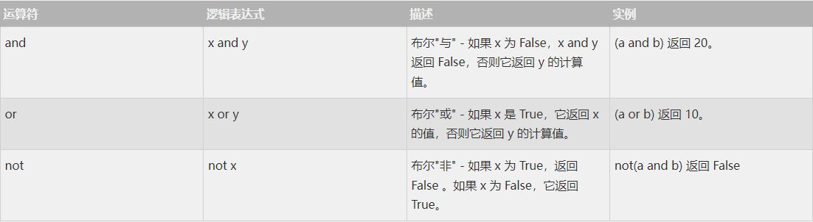
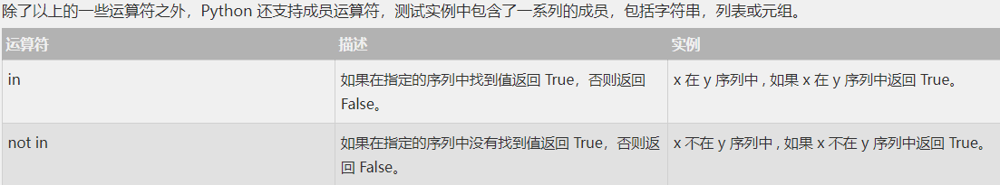
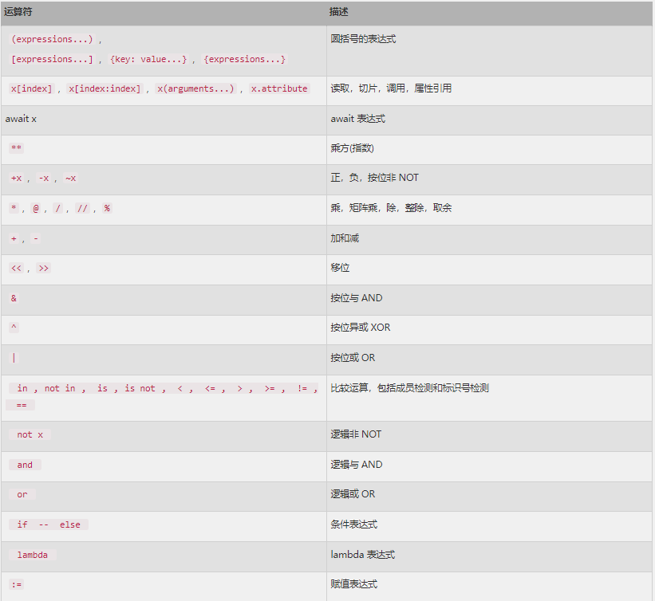

本章节主要说明 Python 的运算符。举个简单的例子 `4 + 5 = 9` 。例子中，`4 和 5` 被称为操作数，"+" 称为  ***运算符*** 。

- 算术运算符
- 比较（关系）运算符
- 赋值运算符
- 逻辑运算符
- 位运算符
- 成员运算符
- 身份运算符
- 运算符优先级


## 1：算术运算符

```python
a = 21
b = 10
c = 0

c = a + b
print ("a+b 的值为：", c) # a+b 的值为： 31
c = a - b
print ("a-b 的值为：", c) # a-b 的值为： 11
c = a * b
print ("a*b 的值为：", c) # a*b 的值为： 210
c = a / b
print ("a/b 的值为：", c) # a/b 的值为： 2.1
c = a % b
print ("a%b 的值为：", c) # a%b 的值为： 1
# 修改变量 a 、b 、c
a = 2
b = 3
c = a**b
print ("a**b 的值为：", c) # a**b 的值为： 8

a = 10
b = 5
c = a//b
print ("a//b 的值为：", c) # a//b 的值为： 2
```

## 2：比较运算符

```python
a = 21
b = 10
c = 0

if ( a == b ):
    print ("a 等于 b")
else:
    print ("a 不等于 b")

if ( a != b ):
    print ("a 不等于 b")
else:
    print ("a 等于 b")

if ( a < b ):
    print ("a 小于 b")
else:
    print ("a 大于等于 b")  

if ( a > b ):
    print ("a 大于 b")
else:
    print ("a 小于等于 b")

# 修改变量 a 和 b 的值
a = 5;
b = 20;
if ( a <= b ):
    print ("a 小于等于 b")
else:
    print ("a 大于  b")

if ( a >= b ):
    print ("a 大于等于 b")
else:
    print ("a 小于 b")


结果是：
a 不等于 b
a 不等于 b
a 大于等于 b
a 大于 b
a 小于等于 b
a 小于 b
```

## 3：赋值运算符

```python
a = 21
b = 10
c = 0

c = a + b
print ("1 - c 的值为：", c) # 1 - c 的值为： 31

c += a
print ("2 - c 的值为：", c) # 2 - c 的值为： 52

c *= a
print ("3 - c 的值为：", c) # 3 - c 的值为： 1092

c /= a
print ("4 - c 的值为：", c) # 4 - c 的值为： 52.0

c = 2
c %= a
print ("5 - c 的值为：", c) # 5 - c 的值为： 2

c **= a
print ("6 - c 的值为：", c) # 6 - c 的值为： 2097152

c //= a
print ("7 - c 的值为：", c) # 7 - c 的值为： 99864
```

## 4：位运算符


> 注：关于原码，补码和反码：  
**原码**  ：假设机器字长为n，原码就是用一个n位的二进制数，其中最高位为符号位：正数是0，负数是1。剩下的表示概数的绝对值，位数如果不够就用0补全。  
**反码**  ：在原码的基础上，符号位不变其他位取反，也就是就是0变1，1变0。  
**补码**  ：在反码的基础上加1。    
**PS**  ：正数的原、反、补码都一样，0的原码跟反码都有两个，因为这里0被分为+0和-0。  
按位取反和反码有一定的相似之处但又不尽相同（反码符号位不取反）。
在计算机中，是以补码的形式存放数据的。`1100 0011` 刚好对应 `-61`。
-61的原码->  `1011 1101` ->反码-> `1100 0010` ->补码-> `1100 0011`


```python
a = 60            # 60 = 0011 1100
b = 13            # 13 = 0000 1101
c = 0

c = a & b;        # 12 = 0000 1100
print ("1 - c 的值为：", c)  # 1 - c 的值为： 12

c = a | b;        # 61 = 0011 1101
print ("2 - c 的值为：", c) # 2 - c 的值为： 61

c = a ^ b;        # 49 = 0011 0001
print ("3 - c 的值为：", c) # 3 - c 的值为： 49

c = ~a;           # -61 = 1100 0011
print ("4 - c 的值为：", c) # 4 - c 的值为： -61

c = a << 2;       # 240 = 1111 0000
print ("5 - c 的值为：", c) # 5 - c 的值为： 240

c = a >> 2;       # 15 = 0000 1111
print ("6 - c 的值为：", c) # 6 - c 的值为： 15
```

## 5：逻辑运算符

```python
a = 10
b = 20

if ( a and b ):
    print ("1 - 变量 a 和 b 都为 true")
else:
    print ("1 - 变量 a 和 b 有一个不为 true")

if ( a or b ):
    print ("2 - 变量 a 和 b 都为 true，或其中一个变量为 true")
else:
    print ("2 - 变量 a 和 b 都不为 true")

# 修改变量 a 的值
a = 0
if ( a and b ):
    print ("3 - 变量 a 和 b 都为 true")
else:
    print ("3 - 变量 a 和 b 有一个不为 true")

if ( a or b ):
    print ("4 - 变量 a 和 b 都为 true，或其中一个变量为 true")
else:
    print ("4 - 变量 a 和 b 都不为 true")

if not( a and b ):
    print ("5 - 变量 a 和 b 都为 false，或其中一个变量为 false")
else:
    print ("5 - 变量 a 和 b 都为 true")

结果为：
1 - 变量 a 和 b 都为 true
2 - 变量 a 和 b 都为 true，或其中一个变量为 true
3 - 变量 a 和 b 有一个不为 true
4 - 变量 a 和 b 都为 true，或其中一个变量为 true
5 - 变量 a 和 b 都为 false，或其中一个变量为 false
```
## 6：成员运算符

```python
a = 10
b = 20
list = [1, 2, 3, 4, 5 ];

if ( a in list ):
    print ("1 - 变量 a 在给定的列表中 list 中")
else:
    print ("1 - 变量 a 不在给定的列表中 list 中")

if ( b not in list ):
    print ("2 - 变量 b 不在给定的列表中 list 中")
else:
    print ("2 - 变量 b 在给定的列表中 list 中")

# 修改变量 a 的值
a = 2
if ( a in list ):
    print ("3 - 变量 a 在给定的列表中 list 中")
else:
    print ("3 - 变量 a 不在给定的列表中 list 中")

结果是：
1 - 变量 a 不在给定的列表中 list 中
2 - 变量 b 不在给定的列表中 list 中
3 - 变量 a 在给定的列表中 list 中
```

## 7：身份运算符

```python
a = 20
b = 20

if ( a is b ):
    print ("1 - a 和 b 有相同的标识")
else:
    print ("1 - a 和 b 没有相同的标识")

if ( id(a) == id(b) ):
    print ("2 - a 和 b 有相同的标识")
else:
    print ("2 - a 和 b 没有相同的标识")

# 修改变量 b 的值
b = 30
if ( a is b ):
    print ("3 - a 和 b 有相同的标识")
else:
    print ("3 - a 和 b 没有相同的标识")

if ( a is not b ):
    print ("4 - a 和 b 没有相同的标识")
else:
    print ("4 - a 和 b 有相同的标识")

结果是：
1 - a 和 b 有相同的标识
2 - a 和 b 有相同的标识
3 - a 和 b 没有相同的标识
4 - a 和 b 没有相同的标识
```

## 8：运算符优先级

```python
a = 20
b = 10
c = 15
d = 5
e = 0

e = (a + b) * c / d       #( 30 * 15 ) / 5
print ("(a + b) * c / d 运算结果为：",  e)

e = ((a + b) * c) / d     # (30 * 15 ) / 5
print ("((a + b) * c) / d 运算结果为：",  e)

e = (a + b) * (c / d);    # (30) * (15/5)
print ("(a + b) * (c / d) 运算结果为：",  e)

e = a + (b * c) / d;      #  20 + (150/5)
print ("a + (b * c) / d 运算结果为：",  e)

结果是：
(a + b) * c / d 运算结果为： 90.0
((a + b) * c) / d 运算结果为： 90.0
(a + b) * (c / d) 运算结果为： 90.0
a + (b * c) / d 运算结果为： 50.0
```