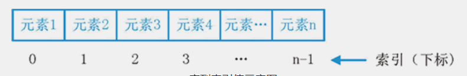

在编程语言中，将  ***以某种方式*** （比如通过编号） ***组合起来***  的  ***数据元素***（如数字，字符串乃至其他数据结构）***集合***  称为数据结构。在python中，最基本的数据结构为  ***序列***  （sequence，简写为seq）。

所谓序列，指的是一块可存放多个值的连续内存空间，这些值按一定顺序排列，可通过每个值所在位置的编号（称为索引）访问它们。

为了更形象的认识序列，可以将它看做是一家旅店，那么店中的每个房间就如同序列存储数据的一个个内存空间，每个房间所特有的房间号就相当于索引值。也就是说，通过房间号（索引）我们可以找到这家旅店（序列）中的每个房间（内存空间）。

在 Python 中， ​**​序列类型包括字符串、列表、元组、集合和字典**  ​​，这些序列支持以下几种通用的操作，但比较特殊的是，  ***集合和字典不支持索引、切片、相加和相乘操作***。

字符串也是一种常见的序列（所以以下的例子以字符串作为），它也可以直接通过索引访问字符串内的字符。

## 1：序列索引
序列中，每个元素都有属于自己的编号（索引）。从起始元素开始，索引值从 0 开始递增，如图 1 所示。


除此之外，Python 还支持索引值是负数，此类索引是从右向左计数，换句话说，从最后一个元素开始计数，从索引值 -1 开始，如图 2 所示。


注意，在使用负值作为列序中各元素的索引值时，是从 -1 开始，而不是从 0 开始。

另一种理解方式是：将序列想象成如下方的一个环：


无论是采用正索引值，还是负索引值，都可以访问序列中的任何元素。以字符串为例，访问“W3Cschool”的首元素和尾元素，可以使用如下的代码：

```python
str="W3Cschool"
print(str[0],"==",str[-9])
print(str[8],"==",str[-1])

结果为：
W == W
l == l
```

## 2：序列切片
切片操作是访问序列中元素的另一种方法，它可以访问一定范围内的元素，通过切片操作，可以生成一个新的序列。
序列实现切片操作的语法格式如下：  `sname[start : end : step]`

其中，各个参数的含义分别是：

- `sname`：表示序列的名称；
- `start`：表示切片的开始索引位置（包括该位置），此参数也可以不指定，会默认为 0，也就是从序列的开头进行切片；
- `end`：表示切片的结束索引位置（不包括该位置），如果不指定，则默认为序列的长度；
- `step`：表示在切片过程中，隔几个存储位置（包含当前位置）取一次元素，也就是说，如果 step 的值大于 1，则在进行切片去序列元素时，会“跳跃式”的取元素。如果省略设置 step 的值，则最后一个冒号就可以省略。

```python
str="python,love"
#取索引区间为[0,2]之间（不包括索引2处的字符）的字符串
print(str[:2])
#隔 1 个字符取一个字符，区间是整个字符串
print(str[::2])
#取整个字符串，此时 [] 中只需一个冒号即可
print(str[:])
```

## 3：序列相加
Python 中，支持两种类型相同的序列使用“+”运算符做相加操作，它会将两个序列进行连接，但不会去除重复的元素。
这里所说的“类型相同”，指的是“+”运算符的两侧序列要么都是列表类型，要么都是元组类型，要么都是字符串。

例如，前面章节中我们已经实现用“+”运算符连接 2 个（甚至多个）字符串，如下所示：
```python
protocol = "https://"
url = "www.w3cschool.cn"
print(protocol+url)
```

## 4：序列相乘

Python 中，使用数字 n 乘以一个序列会生成新的序列，其内容为原来序列被重复 n 次的结果。例如：

```python
str="W3Cschool"
print(str*3)  # W3CschoolW3CschoolW3Cschool
``` 

比较特殊的是，列表类型在进行乘法运算时，还可以实现初始化指定长度列表的功能。例如如下的代码，将创建一个长度为 5 的列表，列表中的每个元素都是 None，表示什么都没有。

```python
#列表的创建用 []，可以指定长度
list = [None]*5
print(list)  # [None, None, None, None, None]
```

## 5：检查元素是否包含在序列中
Python 中，可以使用 in 关键字检查某元素是否为序列的成员，其语法格式为：
```python
value in sequence​
```

## 6：和序列相关的内置函数
