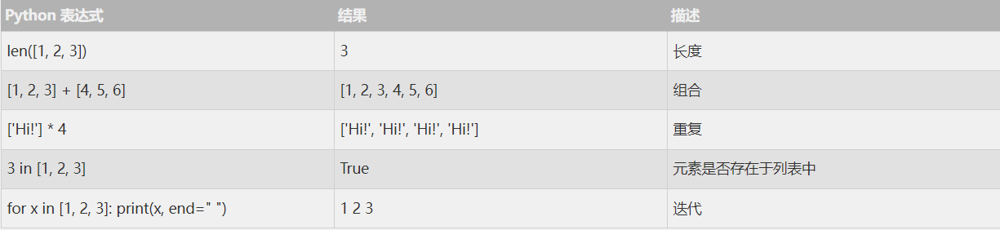
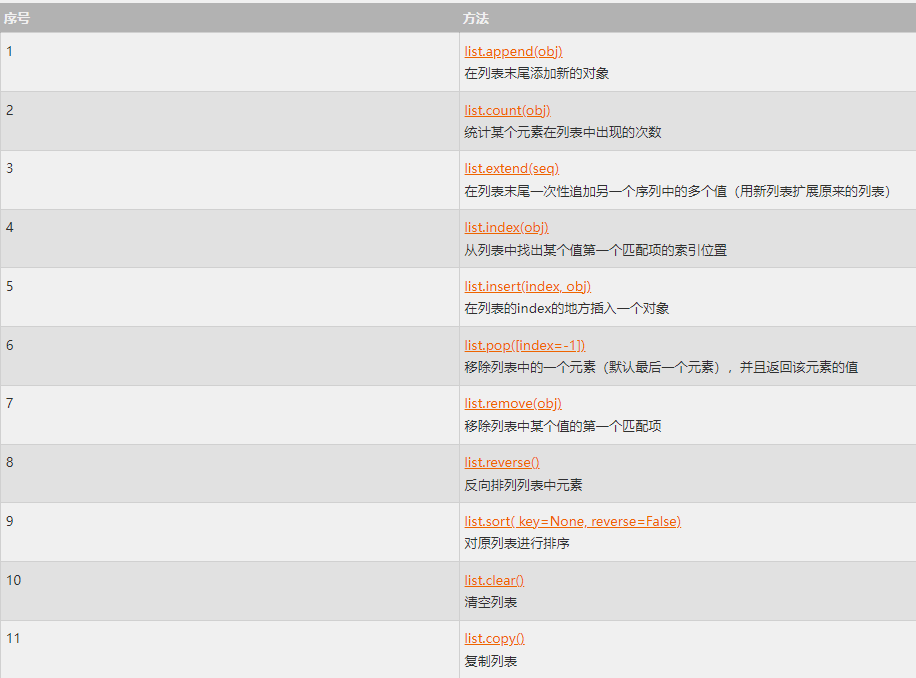

`列表（list`  也是最常用的 Python 数据类型之一，它以一个方括号内包含多个其他数据项（字符串，数字等甚至是另一个列表），数据项间以逗号作为分隔的数据类型。

列表的数据项不需要具有相同的类型。（这点是与其他语言的数组的一个区别）

创建一个列表，只要把 **逗号分隔的不同的数据项使用方括号括起来** 即可。如下所示：
```python
list1 = ['Google', 'python', 1997, 2000]
list2 = [1, 2, 3, 4, 5, 6, 7 ]
print ("list1: ", list1)
print ("list2: ", list2)

运行结果：
list1:  ['Google', 'python', 1997, 2000]
list2:  [1, 2, 3, 4, 5, 6, 7]
```

## 1：访问列表中的值
与字符串的索引一样，列表索引从 0 开始，第二个索引是 1，依此类推。

通过索引列表可以进行截取、组合等操作。

```python
list1 = ['Google', 'W3Cschool', 1997, 2000]
print ("list1的第一项: ", list1[0])
print ("list1的最后一项: ", list1[-1])

运行结果：
list1的第一项:  Google
list1的最后一项:  2000
```

以下是列表切片的操作：

```python
list1 = ['Google', 'W3Cschool', 1997, 2000]
print ("list1的前3项: ", list1[0:3])
print ("list1的2、3项: ", list1[1:3])

运行结果：
list1的前3项:  ['Google', 'W3Cschool', 1997]
list1的2、3项:  ['W3Cschool', 1997]
```

## 2：更新列表
你可以对列表的数据项进行修改或更新，你也可以使用 `append()` 方法来添加列表项，如下所示：

```python
list1 = ['Google', 'W3Cschool', 1997, 2000]
print ("list1的第三个元素为: ", list1[2])
list1[2] = "1998" #直接对想要修改的数据项赋上一个新值即可修改该数据项
print ("list1的第三个元素为: ", list1[2])
list1.append(2021) #append()可以在列表后追加一项列表项
print ("追加列表项后的list1: ", list1)


运行结果：
list1的第三个元素为:  1997
list1的第三个元素为:  1998
追加列表项后的list1:  ['Google', 'W3Cschool', '1998', 2000, 2021]
```

## 3：删除列表元素

可以使用 del 语句来删除列表的的元素，如下实例：

```python
list1 = ['Google', 'W3Cschool', 1997, 2000]
del list1[0] #del可以删掉一个元素
print ("删除列表项后的list1: ", list1)  # 删除列表项后的list1:  ['W3Cschool', 1997, 2000]
```

**注意：使用del是删除删除一个变量的方法，所以使用del的时候要作用在变量上（也就是list[1]）**

另一种删除的方式是使用remove来删除列表的元素，如下实例

```python
list1 = ['Google', 'W3CSchool', 'Taobao', 'Baidu']
list1.remove('Taobao') # remove可以按值查找列表中的元素并删除
print ("列表现在为 : ", list1)
list1.remove('Baidu')
print ("列表现在为 : ", list1)

运行结果:
列表现在为 :  ['Google', 'W3CSchool', 'Baidu']
列表现在为 :  ['Google', 'W3CSchool']
```

## 4：列表脚本操作符
列表对 + 和 * 的操作符与字符串相似。+ 号用于组合列表，* 号用于重复列表。



## 5：列表截取与拼接

```python
L=['Google', 'W3Cschool', 'Taobao']
```


## 6：嵌套列表

```python
>>> a = ['a', 'b', 'c'] 
>>> n = [1, 2, 3] 
>>> x = [a, n] 
>>> x [['a', 'b', 'c'], [1, 2, 3]] 
>>> x[0] ['a', 'b', 'c'] 
>>> x[0][1] 'b'
```

## 7：列表函数&方法


