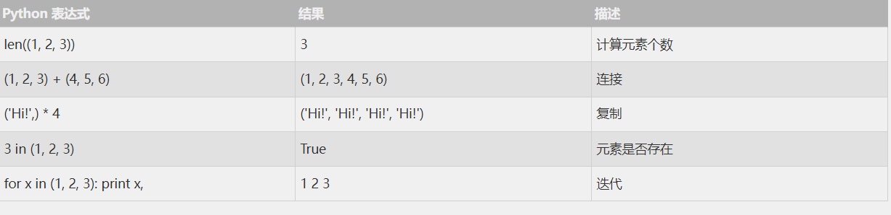
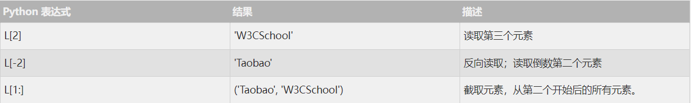
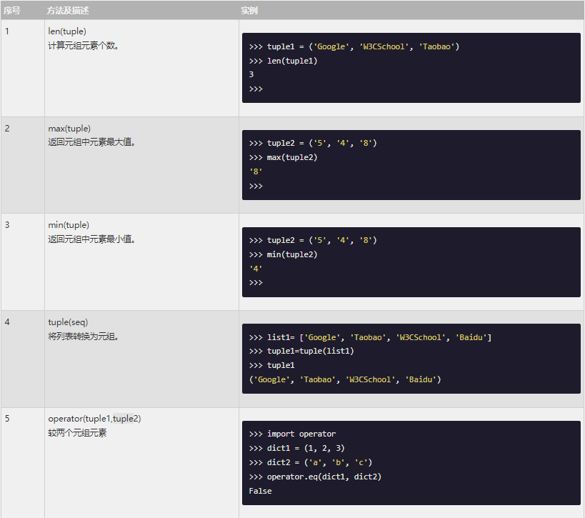

Python 的元组（tuple，简写为tup）与列表类似，不同之处在于元组的元素不能修改。

元组使用 `小括号​()`​，列表使用 `方括号​[]` ​。

元组创建很简单，只需要在括号中添加元素，并使用 `逗号` 隔开即可。

如下实例：
```python
tup1 = ('Google', 'W3CSchool', 1997, 2020)
tup2 = (1, 2, 3, 4, 5 )
tup3 = "a", "b", "c", "d" # 不需括号也可以
print(type(tup3))

运行结果：
<class 'tuple'>

```

创建空元组
```python
tup1 = ()
```

元组中只包含一个元素时，需要在元素后面添加逗号，否则括号会被当做运算符使用。

```python
tup1 = (50,)
```
元组与字符串类似，下标索引从 0 开始，可以进行截取，组合等。


## 1：访问元组
元组可以使用下标索引来访问元组中的值，如下实例:

```python
tup1 = ('Google', 'W3CSchool', 1997, 2020)
tup2 = (1, 2, 3, 4, 5, 6, 7 )

print ("tup1[0]: ", tup1[0])  # tup1[0]:  Google
print ("tup2[1:5]: ", tup2[1:5]) # tup2[1:5]:  (2, 3, 4, 5)
```

## 2：修改元组
元组中的元素值是不允许修改的，但我们可以对元组进行连接组合，如下实例:
```python
tup1 = (12, 34.56);
tup2 = ('abc', 'xyz')

# 以下修改元组元素操作是非法的。
# tup1[0] = 100

# 创建一个新的元组
tup3 = tup1 + tup2;
print (tup3)   # (12, 34.56, 'abc', 'xyz')

```

## 3：删除元组
元组中的元素值是不允许删除的，但我们可以使用del语句来删除整个元组，如下实例:

```python
tup = ('Google', 'W3CSchool', 1997, 2020)

print (tup)
del tup;
print ("删除后的元组 tup : ")
print (tup)
```
以上实例元组被删除后，输出变量会有异常信息，输出如下所示：

```python
删除后的元组 tup : 
Traceback (most recent call last):
  File "test.py", line 8, in <module>
    print (tup)
NameError: name 'tup' is not defined
```

## 4：元组运算符
与字符串一样，元组之间可以使用 + 号和 * 号进行运算。这就意味着他们可以组合和复制，运算后会生成一个新的元组。



## 5：元组索引，截取

因为元组也是一个序列，所以我们可以访问元组中的指定位置的元素，也可以截取索引中的一段元素，如下所示：

```python
L = ('Google', 'Taobao', 'W3CSchool')
```



## 6：元组内置函数


## 7：关于元组是不可变的
所谓元组的不可变指的是元组所指向的内存中的内容不可变。

```python
>>> tup = ('W', '3', 'C', 's', 'c', 'h','o','o','l')
>>> tup[0] = 'w'     # 不支持修改元素
Traceback (most recent call last):
  File "<stdin>", line 1, in <module>
TypeError: 'tuple' object does not support item assignment
>>> id(tup)     # 查看内存地址
4440687904
>>> tup = (1,2,3)
>>> id(tup)
4441088800    # 内存地址不一样了
```
