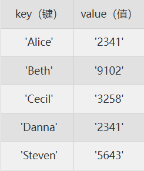
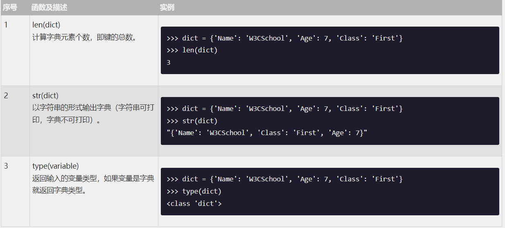
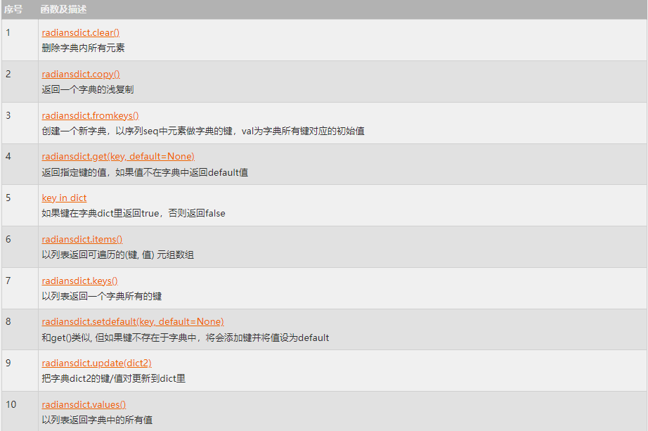

在Python3中字典（ `dictionary`  ，简写为dict）是另一种可变容器模型，且可存储任意类型对象。

字典的每个键值 ( `​key=>value` ​) 对用冒号 (:) 分割，每个对之间用逗号 (,) 分割，整个字典包括在花括号 (​{}​) 中 ,格式如下所示：

```python
dict = {key1 : value1, key2 : value2 }
```


***键必须是唯一的***，但值则不必(上表中Danna和Alice的键是不同的，值却是相同的)。

值可以取任何数据类型， ***但​键必须是不可变的*** ​，如字符串，数字或元组。

一个简单的字典实例：
```python
dict = {'Alice': '2341', 'Beth': '9102', 'Cecil': '3258'}
```

也可如此创建字典：
```python
dict1 = { 'abc': 456 }
dict2 = { 'abc': 123, 98.6: 37 }
```

## 1：访问字典里的值
与列表取值类似，但列表取值时使用索引，字典取值时使用key，如下实例:

```python
dict = {'Name': 'W3CSchool', 'Age': 7, 'Class': 'First'}

print ("dict['Name']: ", dict['Name'])  # dict['Name']:  W3CSchool
print ("dict['Age']: ", dict['Age'])  # dict['Age']:  7
```

如果用字典里没有的键访问数据，会输出错误如下：
```python
dict = {'Name': 'W3CSchool', 'Age': 7, 'Class': 'First'}
 
print ("dict['Alice']: ", dict['Alice'])

Traceback (most recent call last):
  File "test.py", line 5, in <module>
    print ("dict['Alice']: ", dict['Alice'])
KeyError: 'Alice'
```

## 2：修改字典
向字典添加新内容的方法是增加新的键/值对，修改或删除已有键/值对如下实例:


```python
dict = {'Name': 'W3CSchool', 'Age': 7, 'Class': 'First'}

dict['Age'] = 8;               # 更新 Age
dict['School'] = "W3Cschool教程"  # 添加信息


print ("dict['Age']: ", dict['Age'])  # dict['Age']:  8
print ("dict['School']: ", dict['School']) # dict['School']:  W3Cschool教程
```

## 3：删除字典元素
`​del` ​能删单一的元素也能清空字典。我们可以用它来删除字典中的一组键值对也可以用来删除整个字典。另外使用 `clear()` 也能删除字典。如下实例：

```python
dict = {'Name': 'W3CSchool', 'Age': 7, 'Class': 'First'}

del dict['Name'] # 删除键 'Name'
dict.clear()     # 删除字典
del dict         # 删除字典

print ("dict['Age']: ", dict['Age'])
print ("dict['School']: ", dict['School'])
```

但这会引发一个异常，因为用执行 `del` 操作后字典不再存在：

```python
Traceback (most recent call last):
  File "test.py", line 9, in <module>
    print ("dict['Age']: ", dict['Age'])
TypeError: 'type' object is not subscriptable
```

## 3：字典键的特性
字典值可以没有限制地取任何 Python 对象，既可以是标准的对象，也可以是用户定义的，但键不行。

两个重要的点需要记住：

- 1）不允许同一个键出现两次。***创建时如果同一个键被赋值两次*** ，后一个值会被记住，如下实例：
  
```python
dict = {'Name': 'W3CSchool', 'Age': 7, 'Name': '编程狮'}

print ("dict['Name']: ", dict['Name'])  # dict['Name']:  编程狮
```
- 2）键必须不可变，所以可以用 `数字`，`字符串` 或 `元组` 充当，而用 `列表` 就不行，如下实例：

```python
dict = {['Name']: 'W3CSchool', 'Age': 7}

print ("dict['Name']: ", dict['Name'])
```

```python
Traceback (most recent call last):
  File "test.py", line 3, in <module>
    dict = {['Name']: 'W3CSchool', 'Age': 7}
TypeError: unhashable type: 'list'
```
> 注：为了便于理解，本文的所有字典都采用了dict或者带编号的dict作为变量，但在实际开发中并不推荐这么做！也不推荐使用简单的变量名（比如d,x,a1之类的），变量名应该具有自注释性，让开发者一眼就能知道这个变量是用来做什么的。

## 4：内置函数&方法

Python 字典包含了以下内置函数：



Python 字典包含了以下内置方法：

