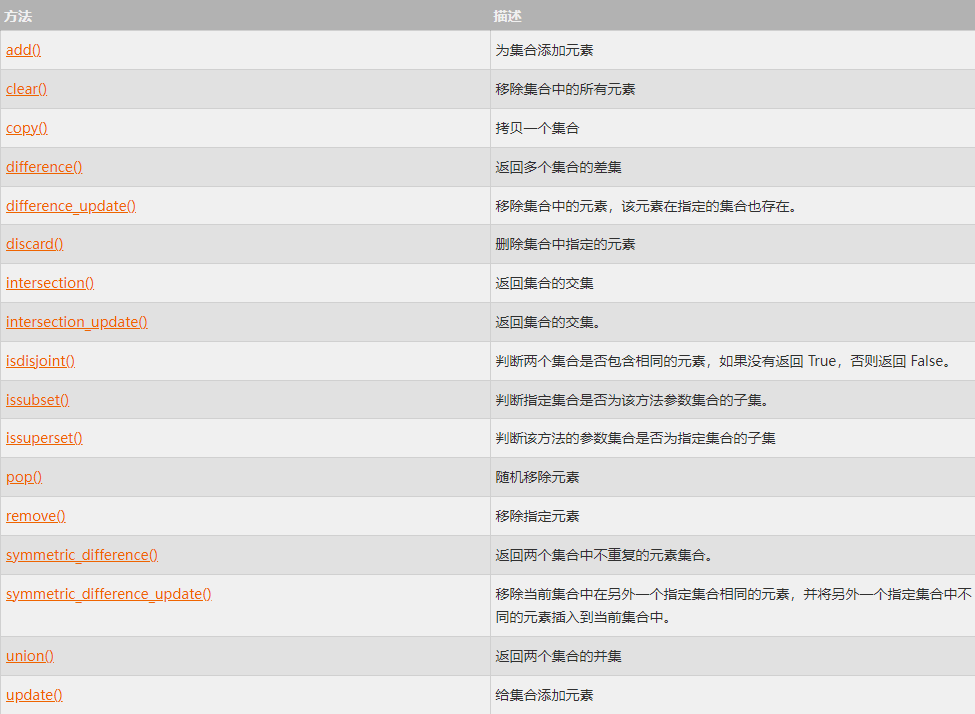

集合（ `set` ）是一个无序的  ***不重复元素序列*** 。因此在每次运行的时候集合的运行结果的内容都是相同的，但元素的排列顺序却不是固定的，所以本章中部分案例的运行结果会出现与给出结果不同的情况（运行结果不唯一）。

可以使用大括号 `{ }` 或者 `set()` 函数创建集合，注意：创建一个 ***空集合必须用 `set()` 而不是 `{ }`*** ，因为 { } 是用来创建一个空字典。

创建格式：

```python
parame = {value01,value02,...}
或者
set(value)
```

集合实例：

```python
basket = {'apple', 'orange', 'apple', 'pear', 'orange', 'banana'}
print(basket)  # 这里演示的是去重功能  {'pear', 'banana', 'orange', 'apple'}

print('orange' in basket)    # 快速判断元素是否在集合内  True
print('crabgrass' in basket)  # False
```

集合的运算：

```python
a = set('abracadabra')
b = set('alacazam')

print(a)  # {'b', 'd', 'a', 'c', 'r'}
print(b)  # {'l', 'z', 'm', 'a', 'c'}

print(a-b) # {'r', 'd', 'b'}

print(a|b) # {'l', 'z', 'b', 'm', 'd', 'a', 'c', 'r'}

print(a&b) # {'c', 'a'}

print(a^b) # {'l', 'z', 'b', 'm', 'r', 'd'}
```


# 集合的基本操作
## 1、添加元素
语法格式如下：

```python
s.add( x )
```

将 `元素 x` 添加到 `集合 s` 中，如果元素已存在，则不进行任何操作。

```python
thisset = set(("Google", "W3Cschool", "Taobao"))
thisset.add("Baidu")
print(thisset)  # {'W3Cschool', 'Taobao', 'Google', 'Baidu'}
```

还有一个方法，也可以添加元素，且参数可以是列表，元组，字典等，语法格式如下：

```python
s.update( x )
```
x 可以有多个，用逗号分开。

实例：

```python
thisset = set(("Google", "w3Cschool", "Taobao"))
thisset.update({1,3})
print(thisset)  # {1, 3, 'w3Cschool', 'Taobao', 'Google'}
thisset.update([1,4],[5,6])  
print(thisset)  # {1, 3, 4, 5, 6, 'w3Cschool', 'Taobao', 'Google'}
```

## 2、移除元素
语法格式如下：

```python
s.remove( x )

```

将 `元素 x` 从 `集合 s` 中移除，如果元素不存在，则会发生错误。

实例：
```python
thisset = set(("Google", "W3Cschool", "Taobao"))
thisset.remove("Taobao")
print(thisset)

thisset.remove("Facebook")   # 不存在会发生错误
```

运行结果：
```python
{'W3Cschool', 'Google'}
Traceback (most recent call last):
  File ".code.tio", line 5, in 
    thisset.remove("Facebook")   # 不存在会发生错误
KeyError: 'Facebook'
```
此外还有一个方法也是移除集合中的元素，且如果元素不存在，不会发生错误。格式如下所示：

```python
s.discard( x )
```

实例：
```python
thisset = set(("Google", "W3Cschool", "Taobao"))
thisset.discard("Facebook")  # 不存在不会发生错误
print(thisset)  # {'Taobao', 'Google', 'W3Cschool'}
```

我们也可以设置随机删除集合中的一个元素，语法格式如下：

```python
s.pop() 

```

实例：
```python
thisset = set(("Google", "W3Cschool", "Taobao", "Facebook"))
x = thisset.pop()

print(x)   #  Google
print(thisset)  # {'Facebook', 'Taobao', 'W3Cschool'}

```

多次执行测试结果都不一样。

set 集合的 `pop` 方法会对集合进行无序的排列，然后将这个无序排列集合的左面第一个元素进行删除。因为这个过程是不确定的，所以删除结果也是不确定的，不建议使用这种方式进行删除

## 3、计算集合元素个数
语法格式如下：

```python
len(s)
```
计算 `集合 s` 的元素个数。

实例：
```python
thisset = set(("Google", "W3Cschool", "Taobao"))
print(len(thisset))  #  3
```

## 4、清空集合
语法格式如下：
```python
s.clear()
```
清空 `集合 s`。

实例

```python
thisset = set(("Google", "W3cschool", "Taobao"))
thisset.clear()
print(thisset) # set()
```

## 5、判断元素是否在集合中存在
语法格式如下：

```python
x in s

```

判断 `元素 x` 是否在 `集合 s` 中，存在则返回 `True` ，不存在则返回 `False` 。

实例：
```python
thisset = set(("Google", "W3Cschool", "Taobao"))
print("W3Cschool" in thisset)  # True
print("Facebook" in thisset)  # False
```

## 6、集合内置方法完整列表
