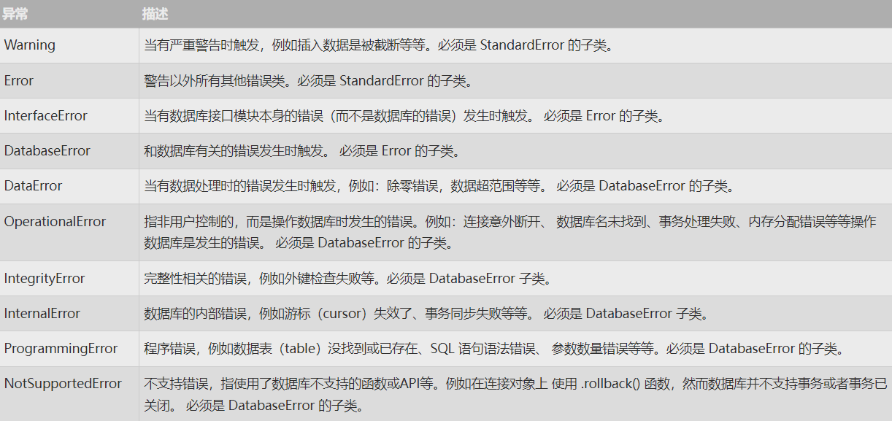

## 1：什么是 PyMySQL？
`PyMySQL` 是在 `Python3.x` 版本中用于连接 `MySQL` 服务器的一个库，`Python2` 中则使用`mysqldb`。

`PyMySQL` 遵循 `Python` 数据库 `API v2.0` 规范，并包含了 `pure-Python MySQL` 客户端库。

## 2：PyMySQL 安装
PyMySQL 下载地址：[下载地址](https://github.com/PyMySQL/PyMySQL)。

如果还未安装，我们可以使用以下命令安装最新版的 PyMySQL：
```shell
pip install PyMySQL
```
如果你的系统不支持 `pip` 命令，可以使用以下方式安装：

1、使用 `git` 命令下载安装包安装(你也可以手动下载)：

```shell
$ git clone https://github.com/PyMySQL/PyMySQL
$ cd PyMySQL/
$ python3 setup.py install
```

2、如果需要制定版本号，可以使用 `curl` 命令来安装：

```shell
$ # X.X 为 PyMySQL 的版本号
$ curl -L https://github.com/PyMySQL/PyMySQL/tarball/pymysql-X.X | tar xz
$ cd PyMySQL*
$ python3 setup.py install
$ # 现在你可以删除 PyMySQL* 目录
```

**注意** ：请确保您有 root 权限来安装上述模块。

## 3：数据库连接

- `host(str)`:      MySQL服务器地址
- `port(int)`:      MySQL服务器端口号
- `user(str)`:      用户名
- `passwd(str)`:    密码
- `db(str)`:        数据库名称
- `charset(str)`:   连接编码

`connection`对象支持的方法
- `cursor()`        使用该连接创建并返回游标
- `commit() `       提交当前事务
- `rollback() `     回滚当前事务
- `close()`         关闭连接

`cursor`对象支持的方法
- `execute(op)`     执行一个数据库的查询命令
- `fetchone() `     取得结果集的下一行
- `fetchmany(size)` 获取结果集的下几行
- `fetchall()`      获取结果集中的所有行
- `rowcount()`      返回数据条数或影响行数
- `close()`         关闭游标对象


```python
import pymysql

# 打开数据库连接
db = pymysql.connect(host="localhost", user="root", password="xiaoze", db="collegestudentsloosechangenetwork")

# 使用 cursor() 方法创建一个游标对象 cursor
cursor = db.cursor()

# 使用 execute()  方法执行 SQL 查询
cursor.execute("SELECT * FROM user where user_id = 43")

# 使用 fetchone() 方法获取单条数据.
data = cursor.fetchone()

print(data)

# 关闭数据库连接
db.close()
```

## 4：创建数据库表

如果数据库连接存在我们可以使用 `execute()` 方法来为数据库创建表，如下所示创建表`EMPLOYEE`：

```python
#!/usr/bin/python3

import pymysql

# 打开数据库连接
db = pymysql.connect("localhost","testuser","test123","TESTDB" )

# 使用 cursor() 方法创建一个游标对象 cursor
cursor = db.cursor()

# 使用 execute() 方法执行 SQL，如果表存在则删除
cursor.execute("DROP TABLE IF EXISTS EMPLOYEE")

# 使用预处理语句创建表
sql = """CREATE TABLE EMPLOYEE (
         FIRST_NAME  CHAR(20) NOT NULL,
         LAST_NAME  CHAR(20),
         AGE INT,  
         SEX CHAR(1),
         INCOME FLOAT )"""

cursor.execute(sql)

# 关闭数据库连接
db.close()
```

## 5：数据库插入操作

以下实例使用执行 `SQL INSERT` 语句向表 `EMPLOYEE` 插入记录：
```python
#!/usr/bin/python3

import pymysql

# 打开数据库连接
db = pymysql.connect("localhost","testuser","test123","TESTDB" )

# 使用cursor()方法获取操作游标 
cursor = db.cursor()

# SQL 插入语句
sql = """INSERT INTO EMPLOYEE(FIRST_NAME,
         LAST_NAME, AGE, SEX, INCOME)
         VALUES ('Mac', 'Mohan', 20, 'M', 2000)"""
try:
   # 执行sql语句
   cursor.execute(sql)
   # 提交到数据库执行
   db.commit()
except:
   # 如果发生错误则回滚
   db.rollback()

# 关闭数据库连接
db.close()
```

以上例子也可以写成如下形式：

```python
#!/usr/bin/python3

import pymysql

# 打开数据库连接
db = pymysql.connect("localhost","testuser","test123","TESTDB" )

# 使用cursor()方法获取操作游标 
cursor = db.cursor()

# SQL 插入语句
sql = "INSERT INTO EMPLOYEE(FIRST_NAME, \
       LAST_NAME, AGE, SEX, INCOME) \
       VALUES ('%s', '%s', '%d', '%c', '%d' )" % \
       ('Mac', 'Mohan', 20, 'M', 2000)
try:
   # 执行sql语句
   cursor.execute(sql)
   # 执行sql语句
   db.commit()
except:
   # 发生错误时回滚
   db.rollback()

# 关闭数据库连接
db.close()
```

以下代码使用变量向 SQL 语句中传递参数:

```python
..................................
user_id = "test123"
password = "password"

con.execute('insert into Login values("%s", "%s")' % \
             (user_id, password))
..................................
```

## 6：数据库查询操作

Python 查询 Mysql 使用 `fetchone()` 方法获取单条数据, 使用 `fetchall()` 方法获取多条数据。

- `fetchone()` : 该方法获取下一个查询结果集。结果集是一个对象
- `fetchall()` : 接收全部的返回结果行.
- `rowcount` : 这是一个只读属性，并返回执行 `execute()` 方法后影响的行数。

查询 `EMPLOYEE` 表中 `salary`（工资）字段大于 1000 的所有数据：

```python
#!/usr/bin/python3

import pymysql

# 打开数据库连接
db = pymysql.connect("localhost","testuser","test123","TESTDB" )

# 使用cursor()方法获取操作游标 
cursor = db.cursor()

# SQL 查询语句
sql = "SELECT * FROM EMPLOYEE \
       WHERE INCOME > '%d'" % (1000)
try:
   # 执行SQL语句
   cursor.execute(sql)
   # 获取所有记录列表
   results = cursor.fetchall()
   for row in results:
      fname = row[0]
      lname = row[1]
      age = row[2]
      sex = row[3]
      income = row[4]
       # 打印结果
      print ("fname=%s,lname=%s,age=%d,sex=%s,income=%d" % \
             (fname, lname, age, sex, income ))
except:
   print ("Error: unable to fecth data")

# 关闭数据库连接
db.close()
```

以上脚本执行结果如下：

```python
fname=Mac, lname=Mohan, age=20, sex=M, income=2000
```

## 7：数据库更新操作
更新操作用于更新数据表的的数据，以下实例将 `TESTDB` 表中的 `SEX` 字段全部修改为 'M'，AGE 字段递增 1：

```python
#!/usr/bin/python3

import pymysql

# 打开数据库连接
db = pymysql.connect("localhost","testuser","test123","TESTDB" )

# 使用cursor()方法获取操作游标 
cursor = db.cursor()

# SQL 更新语句
sql = "UPDATE EMPLOYEE SET AGE = AGE + 1
                          WHERE SEX = '%c'" % ('M')
try:
   # 执行SQL语句
   cursor.execute(sql)
   # 提交到数据库执行
   db.commit()
except:
   # 发生错误时回滚
   db.rollback()

# 关闭数据库连接
db.close()
```

## 8：删除操作

删除操作用于删除数据表中的数据，以下实例演示了删除数据表 `EMPLOYEE` 中 `AGE` 大于 20 的所有数据：

```python
#!/usr/bin/python3

import pymysql

# 打开数据库连接
db = pymysql.connect("localhost","testuser","test123","TESTDB" )

# 使用cursor()方法获取操作游标 
cursor = db.cursor()

# SQL 删除语句
sql = "DELETE FROM EMPLOYEE WHERE AGE > '%d'" % (20)
try:
   # 执行SQL语句
   cursor.execute(sql)
   # 提交修改
   db.commit()
except:
   # 发生错误时回滚
   db.rollback()

# 关闭连接
db.close()
```

## 9：执行事务
事务机制可以确保数据一致性。

事务应该具有 4 个属性：`原子性`、`一致性`、`隔离性`、`持久性`。这四个属性通常称为 `ACID` 特性。

- `原子性（atomicity）` 。一个事务是一个不可分割的工作单位，事务中包括的诸操作要么都做，要么都不做。
- `一致性（consistency）` 。事务必须是使数据库从一个一致性状态变到另一个一致性状态。一致性与原子性是密切相关的。
- `隔离性（isolation）` 。一个事务的执行不能被其他事务干扰。即一个事务内部的操作及使用的数据对并发的其他事务是隔离的，并发执行的各个事务之间不能互相干扰。
- `持久性（durability）` 。持续性也称永久性（permanence），指一个事务一旦提交，它对数据库中数据的改变就应该是永久性的。接下来的其他操作或故障不应该对其有任何影响。
`Python DB API 2.0` 的事务提供了两个方法 `commit` 或 `rollback`。

```python
# SQL删除记录语句
sql = "DELETE FROM EMPLOYEE WHERE AGE > '%d'" % (20)
try:
   # 执行SQL语句
   cursor.execute(sql)
   # 向数据库提交
   db.commit()
except:
   # 发生错误时回滚
   db.rollback()
```

对于支持事务的数据库， 在 `Python` 数据库编程中，当游标建立之时，就自动开始了一个隐形的数据库事务。

`commit()` 方法游标的所有更新操作，`rollback（）`方法回滚当前游标的所有操作。每一个方法都开始了一个新的事务。

## 10：错误处理

DB API 中定义了一些数据库操作的错误及异常，下表列出了这些错误和异常:

