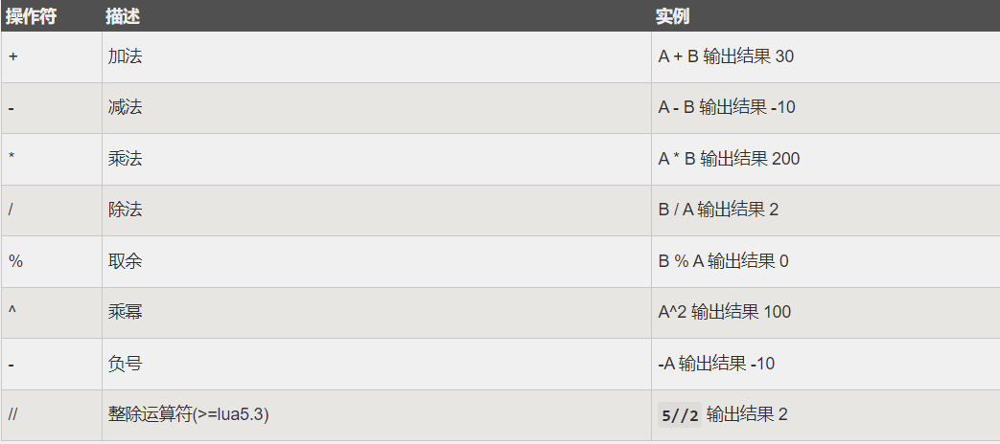
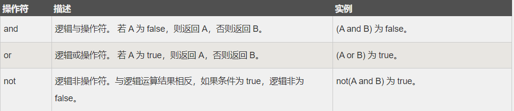
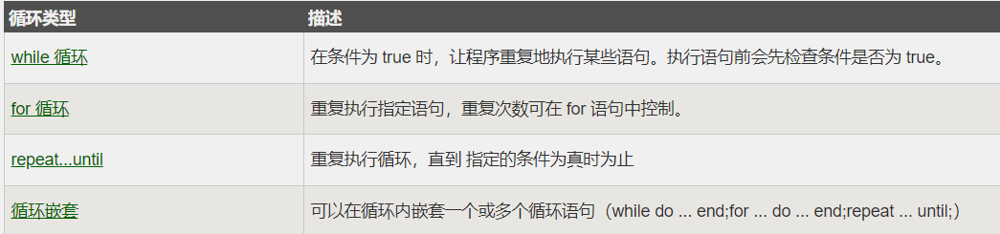

[学习网站](https://www.runoob.com/lua/lua-environment.html)

## 1：linux环境配置
```linux
curl -R -O http://www.lua.org/ftp/lua-5.3.0.tar.gz
tar zxf lua-5.3.0.tar.gz
cd lua-5.3.0
make linux test
make install
```
## 2：基本语法
> windows和linux语法一直，但是需要在Linux文件中加入头`#!/usr/local/bin/lua`,之后语法以Windows为例。
### 1）基本数据类型
Lua 中有 8 个基本类型分别为：`nil`、`boolean`、`number`、`string`、`userdata`、`function`、`thread` 和 `table`。

我们可以使用 type 函数测试给定变量或者值的类型：

```lua
print(type("Hello world"))      --> string
print(type(10.4*3))             --> number
print(type(print))              --> function
print(type(type))               --> function
print(type(true))               --> boolean
print(type(nil))                --> nil
print(type(type(X)))            --> string
```

<p style="color:red">nil（空）</p>

nil 类型表示一种没有任何有效值，它只有一个值 -- nil，例如打印一个没有赋值的变量，便会输出一个 nil 值：
```lua
print(type(a))
-- nil
```

<p style="color:red">boolean（布尔）</p>

boolean 类型只有两个可选值：true（真） 和 false（假），Lua 把 false 和 nil 看作是 false，其他的都为 true，数字 0 也是 true:

```lua
print(type(true))
print(type(false))
print(type(nil))
 
if false or nil then
    print("至少有一个是 true")
else
    print("false 和 nil 都为 false")
end

if 0 then
    print("数字 0 是 true")
else
    print("数字 0 为 false")
end

--boolean
--boolean
--nil
--false 和 nil 都为 false
--数字 0 是 true
```

<p style="color:red">number（数字）</p>

Lua 默认只有一种 number 类型 -- double（双精度）类型（默认类型可以修改 luaconf.h 里的定义），以下几种写法都被看作是 number 类型：
```lua
print(type(2))
print(type(2.2))
print(type(0.2))
print(type(2e+1))
print(type(0.2e-1))
print(type(7.8263692594256e-06))
--number
--number
--number
--number
--number
--number
```

<p style="color:red">string（字符串）</p>

nil 类型表示一种没有任何有效值，它只有一个值 -- nil，例如打印一个没有赋值的变量，便会输出一个 nil 值：
```lua
string1 = "this is string1"
string2 = 'this is string2'

html = [[
<html>
<head></head>
<body>
    <a href="http://www.baidu.com/">百度</a>
</body>
</html>
]]
print(html)

--<html>
--<head></head>
--<body>
--   <a href="http://www.baidu.com/">百度</a>
--</body>
--</html>

```

<p style="color:red">table（表）</p>

在 Lua 里，table 的创建是通过"构造表达式"来完成，最简单构造表达式是{}，用来创建一个空表。也可以在表里添加一些数据，直接初始化表:
```lua
-- 创建一个空的 table
local tbl1 = {}
 
-- 直接初始表
local tbl2 = {"apple", "pear", "orange", "grape"}

-- table_test2.lua 脚本文件
local tbl = {"apple", "pear", "orange", "grape"}
for key, val in pairs(tbl) do
    print("Key", key)
end

--Key    1
--Key    2
--Key    3
--Key    4
```

<p style="color:red">function（函数）</p>

在 Lua 中，函数是被看作是"第一类值（First-Class Value）"，函数可以存在变量里:

```lua
-- function_test.lua 脚本文件
function factorial1(n)
    if n == 0 then
        return 1
    else
        return n * factorial1(n - 1)
    end
end
print(factorial1(5))
factorial2 = factorial1
print(factorial2(5))

--120
--120
```

<p style="color:red">thread（线程）</p>

在 Lua 里，最主要的线程是协同程序（coroutine）。它跟线程（thread）差不多，拥有自己独立的栈、局部变量和指令指针，可以跟其他协同程序共享全局变量和其他大部分东西。

线程跟协程的区别：线程可以同时多个运行，而协程任意时刻只能运行一个，并且处于运行状态的协程只有被挂起（suspend）时才会暂停。

<p style="color:red">userdata（自定义类型）</p>
userdata 是一种用户自定义数据，用于表示一种由应用程序或 C/C++ 语言库所创建的类型，可以将任意 C/C++ 的任意数据类型的数据（通常是 struct 和 指针）存储到 Lua 变量中调用。

#### 示例1-基本数据类型
```lua
--[[
基本数据类型
    Lua 中有八种基本类型： nil、boolean、number、 string、function、userdata、 thread和table；number 包括整型和浮点型
    string 单引号，双引号都表示string，不管是单引号，双引号，单个字符多个字符
    转义 用反斜杠 \n 换行    \t 制表符

    userdata 自定义数据格式
    thread   协程
    table   表
    在lua 中，只有false 和 nil 才表示假
    0和空串表示真
    库函数type返回一个描述给定值类型的字符串
    type (v)返回其唯一参数的类型，编码为字符串
]]--

a=0;
if a then
    print("真");
else
    print("假");
end


b='';
if b then
    print("真");
else
    print("假");
end

c=nil;
if c then
    print("真");
else
    print("假");
end

d=false;
if d then
    print("真");
else
    print("假");
end

print(type(print));
print(type(type));
print(type({}));


a="a\nb\nc\td\t\tef";
print(a);
b=[=[a\nb\nc\td\t\tef[[aaaaa]]]=];
print(b);


--不管是单引号，双引号，单个字符多个字符
a="abc"
b='abc'
c='a'
d="a"
print(type(a));
print(type(b));
print(type(c));
print(type(d));

a=nil;
print(type(a));

print(type(true));
print(type(false));

print(type(123));
print(type(1.23));
print(type(1234567890));
```
#### 示例2-基本数据类型（function）
```lua
--[[

基本数据类型
    Lua 中有八种基本类型： nil、boolean、number、 string、function、userdata、 thread和table

    function 在lua 中一个基本的数据类型，是第一类值

    格式
    function funcName()
        ...
        ...
    end

    传参或返回值，都很自由

    function 可以作为参数被传递，也可以作为值被赋值给另一个变量

]]--

--c++
--void func1(int a,int b){}
--int func2(int a,int b){return a+b; }

--lua

function func1()
    print("这里是func1");
end


func1();


--传参
function func2(a,b,c)
    print(a,b,c);

end
func2(123,"abc",true);


function func3(a,b,c)
    return a,b,c,"dddd","eeee"
end

print(func3("abc",false,123));

--可变参
function func4(...)

end


--函数当右值
--把匿名函数赋值给变量
sum1 = function(a,b)
    return a+b;
end
print(sum1(1,2));

sum2=sum1;
print(sum2(11,22));


--当其它函数的参数
function func4(functionName,a,b)
    return functionName(a,b);
end

function func5(a,b)
    print(a,b);
end

print(func4(sum1,111,222));

func4(func5,111,222);
```

#### 示例3-基本数据类型（table）
```lua
--[[
基本数据类型
    Lua 中有八种基本类型： nil、boolean、number、 string、function、userdata、 thread和table
    table 表，不是指数据库中的表，而是一种数据类型，类似于map，用k-v的方式来表现，理论上来讲，除了nil，其它字符都可以作为k 值(索引值)
    格式
    类似于hash
    tableName={
        k=v,
    }
    类似于数组 -- 下标是从1开始
    tableName={v,v,v}
    可以用hash 格式和 array 格式混搭

    for 循环遍历
    for k,v in pairs(tableName) do
       print(k,v);
    end

    c++ 中  pairs 是对组

    循环嵌套
    for k,v in pairs(info3) do
        print(k,"===",v);
        if type(v)=="table" then
            for k2,v2 in pairs(v) do
                print("\t",k2,"===",v2);
            end
        end

    end

]]--


--[[
info={
    id=123,
    name="tom",
    sex=false
};

for k,v in pairs(info) do
   print(k,"===",v);
end
print("\n");

--print(info.id);
--print(info["id"]);


--增加字段
info.age=123;
info["coutry"]="china";

--删除字段
--info.sex=nil;
info["sex"]=nil;

--修改
info["name"]="jerry";
info.id=789;

for k,v in pairs(info) do
    print(k,"===",v);
end
]]--


--[[
info2={"abc",123,true};

for k,v in pairs(info2) do
    print(k,"===",v);
end
print("\n");

--增加
info2[33]=33;

--修改
info2[2]="222";

--删除
info2[1]=nil;
for k,v in pairs(info2) do
    print(k,"===",v);
end

]]--


info3={
    name="tom",
    age=123,
    sex=false,
    111,
    "222",
    {"abc","def",789,son_k_1="son-key-1"},
    son2={son2_k_1="son2-key-1",name="son2",false,"abc-son2",123456},
    country="china",
    3333
};

for k,v in pairs(info3) do
    print(k,"===",v);
    if type(v)=="table" then
        for k2,v2 in pairs(v) do
            print("\t",k2,"===",v2);
        end
    end
end
print("\n");

--修改
info3[3][2]="DEF";
info3[3]["son_k_1"]="SON-KEY-1";

info3["son2"][1]=true;
info3["son2"]["name"]="SON2";

--删除
info3.sex=nil;
info3[1]=nil;
info3[2]=nil;

info3[3][1]=nil;
info3[3]["son_k_1"]=nil;

info3["son2"][2]=nil;

---info3["son2"]=nil;

--增加
info3[3][33]="3333---";
info3[3]["33"]="3333++++";

--print(info3[3]["33"]);

for k,v in pairs(info3) do
    print(k,"===",v);
    if type(v)=="table" then
        for k2,v2 in pairs(v) do
            print("\t",k2,"===",v2);
        end
    end
end
```
### 2）基本运算符

#### 1:算数运算符


#### 2:关系运算符


算数运算符&关系运算符
```lua

--[[
    赋值=
    lua 中变量是弱类型，就是说变量名是没有类型的，其类型取决于所赋的值，并且，同一个变量，可以随时切换成不同的数据类型
    多重赋值
    a,b=b,a  值交换   类似于swap


    算术运算符
    加+,减-,乘*,除/,取模%,指数(次方)^


    关系运算符
    等于==, 不等于~=, 大于>, 小于<, 大于或等于>=, 小于或等于<=
    关系运算符的运算结果只能是true 或 false，且只能在相同类型的数据间运算(运算时不会做隐式类型转换)

    对于对象型的数据(function,userdata,table)，比较运算是比较其引用

]]


info1={a='a',b='b'};
info2={a='a',b='b'};
info3=info1;

print(info1 == info2);--false 比较的是引用
print(info1 == info3);--true 比较的是引用

print(info1.a == info2.a);--true 比较的是值

print(info1.a);
info3.a='aaa';
print("---------")
print(info1.a);   --此时证明info和info3是一个内存地址，也就是同一个引用，改变Info3得值，info1也会改变。


--print(1==1);
--print(1 == "1");--false
--print(1 >= '1');--报错，语法错误

--print(1+'1');--做了隐式类型转换
--print(1+'a');--隐式类型转换失败

--a=1;
--b=2;
--print(a~=b);

--print(10%3);
--print(2^10);

--[[

a,b=1,2;
print(a,b);
a,b=b,a;
print(a,b);

]]--
--a,b,c,d=1,"abc",false,{12};
--a,b,c,d=1,2,3;
--print(a,b,c,d);

--[[
a=1;
b=2;
c=a;
c="string";
c=true;
print(a,b,c);
]]--

```
#### 3:逻辑运算符


#### 4:其他运算符


#### 5:运算符优先级
```lua
^
not    - (unary)
*      /       %
+      -
..
<      >      <=     >=     ~=     ==
and
or
```
```
a+i < b/2+1          <-->       (a+i) < ((b/2)+1)
5+x^2*8              <-->       5+((x^2)*8)
a < y and y <= z     <-->       (a < y) and (y <= z)
-x^2                 <-->       -(x^2)
x^y^z                <-->       x^(y^z)
```

```lua
--[[
    逻辑运算符
        逻辑与 and, 逻辑或 or, 逻辑非 not
        &&, ||, !

        在lua 中，逻辑运算与其它语言的逻辑运算不是同一个意思，其运算结果返回值是参与运算的变量之一(not 除外，not 只返回true 或 false)
        其它语言的逻辑运算，返回值是0 或 1(false 或 ture)，意思就是返回一个bool 值

        在lua 中，只有 nil(null,NULL) 和 false 为假，其它都为真(包括空串或0值)

        对于and 和 or，实行短路运算(又称短路规则，短路求值，就是说，当前面的表达式可以返回时，就直接返回，不管后面的表达式)

]]--
--[[
a,b=1,2;
print(a and b);--如果a 为真，则返回b

a=nil;
print(a and b);--如果a 不为真，则返回a，不再往后运算(不管b是啥)
print("\n");

c,d=1,false;
print(c or d);--如果 c 为真，则返回c，不再往后运算(不管d 是啥)

c=nil;
print(c or d);--如果 c 不为真，则返回d

print("\n");
e,f=1,2;
--print(e not f); --错误写法
print(not e);--如果e为真，则返回假

f=false;
print(not f);--如果f 为假，则返回真
]]--

--用or 设置默认值
function func1(a,b)
    a= a or 10;
    b = b or 100;
    print(a,b);
end

--func1();
--func1(1,2);

--实现三目运算 d=a?b:c      如果 a 为真，则取b,否则取c
print("-------")
a,b,c=1,2,3;
d=(a and b) or c;
print(d);

a=false;
d=(a and b) or c;
print(d);

print("-----=====")
A,B,C=1,2,3;
B=false;
D=(A and B) or C;
print(D);

E=((A and {B}) or {C})[1];--这里才是一个合格的三目运算
print(E);


print(((A and {B}) or {C})[1])
```

### 3）流程控制（if）

#### 1-if...else 语句
语法
```lua
if(布尔表达式)
then
   --[ 布尔表达式为 true 时执行该语句块 --]
else
   --[ 布尔表达式为 false 时执行该语句块 --]
end
```
示例代码
```lua
--[ 定义变量 --]
a = 100;
--[ 检查条件 --]
if( a < 20 )
then
   --[ if 条件为 true 时执行该语句块 --]
   print("a 小于 20" )
else
   --[ if 条件为 false 时执行该语句块 --]
   print("a 大于 20" )
end
print("a 的值为 :", a)
```
#### 2-if...elseif...else 语句

语法
```lua
if( 布尔表达式 1)
then
   --[ 在布尔表达式 1 为 true 时执行该语句块 --]

elseif( 布尔表达式 2)
then
   --[ 在布尔表达式 2 为 true 时执行该语句块 --]

elseif( 布尔表达式 3)
then
   --[ 在布尔表达式 3 为 true 时执行该语句块 --]
else 
   --[ 如果以上布尔表达式都不为 true 则执行该语句块 --]
end
```
示例代码
```lua
--[ 定义变量 --]
a = 100

--[ 检查布尔条件 --]
if( a == 10 )
then
   --[ 如果条件为 true 打印以下信息 --]
   print("a 的值为 10" )
elseif( a == 20 )
then   
   --[ if else if 条件为 true 时打印以下信息 --]
   print("a 的值为 20" )
elseif( a == 30 )
then
   --[ if else if condition 条件为 true 时打印以下信息 --]
   print("a 的值为 30" )
else
   --[ 以上条件语句没有一个为 true 时打印以下信息 --]
   print("没有匹配 a 的值" )
end
print("a 的真实值为: ", a )
```
#### 3-个人练习
```lua
--[[
    流程控制语句
        if 条件 then
            ...
        end
]]


a,b=1,2;
if a==1 then
    print("111");
end

if a > 1 then
    print(a .. ">1");
else
    print(a .. "<=1");
end

if a > 1 then
    print(">1");
elseif a==1 then
    print("==1");
else
    print("<1");
end


c,d=900,101;

if c > 100 then
    print("学仙");
elseif c>90 and c<=100 then
    print("学神");
elseif c>80 and c<=90 then
    print("学霸");
elseif c>60 and c<=80 then
    print("学长");
elseif c>50 and c<=60 then
    print("学渣");
else
    print("学酥");--本人
end


if c > 100 then
    print("学仙");
elseif c>90 and c<=100 then
    print("学神");
else
    if c>80 and c<=90 then
        print("学霸");
    elseif c>60 and c<=80 then
        print("学长");
    elseif c>50 and c<=60 then
        print("学渣");
    else
        print("学酥");--学酥本酥
    end
end
```

### 4）流程控制（循环）

#### 1-while循环
语法
```lua
while(condition)
do
   statements
end
```
练习1：
```lua
a=10
while( a < 20 )
do
   print("a 的值为:", a)
   a = a+1
end
```

练习2：
```lua

--[[
    流程控制语句

    while 条件 do
        ...
    end

    repeat
        ...
    until 条件;

    while 和 repeat 的区别
        while 循环中，当条件不成立时，结束循环
        repeat 循环中，当条件成立时，结束循环

    没有 continue

    break 只能跳出一重循环
    goto FLAG  语句 跳转到指定标记处，也可用于跳出循环，FLAG是一个标记位，相当于一个锚点

    两者区别是
        break 只能跳出当前循环，而goto 可以跳转到指定位置，这样可以忽略一些代码

    在lua 中，没有这些运算符 i++, i--, ++i, --i, +=, -=

    a=b=1 这种写法会出错，不能连续赋值

]]--


--求和 1+2+3+...100    5050

i,sum=0,0;

while i<100 do

    if i>49 then
        goto FLAG;
        --break;
    end

    i=i+1;
    sum=sum+i;

end


print(i,sum);

print("111111");

::FLAG::
print("222");


i,sum=0,0;
repeat
    i=i+1;
    sum=sum+i;
until i>=100;

print(i,sum);
```

#### 2-goto循环
语法
```lua
local a = 1
::label:: print("--- goto label ---")

a = a+1
if a < 3 then
    goto label   -- a 小于 3 的时候跳转到标签 label
end
```
以下实例演示了可以在 lable 中设置多个语句：
```lua
i = 0
::s1:: do
  print(i)
  i = i+1
end
if i>3 then
  os.exit()   -- i 大于 3 时退出
end
goto s1
```
有了 goto，我们可以实现 continue 的功能：

```lua
for i=1, 3 do
    if i <= 2 then
        print(i, "yes continue")
        goto continue
    end
    print(i, " no continue")
    ::continue::
    print([[i'm end]])
end
```
结果为
```lua
1   yes continue
i'm end
2   yes continue
i'm end
3    no continue
i'm end
```

个人练习
```lua

--[[
    流程控制语句

    goto FLAG  语句 跳转到指定标记处，也可用于跳出循环，FLAG是一个标记位，相当于一个锚点

    代码块(作用域)  do ... end

    flag 不可见原则
    1 不能从外面 goto 到代码块里面，因为代码块里面的flag，对于外面的 goto来说，是不可见的
    2 不能跳出或跳入一个函数，因为函数也是一个block(块)
    3 不能跳入本地变量(local)作用域


]]--


do
    a=123;
    ::FLAG1::;
    print(a);
    ::FLAG2::;
    goto FLAG1;--此处goto 是在 local b 的作用域外面，所以报错
    local b=456;
    ::FLAG3::;
    print(b);
    --goto FLAG1;--此处goto 是在 local b 的作用域里面
end

--print(a);
--print(b);

--[[
function func1()

    ::FLAG1::;
    print("func1--11");
    print("func1--22");
    goto FLAG3;
    ::FLAG2::;

    print("func1--33");
    ::FLAG3::;

end

::FLAG4::;
print("aaaa");
func1();

::FLAG5::;

print("bbb");

]]--


--[[
print("1234");
goto FLAG1;

do
    print("a");
    print("b");

    ::FLAG1::;

    print("c");
    print("d");

    ::FLAG2::;

end

::FLAG3::;

print("aa");
print("bb");

::FLAG4::;

print("cc");
print("dd");

]]--

--死循环
--[[
i=0;
::FLAG1::;

    print(i);
    i=i+1;

goto FLAG1;
]]--
```

#### for循环
```lua

--[[
    流程控制语句

    for 循环分为数值循环和泛型循环(类似于foreach)

    数值循环
    for 变量名=初始值,结束值,步长(默认值为1,可省略) do
        ...
    end


    泛型循环
    for k,v in 迭代函数(table) do   -- 此处 v 可以省略，k 不能少
        ...
    end

    迭代函数 ipairs，pairs

    ipairs 顺序遍历，中间的序号不会断开，遇到k=>v 直接跳过，遇到第一个nil 就会直接终止，一般情况下，用于数组类型的集合遍历

]]--

t1={11,22,"xxx",33,"nil",44,55,66,key="vvv",77};
--for k,v in ipairs(t1) do
    --t1[k]=v*10;
--end


for k,v in ipairs(t1) do
    print(k,v);
end


for i=1,10 do
    io.write(i," ");
end
io.write("\n");
for i=1,10,2 do
    io.write(i," ");
end
io.write("\n");
for i=10,-10,-1 do
    io.write(i," ");
end
io.write("\n");
for i=10,1,-2 do
    io.write(i," ");
end

io.write("\n");
t1={11,22,33,44,55,66};
for i=1,6 do
    --io.write(t1[i]," ");
    t1[i]=t1[i]*10;
end

io.write("\n");
for i=6,1,-2 do
    io.write(t1[i]," ");
    --print(t1[i]);

end


--九九乘法表
for i=1,9 do

    for j=1,i do
        io.write(j,"*",i,"=",i*j,"\t");
    end

    io.write("\n");

end
```

### 5）table-array
```lua

--[[

    table
        array
        hash
]]--

--自定义下标 -- 不建议这样使用

t1={11,22,33};
t1["dfdsdf"]=555;
for k,v in ipairs(t1) do
    print(k,v);
end
print("");
for k,v in pairs(t1) do
    print(k,v);
end

print("------------------");

t1={};
for i=-4,4 do
    t1[i]=i*10;
end

for k,v in ipairs(t1) do
    print(k,v);
end
print("");

print("------------------");


--二维数组

--[[
x={11,22,33};
y={44,55,66};

t1={
    {11,22,33},
    {44,55,66}
};

for i=1,2 do
    for j=1,3 do
        print(i,j,t1[i][j]);
    end
    print("");
end
print("");print("");
for k,v in ipairs(t1) do
    for k2,v2 in ipairs(v) do
        print(k,k2,v2);
    end
    print("");
end

]]--

--[[
t1={};
for i=1,3 do
    t1[i]={};
    for j=1,2 do
        t1[i][j]=i*j*10;
    end
end


for k,v in ipairs(t1) do
    for k2,v2 in ipairs(v) do
        print(k,k2,v2);
    end
    print("");
end

]]--


--table.concat(list, sep, i, j)  将数组中的元素拼接成一个字符串
--table.remove(list, pos) 删除数组中元素，默认删除最后一个
--table.insert(list, pos, value) 向指定位置插入元素，默认插入到最后
--table.sort(list, comp) 数组排序，默认从小到大，可自定义排序规则
--table.move(a1, f, e, t, a2) 把数组a1中的元素往a2中拷贝

t1={"abc","DEF","xyz","123","456"};
print(table.concat(t1,"--"));
table.remove(t1,2);
print(table.concat(t1,"--"));

table.insert(t1,2,"123456");
print(table.concat(t1,"--"));

table.sort(t1);
print(table.concat(t1,"--"));

function func1(a,b)
    return a>b;
end
table.sort(t1,func1);
print(table.concat(t1,"--"));

print("\n");
t2={"a","b"};
--table.move(t1,1,2,3,t2);--把t1 里面的元素拷贝到t2 中
print(table.concat(t1,"--"));
print(table.concat(t2,"--"));

```
### 6）string字符串
```lua

--string 常用api

--string.find(s, pattern, init, plain)  在字符串s中 查找pattern(可以是表达式)，如果找到，则返回pattern 第一次出现的开始位置和结束位置,如果没找到，返回nil


str1="abcd1234";
print(string.find(str1,"cd"));
print(string.find(str1,"cd",3));--从指定位置处开始查找
print(string.find(str1,"cd",-6));--如果是负数，则是从字符串长度+该负数的位置开始找

print(string.find(str1,"%d",6));--最后一个参数，默认就是false，开启正则匹配模式
print(string.find(str1,"(%d%d%d%d)"));
print(string.find(str1,"%d",6,true));--最后一个参数，true 是直接当子串处理

str2="abcdcd1234cdcd";
print(string.gsub(str2,"cd","CD"));--全部替换
print(string.gsub(str2,"cd","CD",2));--最多替换两次


print(string.char(65));--asscii 码转字符,数字只能是0-255
print(string.char(65,66,67));

print(string.byte("a"));
print(string.byte("abc",1,3));


---string.gmatch()

str1="abcd";
str2=string.upper(str1);--转大写
print(str2);
print(string.lower(str2));--转小写

print(string.len(str1));--字符串长度
print(string.len("你好 lua"));--

print(string.reverse(str1));--反转

str3=789;
print("abc".."xyz"..str1..str2..123 ..456.56 ..str3..000);---连接符，number 如果在连接符左边，后面要空格

print("");
str4="abcd1234";
print(string.sub(str4,3,5));--截取，后面参数是开始位置和结束位置，结束位置可省略不写
print(string.sub(str4,-4,-2));--负数是从右往左数
```

### 7）string字符串
```lua

--string 常用api

--string.find(s, pattern, init, plain)  在字符串s中 查找pattern(可以是表达式)，如果找到，则返回pattern 第一次出现的开始位置和结束位置,如果没找到，返回nil


str1="abcd1234";
print(string.find(str1,"cd"));
print(string.find(str1,"cd",3));--从指定位置处开始查找
print(string.find(str1,"cd",-6));--如果是负数，则是从字符串长度+该负数的位置开始找

print(string.find(str1,"%d",6));--最后一个参数，默认就是false，开启正则匹配模式
print(string.find(str1,"(%d%d%d%d)"));
print(string.find(str1,"%d",6,true));--最后一个参数，true 是直接当子串处理

str2="abcdcd1234cdcd";
print(string.gsub(str2,"cd","CD"));--全部替换
print(string.gsub(str2,"cd","CD",2));--最多替换两次


print(string.char(65));--asscii 码转字符,数字只能是0-255
print(string.char(65,66,67));

print(string.byte("a"));
print(string.byte("abc",1,3));


---string.gmatch()

str1="abcd";
str2=string.upper(str1);--转大写
print(str2);
print(string.lower(str2));--转小写

print(string.len(str1));--字符串长度
print(string.len("你好 lua"));--

print(string.reverse(str1));--反转

str3=789;
print("abc".."xyz"..str1..str2..123 ..456.56 ..str3..000);---连接符，number 如果在连接符左边，后面要空格

print("");
str4="abcd1234";
print(string.sub(str4,3,5));--截取，后面参数是开始位置和结束位置，结束位置可省略不写
print(string.sub(str4,-4,-2));--负数是从右往左数
```

### 8）function的常见表现形式
```lua

--function 进阶，常见的表现形式

function show(a,b)
    print(a,b);
end

--直接调用
show("abc",123);

--当右值，赋值给一个变量
func1=show;
func1("abc",123);

--匿名函数当右值
func2=function (a,b)
    print(a,b);
end

func1("abc",123);


---当参数
function func3(func,a,b)
    func(a,b);
end

func3(show,"abc",123);
func3(function (a,b) print(a,b); end,"abc",123);--匿名临时对象当参数

print("");

--当返回值
function func4()
    return func1;
end

rs1=func4();
rs1("abc",123);
func4()("abc",123);


--匿名函数当返回值
function func5()
    return function(a,b)
        print(a,b);
    end
end

rs2=func5();
rs2("abc",123);
func5()("abc",123);

print("");


--多返回值
function func6()
    function func6_son1(a,b)
        print("son1",a,b);
    end

    function func6_son2(a,b)
        print("son2",a,b);
    end

    return
        func6_son1,
        func6_son2,
        func1,
        function (a,b)
            print("son-last",a,b);
        end
        ;
end

rs3,rs4,rs5,rs6=func6();
rs3("abc",123);
rs4("abc",123);
rs5("abc",123);
rs6("abc",123);

```
### 9）table中的function
```lua


--function 进阶，table 中的 function


function show(a)
    print(a);
end

t1={
    t1_show=show,
    add=function(a,b)
        return a+b;
    end
};

t1.sub=function(a,b)
    return a-b;
end

t1["mult"]=function(a,b)
    return a*b;
end


--t1.t1_show("abc");
--t1["t1_show"](123);
--t1.t1_show(t1.add(11,22));

--t1.t1_show(t1.add(11,22));
--t1.t1_show(t1.sub(11,22));
--t1.t1_show(t1.mult(11,22));

calc={

    add=function(a,b)
        return a+b;
    end,
    sub=function(a,b)
        return a-b;
    end,
    mult=function(a,b)
        return a*b;
    end,
    show=function(a) print(a);  end
}

calc.show(calc.add(11,22));
calc.show(calc.sub(11,22));
calc.show(calc.mult(11,22));


calc={
    a=0,
    b=0,
    result=0,
    add=function()
        calc.result= calc.a+calc.b;
    end,
    sub=function()
        calc.result= calc.a-calc.b;
    end,
    mult=function()
        calc.result= calc.a*calc.b;
    end,
    show=function() print(calc.result);  end
}

calc.a=11;
calc.b=22;

calc.add();
calc.show();

calc.sub();
calc.show();

tmp=calc;
tmp.mult();
tmp.show();
```
### 10）数组
#### 一维数组
```lua
-- 创建一个数组
local myArray = {10, 20, 30, 40, 50}

-- 访问数组元素
print(myArray[1])  -- 输出 10
print(myArray[3])  -- 输出 30

-- 计算数组长度
local length = #myArray

print(length) -- 输出 5


-- 创建一个数组
local myArray = {10, 20, 30, 40, 50}

-- 循环遍历数组
for i = 1, #myArray do
    print(myArray[i])
end

-- 创建一个数组
local myArray = {10, 20, 30, 40, 50}

-- 删除第三个元素
table.remove(myArray, 3)

-- 循环遍历数组
for i = 1, #myArray do
    print(myArray[i])
end
```

#### 多维数组
```lua
-- 初始化数组
array = {}
for i=1,3 do
   array[i] = {}
      for j=1,3 do
         array[i][j] = i*j
      end
end

-- 访问数组
for i=1,3 do
   for j=1,3 do
      print(array[i][j])
   end
end
```
### 11）用select处理可变参数
```lua
---用select 处理函数可变参

--select(n, ...) 表示获取可变参的一部份数据，从第n个位置开始
--select("#", ...) 表示获取可变参的元素个数

--求和
function func22(...)

    sum=0;
    count=select("#",...);
    for i=1,count do
        sum = sum + ((select(i,...)));
    end

    return sum,sum/count;


end

print(func22(1,2,3,4,5));


function func33()
    return 11,22,33;
end

function func44()
    return 111,222,333;
end


---茴香豆的茴字有几种写法
---
--[[
print(  func33()  );
print(  func44()  );
print("");
print( (func33())  );
print( (func44())  );
print("");
print(  func33(),"====",func44()  );
print(  (func33()),"====",func44()  );
]]--

```
### 12）用pack处理可变参数
```lua


---用pack 处理函数可变参
---table.pack(...) 将可变参打包成一个table，且会在最后多出一个n键，其对应的值是可变参的参数个数
---table.unpack(list, i, j) 解包，将table 解成可变参


--求和
function func22(...)


    --print(table.pack(...).n);

    t1=table.pack(...);

    sum=0;
    --[[
    for k,v in pairs(t1) do
        if k ~= "n" then
          sum=sum+v;
        end
    end
    ]]--

    count=t1.n;
    for i=1,count do
        if t1[i] ~= nil then
            sum = sum + t1[i];
        end
    end
    return sum;

end

--print(func22(1,2,nil,nil,3,4,5,nil));

function func3()
    --return 1,2,3,4,5;
    return table.pack(11,22,33,4,5);
end

--print(func3());-- print(1,2,3);
--print(func3());
--print(table.unpack(func3()));


--a=func3();
--print(a);
--a1,b1,c1,d1,f1=table.unpack(a);
--print(a1,b1,c1,d1,f1);


---可变参转成table
function func44(...)

    t1={...};
    count=#t1;
    --print(count);

    for k,v in pairs(t1) do
        --if k ~= "n" then
            --sum=sum+v;
        --end

        print(k,v);
    end

end

func44(1,2,3,nil,nil,4);
```
### 13）lua中闭包的实现
```lua

--[[

    闭包

    百度百科 https://baike.baidu.com/item/闭包/10908873

    闭包就是能够读取其他函数内部变量的函数。
    例如在javascript中，只有函数内部的子函数才能读取局部变量，所以闭包可以理解成“定义在一个函数内部的函数“。
    在本质上，闭包是将函数内部和函数外部连接起来的桥梁。

    lua
    当一个函数内部嵌套另一个函数定义时，内部的函数体可以访问外部的函数的局部变量，
    这种特征在lua中我们称作词法定界。
    虽然这看起来很清楚，事实并非如此，
    词法定界加上第一类函数在编程语言里是一个功能强大的概念，很少语言提供这种支持。

    个人理解
    闭包就是指一种编码方式，一种思想，而不是指某种具体的技术或函数或库

    lambda 表达式，经典的闭包表现方式之一

]]--

local function func1(a,b)
    local x=0;
    local y=0;
    return function()
        x=x+1;          -- 类似于static 属性
        print(a,b,x,y);
    end

end


--func1("abc",123)();

---如果学过面向对象，这里很好理解
---

tmpFunc = func1("abc",123);
tmpFunc();
tmpFunc();
tmpFunc();

tmpFunc3=tmpFunc;
tmpFunc3();

print("");

tmpFunc2 = func1("abc",123);
tmpFunc2();
```
### 14）用闭包实现ipairs 迭代器
```lua

--[[

    迭代器

    百科百科 https://baike.baidu.com/item/迭代器

    迭代器（iterator）有时又称光标（cursor）是程序设计的软件设计模式，
    可在容器对象（container，例如链表或数组）上遍访的接口，
    设计人员无需关心容器对象的内存分配的实现细节。

]]--

t1={11,22,33,nil,44,55};

for k,v in pairs(t1) do
    print(k,v);
end

print("");


function myIpairs(tab)

    local index=0;
    local count=#tab;

    return function()
        index = index+1;

        if index <= count then

            if tab[index] == nil then
                index = index+1;
            end
            return index,tab[index];

        end
    end

end

for k,v in myIpairs(t1) do
    print(k,v);
end

print("fdfsfdsds");

```
### 15）元表与元方法
(1)
```lua

--[[

    元表 metatable

        元表并不是一个普通的表，而是一套自定义的计算规则，用这些规则，可以实现表与表之间的运算
        而这些规则，都以函数的方式，写在元表中，所以又称为元方法(就是写在元表里面的方法)

        起到一个类似于其它语言中的运算符重载的作用

        setmetatable(table, metatable) -- 将 metatable 设为 table 的元表，其返回值为table

]]--

t1={11,22,nil,nil,nil,33};
t2={111,222,333,444,555};
metatT3={};

setmetatable(t1,metatT3);
setmetatable(t2,metatT3);

metatT3.__add=function(t1,t2)
    local rs={};

    local len1=#t1;
    local len2=#t2;

    if len1 > len2 then
        len2=len1;
    end

    for i=1,len2 do
        local a=t1[i] or 0;
        local b=t2[i] or 0;
        rs[i]=a+b;
    end
    return rs;
end

metatT3["__eq"]=function(t1,t2)

    if #t1 ~= #t2 then
        return false;
    end

    for i=1,#t1 do
        if t1[i] ~= t2[i] then
            return false;
        end
    end

    return true;


end


t3=t1+t2;
--print(t3);

for k,v in ipairs(t3) do
    print(k,v);
end

t11={1,2,3};
t22={1,2,3};


--在lua 中，我们认为nil 是无效的，所以如果nil 在 表的最后，就直接扔掉，
--如果nil 后面有其它非nil 的元素，不得己必须得带着
--print(#t22);

setmetatable(t11,metatT3);
setmetatable(t22,metatT3);


print(t11 == t22);


--[[
metatT4={
    __add=function(t1,t2)
        local rs={};

        local len1=#t1;
        local len2=#t2;

        if len1 > len2 then
            len2=len1;
        end

        for i=1,len2 do
            local a=t1[i] or "";
            local b=t2[i] or "";
            --print(a,b);
            rs[i]=a..b;
        end
        return rs;
    end
}

t4={"abc","def","xyz"};
t5={11,22,33,"ABC"};
setmetatable(t4,metatT4);
setmetatable(t5,metatT4);
t6=t4+t5;
print("")
for k,v in ipairs(t6) do
    print(k,v);
end
]]--

```
(2)
```lua

--[[

    元表 metatable

        __index
            当在一个表中，去取某个key
                如果该表中有对应的key，就直接返回
                如果没有
                    看有没有元表
                        没有元表，返回nil
                        有元表
                            看元表中有没有__index
                                没有，返回nil
                                有
                                    如果__index 是个表,
                                        并且有key, 返回值
                                            没有key, 返回nil

                                     如果 __index 是个function
                                        则直接调用该function ，且表和key 都会作为该function 的参数


        __newindex
            如果是表，则在本表里面设一个没有的key的时候，会写到__newindex 对应的表中,而不会写本表
                     如果本表中有key,则更新本表，不会管元表

            如果是function,则直接调用，且本表，key,value 都可作参数
]]--


t1={id=123,name="tom"};

t2={};
meta={
    --__newindex=t2;

    __newindex=function(t,k,v)
        --print(tostring(t).." 被写入 "..k.." : "..v);
        --t[k]=v; --stack overflow 死递归，爆栈了
        rawset(t,k,v);--调用原生方法，不调用重载的方法
    end

};

setmetatable(t1,meta);

--print(t1.phone);
t1["phone"]="t1-phone";--当有__newindex 的时候，就写到对应的__newindex 的表中去了
print(t1.phone);

print(t2.phone);

--meta.__index=t2;
--print(t1.phone);


--[[
t1={id=123,name="tom"};
meta={

    --__index={phone="index_phone"};
    __index=function(t,k)
        --print(t,k);
        t[k]="new-phone";
        return "index-phone";
    end
};

setmetatable(t1,meta);


print(t1.phone);--index-hone
print(t1.phone);--new-hone

]]--

--[[
print(t1.phone);--没有key,没有元表 nil

t1.phone="t1_phone";--有key,不管元表，直接返回
print(t1.phone);


setmetatable(t1,meta);--设置元表,但没有__index;

print(t1.phone);--还是取自己的key

meta.__index={phone="index_phone";};  --元表设置__index;

print(t1.phone);--还是自己的key

t1.phone=nil;--把自己的key 去掉，则会去拿元表

print(t1.phone);--

]]--
```
(3)
```lua

--[[

    元表 metatable

        __tostring  用函数接管本表的返回值 返回一个string
        __call      把表当类处理，此处类似于类中的构造函数，可传值，本表是第一个参数

        rawget(table, index)  取本表中的index 索引对应的值，不受元表干扰，没有就返回nil;
        rawset(table, index, value)  给本表添加元素，不受元表干扰

]]--


t1={id=123,name="tom"};
meta={};
setmetatable(t1,meta);

--print(t1,t1.phone);


meta.__tostringXX=function(t)

    str="";
    for k,v in pairs(t) do
        str = str..k..":"..v.."; ";
    end

    --t["phone"]=123456;
    --print("这里是 tostring");
    return str;
end

--print(t1);
--print(t1.phone);--在上一句执行完之后，才有phone 字段


--类似于构造函数
meta.__call=function(t,...)
    --print(t);
    --print(...);
    --local t2={...};
    --for k,v in pairs(t2) do
    --    print(k,v);
    --end

end

--print("");
--t1(1,"a",2,"b");

t2={id=123,name="tom"};
t3={};

--print(t2.id);
--print(t2.phone);
--print("");
meta2={
    --__index={phone=123456;}
    --__index=function(t,k)
    --    print(t,k);
    --    return "index func";
    --end,
    __newindex=t3

};
setmetatable(t2,meta2);
--print(t2.id);
--print(t2.phone);
--print("");
--print(rawget(t2,"id"));
--print(rawget(t2,"phone"));--取本表值

print(t2.country);
t2.country="china";
--rawset(t2,"country","china");

print(t2.country,t3.country);

```
### 16）面向对象-self
```lua
--[[

    类 class
    对象   new class(实例化)
    继承，构造，析构


    table {}
    metatable {}

    self

]]--


t1={
    id=123,
    name="tom"
};

t1.getId=function(obj)
    return obj.id;
end


--this,self
--t1.getName=function(obj)
function t1:getName()
    return self.name;
end

print(t1.id,t1.name,t1.getId(t1),t1:getName());

t2=t1;
--print(t1,t2);
t1=nil;

print(t2.id,t2.name,t2.getId(t2),t2:getName());

```
### 17）面向对象-自索引
```lua

--[[

    自索引  自己索引自己

]]--

t1={id=123,name="tom"};

--indexTable={phone=123456}

meta={
    phone=123456,
    --__index=meta,--此时 meta 不存在，所以 此处的索引 __index=nil
    test=function()
        print(meta.__index);
        print(meta);
    end
}

meta.__index=meta;  --自己索引自己了，这种就叫自索引

setmetatable(t1,meta);

print(t1.phone);
print("");
meta.test();
```
### 18）面向对象-自索引实现继承
```lua
--[[

    自索引  自己索引自己

    用自索引实现继承

    典型的面向对象的写法，子类继承父类，并调用父类方法

]]--

father={a=1,b=2};
function father:faSay()
    print("father say",self.a,self.b);
end

father:faSay();

father.__index=father;--加自索引


son={c=1,d=2};

function son:sonSay()
    print("son say");
end

son:sonSay();

setmetatable(son,father);--加元表

--son:sonSay();

son:faSay();--典型的面向对象的写法，子类继承父类，并调用父类方法
```
### 19）面向对象-类的实例化
```lua

--[[

    类 class
    对象   new class()
    继承，构造，析构

    table {}
    metatable {}

]]--

userInfo={id=123,name="tom",age=99};

userInfo.__index=userInfo;

u1=userInfo;
u2=u1;

function userInfo:new(obj)
    obj=obj or {};
    setmetatable(obj,self);
    return obj;
end

function userInfo:setAge(val)
    self.age=self.age+val;  --取 userInfo 的age + val,再写给u3
end

u3=userInfo:new({id=456});

print(u2.age,u3.age);
u3:setAge(100);
print(u2.age,u3.age);--99 199


--[[
print(u2,u3);
print(u2.id,u3.id);
u2.id=789;
print(u2.id,u3.id);
]]--


--[[
print(u2.name,u3.name);
userInfo.name="jerry";
print(u2.name,u3.name);

u3.name="tom";  ---__newindex
print(u2.name,u3.name);

userInfo.name="lucy";
print(u2.name,u3.name);

]]--
```
### 20）面向对象-多重继承
```lua

--[[

        多重继承

]]--

--[[
grandfather={id=123,name="grandfather"};
grandfather.__index=grandfather;

father={name="father"};
father.__index=father;
setmetatable(father,grandfather);

son={name="son"};
setmetatable(son,father);


print(grandfather.id);--找自己有没有 id 这个索引，有，直接发返回123
print(father.id);--先找自己，没有 id 这个索引，所以看有没有元表，元表是 grandfather，然后去找 grandfather的 __index，找到，所以返回123

print(son.id);--先找自己，没有 id 这个索引，所以看有没有元表，元表是 father,然后去找 father的 __index，
                -- father.__index 里面也没有 id 这个索引，但是 father.__index 有元表，是 grandfather
                -- 所以去找 grandfather.__index 里面有没有 id 这个索引，有，所以返回123

print(grandfather.name,father.name,son.name);
]]--


userInfo={id=123,name="tom",age=99};


function userInfo:new(obj)
    obj=obj or {};
    setmetatable(obj,self);---谁调用new 方法，此处的 self 就是谁
    self.__index=self;
    return obj;
end


u3=userInfo:new({id=456});

print(userInfo.id,u3.id);
print(userInfo.name,u3.name);


u4=u3:new({id=789,name="u4u4u4"});
print(u4.id,u4.name);--这里出不来的原因是，u3 没有 __index

u5=u4:new();
print(u5.id,u5.name,u5.age);

```
### 21）面向对象-重写
```lua

--[[

        重写
]]--

userInfo={id=123,name="tom",age=99};

function userInfo:new(obj)
    obj=obj or {};
    setmetatable(obj,self);---谁调用new 方法，此处的 self 就是谁
    self.__index=self;
    return obj;
end

function userInfo:say()
    print("userinfo say");
end


u1=userInfo:new();

u2=u1:new();

--userInfo -->  u1 --> u2

function u1:hello()
    print("u1-hello");
end

--userInfo.hello();
u1.hello();
u2.hello();


--[[
userInfo.say();
u1.say();
u2.say();
print("");

function u1:say()
    print("u1 say");
end


userInfo.say();
u1.say();
u2.say();
print("");

function u2:say()
    print("u2 say");
end
userInfo.say();
u1.say();
u2.say();
print("");
]]--


--[[

print(userInfo.id,u1.id,u2.id); -- 如果子类没有赋值，则默认用父类的值，同样，如果父类的成员或方法发生了改变，默认会影响子类，前提是子类没有特化

u1.id=456;--自 u1 以下，都会改变,这种，就算重写

print(userInfo.id,u1.id,u2.id);


u1.phone=123456;

print(userInfo.phone,u1.phone,u2.phone);

u1.phone=nil;
print(userInfo.phone,u1.phone,u2.phone);
u2.phone=654321;
print(userInfo.phone,u1.phone,u2.phone);

]]--
```
### 22）面向对象-成员私有化
```lua

--[[

        成员私有化
]]--

function newUserInfo()

    local member={
        id=123,
        name="tom",
        city="beijing"
    }


    local function getId()
        return member.id;
    end

    local function setId(val)
       member.id=val;
    end

    --只暴露了这几个方法
    return {
        getId=getId,
        setId=setId,

        getName=function()
            return member.name;
        end
    };


end


users = newUserInfo();


print(users.getId());

users.setId(456);
print(users.getId(),users.getName());
```
### 23）协程(coroutine)
```lua

--[[

        协程

        协程不是进程或线程，其执行过程更类似于子例程，或者说不带返回值的函数调用。
        一个程序可以包含多个协程，可以对比与一个进程包含多个线程，因而下面我们来比较协程和线程。
        我们知道多个线程相对独立，有自己的上下文，切换受系统控制；
        而协程也相对独立，有自己的上下文，但是其切换由自己控制，由当前协程切换到其他协程由当前协程来控制。

        【可以把协程看成是一个可自行决定调度切换的线程】

        编程语言Lua从5.0版开始支持协程的概念，极大的扩展了Lua的能力。Lua的协程通过扩展库coroutine来实现

        百度百科  https://baike.baidu.com/item/协程/8652240


        API  https://www.lua.org/manual/5.4/manual.html#6.2

        coroutine.close (co) -------------------- 关闭协程，返回bool
        coroutine.create (f) -------------------- 创建协程，传入一个function，返回一个协程句柄
        coroutine.isyieldable ([co]) ------------ 判断协程是否是 yield 状态
        coroutine.resume (co [, val1, ···]) ----- 将挂起态的协程重新激活
        coroutine.running () -------------------- 获取正在运行的协程
        coroutine.status (co) ------------------- 获取co句柄对应的协程的状态 [suspended(挂起)，running(执行中),dead(结束)]
        coroutine.wrap (f) ---------------------- 用function 创建一个新的协程
        coroutine.yield (···) ------------------- 挂起当前协程

]]--


--业务，取钱，取一百万
function func1(a,b)

    ---print(coroutine.status(handle));--这里能看出是执行中
    aa=a*2;
    bb=b*3;
    x,y,z=coroutine.yield(a,b,"100w");--挂起协程，一百万给你了，然后问你，还有什么要帮你的

    print(x,y,z);
    --第二笔业业，查询你有没有IQ
    ---xx,yy,zz= coroutine.yield();


end


handle = coroutine.create(func1);--- 去银行办业务， 然后告诉大堂经理，要取现金(要执行func1)，大堂经理会帮你叫号，给你一个小票(handle)

print(coroutine.status(handle));--- 挂起状态，等待执行或结束，(你拿到小票了，就去等着叫号，下一步，也可能这个号作废，也可能叫你去办业务)

--coroutine.resume(handle);--------------- 叫到你的号了，你拿着小票去窗口办业务(执行 func1)
print(coroutine.resume(handle,11,22));---- resume是阻塞的，要等到调用结束，然后返回调用成功或失败状态(bool)以及其它值
                                            ---- 并且把你的身份证，银行卡还给你，再把你取的一百万给你

print(coroutine.status(handle));---------------- 挂起状态，等待继续服务或结束服务

--coroutine.close(handle);------------------------ 业务办完了，好评结束
--print(coroutine.status(handle));---------------- dead 结束状态


print(coroutine.resume(handle,"aa","bb","cc"));--再办一个业务，查查我其它的卡上的余额，IC卡，IQ都给你(aa,bb,cc)

print(coroutine.status(handle));
```
### 24）协程(coroutine)-双循环切换
```lua


function sleep(n)
    local now = os.clock();
    while now+n >= os.clock() do

    end
end


--[[
function func1()
    while true do
        print("func1---111");
        sleep(1);
    end
end

function func2()
    while true do
        print("func2---222");
        sleep(1);
    end
end
--func1();
--func2();

]]--


--[[
function func1(flag)
    while true do
        print("func1---111");
        sleep(1);
        if flag %2 == 0 then
            break;
        end
    end
end

function func2(flag)
    while true do
        print("func2---222");
        sleep(1);
        if flag %2 ~= 0 then
            break;
        end
    end
end


flag = 0;
while true do
    if flag % 2 == 0 then
        func1(flag);
    else
        func2(flag);
    end
    flag = flag+1;
end
]]--


function func1()
    while true do
        rs = coroutine.resume(handle2);
        print(rs," func1---111");
        sleep(1);
    end
end

function func2()
    while true do
        print("xxxxxxxxxxxxx");
        coroutine.yield();
        print("func2---222");
        sleep(1);

    end
end

handle1=coroutine.create(func1);
handle2 = coroutine.create(func2);

coroutine.resume(handle1);
```
### 25）协程(coroutine)-生产者消费者模型
```lua


--[[

    协程

    生产者消费者模型

    你去吃串，
        生产者  烤串的小哥
        消费者  你

    小哥烤一串，你吃一串
    小哥烤一串，你吃一串
    小哥烤一串，你吃一串
    ....

    这就是生产者消费者模型

]]--

function sleep(n)
    local now = os.clock();
    while now+n >= os.clock() do

    end
end


--生产者
function prod()
    local i=0;
    while true do
        i=i+1;
        coroutine.yield(i);--生产者生产出后，返回给消费者，并挂起，
    end
end


--消费者
function consumer()
    while true do
        local flag,i=coroutine.resume(prodHandle);--用协程去找生产者要
        print(flag,i);
        sleep(2);
    end
end

prodHandle=coroutine.create(prod);
consumerHandle = coroutine.create(consumer);

coroutine.resume(consumerHandle);--从消费者开始

```
### 26）文件操作
```lua

--[[

    文件操作

    io.open (filename [, mode])

        r	只读方式打开，文件必须存在。
        w	只写方式打开，文件存在则删除原有内容，文件不存在则创建。
        a	追加方式打开，文件存在，则写入的数据会往最后追加，文件不存在则创建。
        r+	读写方式打开，文件必须存在。
        w+	读写方式打开，文件存在则删除原有内容，文件不存在则创建。
        a+	与a类似，但文件可读写。
        b	二进制模式，如果文件是二进制文件，可以加上b
        +	修饰符，表示对文件既可以读也可以写


    io.read()
        *n  读取一个数字
        *a  读取所有内容
        *l  默认值，读取下一行
        123 从当前位置开始，读取123个字符长度

    file:seek(whence, offset)

    whence
        set 从头开始
        cur 从当前位置开始
        end 从末尾开始


    file:seek() 无参数，返回的是当前位置


]]--


f1 = io.open("file/a.txt","r");
f2 = io.open("file/ab.txt","r");

for str in f1:lines() do
    print(str);
end
print("");
for str in io.lines("file/ab.txt") do
    print(str);
end

io.close(f1);
f2:close();


--[[
print(f1:seek());--0
print(f1:read());
print(f1:seek());--7
print(f1:seek("cur"));--迭代器指向的位置
print(f1:read());

print(f1:seek("end",-5));
print(f1:read());
--print(f1:seek("set"));
--print(f1:read());
]]--


--[[
print(f1:read());
print(f2:read());
print("");

print(f1:read());
print(f2:read());

print("");
print(f1:seek());
print(f2:seek());
f2:seek()
]]--

--[[
io.input(f1);
print(io.read());
io.input(f2);
print(io.read());
]]--


--[[
f1 = io.open("file/ab.txt","w+");

if f1 == nil then
    print("文件不存在");
    os.exit();
end

io.input(f1);--把f1 文件句柄输入到io(当前输入输出终端)

--io.write("AB");

io.output(f1);-- 把io的内容输出到 f1

io.write("123456");

print(io.read());
]]--

--io.write("ABCDEF");
--io.write("G");
--io.write("XY");


--print(io.read("*n"));
--print(io.read("l"));
--print(io.read(8));
--print("");
--print(io.read("*a"));
--[[
while true do
    str = io.read();
    if str == nil then
        break;
    end
    print(str);

end
]]--

--io.close(f1);
```
### 27）包(模块)管理
```lua

local  tmpHelper = require("helper");
local  tmpHelper2 = require("file/helper2");

--找lua源文件和so 库
--print(package.path);
--print(package.cpath);

--package.path=package.path..";/tmp/?.lua";

--package.preload
--package.loaded;


for k,v in pairs(package.preload) do
    print(k,v);
end
print("");
for k,v in pairs(package.loaded) do
    print(k,v);
end


--print(package.path);

--package.path=package.path..";/tmp/?.lua";
--local test = require("test");

--print(package.path);
--print(test.id);

--os.exit();
--print("");

--[[
helper={
    getIp = function()
        return "192.168.1.1";
    end
}


print(helper.getIp(),tmpHelper.getIp(),tmpHelper2.getIp());
]]--
```
### 28）操作mysql数据库
```lua
--[[

    luasql  https://luarocks.org/

    brew install luarocks
    luarocks install luasql-mysql   注意此处，如果你是 mariadb，然后要求指定 MYSQL_DIR 参数的时候，
                                        千万不要指到 mariadb 的安装目录，而是要指到一个真正的mysql 安将目录
                                        那是不是不能用 mariadb 呢，也不是，要手动安装一遍

    luarocks install luasql-sqlite3
    luarocks install luasql-postgres
    luarocks install luasql-mysql
    luarocks install luasql-sqlite
    luarocks install luasql-odbc

]]--

local luasql = require("luasql.mysql");

client = luasql.mysql();

--创建连接
conn=client:connect("lua-test","root","12345678","127.0.0.1",3306); --数据库名，用户名，密码，IP，端口

if conn == nil then
    print("连接失败");
    os.exit();
end

--select
rs=conn:execute("select * from user_list order by id desc");

row = rs:fetch({},"a");

while row do

    print(row.id,row.name,row.age);

    row = rs:fetch(row,"a");

end

--insert
--rs=conn:execute("insert into user_list (name,age)values('def',456)");
--print(rs);

--update
rs=conn:execute("update user_list set name='DEF',age=789 where id<=4");
print(rs);

--delete
rs=conn:execute("delete from  user_list where id=4");
print(rs);

conn:close();
client:close();
```


### 29）连接数据库
```lua
--[[

    luasql  https://luarocks.org/

    brew install luarocks
    luarocks install luasql-mysql   注意此处，如果你是 mariadb，然后要求指定 MYSQL_DIR 参数的时候，
                                        千万不要指到 mariadb 的安装目录，而是要指到一个真正的mysql 安将目录
                                        那是不是不能用 mariadb 呢，也不是，要手动安装一遍

    luarocks install luasql-sqlite3
    luarocks install luasql-postgres
    luarocks install luasql-mysql
    luarocks install luasql-sqlite
    luarocks install luasql-odbc

]]--

local luasql = require("luasql.mysql");

client = luasql.mysql();

--创建连接
conn=client:connect("collegestudentsloosechangenetwork","root","xiaoze","127.0.0.1",3306); --数据库名，用户名，密码，IP，端口
conn:execute"SET NAMES UTF8"

if conn == nil then
    print("连接失败");
    os.exit();
end

--select
rs=conn:execute("select * from user order by  user_id desc");

row = rs:fetch({},"a");

while row do

    print(row.id,row.name,row.age);

    row = rs:fetch(row,"a");

end

--insert
--rs=conn:execute("insert into user_list (name,age)values('def',456)");
--print(rs);

--update
--rs=conn:execute("update user_list set name='DEF',age=789 where id<=4");
--print(rs);

--delete
--rs=conn:execute("delete from  user_list where id=4");
--print(rs);

conn:close();
client:close();
```

### 30）操作redis
```lua

--[[

    luarocks install luasocket         module 'socket' not found

    https://github.com/nrk/redis-lua

    最历害的是，用redis 去跑lua，分布式锁，限流，
]]--

local redis = require("redis");


local config={host="127.0.0.1",port=6379};
local client = redis.connect(config);


--原子操作
--eval "local val=redis.call('GET',KEYS[1]);if _G.tonumber(val)>0 then redis.call('DECR',KEYS[1]) end;return true" 1 test-key


local val=client.get('test-key');--1
if _G.tonumber(val) <1 then

    print("没有库存，抢完了");
    os.exit();
else
    client.decr('test-key');
end


--[[
info = client:info();

for k,v in pairs(info.clients) do
    print(k,v);
 end
 ]]--

print(client:get("test-key"));
--print(cliREADMEent:del("test-key"));

--print(client:set("test-key",456));

print(client:incr("test-key"));

print(client:get("test-key"));

for k,v in pairs(redis.commands) do
    print(k,v);
end

```


