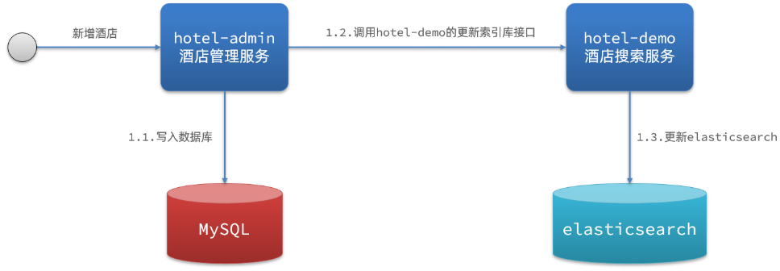
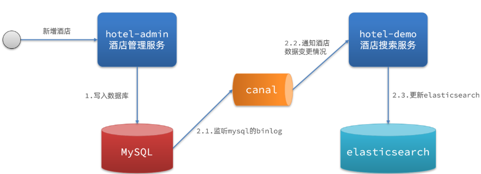
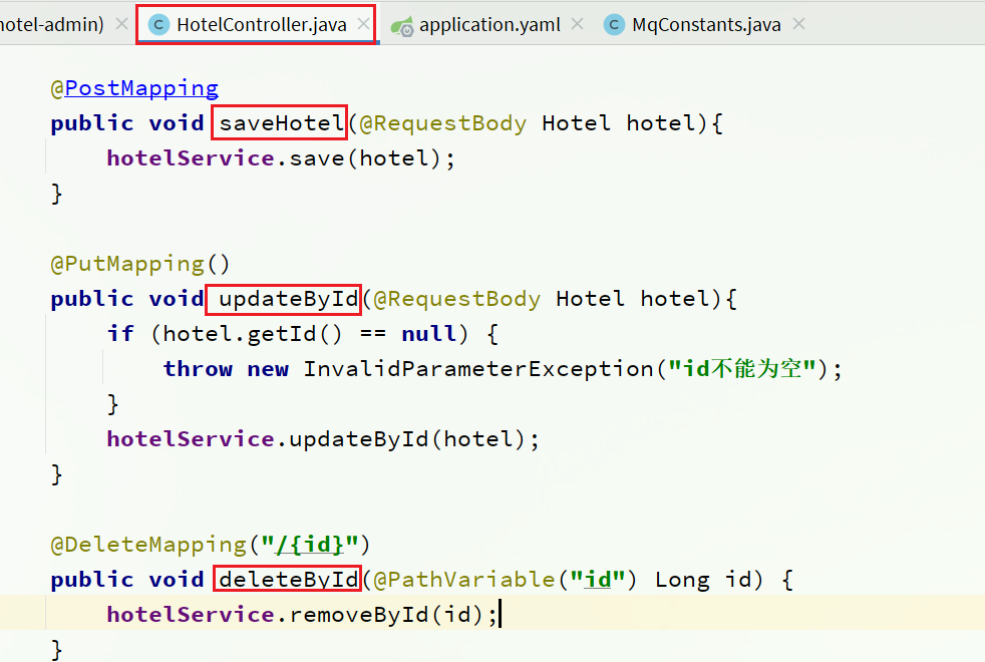

`elasticsearch` 中的酒店数据来自于 `mysql` 数据库，因此 `mysql` 数据发生改变时，`elasticsearch` 也必须跟着改变，这个就是 `elasticsearch` 与 `mysql` 之间的**数据同步**。


## 1：思路分析

:::warning 三种方案
**常见的数据同步方案有三种：**

- 同步调用
- 异步通知
- 监听binlog
:::

### 1.1 同步调用



基本步骤如下：

- `hotel-demo` 对外提供接口，用来修改 `elasticsearch` 中的数据
- 酒店管理服务在完成数据库操作后，直接调用 `hotel-demo`提供的接口，

### 1.2 异步通知


流程如下：

- `hotel-admin`对 `mysql` 数据库数据完成增、删、改后，发送MQ消息
- `hotel-demo` 监听 `MQ` ，接收到消息后完成 `elasticsearch` 数据修改

### 1.3 监听binlog



流程如下：

- 给 `mysql` 开启 `binlog` 功能
- `mysql` 完成增、删、改操作都会记录在 `binlog` 中
- `hotel-demo` 基于 `canal` 监听 `binlog` 变化，实时更新 `elasticsearch`中的内容

### 1.4 优缺点

**方式一：同步调用**

- 优点：实现简单，粗暴
- 缺点：业务耦合度高

**方式二：异步通知**

- 优点：低耦合，实现难度一般
- 缺点：依赖mq的可靠性

**方式三：监听binlog**

- 优点：完全解除服务间耦合
- 缺点：开启binlog增加数据库负担、实现复杂度高

## 2：数据同步实现

### 2.1 思路

`hotel-admin` 项目作为酒店管理的微服务。当酒店数据发生 `增`、`删`、`改`时，要求对 `elasticsearch` 中数据也要完成相同操作。

步骤：

- 导入hotel-admin项目，启动并测试酒店数据的CRUD

- 声明 `exchange`、`queue`、`RoutingKey`

- 在 `hotel-admin` 中的增、删、改业务中完成消息发送

- 在 `hotel-demo` 中完成消息监听，并更新 `elasticsearch`中数据

- 启动并测试数据同步功能

### 2.2 导入hotel-admin

其中包含了酒店的CRUD功能：



### 2.3 声明交换机、队列

MQ结构如图


#### 1）引入依赖

在hotel-admin、hotel-demo中引入rabbitmq的依赖：

```xml
<!--amqp-->
<dependency>
    <groupId>org.springframework.boot</groupId>
    <artifactId>spring-boot-starter-amqp</artifactId>
</dependency>
```

#### 2）声明队列交换机名称

在 `hotel-admin`和 `hotel-demo`中的`cn.itcast.hotel.constatnts`包下新建一个类`MqConstants`：

```java
package cn.itcast.hotel.constatnts;

    public class MqConstants {
    /**
     * 交换机
     */
    public final static String HOTEL_EXCHANGE = "hotel.topic";
    /**
     * 监听新增和修改的队列
     */
    public final static String HOTEL_INSERT_QUEUE = "hotel.insert.queue";
    /**
     * 监听删除的队列
     */
    public final static String HOTEL_DELETE_QUEUE = "hotel.delete.queue";
    /**
     * 新增或修改的RoutingKey
     */
    public final static String HOTEL_INSERT_KEY = "hotel.insert";
    /**
     * 删除的RoutingKey
     */
    public final static String HOTEL_DELETE_KEY = "hotel.delete";
}
```

#### 3）声明队列交换机

在 `hotel-demo`中，定义配置类，声明队列、交换机：

```java
package cn.itcast.hotel.config;

import cn.itcast.hotel.constants.MqConstants;
import org.springframework.amqp.core.Binding;
import org.springframework.amqp.core.BindingBuilder;
import org.springframework.amqp.core.Queue;
import org.springframework.amqp.core.TopicExchange;
import org.springframework.context.annotation.Bean;
import org.springframework.context.annotation.Configuration;

@Configuration
public class MqConfig {
    @Bean
    public TopicExchange topicExchange(){
        return new TopicExchange(MqConstants.HOTEL_EXCHANGE, true, false);
    }

    @Bean
    public Queue insertQueue(){
        return new Queue(MqConstants.HOTEL_INSERT_QUEUE, true);
    }

    @Bean
    public Queue deleteQueue(){
        return new Queue(MqConstants.HOTEL_DELETE_QUEUE, true);
    }

    @Bean
    public Binding insertQueueBinding(){
        return BindingBuilder.bind(insertQueue()).to(topicExchange()).with(MqConstants.HOTEL_INSERT_KEY);
    }

    @Bean
    public Binding deleteQueueBinding(){
        return BindingBuilder.bind(deleteQueue()).to(topicExchange()).with(MqConstants.HOTEL_DELETE_KEY);
    }
}
```

### 2.4 发送MQ消息

在 `hotel-admin` 中的增、删、改业务中分别发送MQ消息：


### 2.5 接收MQ消息

`hotel-demo` 接收到 `MQ` 消息要做的事情包括：

- 新增消息：根据传递的 `hotel` 的 `id` 查询 `hotel` 信息，然后新增一条数据到索引库
- 删除消息：根据传递的 `hotel` 的 `id` 删除索引库中的一条数据

#### 1）首先在hotel-demo的`cn.itcast.hotel.service`包下的`IHotelService`中新增新增、删除业务

```java
void deleteById(Long id);

void insertById(Long id);
```

#### 2）给hotel-demo中的`cn.itcast.hotel.service.impl`包下的HotelService中实现业务：

```java
@Override
public void deleteById(Long id) {
    try {
        // 1.准备Request
        DeleteRequest request = new DeleteRequest("hotel", id.toString());
        // 2.发送请求
        client.delete(request, RequestOptions.DEFAULT);
    } catch (IOException e) {
        throw new RuntimeException(e);
    }
}

@Override
public void insertById(Long id) {
    try {
        // 0.根据id查询酒店数据
        Hotel hotel = getById(id);
        // 转换为文档类型
        HotelDoc hotelDoc = new HotelDoc(hotel);

        // 1.准备Request对象
        IndexRequest request = new IndexRequest("hotel").id(hotel.getId().toString());
        // 2.准备Json文档
        request.source(JSON.toJSONString(hotelDoc), XContentType.JSON);
        // 3.发送请求
        client.index(request, RequestOptions.DEFAULT);
    } catch (IOException e) {
        throw new RuntimeException(e);
    }
}
```

#### 3）编写监听器

在hotel-demo中的`cn.itcast.hotel.mq`包新增一个类：

```java
package cn.itcast.hotel.mq;

import cn.itcast.hotel.constants.MqConstants;
import cn.itcast.hotel.service.IHotelService;
import org.springframework.amqp.rabbit.annotation.RabbitListener;
import org.springframework.beans.factory.annotation.Autowired;
import org.springframework.stereotype.Component;

@Component
public class HotelListener {

    @Autowired
    private IHotelService hotelService;

    /**
     * 监听酒店新增或修改的业务
     * @param id 酒店id
     */
    @RabbitListener(queues = MqConstants.HOTEL_INSERT_QUEUE)
    public void listenHotelInsertOrUpdate(Long id){
        hotelService.insertById(id);
    }

    /**
     * 监听酒店删除的业务
     * @param id 酒店id
     */
    @RabbitListener(queues = MqConstants.HOTEL_DELETE_QUEUE)
    public void listenHotelDelete(Long id){
        hotelService.deleteById(id);
    }
}
```
