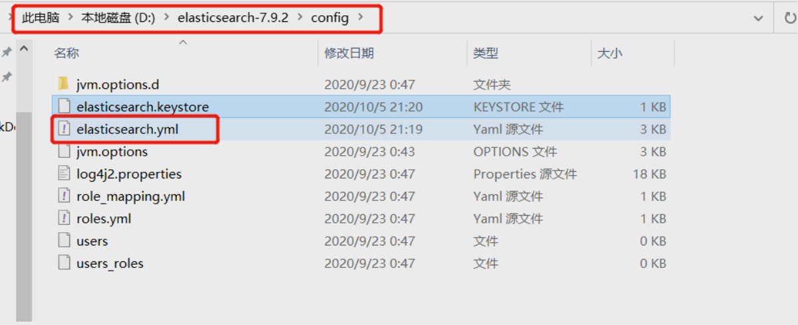
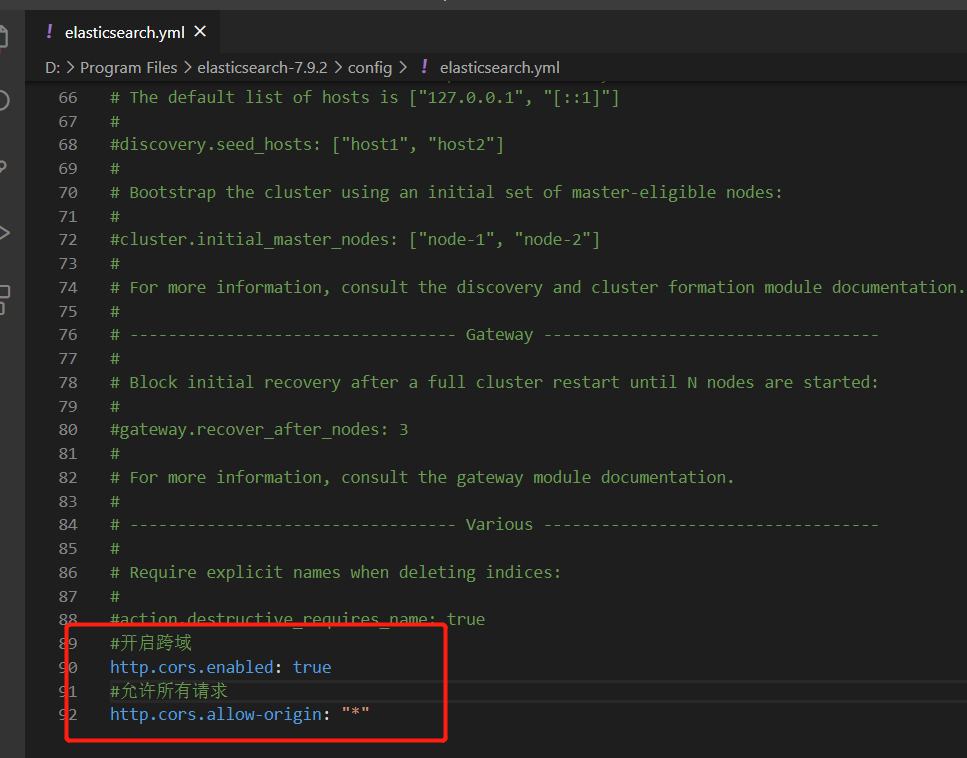
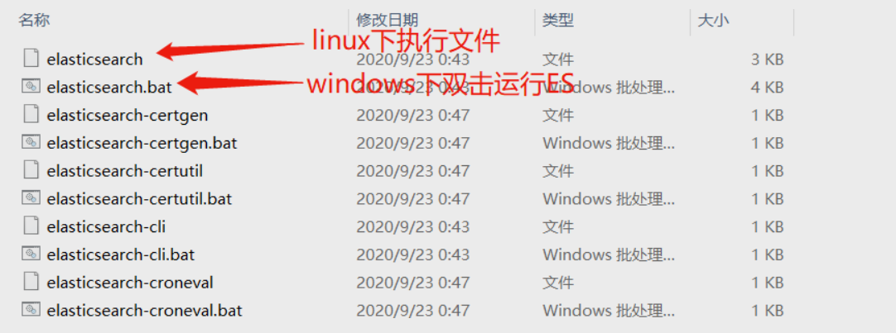
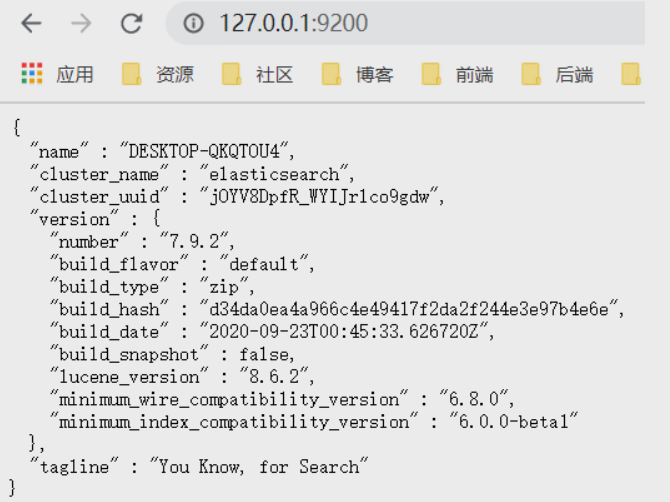
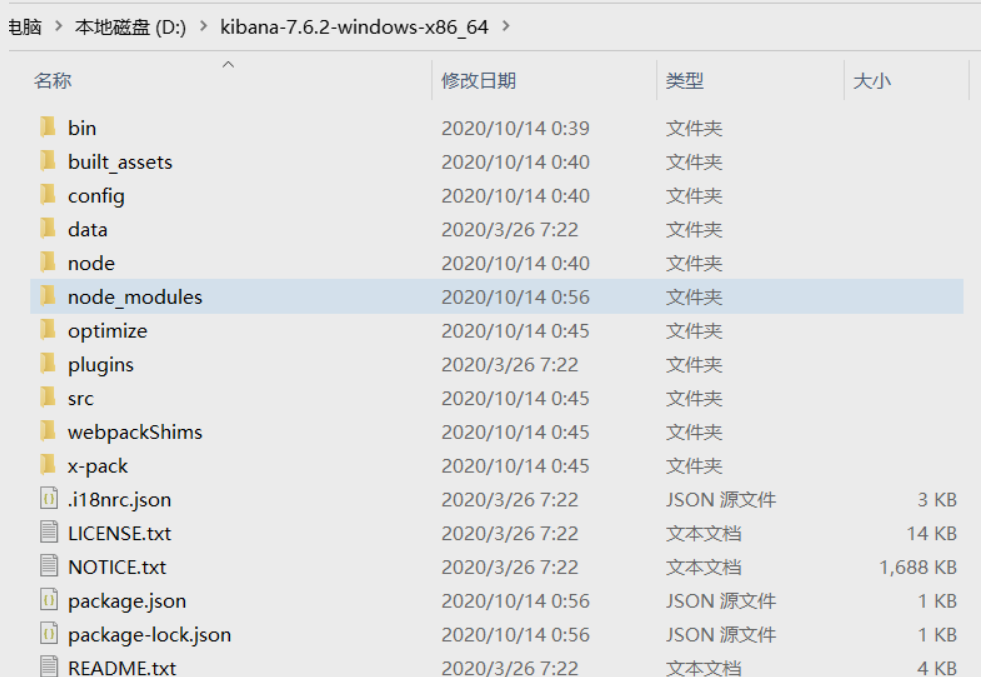
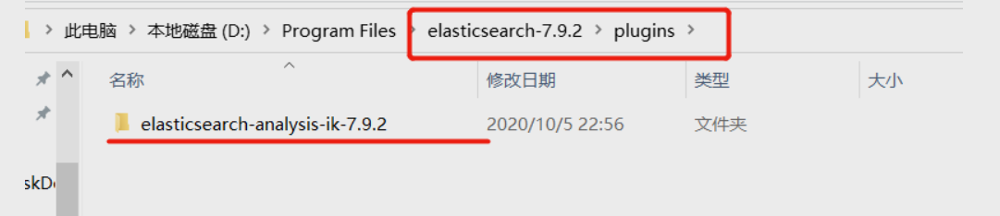
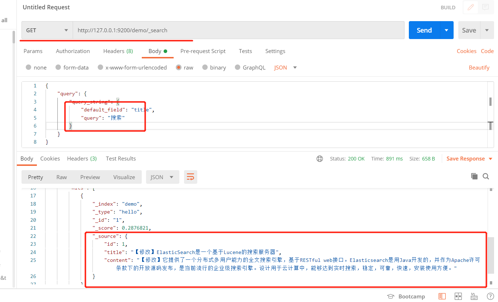

## 1：下载安装ES

### 1.1 下载ES

- 自带JDK的版本: [https://www.elastic.co/cn/downloads/elasticsearch](https://www.elastic.co/cn/downloads/elasticsearch)

- 不带JDK的版本: [https://www.elastic.co/cn/downloads/elasticsearch-no-jdk](https://www.elastic.co/cn/downloads/elasticsearch-no-jdk)

**注意：1.安装 `Elasticsearch` 前提条件：`JDK1.8` 及以上 `2.ES` 的安装目录即解压目录不能包含 `空格` 否则在之后ES将启动不了**

### 1.2 文件目录


这是自带 `JDK` 的 `ES` 版本目录，不带 `JDK` 的 `ES` 同理不存在 `jdk` 目录


### 1.3 解决ES的跨域问题

编辑ES配置文件





```xml
http.cors.enabled: true
http.cors.allow-origin: "*"
```

### 1.4 启动ES



这里会弹出命令行


### 1.5 验证ES是否启动成功
打开浏览器在地址栏输入 [http://127.0.0.1:9200](http://127.0.0.1:9200) 当出现如下提示时则表示ES启动成功



## 2：kibana

`Kibana` 基于 `Node.js`，所以安装之前需要安装 `Node.js`。

- `Node.js` 下载地址：[https://nodejs.org/zh-cn/](https://nodejs.org/zh-cn/)

- `Kinbana` 下载地址：[https://www.elastic.co/cn/downloads/past-releases#kibana](https://www.elastic.co/cn/downloads/past-releases#kibana)

- `Kibana` 用户手册：[https://www.elastic.co/guide/cn/kibana/current/index.html](https://www.elastic.co/guide/cn/kibana/current/index.html)

下载完 `Kibana` 之后解压

### 2.1 目录结构



### 2.2 编辑kibana.yml配置文件


如果本地已经启动了一个 `ES` ，就可以直接把这行注释放开


### 2.3 启动Kibana


### 2.4 效果


访问浏览器 [http://localhost:5601](http://localhost:5601)


安装完成，即可对 `ES` 进行操作

## 3：安装ik分词器

### 3.1 下载安装

**下载的版本最好和ES版本一致**

项目地址: [https://github.com/medcl/elasticsearch-analysis-ik](https://github.com/medcl/elasticsearch-analysis-ik)

解压，将解压后的文件夹拷贝到 `ES目录\plugins` 下



运行ES，可以看到ik分词器已被加载


### 3.2 IK分词器测试-最小切分(ik_smart)


返回的结果

```json
{
  "tokens": [
    {
      "token": "这是",
      "start_offset": 0,
      "end_offset": 2,
      "type": "CN_WORD",
      "position": 0
    },
    {
      "token": "一个",
      "start_offset": 2,
      "end_offset": 4,
      "type": "CN_WORD",
      "position": 1
    },
    {
      "token": "对",
      "start_offset": 4,
      "end_offset": 5,
      "type": "CN_CHAR",
      "position": 2
    },
    {
      "token": "分词器",
      "start_offset": 5,
      "end_offset": 8,
      "type": "CN_WORD",
      "position": 3
    },
    {
      "token": "的",
      "start_offset": 8,
      "end_offset": 9,
      "type": "CN_CHAR",
      "position": 4
    },
    {
      "token": "测试",
      "start_offset": 9,
      "end_offset": 11,
      "type": "CN_WORD",
      "position": 5
    }
  ]
}
```

### 3.3 IK分词器测试-最细切分(ik_max_word)


返回结果

```json
{
  "tokens": [
    {
      "token": "这是",
      "start_offset": 0,
      "end_offset": 2,
      "type": "CN_WORD",
      "position": 0
    },
    {
      "token": "一个",
      "start_offset": 2,
      "end_offset": 4,
      "type": "CN_WORD",
      "position": 1
    },
    {
      "token": "一",
      "start_offset": 2,
      "end_offset": 3,
      "type": "TYPE_CNUM",
      "position": 2
    },
    {
      "token": "个",
      "start_offset": 3,
      "end_offset": 4,
      "type": "COUNT",
      "position": 3
    },
    {
      "token": "对分",
      "start_offset": 4,
      "end_offset": 6,
      "type": "CN_WORD",
      "position": 4
    },
    {
      "token": "分词器",
      "start_offset": 5,
      "end_offset": 8,
      "type": "CN_WORD",
      "position": 5
    },
    {
      "token": "分词",
      "start_offset": 5,
      "end_offset": 7,
      "type": "CN_WORD",
      "position": 6
    },
    {
      "token": "器",
      "start_offset": 7,
      "end_offset": 8,
      "type": "CN_CHAR",
      "position": 7
    },
    {
      "token": "的",
      "start_offset": 8,
      "end_offset": 9,
      "type": "CN_CHAR",
      "position": 8
    },
    {
      "token": "测试",
      "start_offset": 9,
      "end_offset": 11,
      "type": "CN_WORD",
      "position": 9
    }
  ]
}
```

### 3.4 分析器使用ik

#### 删除索引


#### 新建索引和Mapping，分析器选择的时ik_max_word


可在Head中查看到Mapping


#### 当改用ik分词器（ik_max_word）再次查询关键词“搜钢索”时，


#### 当改用ik分词器（ik_max_word）查询关键词“搜索”时，




