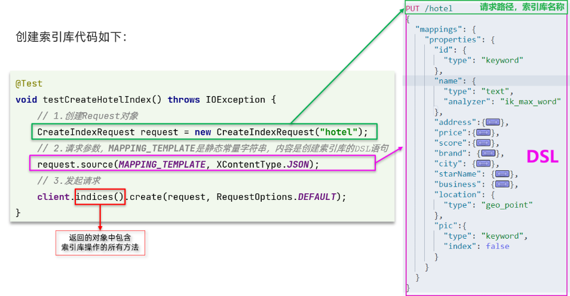
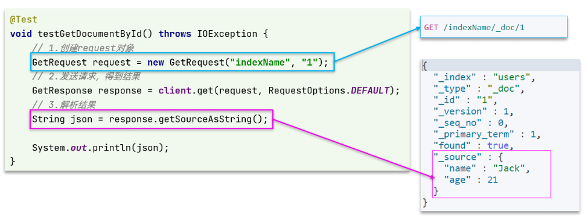
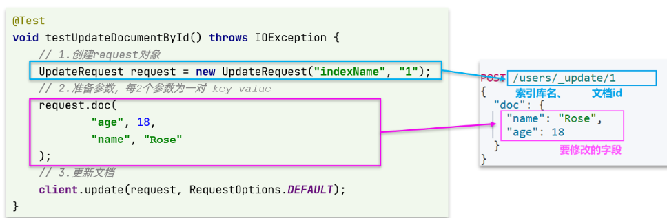

## 1：操作索引库

### 1.1 创建索引库



代码分为三步：

- 1）**创建 `Request` 对象**。因为是 `创建索引库` 的操作，因此 `Request` 是`CreateIndexRequest`。
- 2）**添加请求参数**，其实就是 `DSL` 的 `JSON` 参数部分。因为 `json` 字符串很长，这里是定义了静态字符串常量 `MAPPING_TEMPLATE` ，让代码看起来更加优雅。
- 3）**发送请求**，`client.indices()` 方法的返回值是 `IndicesClient` 类型，封装了所有与索引库操作有关的方法。

#### 创建索引库的静态常量代码
```java
package cn.itcast.hotel.constants;

public class HotelConstants {
    public static final String MAPPING_TEMPLATE = "{\n" +
            "  \"mappings\": {\n" +
            "    \"properties\": {\n" +
            "      \"id\": {\n" +
            "        \"type\": \"keyword\"\n" +
            "      },\n" +
            "      \"name\":{\n" +
            "        \"type\": \"text\",\n" +
            "        \"analyzer\": \"ik_max_word\",\n" +
            "        \"copy_to\": \"all\"\n" +
            "      },\n" +
            "      \"address\":{\n" +
            "        \"type\": \"keyword\",\n" +
            "        \"index\": false\n" +
            "      },\n" +
            "      \"price\":{\n" +
            "        \"type\": \"integer\"\n" +
            "      },\n" +
            "      \"score\":{\n" +
            "        \"type\": \"integer\"\n" +
            "      },\n" +
            "      \"brand\":{\n" +
            "        \"type\": \"keyword\",\n" +
            "        \"copy_to\": \"all\"\n" +
            "      },\n" +
            "      \"city\":{\n" +
            "        \"type\": \"keyword\",\n" +
            "        \"copy_to\": \"all\"\n" +
            "      },\n" +
            "      \"starName\":{\n" +
            "        \"type\": \"keyword\"\n" +
            "      },\n" +
            "      \"business\":{\n" +
            "        \"type\": \"keyword\"\n" +
            "      },\n" +
            "      \"location\":{\n" +
            "        \"type\": \"geo_point\"\n" +
            "      },\n" +
            "      \"pic\":{\n" +
            "        \"type\": \"keyword\",\n" +
            "        \"index\": false\n" +
            "      },\n" +
            "      \"all\":{\n" +
            "        \"type\": \"text\",\n" +
            "        \"analyzer\": \"ik_max_word\"\n" +
            "      }\n" +
            "    }\n" +
            "  }\n" +
            "}";
}
```

#### 真正实现代码
```java
public class HotelIndexTest {
    private RestHighLevelClient client;
    @Test
    void createHotelIndex() throws IOException {
        // 1.创建Request对象
        CreateIndexRequest request = new CreateIndexRequest("hotel");
        // 2.准备请求的参数：DSL语句
        request.source(MAPPING_TEMPLATE, XContentType.JSON);
        // 3.发送请求
        client.indices().create(request, RequestOptions.DEFAULT);
    }

    @BeforeEach
    void setUp() {
        this.client = new RestHighLevelClient(RestClient.builder(
                HttpHost.create("http://127.0.0.1:9200")
        ));
    }

    @AfterEach
    void tearDown() throws IOException {
        this.client.close();
    }
}
```
### 1.2 删除索引库

删除索引库的DSL语句非常简单：

```shell
DELETE /hotel
```

与创建索引库相比：

- 请求方式从 `PUT` 变为 `DELTE`
- 请求路径不变
- 无请求参数

所以代码的差异，注意体现在Request对象上。依然是三步走：

- 1）创建 `Request` 对象。这次是 `DeleteIndexRequest` 对象
- 2）准备参数。这里是无参
- 3）发送请求。改用 `delete`方法


```java
@Test
void testDeleteHotelIndex() throws IOException {
    // 1.创建Request对象
    DeleteIndexRequest request = new DeleteIndexRequest("hotel");
    // 2.发送请求
    client.indices().delete(request, RequestOptions.DEFAULT);
}
```

### 1.3 判断索引库是否存在

判断索引库是否存在，本质就是查询，对应的DSL是：

```shell
GET /hotel
```

因此与删除的Java代码流程是类似的。依然是三步走：

- 1）创建 `Request` 对象。这次是 `GetIndexRequest` 对象
- 2）准备参数。这里是无参
- 3）发送请求。改用 `exists` 方法


```java
@Test
void testExistsHotelIndex() throws IOException {
    // 1.创建Request对象
    GetIndexRequest request = new GetIndexRequest("hotel");
    // 2.发送请求
    boolean exists = client.indices().exists(request, RequestOptions.DEFAULT);
    // 3.输出
    System.err.println(exists ? "索引库已经存在！" : "索引库不存在！");
}
```

### 1.4 总结

`JavaRestClient` 操作 `elasticsearch` 的流程基本类似。核心是 `client.indices()`方法来获取索引库的操作对象。

索引库操作的基本步骤：

- 初始化 `RestHighLevelClient`
- 创建 `XxxIndexRequest`。`XXX` 是 `Create`、`Get`、`Delete`
- 准备 `DSL`（ `Create` 时需要，其它是无参）
- 发送请求。调用 `RestHighLevelClient#indices().xxx()` 方法，`xxx` 是 `create`、`exists`、`delete`


## 2：操作文档

### 2.1 创建文档

#### 索引库实体类
```java
@Data
@TableName("tb_hotel")
public class Hotel {
    @TableId(type = IdType.INPUT)
    private Long id;
    private String name;
    private String address;
    private Integer price;
    private Integer score;
    private String brand;
    private String city;
    private String starName;
    private String business;
    private String longitude;
    private String latitude;
    private String pic;
}
```
与我们的索引库结构存在差异：

- `longitude` 和 `latitude` 需要合并为 `location`

因此，我们需要定义一个新的类型，与索引库结构吻合：

```java
package cn.itcast.hotel.pojo;

import lombok.Data;
import lombok.NoArgsConstructor;

@Data
@NoArgsConstructor
public class HotelDoc {
    private Long id;
    private String name;
    private String address;
    private Integer price;
    private Integer score;
    private String brand;
    private String city;
    private String starName;
    private String business;
    private String location;
    private String pic;

    public HotelDoc(Hotel hotel) {
        this.id = hotel.getId();
        this.name = hotel.getName();
        this.address = hotel.getAddress();
        this.price = hotel.getPrice();
        this.score = hotel.getScore();
        this.brand = hotel.getBrand();
        this.city = hotel.getCity();
        this.starName = hotel.getStarName();
        this.business = hotel.getBusiness();
        this.location = hotel.getLatitude() + ", " + hotel.getLongitude();
        this.pic = hotel.getPic();
    }
}

```
#### 语法说明

DSL语句如下：
```json
POST /{索引库名}/_doc/1
{
    "name": "Jack",
    "age": 21
}
```

对应的java代码如图：


可以看到与创建索引库类似，同样是三步走：

- 1）创建 `Request`对象
- 2）准备请求参数，也就是DSL中的JSON文档
- 3）发送请求

变化的地方在于，这里直接使用 `client.xxx()` 的API，不再需要 `client.indices()`了。

**java完整代码**
```java
@Test
void testAddDocument() throws IOException {
    // 1.根据id查询酒店数据
    Hotel hotel = hotelService.getById(61083L);
    // 2.转换为文档类型
    HotelDoc hotelDoc = new HotelDoc(hotel);
    // 3.将HotelDoc转json
    String json = JSON.toJSONString(hotelDoc);

    // 1.准备Request对象
    IndexRequest request = new IndexRequest("hotel").id(hotelDoc.getId().toString());
    // 2.准备Json文档
    request.source(json, XContentType.JSON);
    // 3.发送请求
    client.index(request, RequestOptions.DEFAULT);
}
```

### 2.2 查询文档

查询的DSL语句如下：

```json
GET /hotel/_doc/{id}
```

非常简单，因此代码大概分两步：

- 准备 `Request` 对象
- 发送请求

不过查询的目的是得到结果，解析为 `HotelDoc`，因此难点是结果的解析。完整代码如下：



可以看到，结果是一个 `JSON` ，其中文档放在一个`_source`属性中，因此解析就是拿到`_source`，反序列化为Java对象即可。

与之前类似，也是三步走：

- 1）准备 `Request` 对象。这次是查询，所以是 `GetRequest`
- 2）发送请求，得到结果。因为是查询，这里调用 `client.get()` 方法
- 3）解析结果，就是对 `JSON做反序列化`

#### 完整代码
```java
@Test
void testGetDocumentById() throws IOException {
    // 1.准备Request
    GetRequest request = new GetRequest("hotel", "61082");
    // 2.发送请求，得到响应
    GetResponse response = client.get(request, RequestOptions.DEFAULT);
    // 3.解析响应结果
    String json = response.getSourceAsString();

    HotelDoc hotelDoc = JSON.parseObject(json, HotelDoc.class);
    System.out.println(hotelDoc);
}
```

### 2.3 删除文档

删除的 `DSL` 为是这样的：

```shell
DELETE /hotel/_doc/{id}
```

与查询相比，仅仅是请求方式从 `GET` 变成 `DELETE`，可以想象Java代码应该依然是三步走：

- 1）**准备 `Request` 对象**，因为是删除，这次是 `DeleteRequest` 对象。要指定索引库名和id
- 2）**准备参数**，无参
- 3）**发送请求**。因为是删除，所以是 `client.delete()` 方法


```java
@Test
void testDeleteDocument() throws IOException {
    // 1.准备Request
    DeleteRequest request = new DeleteRequest("hotel", "61083");
    // 2.发送请求
    client.delete(request, RequestOptions.DEFAULT);
}
```

### 2.4 修改文档

修改我们讲过两种方式：

- `全量修改`：本质是先根据id删除，再新增
- `增量修改`：修改文档中的指定字段值


在 `RestClient` 的API中，全量修改与新增的API完全一致，判断依据是ID：

- 如果新增时，ID已经存在，则修改
- 如果新增时，ID不存在，则新增

这里不再赘述，我们主要关注增量修改。



与之前类似，也是三步走：

- 1）**准备 `Request` 对象**。这次是修改，所以是 `UpdateRequest` 
- 2）**准备参数**。也就是 `JSON` 文档，里面包含要修改的字段
- 3）**更新文档**。这里调用 `client.update()` 方法

```java
@Test
void testUpdateDocument() throws IOException {
    // 1.准备Request
    UpdateRequest request = new UpdateRequest("hotel", "61083");
    // 2.准备请求参数
    request.doc(
        "price", "952",
        "starName", "四钻"
    );
    // 3.发送请求
    client.update(request, RequestOptions.DEFAULT);
}
```

### 2.5 批量导入文档

案例需求：利用 `BulkRequest` 批量将数据库数据导入到索引库中。

步骤如下：

- 利用 `mybatis-plus` 查询酒店数据

- 将查询到的酒店数据（Hotel）转换为文档类型数据（HotelDoc）

- 利用 `JavaRestClient` 中的 `BulkRequest` 批处理，实现批量新增文档


#### 语法说明

批量处理 `BulkRequest` ，其本质就是将多个普通的CRUD请求组合在一起发送。

其中提供了一个add方法，用来添加其他请求：


可以看到，能添加的请求包括：

- `IndexRequest`，也就是新增
- `UpdateRequest`，也就是修改
- `DeleteRequest`，也就是删除

因此Bulk中添加了多个 `IndexRequest`，就是批量新增功能了。示例：


其实还是三步走：

- 1）创建 `Request` 对象。这里是 `BulkRequest`
- 2）准备参数。批处理的参数，就是其它 `Request` 对象，这里就是多个 `IndexRequest`
- 3）发起请求。这里是批处理，调用的方法为 `client.bulk()`方法


```java
@Test
void testBulkRequest() throws IOException {
    // 批量查询酒店数据
    List<Hotel> hotels = hotelService.list();

    // 1.创建Request
    BulkRequest request = new BulkRequest();
    // 2.准备参数，添加多个新增的Request
    for (Hotel hotel : hotels) {
        // 2.1.转换为文档类型HotelDoc
        HotelDoc hotelDoc = new HotelDoc(hotel);
        // 2.2.创建新增文档的Request对象
        request.add(new IndexRequest("hotel")
                    .id(hotelDoc.getId().toString())
                    .source(JSON.toJSONString(hotelDoc), XContentType.JSON));
    }
    // 3.发送请求
    client.bulk(request, RequestOptions.DEFAULT);
}

```

### 2.6 小结

文档操作的基本步骤：

- 初始化`RestHighLevelClient`
- 创建 `XxxRequest`。`XXX` 是 `Index`、`Get`、`Update`、`Delete`、`Bulk`
- 准备参数（`Index`、`Update`、`Bulk`时需要）
- 发送请求。调用 `RestHighLevelClient.xxx()` 方法，`xxx` 是 `index`、`get`、`update`、`delete`、`bulk`
- 解析结果（Get时需要）