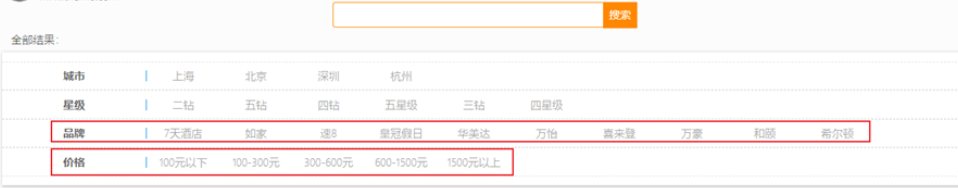
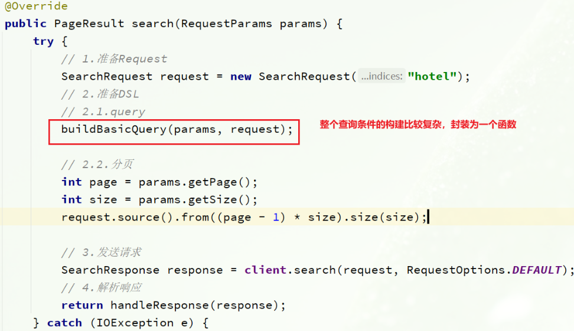
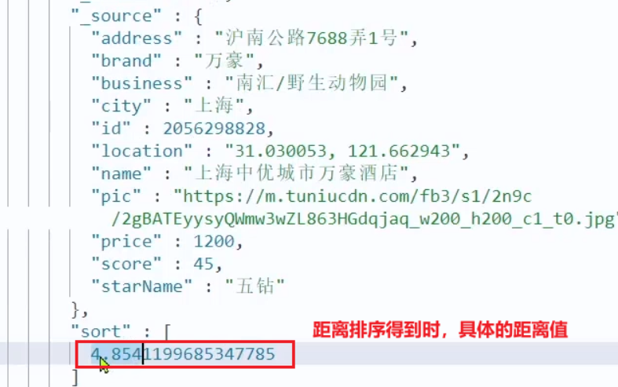

## 1：搜索和分页

### 1.1 需求分析


### 1.2 实体类

```java
package cn.itcast.hotel.pojo;

import lombok.Data;

@Data
public class RequestParams {
    private String key;
    private Integer page;
    private Integer size;
    private String sortBy;
}
```

返回类
```java
package cn.itcast.hotel.pojo;

import lombok.Data;
import java.util.List;

@Data
public class PageResult {
    private Long total;
    private List<HotelDoc> hotels;

    public PageResult() {
    }

    public PageResult(Long total, List<HotelDoc> hotels) {
        this.total = total;
        this.hotels = hotels;
    }
}
```

### 1.3 controller

定义一个 `HotelController`，声明查询接口，满足下列要求：

- 请求方式：Post
- 请求路径：/hotel/list
- 请求参数：对象，类型为RequestParam
- 返回值：PageResult，包含两个属性
  - `Long total`：总条数
  - `List<HotelDoc> hotels`：酒店数据

```java
@RestController
@RequestMapping("/hotel")
public class HotelController {

    @Autowired
    private IHotelService hotelService;
	// 搜索酒店数据
    @PostMapping("/list")
    public PageResult search(@RequestBody RequestParams params){
        return hotelService.search(params);
    }
}
```

### 1.4 注入es客户端

HotelDemoApplication`中声明这个Bean：

```java
@Bean
public RestHighLevelClient client(){
    return  new RestHighLevelClient(RestClient.builder(
        HttpHost.create("http://127.0.0.1:9200")
    ));
}
```

### 1.5 service

```java
@Override
public PageResult search(RequestParams params) {
    try {
        // 1.准备Request
        SearchRequest request = new SearchRequest("hotel");
        // 2.准备DSL
        // 2.1.query
        // 1.构建BooleanQuery
        BoolQueryBuilder boolQuery = QueryBuilders.boolQuery();
        String key = params.getKey();
        if (key == null || "".equals(key)) {
            boolQuery.must(QueryBuilders.matchAllQuery());
        } else {
            boolQuery.must(QueryBuilders.matchQuery("all", key));
        }

        // 2.2.分页
        int page = params.getPage();
        int size = params.getSize();
        request.source().from((page - 1) * size).size(size);

        // 3.发送请求
        SearchResponse response = client.search(request, RequestOptions.DEFAULT);
        // 4.解析响应
        return handleResponse(response);
    } catch (IOException e) {
        throw new RuntimeException(e);
    }
}

// 结果解析
private PageResult handleResponse(SearchResponse response) {
    // 4.解析响应
    SearchHits searchHits = response.getHits();
    // 4.1.获取总条数
    long total = searchHits.getTotalHits().value;
    // 4.2.文档数组
    SearchHit[] hits = searchHits.getHits();
    // 4.3.遍历
    List<HotelDoc> hotels = new ArrayList<>();
    for (SearchHit hit : hits) {
        // 获取文档source
        String json = hit.getSourceAsString();
        // 反序列化
        HotelDoc hotelDoc = JSON.parseObject(json, HotelDoc.class);
		// 放入集合
        hotels.add(hotelDoc);
    }
    // 4.4.封装返回
    return new PageResult(total, hotels);
}
```

## 2：结果过滤

### 2.1 需求分析

在页面搜索框下面，会有一些过滤项：



包含的过滤条件有：

- `brand`：品牌值
- `city`：城市
- `minPrice~maxPrice`：价格范围
- `starName`：星级

我们需要做两件事情：

- 修改请求参数的对象 `RequestParams`，接收上述参数
- 修改业务逻辑，在搜索条件之外，添加一些过滤条件


### 2.2 修改请求参数对象

```java
@Data
public class RequestParams {
    private String key;
    private Integer page;
    private Integer size;
    private String sortBy;
    // 下面是新增的过滤条件参数
    private String city;
    private String brand;
    private String starName;
    private Integer minPrice;
    private Integer maxPrice;
}
```

### 2.3 修改业务逻辑

在HotelService的search方法中，只有一个地方需要修改：`requet.source().query( ... )`其中的查询条件。

在之前的业务中，只有match查询，根据关键字搜索，现在要添加条件过滤，包括：

- **品牌过滤**：是 `keyword` 类型，用 `term` 查询
- **星级过滤**：是 `keyword` 类型，用 `term` 查询
- **价格过滤**：是 `数值` 类型，用 `range` 查询
- **城市过滤**：是 `keyword` 类型，用 `term` 查询

多个查询条件组合，肯定是boolean查询来组合：

- 关键字搜索放到 `must` 中，参与算分
- 其它过滤条件放到 `filter` 中，不参与算分


因为条件构建的逻辑比较复杂，这里先封装为一个函数：



`buildBasicQuery` 的代码如下：

```java
private void buildBasicQuery(RequestParams params, SearchRequest request) {
    // 1.构建BooleanQuery
    BoolQueryBuilder boolQuery = QueryBuilders.boolQuery();
    // 2.关键字搜索
    String key = params.getKey();
    if (key == null || "".equals(key)) {
        boolQuery.must(QueryBuilders.matchAllQuery());
    } else {
        boolQuery.must(QueryBuilders.matchQuery("all", key));
    }
    // 3.城市条件
    if (params.getCity() != null && !params.getCity().equals("")) {
        boolQuery.filter(QueryBuilders.termQuery("city", params.getCity()));
    }
    // 4.品牌条件
    if (params.getBrand() != null && !params.getBrand().equals("")) {
        boolQuery.filter(QueryBuilders.termQuery("brand", params.getBrand()));
    }
    // 5.星级条件
    if (params.getStarName() != null && !params.getStarName().equals("")) {
        boolQuery.filter(QueryBuilders.termQuery("starName", params.getStarName()));
    }
	// 6.价格
    if (params.getMinPrice() != null && params.getMaxPrice() != null) {
        boolQuery.filter(QueryBuilders
                         .rangeQuery("price")
                         .gte(params.getMinPrice())
                         .lte(params.getMaxPrice())
                        );
    }
	// 7.放入source
    request.source().query(boolQuery);
}
```


## 3：周边酒店实现

### 3.1 需求分析

我们要做的事情就是基于这个 `location` 坐标，然后按照距离对周围酒店排序。实现思路如下：

- 修改 `RequestParams` 参数，接收 `location` 字段
- 修改 `search` 方法业务逻辑，如果 `location` 有值，添加根据 `geo_distance` 排序的功能


### 3.2 修改实体类

```java
package cn.itcast.hotel.pojo;

import lombok.Data;

@Data
public class RequestParams {
    private String key;
    private Integer page;
    private Integer size;
    private String sortBy;
    private String city;
    private String brand;
    private String starName;
    private Integer minPrice;
    private Integer maxPrice;
    // 我当前的地理坐标
    private String location;
}
```


### 3.3 DSL语法

```json
GET /indexName/_search
{
  "query": {
    "match_all": {}
  },
  "sort": [
    {
      "price": "asc"  
    },
    {
      "_geo_distance" : {
          "FIELD" : "纬度，经度",
          "order" : "asc",
          "unit" : "km"
      }
    }
  ]
}
```

对应的java代码示例:


### 3.4 添加距离排序


完整代码：

```java
@Override
public PageResult search(RequestParams params) {
    try {
        // 1.准备Request
        SearchRequest request = new SearchRequest("hotel");
        // 2.准备DSL
        // 2.1.query
        buildBasicQuery(params, request);

        // 2.2.分页
        int page = params.getPage();
        int size = params.getSize();
        request.source().from((page - 1) * size).size(size);

        // 2.3.排序
        String location = params.getLocation();
        if (location != null && !location.equals("")) {
            request.source().sort(SortBuilders
                                  .geoDistanceSort("location", new GeoPoint(location))
                                  .order(SortOrder.ASC)
                                  .unit(DistanceUnit.KILOMETERS)
                                 );
        }

        // 3.发送请求
        SearchResponse response = client.search(request, RequestOptions.DEFAULT);
        // 4.解析响应
        return handleResponse(response);
    } catch (IOException e) {
        throw new RuntimeException(e);
    }
}
```

### 3.5 排序距离显示

排序完成后，页面还要获取我附近每个酒店的具体**距离**值，这个值在响应结果中是独立的：



因此，我们在结果解析阶段，除了解析source部分以外，还要得到sort部分，也就是排序的距离，然后放到响应结果中。

我们要做两件事：

- 修改HotelDoc，添加排序距离字段，用于页面显示
- 修改HotelService类中的handleResponse方法，添加对sort值的获取


1）修改HotelDoc类，添加距离字段

```java
package cn.itcast.hotel.pojo;

import lombok.Data;
import lombok.NoArgsConstructor;


@Data
@NoArgsConstructor
public class HotelDoc {
    private Long id;
    private String name;
    private String address;
    private Integer price;
    private Integer score;
    private String brand;
    private String city;
    private String starName;
    private String business;
    private String location;
    private String pic;
    // 排序时的 距离值
    private Object distance;

    public HotelDoc(Hotel hotel) {
        this.id = hotel.getId();
        this.name = hotel.getName();
        this.address = hotel.getAddress();
        this.price = hotel.getPrice();
        this.score = hotel.getScore();
        this.brand = hotel.getBrand();
        this.city = hotel.getCity();
        this.starName = hotel.getStarName();
        this.business = hotel.getBusiness();
        this.location = hotel.getLatitude() + ", " + hotel.getLongitude();
        this.pic = hotel.getPic();
    }
}
```
2）修改 `HotelService` 中的 `handleResponse` 方法


## 4：酒店竞价排名

### 4.1 需求分析

要让指定酒店在搜索结果中排名置顶，效果如图：


页面会给指定的酒店添加**广告**标记。

那怎样才能让指定的酒店排名置顶呢？

我们之前学习过的 `function_score` 查询可以影响算分，算分高了，自然排名也就高了。而`function_score` 包含3个要素：

- `过滤条件`：哪些文档要加分
- `算分函数`：如何计算 `function score`
- `加权方式`：`function_score` 与 `query_score`如何运算

这里的需求是：让**指定酒店**排名靠前。因此我们需要给这些酒店添加一个标记，这样在过滤条件中就可以**根据这个标记来判断，是否要提高算分**。

比如，我们给酒店添加一个字段：`isAD`，Boolean类型：

- `true`：是广告
- `false`：不是广告

这样 `function_score` 包含3个要素就很好确定了：

- 过滤条件：判断isAD 是否为true
- 算分函数：我们可以用最简单暴力的weight，固定加权值
- 加权方式：可以用默认的相乘，大大提高算分


因此，业务的实现步骤包括：

1. 给 `HotelDoc` 类添加 `isAD` 字段，`Boolean` 类型

2. 挑选几个你喜欢的酒店，给它的文档数据添加 `isAD` 字段，值为 `true`

3. 修改 `search` 方法，添加 `function_score` 功能，给 `isAD` 值为 `true`的酒店增加权重


### 4.2 修改HotelDoc实体


### 4.3 添加广告标记

接下来，我们挑几个酒店，添加 `isAD` 字段，设置为 `true`：

```json
POST /hotel/_update/1902197537
{
    "doc": {
        "isAD": true
    }
}
POST /hotel/_update/2056126831
{
    "doc": {
        "isAD": true
    }
}
POST /hotel/_update/1989806195
{
    "doc": {
        "isAD": true
    }
}
POST /hotel/_update/2056105938
{
    "doc": {
        "isAD": true
    }
}
```

### 4.4 添加算分函数查询

接下来我们就要修改查询条件了。之前是用的 `boolean` 查询，现在要改成 `function_socre` 查询。

`function_score` 查询结构如下：


对应的JavaAPI如下：


我们可以将之前写的 `boolean` 查询作为**原始查询**条件放到 `query` 中，接下来就是添加**过滤条件**、**算分函数**、**加权模式**了。所以原来的代码依然可以沿用。

修改 `HotelService`类中的`buildBasicQuery`方法，添加算分函数查询：

```java
private void buildBasicQuery(RequestParams params, SearchRequest request) {
    // 1.构建BooleanQuery
    BoolQueryBuilder boolQuery = QueryBuilders.boolQuery();
    // 关键字搜索
    String key = params.getKey();
    if (key == null || "".equals(key)) {
        boolQuery.must(QueryBuilders.matchAllQuery());
    } else {
        boolQuery.must(QueryBuilders.matchQuery("all", key));
    }
    // 城市条件
    if (params.getCity() != null && !params.getCity().equals("")) {
        boolQuery.filter(QueryBuilders.termQuery("city", params.getCity()));
    }
    // 品牌条件
    if (params.getBrand() != null && !params.getBrand().equals("")) {
        boolQuery.filter(QueryBuilders.termQuery("brand", params.getBrand()));
    }
    // 星级条件
    if (params.getStarName() != null && !params.getStarName().equals("")) {
        boolQuery.filter(QueryBuilders.termQuery("starName", params.getStarName()));
    }
    // 价格
    if (params.getMinPrice() != null && params.getMaxPrice() != null) {
        boolQuery.filter(QueryBuilders
                         .rangeQuery("price")
                         .gte(params.getMinPrice())
                         .lte(params.getMaxPrice())
                        );
    }

    // 2.算分控制
    FunctionScoreQueryBuilder functionScoreQuery =
        QueryBuilders.functionScoreQuery(
        // 原始查询，相关性算分的查询
        boolQuery,
        // function score的数组
        new FunctionScoreQueryBuilder.FilterFunctionBuilder[]{
            // 其中的一个function score 元素
            new FunctionScoreQueryBuilder.FilterFunctionBuilder(
                // 过滤条件
                QueryBuilders.termQuery("isAD", true),
                // 算分函数
                ScoreFunctionBuilders.weightFactorFunction(10)
            )
        });
    request.source().query(functionScoreQuery);
}
```

## 5：完整代码


### 5.1 接口参数
```java
@Data
public class RequestParams {
    private String key;
    private Integer page;
    private Integer size;
    private String sortBy;
    private String city;
    private String brand;
    private String starName;
    private Integer minPrice;
    private Integer maxPrice;
    // 我当前的地理坐标
    private String location;
}
```

### 5.2 返回类

```java
@Data
public class PageResult {
    private Long total;
    private List<HotelDoc> hotels;

    public PageResult() {
    }

    public PageResult(Long total, List<HotelDoc> hotels) {
        this.total = total;
        this.hotels = hotels;
    }
}
```

### 5.3 DSL索引库对应类

```java
@Data
@NoArgsConstructor
public class HotelDoc {
    private Long id;
    private String name;
    private String address;
    private Integer price;
    private Integer score;
    private String brand;
    private String city;
    private String starName;
    private String business;
    private String location;
    private String pic;

    public HotelDoc(Hotel hotel) {
        this.id = hotel.getId();
        this.name = hotel.getName();
        this.address = hotel.getAddress();
        this.price = hotel.getPrice();
        this.score = hotel.getScore();
        this.brand = hotel.getBrand();
        this.city = hotel.getCity();
        this.starName = hotel.getStarName();
        this.business = hotel.getBusiness();
        this.location = hotel.getLatitude() + ", " + hotel.getLongitude();
        this.pic = hotel.getPic();
    }
}

```
### 5.4 service层
```java
@Service
public class HotelService extends ServiceImpl<HotelMapper, Hotel> implements IHotelService {

    @Autowired
    private RestHighLevelClient client;

    @Override
    public PageResult search(RequestParams params) {
        try {
        //1:准备request
        SearchRequest request = new SearchRequest("hotel");
        //2:组织DSL参数
        //2.1准备query
        buildBasicQuery(params,request);
        //2.2准备分页
        int page = params.getPage();
         int size = params.getSize();
        request.source().from((page-1) * size).size(size);
            // 2.3.排序
            String location = params.getLocation();
            if (location != null && !location.equals("")) {
                request.source().sort(SortBuilders
                        .geoDistanceSort("location", new GeoPoint(location))
                        .order(SortOrder.ASC)
                        .unit(DistanceUnit.KILOMETERS)
                );
            }
        //3:发送请求，得到响应结果
        SearchResponse response =  client.search(request, RequestOptions.DEFAULT);
        //4:输出响应结果
        handleResponse(response);
        return null;
        } catch (IOException e) {
            throw new RuntimeException(e);
        }
    }
    private void buildBasicQuery(RequestParams params, SearchRequest request) {
        // 1.构建BooleanQuery
        BoolQueryBuilder boolQuery = QueryBuilders.boolQuery();
        // 2.关键字搜索
        String key = params.getKey();
        if (key == null || "".equals(key)) {
            boolQuery.must(QueryBuilders.matchAllQuery());
        } else {
            boolQuery.must(QueryBuilders.matchQuery("all", key));
        }
        // 3.城市条件
        if (params.getCity() != null && !params.getCity().equals("")) {
            boolQuery.filter(QueryBuilders.termQuery("city", params.getCity()));
        }
        // 4.品牌条件
        if (params.getBrand() != null && !params.getBrand().equals("")) {
            boolQuery.filter(QueryBuilders.termQuery("brand", params.getBrand()));
        }
        // 5.星级条件
        if (params.getStarName() != null && !params.getStarName().equals("")) {
            boolQuery.filter(QueryBuilders.termQuery("starName", params.getStarName()));
        }
        // 6.价格
        if (params.getMinPrice() != null && params.getMaxPrice() != null) {
            boolQuery.filter(QueryBuilders
                    .rangeQuery("price")
                    .gte(params.getMinPrice())
                    .lte(params.getMaxPrice())
            );
        }
        // 7.放入source
        request.source().query(boolQuery);
    }
    //解析结果整合方法。
    public  PageResult handleResponse(SearchResponse response){
        //解析响应
        SearchHits hits = response.getHits();
        //1:获取总条数
        long total = hits.getTotalHits().value;
        //2:文档数组
        SearchHit[] searchHits = hits.getHits();
        List<HotelDoc> hotel = new ArrayList<>();
        //遍历输出数组中的json，也可以转化成对象。
        for (SearchHit searchHit : searchHits) {
            //获取文档的source
            String json = searchHit.getSourceAsString();
            //反序列化，将json转换成对象。
            HotelDoc hotelDoc = JSON.parseObject(json, HotelDoc.class);
            //将每条数据都存入集合中
            hotel.add(hotelDoc);
        }
        return new PageResult(total,hotel);
    }
}
```