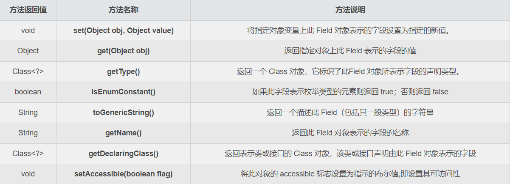

## 1：导言

**Java** 反射是指在 **运行时动态地获取类的信息** ，并可以通过该信息来操作类或对象。通过反射，我们可以在运行时获取类的 ***字段*** 、***方法***、***构造函数*** 等信息，***并能够动态地创建对象、调用方法、访问和修改字段的值***。本文将详细介绍Java反射的概念、原理和使用方法，并提供一些示例代码。

## 2：反射的概念
反射是Java语言的一种机制，它允许程序在 ***运行时检查和操作类、方法、字段*** 等信息，而不需要提前知道它们的具体定义。通过反射，我们可以 ***在运行时动态地加载类、创建对象、调用方法以及访问和修改字段***。

Java反射提供了以下核心类：

- `Class类`：代表Java中的类或接口。通过 `Class` 类，我们可以获取类的构造函数、方法、字段等信息。

- `Constructor类`：代表类的构造函数。通过 `Constructor` 类，我们可以创建对象。

- `Method类`：代表类的方法。通过 `Method` 类，我们可以调用方法。

- `Field类`：代表类的字段。通过 `Field` 类，我们可以访问和修改字段的值。

反射是Java强大的特性之一，它在很多框架和工具中被广泛应用，如Spring框架、JUnit测试框架等。

## 3：反射的使用示例
下面是一个简单的示例代码，演示了如何使用Java反射来 `创建对象`、`调用方法` 和 `访问字段`：
```java
public class ReflectionExample {
    public static void main(String[] args) throws Exception {
        // 获取Class对象
        Class<?> clazz = Class.forName("com.example.MyClass");
        
        // 创建对象
        Object object = clazz.newInstance();
        
        // 调用方法
        Method method = clazz.getDeclaredMethod("sayHello");
        method.invoke(object);
        
        // 访问字段
        Field field = clazz.getDeclaredField("message");
        field.setAccessible(true);
        field.set(object, "Hello, Reflection!");
        
        // 再次调用方法，输出修改后的字段值
        method.invoke(object);
    }
}

class MyClass {
    private String message = "Hello, World!";
    
    public void sayHello() {
        System.out.println(message);
    }
}
```

  在上述示例中，我们使用反射的方式创建了一个名为 `com.example.MyClass` 的类的对象，并调用了其中的 `sayHello` 方法。然后，我们通过反射访问了该类的私有字段 `message` 并修改了其值。最后，再次调用 `sayHello` 方法，输出修改后的字段值。

通过这个简单的示例，我们可以看到反射的强大之处。它允许我们在运行时动态地创建对象、调用方法以及访问和修改字段，而不需要提前知道类的具体定义。

## 4：反射的应用场景
反射在Java中有许多应用场景，以下是一些常见的使用情况：

- ***框架和库*** ：许多Java框架和库使用反射来实现动态加载和配置。例如，Spring框架使用反射来实现依赖注入和AOP编程。

- ***序列化和反序列化*** ：Java的序列化和反序列化机制使用了反射。通过反射，可以在运行时动态地读取和写入对象的字段。

- ***单元测试*** ：JUnit等单元测试框架使用反射来自动化执行测试用例。通过反射，测试框架可以自动发现和执行类中的测试方法。

- ***动态代理*** ：Java动态代理机制利用了反射来实现代理对象的动态创建和方法调用的拦截。

这些只是反射的一些应用场景，实际上，反射在Java的开发中具有广泛的应用。

## 5：反射的注意事项
在使用反射时，我们需要注意以下几点：

- ***性能开销*** ：反射的操作相比普通的Java代码会有一定的性能开销。因此，在性能要求较高的场景下，应尽量避免过度使用反射。

- ***访问权限*** ：通过反射可以访问和修改类的私有成员，但这可能违反了类的封装性。在使用反射时，应注意尊重类的访问权限。

- ***异常处理*** ：使用反射时，可能会抛出 `ClassNotFoundException`、`NoSuchMethodException`等异常。在使用反射的代码中，要适当地处理这些异常。

## 6：个人练习代码
### 1）定义泛型类
```Java
package com.xiaoze.exer.reflectTest;

import java.io.Serializable;

/**
 * @author 小泽
 * @create 2023-11-27  21:20
 * 记得每天敲代码哦
 */
public class Creature<T> implements Serializable {
       private char gender;
       public double weight;

       private void breath(){
              System.out.println("生物呼吸");
       }

       public void eat(){
              System.out.println("生物吃东西");
       }
}
```

### 2）定义注解类
```java
package com.xiaoze.exer.reflectTest;

import java.lang.annotation.Retention;
import java.lang.annotation.RetentionPolicy;
import java.lang.annotation.Target;

import static java.lang.annotation.ElementType.*;

/**
 * @author 小泽
 * @create 2023-11-27  22:26
 * 记得每天敲代码哦
 */
@Target({TYPE, FIELD, METHOD, PARAMETER, CONSTRUCTOR, LOCAL_VARIABLE})
@Retention(RetentionPolicy.RUNTIME)
public @interface MyAnnotation {
    String value() default "hello";
}

```
### 3）定义接口类
```java
package com.xiaoze.exer.reflectTest;

/**
 * @author 小泽
 * @create 2023-11-27  21:21
 * 记得每天敲代码哦
 */
public interface MyInterface {
    void info();
}

```
### 4）定义person类
```java
package com.xiaoze.exer.reflectTest;

/**
 * @author 小泽
 * @create 2023-11-27  21:16
 * 记得每天敲代码哦
 */
@MyAnnotation(value = "hi")
public class Person extends Creature<String> implements Comparable<String>, MyInterface {

    public int id;
    int age;
    private String name;

    public Person() {
    }

    @MyAnnotation(value = "abc")
    private Person(String name) {
        this.name = name;
    }

    Person(String name, int age) {
        this.name = name;
        this.age = age;
    }

    @MyAnnotation
    private String show(String nation) {
        System.out.println("我的国籍是：" + nation);
        return nation;
    }

    private String display(String interests,Integer age) throws NullPointerException,ClassCastException {
        return interests + age;
    }

    @Override
    public void info() {
        System.out.println("我是一个人");
    }

    @Override
    public int compareTo(String o) {
        return 0;
    }

    private static void showDesc(){
        System.out.println("我是一个可爱的人！");
    }

    @Override
    public String toString() {
        return "Person{" +
                "id=" + id +
                ", age=" + age +
                ", name='" + name + '\'' +
                '}';
    }
}

```

### 5）获取运行时类的属性结构


其中的 `set(Object obj, Object value)` 方法是 `Field` 类本身的方法，用于设置字段的值，而 `get(Object obj)` 则是获取字段的值，当然关于 `Field` 类还有其他常用的方法如下：



上述方法可能是较为常用的，事实上在设置值的方法上，`Field` 类还提供了专门针对基本数据类型的方法，如 `setInt()/getInt()`、`setBoolean()/getBoolean`、`setChar()/getChar()` 等等方法，这里就不全部列出了，需要时查API文档即可。需要特别注意的是被 `final` 关键字修饰的`Field` 字段是安全的，在运行时可以接收任何修改，但最终其实际值是不会发生改变的

```java
package com.xiaoze.exer.reflectTest.Test;

import com.xiaoze.exer.reflectTest.Person;
import org.junit.Test;

import java.lang.reflect.Field;
import java.lang.reflect.Modifier;

/**
 * 方法描述: 获取运行时类的属性结构
 *
 * @Author 胡昊泽
 * @Date 2023/11/27 23:04
 * @return
 */

public class FieldTest {

    @Test
    public void test1() {
        Class clazz = Person.class;

        //1：获取所有的属性结构
        //getFields();获取当前运行类及其父类中声明为public访问权限的属性
        Field[] fields = clazz.getFields();
        for (Field f : fields) {
            System.out.println(f);
        }
        System.out.println("--------------------------------------");
        //getDeclaredFields();获取当前运行类中所有的属性（不包含父类中的属性）
        Field[] declaredFields = clazz.getDeclaredFields();
        for (Field f : declaredFields) {
            System.out.println(f);
        }
    }

    //权限修饰符  数据类型  变量名
    @Test
    public void test2() {
        Class clazz = Person.class;
        Field[] declaredFields = clazz.getDeclaredFields();
        for (Field f : declaredFields) {

            // 1：权限修饰符
            int modifiers = f.getModifiers();
            System.out.print(Modifier.toString(modifiers) + "\t");

            // 2：数据类型
            Class type = f.getType();
            System.out.print(type.getName() + "\t");

            // 3：变量名
            System.out.print(f.getName() + "\t");
            System.out.println();
        }
    }
}
```

### 6）获取运行时类的方法结构


`getReturnType方法/getGenericReturnType` 方法都是获取 `Method` 对象表示的方法的返回类型，只不过前者返回的 `Class` 类型后者返回的 `Type` (前面已分析过)，`Type` 就是一个接口而已，在Java8中新增一个默认的方法实现，返回的就参数类型信息

```java
package com.xiaoze.exer.reflectTest.Test;

import com.xiaoze.exer.reflectTest.Person;
import org.junit.Test;

import java.lang.annotation.Annotation;
import java.lang.reflect.Method;
import java.lang.reflect.Modifier;

/**
 * 方法描述: 获取运行时类的方法结构
 *
 * @Author 胡昊泽
 * @Date 2023/11/27 23:05
 * @return
 */

public class MethodTest {
    @Test
    public void test1() {
        Class clazz = Person.class;

        // 获取所有的方法

        //getMethods();获取当前运行类及其父类中声明为public访问权限的方法
        Method[] methods = clazz.getMethods();
        for (Method m : methods) {
            System.out.println(m);
        }

        System.out.println("--------------------------------------");
        //getDeclaredMethods();获取当前运行类中所有的方法（不包含父类中的属性）
        Method[] method = clazz.getDeclaredMethods();
        for (Method m : method) {
            System.out.println(m);
        }
    }

    // @XxxxInterface
    // 权限修饰符  返回值类型  方法名（参数类型1 形参1，... ）throws XxxException {}
    @Test
    public void test2() {
        Class clazz = Person.class;
        Method[] method = clazz.getDeclaredMethods();
        for (Method m : method) {
            // 1:获取方法声明的注解
            Annotation[] annotations = m.getAnnotations();
            for (Annotation a : annotations) {
                System.out.println(a);
            }

            // 2:权限修饰符
            System.out.print(Modifier.toString(m.getModifiers()) + "\t");

            // 3:返回值类型
            System.out.print(m.getReturnType().getName() + "\t");

            // 4:方法名
            System.out.print(m.getName());
            System.out.print("(");
            // 5：形参列表
            Class[] parameterTypes = m.getParameterTypes();
            if (!(parameterTypes == null && parameterTypes.length == 0)) {
                for (int i = 0; i < parameterTypes.length; i++) {
                    if (i == parameterTypes.length - 1) {
                        System.out.print(parameterTypes[i].getName() + " args_" + i);
                        break;
                    }
                    System.out.print(parameterTypes[i].getName() + " args_" + i + ",");
                }
            }

            System.out.print(")");

            // 6:抛出的异常
            Class[] exceptionTypes = m.getExceptionTypes();
            if ( exceptionTypes.length > 0) {
                System.out.println(" throws");
                for (int i = 0; i < exceptionTypes.length; i++) {
                    if (i == exceptionTypes.length - 1) {
                        System.out.print(exceptionTypes[i].getName());
                        break;
                    }
                    System.out.print(exceptionTypes[i].getName() + ",");
                }
            }

            System.out.println();
        }

    }
}
```
### 7）获取构造器结构以及其他

```java
package com.xiaoze.exer.reflectTest.Test;

import com.xiaoze.exer.reflectTest.Person;
import org.junit.Test;

import java.lang.annotation.Annotation;
import java.lang.reflect.Constructor;
import java.lang.reflect.ParameterizedType;
import java.lang.reflect.Type;

/**
 * 方法描述: 获取构造器结构
 *
 * @Author 胡昊泽
 * @Date 2023/11/27 23:38
 * @return
 */

public class OtherTest {
    /*获取构造器结构*/
    @Test
    public void test1() {
        Class clazz = Person.class;

        //getConstructors();获取当前运行类及声明为public访问权限的构造器
        Constructor[] constructors = clazz.getConstructors();
        for (Constructor c : constructors) {
            System.out.println(c);
        }

        //getDeclaredConstructors();获取当前运行类所有的构造器
        Constructor[] constructor = clazz.getDeclaredConstructors();
        for (Constructor c : constructor) {
            System.out.println(c);
        }
    }

    /*获取运行时类的父类*/
    @Test
    public void test2() {
        Class clazz = Person.class;
        Class superclass = clazz.getSuperclass();
        System.out.println(superclass);

    }


    /*获取运行时类带泛型的父类*/
    @Test
    public void test3() {
        Class clazz = Person.class;
        Type genericSuperclass = clazz.getGenericSuperclass();
        System.out.println(genericSuperclass);

    }

    /*获取运行时类带泛型的父类的泛型*/
    @Test
    public void test4() {
        Class clazz = Person.class;
        Type genericSuperclass = clazz.getGenericSuperclass();
        ParameterizedType parameterizedType = (ParameterizedType)genericSuperclass;
        //获取泛型类型
        Type[] actualTypeArguments = parameterizedType.getActualTypeArguments();
        for (Type actualTypeArgument : actualTypeArguments) {
            System.out.println(actualTypeArgument.getTypeName());
        }
    }

    /*获取运行时类实现的接口*/
    @Test
    public void test5() {
        Class clazz = Person.class;
        Class[] interfaces = clazz.getInterfaces();
        for (Class anInterface : interfaces) {
            System.out.println(anInterface);
        }
        System.out.println();

        // 获取运行时类的父类所实现的接口
        Class superclass = clazz.getSuperclass();
        Class[] interfaces1 = superclass.getInterfaces();
        for (Class a : interfaces1) {
            System.out.println(a);
        }
    }

    /*获取当前运行时类所在的包*/
    @Test
    public void test6() {
        Class clazz = Person.class;
        Package aPackage = clazz.getPackage();
        System.out.println(aPackage);
    }

    /*获取当前运行时类所声明的注解*/
    @Test
    public void test7() {
        Class clazz = Person.class;
        Annotation[] annotations = clazz.getAnnotations();
        for (Annotation annotation : annotations) {
            System.out.println(annotation);
        }

    }
}
``` 
### 8）调用运行时类中指定的结构：属性、方法、构造器
```java
package com.xiaoze.exer.reflectTest.Test;

import com.xiaoze.exer.reflectTest.Person;
import org.junit.Test;

import java.lang.reflect.Constructor;
import java.lang.reflect.Field;
import java.lang.reflect.InvocationTargetException;
import java.lang.reflect.Method;

/**
 * @author 小泽
 * 调用运行时类中指定的结构：属性、方法、构造器
 * @create 2023-11-28  17:20
 * 记得每天敲代码哦
 */
public class ReflectionTest {
    /*获取指定属性 - 不需要掌握*/
    @Test
    public void testField() throws NoSuchFieldException, InstantiationException, IllegalAccessException {
        Class clazz = Person.class;

        // 创建运行时类的对象
        Person person = (Person) clazz.newInstance();
        // 获取指定的属性  要求运行时类中属性声明为public
        Field id = clazz.getDeclaredField("id");

              /*
              设置当前属性的值

              set(): 参数一：指明设置哪个对象的属性 ；参数二：设置属性的值
              */
        id.set(person, 1001);

              /*
              获取当前属性的值

              get(): 参数一：获取哪个对象的属性值
              */
        int pId = (int) id.get(person);
        System.out.println(pId);

    }

    /*如何操作运行时类中指定的属性 - 需要掌握*/
    @Test
    public void testField1() throws NoSuchFieldException, InstantiationException, IllegalAccessException {
        Class clazz = Person.class;

        // 创建运行时类的对象
        Person p = (Person) clazz.newInstance();

        // 1：获取运行时类中指定变量名的属性
        Field name = clazz.getDeclaredField("name");

        // 2：保证当前属性是可访问的
        name.setAccessible(true);

        // 3：获取、设置指定对象的此属性值
        name.set(p, "xiaohong");

        System.out.println(name.get(p));

    }

    /*如何操作运行时类中指定的方法 - 需要掌握*/
    @Test
    public void testMethod() throws NoSuchFieldException, InstantiationException, IllegalAccessException, NoSuchMethodException, InvocationTargetException {
        Class clazz = Person.class;

        // 创建运行时类的对象
        Person p = (Person) clazz.newInstance();

        // 1.获取指定的方法
        Method show = clazz.getDeclaredMethod("show", String.class);

        // 2.设置当前方法是可以被访问的
        show.setAccessible(true);

        // 3.invoke 调用方法 参数一：方法调用者 ； 参数二： 给方法赋值的形参
        // invoke() 方法的返回值即为对应类中调用方法的返回值
        show.invoke(p, "中国");

        System.out.println("--------如何调用静态方法----------");

        Method showDesc = clazz.getDeclaredMethod("showDesc");
        showDesc.setAccessible(true);
        showDesc.invoke(Person.class);
    }

    /*如何操作运行时类中指定的构造器 - 需要掌握*/
    @Test
    public void testConstructor() throws NoSuchFieldException, InstantiationException, IllegalAccessException, NoSuchMethodException, InvocationTargetException {
        Class clazz = Person.class;

        // 1.获取指定的构造器
        Constructor constructor = clazz.getDeclaredConstructor(String.class);

        // 2.保证此构造器是可以访问的
        constructor.setAccessible(true);

        // 3.调用此构造器创建运行时类的对象
        Person person = (Person) constructor.newInstance("Tom");
        System.out.println(person);
    }
}
```