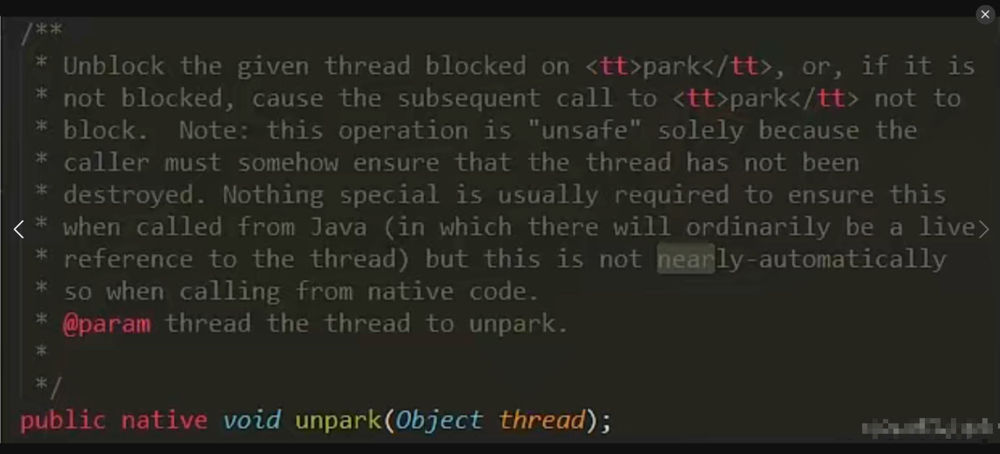

## 1：线程中断机制
### 1）什么是中断机制?
- 首先
一个线程不应该由其他线程来强制中断或停止，而是应该由线程自己自行停止。
所以，Thread.stop, Thread.suspend, Thread.resume 都已经被废弃了。
- 其次
在Java中没有办法立即停止一条线程，然而停止线程却显得尤为重要，如取消一个耗时操作。

因此，Java提供了一种用于停止线程的协商机制——中断。

中断只是一种协作协商机制，Java没有给中断增加任何语法，中断的过程完全需要程序员自己实现。

若要中断一个线程，你需要手动调用该线程的interrupt方法，该方法也仅仅是将线程对象的中断标识设成true；

接着你需要自己写代码不断地检测当前线程的标识位，如果为true，表示别的线程要求这条线程中断，

此时究竟该做什么需要你自己写代码实现。

每个线程对象中都有一个标识，用于表示线程是否被中断；该标识位为true表示中断，为false表示未中断；

通过调用线程对象的interrupt方法将该线程的标识位设为true；可以在别的线程中调用，也可以在自己的线程中调用。
  - eg.顾客在无烟餐厅中吸烟，服务员希望他别吸烟了，不是强行停止他吸烟，而是给他的标志位打为true，具体的停止吸烟还是要顾客自己停止。（体现了协商机制）
### 2）中断的相关API方法之三大方法说明


### 3）大厂面试题：如何使用中断标识停止线程？
#### 1如何停止中断运行中的线程？
##### ① 通过一个volatile变量实现
- volatile保证了可见性，t2修改了标志位后能马上被t1看到
```java
public class interruptDemo {
    static volatile boolean isStop = false;

    public static void main(String[] args) {
        new Thread(()->{
            while(true){
                if(isStop){//如果这个标志位被其他线程改为true了
                    System.out.println(Thread.currentThread().getName()+"\t isStop被修改为true，程序终止");
                    break;
                }
                System.out.println("t1 ------hello volatile");//----------------------如果没停止，那就一直打印
            }
        },"t1").start();

        try {TimeUnit.MILLISECONDS.sleep(20);} catch (InterruptedException e) {e.printStackTrace();}

        new Thread(()->{
            isStop = true;
        },"t2").start();
    }
}
//--
//t1 ------hello volatile
//t1 ------hello volatile
//t1 ------hello volatile
//t1 ------hello volatile
//t1 ------hello volatile
//t1 ------hello volatile
//t1 ------hello volatile
//t1   isStop被修改为true，程序终止
```
##### ② 通过AtomicBoolean（原子布尔型）
```java
public class interruptDemo {

    static AtomicBoolean atomicBoolean = new AtomicBoolean(false);

    public static void main(String[] args) {
        m1_volatile();
    }

    public static void m1_volatile() {
        new Thread(()->{
            while(true){
                if(atomicBoolean.get()){//如果这个标志位被其他线程改为true了
                    System.out.println(Thread.currentThread().getName()+"\t isStop被修改为true，程序终止");
                    break;
                }
                System.out.println("t1 ------hello volatile");//----------------------如果没停止，那就一直打印
            }
        },"t1").start();

        try {TimeUnit.MILLISECONDS.sleep(20);} catch (InterruptedException e) {e.printStackTrace();}

        new Thread(()->{
            atomicBoolean.set(true);
        },"t2").start();
    }
}
//t1 ------hello volatile
//t1 ------hello volatile
//t1 ------hello volatile
//t1 ------hello volatile
//t1 ------hello volatile
//t1 ------hello volatile
//t1   isStop被修改为true，程序终止
```
##### ③ 通过Thread类自带的中断api方法实现
```java
    //默认的中断标志位是false，然后被改为了true
    public static void main(String[] args) {
        m1_volatile();
    }

    public static void m1_volatile() {
        Thread t1 = new Thread(() -> {
            while (true) {
                if (Thread.currentThread().isInterrupted()) {//一旦发现中断标志位被修改
                    System.out.println(Thread.currentThread().getName() + "\t isInterrupted()被修改为true，程序终止");
                    break;
                }
                System.out.println("t1 ------hello interrupt ");//----------------------如果没停止，那就一直打印
            }
        }, "t1");
        t1.start();

        try {TimeUnit.MILLISECONDS.sleep(20);} catch (InterruptedException e) {e.printStackTrace();}

        new Thread(()->{
            t1.interrupt();//把t1中断
        },"t2").start();
    }
}

//t1 ------hello interrupt 
//t1 ------hello interrupt 
//t1 ------hello interrupt 
//t1 ------hello interrupt 
//t1 ------hello interrupt 
//t1 ------hello interrupt 
//t1 ------hello interrupt 
//t1 ------hello interrupt 
//t1 ------hello interrupt 
//t1   isInterrupted()被修改为true，程序终止
```
**—API源码分析**
**实例方法interrupt()，没有返回值**
```java
//Thread.java
public void interrupt() {
        if (this != Thread.currentThread())
            checkAccess();

        synchronized (blockerLock) {
            Interruptible b = blocker;
            if (b != null) {
                interrupt0();           // Just to set the interrupt flag----调用了interrupt0（）方法
                b.interrupt(this);
                return;
            }
        }
        interrupt0();
    }
```
```java
//Thread.java
    /* Some private helper methods */
    private native void setPriority0(int newPriority);
    private native void stop0(Object o);
    private native void suspend0();
    private native void resume0();
    private native void interrupt0();  //---------------------------调用了c底层
    private native void setNativeName(String name);
```
**实例方法isInterrupted，返回布尔值**
```java
    //Thread.java
    public boolean isInterrupted() {
        return isInterrupted(false);
    }
```
```java
    //Thread.java
    private native boolean isInterrupted(boolean ClearInterrupted);//也调用了c底层
```
**说明**
- 具体来说，当对一个线程，调用 interrupt() 时：

  - 如果线程处于**正常活动状态**，那么会将该线程的中断标志设置为 true，仅此而已。被设置中断标志的线程将继续正常运行，不受影响。所以， interrupt() 并不能真正的中断线程，需要被调用的线程自己进行配合才行。

  - 如果线程处于被阻塞状态（例如处于sleep, wait, join 等状态），在别的线程中调用当前线程对象的interrupt方法，那么线程将**立即退出被阻塞状态（中断状态将被清除）**，并抛出一个InterruptedException异常。

  - （**中断不活动**的线程**不会**产生任何影响，看下面案例）

#### 2 当前线程的中断标识为true，是不是线程就立刻停止？
- 否
  - 仅仅设置了一个中断状态
- 看看中断是否会立即停止这个300的线程
  - 否，虽然中断标志位变了。但是i一直在循环

```java
public class InterruptDemo02 {
    public static void main(String[] args) {
        Thread t1 = new Thread(()->{
            for(int i = 0;i < 300;i ++){
                System.out.println("---------" + i);
            }
            System.out.println("after t1.interrupt()---第2次----"+Thread.currentThread().isInterrupted());
        },"t1");
        t1.start();
        System.out.println("before t1.interrupt()----"+t1.isInterrupted());
        t1.interrupt();
        try {TimeUnit.MILLISECONDS.sleep(3);} catch (InterruptedException e) {e.printStackTrace();}
        System.out.println("after t1.interrupt()---第1次---"+t1.isInterrupted());
        try {TimeUnit.MILLISECONDS.sleep(3000);} catch (InterruptedException e) {e.printStackTrace();}
        System.out.println("after t1.interrupt()---第3次---"+t1.isInterrupted());
    }
}
//before t1.interrupt()----false
//---------0
//---------1
//---------2
//---------3
//....
//---------136
//after t1.interrupt()---第1次---true    ------此处中断标志位设置为了true,但是t1仍然在运行
//---------137
//---------298
//---------299
//after t1.interrupt()---第2次----true
//after t1.interrupt()---第3次---false//中断不活动的线程不会产生任何影响，线程结束后应该是自动变为了false
```
**后手案例-深入**
- 在我们基本中断程序的骨架上 + 一个sleep阻塞
- 中断异常 且 会导致程序无限循环.

```java
public class InterruptDemo03 {
    public static void main(String[] args) {
        Thread t1 =  new Thread(()->{
            while(true){
                if(Thread.currentThread().isInterrupted()){
                    System.out.println(Thread.currentThread().getName()+"\t"+
                            "中断标志位："+Thread.currentThread().isInterrupted()+"程序终止");
                    break;
                }
                try {
                    Thread.sleep(200);
                } catch (InterruptedException e) {
                    e.printStackTrace();
                    // Thread.currentThread().interrupt();  假如加了这个，程序可以终止，只会爆异常
                }
                System.out.println("-----hello InterruptDemo03");
            }
        },"t1");
        t1.start();
        try {TimeUnit.MILLISECONDS.sleep(1);} catch (InterruptedException e) {e.printStackTrace();}
        new Thread(() -> t1.interrupt()).start();
    }
}
//爆异常了，并且程序一直在跑
//java.lang.InterruptedException: sleep interrupted
//  at java.lang.Thread.sleep(Native Method)
//-----hello InterruptDemo03
//-----hello InterruptDemo03
//-----hello InterruptDemo03
//......
//----------------------------
//---------加了Thread.currentThread().interrupt();
//java.lang.InterruptedException: sleep interrupted
// at java.lang.Thread.sleep(Native Method)
//  at com.zhang.admin.controller.InterruptDemo03.lambda$main$0(InterruptDemo03.java:15)
//  at java.lang.Thread.run(Thread.java:748)
//-----hello InterruptDemo03
//t1  中断标志位：true程序终止


```
- 前文
  - ② 如果线程处于被阻塞状态（例如处于sleep, wait, join 等状态），在别的线程中调用当前线程对象的interrupt方法，那么线程将立即退出被阻塞状态（中断状态将被清除），并抛出一个InterruptedException异常。

```java
/**
 * 1 中断标志位 默认是false
 * 2 t2 ----->t1发出了中断协商，t2调用t1.interrupt()，中断标志位true
 * 3 中断标志位true，正常情况下，程序停止，^-^
 * 4 中断标志位true，异常情况下，InterruptedException，将会把中断状态清除，并且将收到InterruptedException。中断标志位false导致无限循环。
 * 
 * 5 在catch块中，需要再次给中断标志位设置为true，2次调用停止
 */
```
> sleep方法抛出InterruptedException后，中断标识也被清空置为false,我们在catch没有通过th.interrupt()方法再次将中断标志设置为true，这就导致无限循环了

**小总结**
- 中断只是一种协同机制，修改中断标识位仅此而已，而不是立刻stop打断
#### 3 静态方法Thread.interrupted()，谈谈你的理解
- api里的第二个
  - public static boolean interrupted()
  - 静态方法，Thread.interrupted();判断线程是否被中断，并清除当前中断状态这个方法做了两件事：1 返回当前线程的中断状态2 将当前线程的中断状态设为false（这个方法有点不好理解，因为连续调用两次的结果可能不一样。） |
```java
public class InterruptDemo04 {
    public static void main(String[] args) {
        System.out.println(Thread.currentThread().getName()+"\t"+Thread.interrupted());
        System.out.println(Thread.currentThread().getName()+"\t"+Thread.interrupted());
        System.out.println("-----1");
        Thread.currentThread().interrupt();//中断标志位设置为true
        System.out.println("-----2");
        System.out.println(Thread.currentThread().getName()+"\t"+Thread.interrupted());
        System.out.println(Thread.currentThread().getName()+"\t"+Thread.interrupted());
    }
}
//main  false
//main  false
//-----1
//-----2
//main  true
//main  false
```
- 看下源码，`interrupted()`对比`isInterrupted()`
```java
public static boolean interrupted() {
        return currentThread().isInterrupted(true);
    }
    
private native boolean isInterrupted(boolean ClearInterrupted);
```
```java
public boolean isInterrupted() {
        return isInterrupted(false);
    }

private native boolean isInterrupted(boolean ClearInterrupted);

```
- 他们在底层都调用了native方法isInterrupted。
- 只不过传入参数ClearInterrupted一个传参传了true，一个传了false。
  - 静态方法interrupted() 中true表示清空当前中断状态。
  - 实例方法isInterrupted 则不会。


## 2：LockSupport是什么
- 核心就是`park()`和`unpark()`方法
  - `park()`方法是阻塞线程
  - `unpark()`方法是解除阻塞线程


## 3：线程等待唤醒机制
### 1）3种让线程等待和唤醒的方法
- 使用`Object`中的`wait()`方法让线程等待，使用`Object`中的`notify()`方法唤醒线程
- 使用JUC包中`Condition`的`await()`方法让线程等待，使用`signal()`方法唤醒线程
- `LockSupport`类可以阻塞当前线程以及唤醒指定被阻塞的线程


### 2）①Object类中的wait和notify方法实现线程等待和唤醒
- 正常
```java
public class LockSupportDemo
{
    public static void main(String[] args)
    {
        Object objectLock = new Object();

        new Thread(() -> {
            synchronized (objectLock) {
                System.out.println(Thread.currentThread().getName()+"\t ---- come in");
                try {
                    objectLock.wait();//----------------------这里先让他等待
                } catch (InterruptedException e) {
                    e.printStackTrace();
                }
            }
            System.out.println(Thread.currentThread().getName()+"\t"+"---被唤醒了");
        },"t1").start();

        //暂停几秒钟线程
        try { TimeUnit.SECONDS.sleep(3L); } catch (InterruptedException e) { e.printStackTrace(); }

        new Thread(() -> {
            synchronized (objectLock) {
                objectLock.notify();//-------------------------再唤醒它
                System.out.println(Thread.currentThread().getName()+"\t ---发出通知");
            }
        },"t2").start();
    }
}
//t1   ---- come in
//t2   ---发出通知
//t1  ---被唤醒了
```
- 异常1—去掉synchronized
说明要使用`wait`和`notify`必须加`synchronized`
```java
public class LockSupportDemo
{
    public static void main(String[] args)
    {
        Object objectLock = new Object();

        new Thread(() -> {
        //    synchronized (objectLock) {
                System.out.println(Thread.currentThread().getName()+"\t ---- come in");
                try {
                    objectLock.wait();
                } catch (InterruptedException e) {
                    e.printStackTrace();
                }
      //      }
            System.out.println(Thread.currentThread().getName()+"\t"+"---被唤醒了");
        },"t1").start();

        //暂停几秒钟线程
        try { TimeUnit.SECONDS.sleep(3L); } catch (InterruptedException e) { e.printStackTrace(); }

        new Thread(() -> {
       //     synchronized (objectLock) {
                objectLock.notify();
                System.out.println(Thread.currentThread().getName()+"\t ---发出通知");
       //     }
        },"t2").start();
    }
}
//t1   ---- come in
//Exception in thread "t1" java.lang.IllegalMonitorStateException
//  at java.lang.Object.wait(Native Method)
//  at java.lang.Object.wait(Object.java:502)
//  at com.zhang.admin.controller.LockSupportDemo.lambda$main$0(LockSupportDemo.java:15)
//  at java.lang.Thread.run(Thread.java:748)
```

- 异常2—把notify和wait的执行顺序对换
说明顺序不能对换
```java
public class LockSupportDemo
{
    public static void main(String[] args)
    {
        Object objectLock = new Object();

        new Thread(() -> {
            try { TimeUnit.SECONDS.sleep(1); } catch (InterruptedException e) { e.printStackTrace(); }
            synchronized (objectLock) {
                System.out.println(Thread.currentThread().getName()+"\t ---- come in");
                try {
                    objectLock.wait();
                } catch (InterruptedException e) {
                    e.printStackTrace();
                }
            }
            System.out.println(Thread.currentThread().getName()+"\t"+"---被唤醒了");
        },"t1").start();


        new Thread(() -> {
            synchronized (objectLock) {
                objectLock.notify();//这个先执行了
                System.out.println(Thread.currentThread().getName()+"\t ---发出通知");
            }
        },"t2").start();
    }
}
//一直处于循环中
```
**小总结** 
- wait和notify方法必须要在**同步块**或者**方法**里面，且成对出现使用
- 先`wait`后`notify`才OK,顺序

### 3）②Condition接口中的await后signal方法实现线程的等待和唤醒
- 正常

```java
public class LockSupportDemo
{
    public static void main(String[] args)
    {
        Lock lock = new ReentrantLock();
        Condition condition = lock.newCondition();

        new Thread(() -> {
            lock.lock();
            try
            {
                System.out.println(Thread.currentThread().getName()+"\t-----come in");
                condition.await();
                System.out.println(Thread.currentThread().getName()+"\t -----被唤醒");
            } catch (InterruptedException e) {
                e.printStackTrace();
            } finally {
                lock.unlock();
            }
        },"t1").start();

        //暂停几秒钟线程
        try { TimeUnit.SECONDS.sleep(1); } catch (InterruptedException e) { e.printStackTrace(); }

        new Thread(() -> {
            lock.lock();
            try
            {
                condition.signal();
            } catch (Exception e) {
                e.printStackTrace();
            } finally {
                lock.unlock();
            }
            System.out.println(Thread.currentThread().getName()+"\t"+"我要进行唤醒");
        },"t2").start();

    }
}
//t1  -----come in
//t2  我要进行唤醒
//t1   -----被唤醒
```
- 异常1原理同上
  - 仍然返回`IllegalMonitorStateException`
- 异常2 原理同上
  - 仍然在不停的循环
**小总结**
- `await`和`notify`类似于上面`wait`和`notify`
  - `Condition`中的线程等待和唤醒方法，需要先获取锁
  - 一定要先`await`后`signal`，不能反了

### 4）Object和Condition使用的限制条件
- 总结
  - 线程先要获得并持有锁，必须在锁块（`synchronized`或`lock`）中
  - 必须要先等待后唤醒，线程才能够被唤醒
### 5）③LockSupport类中的park等待和unpark唤醒

#### 是什么
- 通过`park()`和`unpark(thread)`方法来实现阻塞和唤醒线程的操作
- 官网解释
  - `LockSupport`是用来创建锁和其他同步类的基本线程阻塞原语。
  - `LockSupport`类使用了一种名为`Permit`（许可） 的概念来做到阻塞和唤醒线程的功能， 每个线程都有一个许可(permit)，
  - `permit（许可）`只有两个值1和0，默认是0。0 是阻塞，1是唤醒
  - 可以把许可看成是一种(0,1)信号量（`Semaphore`），但与 `Semaphore` 不同的是，许可的累加上限是1。
> 许可（Permit）
#### 主要方法
**API**

**阻塞**
- `park()/park(Object blocker)`
- 调用`LockSupport.park()`时，发现它调用了`unsafe`类，并且默认传了一个0

```java
public static void park() {
        UNSAFE.park(false, 0L);
    }
```

- permit默认是零，所以一开始调用park()方法，当前线程就会阻塞，直到别的线程将当前线程的permit设置为1时，park方法会被唤醒，
- 然后会将permit再次设置为零并返回。

**唤醒**
调用`LockSupport.unpark()`;时，也调用了`unsafe`类
```java
public static void unpark(Thread thread) {
        if (thread != null)
            UNSAFE.unpark(thread);
    }
```

- 调用`unpark(thread)`方法后，就会将`thread线程`的`许可permit`设置成1(注意多次调用`unpark`方法，**不会累加**，permit值还是1)会自动唤醒thread线程，即之前阻塞中的`LockSupport.park()`方法会立即返回。
#### 代码
- 正常+无锁块要求

```java
public class LockSupportDemo
{
    public static void main(String[] args) {
        Thread t1 = new Thread(()->{
            System.out.println(Thread.currentThread().getName()+"\t----------come in");
            LockSupport.park();
            System.out.println(Thread.currentThread().getName()+"\t----------被唤醒了");
        },"t1");
        t1.start();

        new Thread(()->{
            LockSupport.unpark(t1);
            System.out.println(Thread.currentThread().getName()+"\t-----发出通知，去唤醒t1");
        },"t2").start();
    }
}
//t1  ----------come in
//t2  -----发出通知，去唤醒t1
//t1  ----------被唤醒了
```
- 之前错误的先唤醒后等待，LockSupport照样支持

```java
public class LockSupportDemo
{
    public static void main(String[] args) {
        Thread t1 = new Thread(()->{
            try {TimeUnit.SECONDS.sleep(3);} catch (InterruptedException e) {e.printStackTrace();}
            System.out.println(Thread.currentThread().getName()+"\t----------come in"+"\t"+System.currentTimeMillis());
            LockSupport.park();
            System.out.println(Thread.currentThread().getName()+"\t----------被唤醒了"+"\t"+System.currentTimeMillis());
        },"t1");
        t1.start();

        new Thread(()->{
            LockSupport.unpark(t1);
            System.out.println(Thread.currentThread().getName()+"\t-----发出通知，去唤醒t1");
        },"t2").start();
    }
}
//t2  -----发出通知，去唤醒t1
//t1  ----------come in  1654750785663
//t1  ----------被唤醒了  1654750785663
```
> sleep方法3秒后醒来，执行park无效，没有阻塞效果，解释如下。先执行了unpark(t1)导致上面的park方法形同虚设无效，时间是一样的 -> 类似于高速公路的ETC，提前买好了通行证unpark，到闸机处直接抬起栏杆放行了，没有park拦截了。
- 成双成对要牢记
#### 最后
- 许可证是只要一个的

```java
public class LockSupportDemo
{
    public static void main(String[] args) {
        Thread t1 = new Thread(()->{
            try {TimeUnit.SECONDS.sleep(3);} catch (InterruptedException e) {e.printStackTrace();}
            System.out.println(Thread.currentThread().getName()+"\t----------come in"+"\t"+System.currentTimeMillis());
            LockSupport.park();
            LockSupport.park();
            System.out.println(Thread.currentThread().getName()+"\t----------被唤醒了"+"\t"+System.currentTimeMillis());
        },"t1");
        t1.start();

        new Thread(()->{
            LockSupport.unpark(t1);
            LockSupport.unpark(t1);
            System.out.println(Thread.currentThread().getName()+"\t-----发出通知，去唤醒t1");
        },"t2").start();
    }
}
//t2  -----发出通知，去唤醒t1
//t1  ----------come in  1654750970677--------------------卡在这里了
```
**小总结**
- Lock Support是用来创建锁和其他同步类的基本线程阻塞原语。
- Lock Support是一个线程阻塞工具类， 所有的方法都是静态方法， 可以让线程在任意位置阻塞， 阻塞之后也有对应的唤醒方法。归根结底， Lock Support调用的Unsafe中的native代码。
- Lock Support提供park() 和unpark() 方法实现阻塞线程和解除线程阻塞的过程
- Lock Support和每个使用它的线程都有一个许可(permit) 关联。
- 每个线程都有一个相关的permit， permit最多只有一个， 重复调用un park也不会积累凭证。

**形象的理解**
线程阻塞需要消耗凭证(permit) ， 这个凭证最多只有1个。
当调用方法时
**如果有凭证**，则会直接消耗掉这个凭证然后正常退出；
**如果无凭证**，就必须阻塞等待凭证可用；
**而则相反**， 它会增加一个凭证， 但凭证最多只能有1个， 累加无效。


