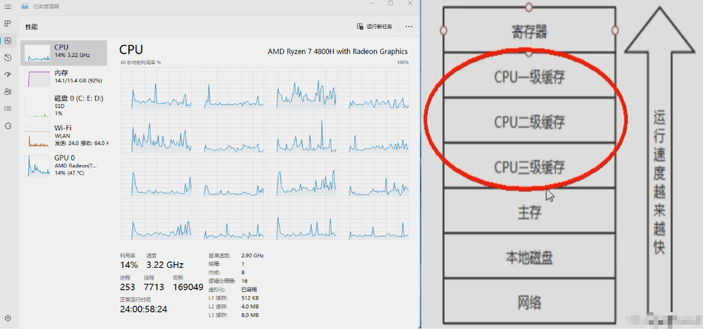
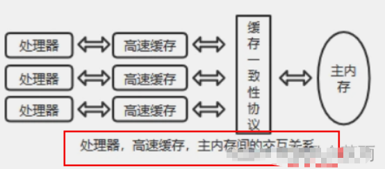
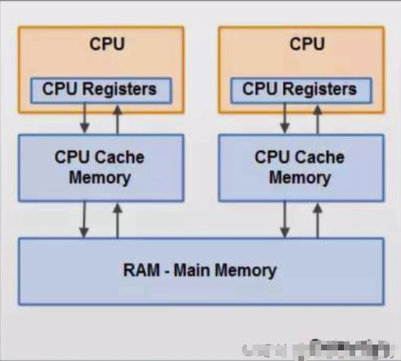
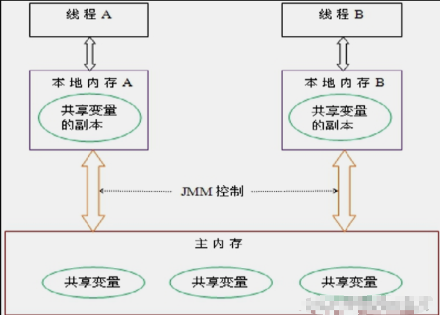
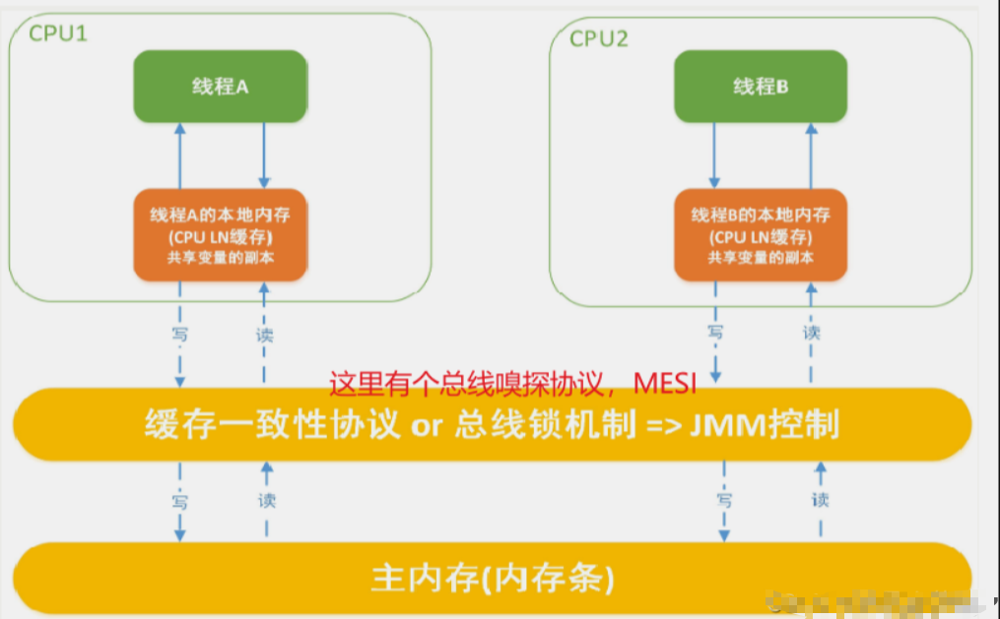

## 1：先从大厂面试题开始
- 你知道什么是Java内存模型JMM吗？
- JMM与`volatile`它们两个之间的关系？（下一章详细讲解）
- JMM有哪些特性or它的三大特性是什么？
- 为什么要有JMM，它为什么出现？作用和功能是什么？
- `happens-before`先行发生原则你有了解过吗？
## 2：计算机硬件存储体系
计算机存储结构，从本地磁盘到主存到CPU缓存，也就是从硬盘到内存，到CPU。
一般对应的程序的操作就是从数据库查数据到内存然后到CPU进行计算

因为有这么多级的缓存(cpu和物理主内存的速度不一致的)，
CPU的运行**并不是直接操作内存而是先把内存里边的数据读到缓存**，而内存的读和写操作的时候就会造成不一致的问题

Java虚拟机规范中试图定义一种**Java内存模型**（java Memory Model，简称JMM) **来屏蔽掉各种硬件和操作系统的内存访问差异**，以实现让Java程序在各种平台下都能达到一致的内存访问效果。推导出我们需要知道JMM
## 3：Java内存模型Java Memory Model
- JMM
JMM(Java内存模型Java Memory Model，简称JMM)本身是一种**抽象的概念**并不真实存在它仅仅描述的是一组约定或规范，通过这组规范定义了程序中(尤其是多线程)各个变量的读写访问方式并决定一个线程对共享变量的写入何时以及如何变成对另一个线程可见，关键技术点都是围绕多线程的**原子性**、**可见性**和**有序性**展开的。

- 原则：
JMM的关键技术点都是围绕多线程的**原子性**、**可见性**和**有序性**展开的

- 能干嘛？
  - 1 通过JMM来实现线程和主内存之间的抽象关系。
  - 2 屏蔽各个**硬件平台**和**操作系统**的内存访问差异以实现让Java程序在各种平台下都能达到一致的内存访问效果。

## 4：JMM规范下，三大特性
### 1）原子性
- 指一个操作是不可中断的，即多线程环境下，操作不能被其他线程干扰
### 2）可见性
> 是指当一个线程修改了某一个共享变量的值，其他线程是否能够立即知道该变更 ，JMM规定了所有的变量都存储在主内存中。


- Java中**普通的共享变量不保证可见性**，因为数据修改被写入内存的时机是不确定的，多线程并发下很可能出现"脏读"，所以每个线程都有自己的**工作内存**，线程自己的工作内存中保存了该线程使用到的变量的**主内存副本拷贝**，线程对变量的所有操作（读取，赋值等 ）都必需在线程自己的工作内存中进行，而不能够直接读写主内存中的变量。不同线程之间也无法直接访问对方工作内存中的变量，线程间变量值的传递均需要通过主内存来完成

- 如果没有保证可见性
  - 导致-**线程脏读**
  - 例子
    - 主内存中有变量 x，初始值为 0
    - 线程 A 要将 x 加 1，先将 x=0 拷贝到自己的私有内存中，然后更新 x 的值
    - 线程 A 将更新后的 x 值回刷到主内存的时间是不固定的
    - 刚好在线程 A 没有回刷 x 到主内存时，线程 B 同样从主内存中读取 x，此时为 0，和线程 A 一样的操作，最后期盼的 x=2 就会变成 x=1

### 3）有序性
- 有序性牵扯到指令
- 这里给一个案例

```java
public void mySort()
{
    int x = 11; //语句1
    int y = 12; //语句2
    x = x + 5;  //语句3
    y = x * x;  //语句4
}
 
  1234
  2134
  1324
 
问题：请问语句4可以重排后变成第一个条吗？
```
- 有序性是什么？
对于一个线程的执行代码而言，我们总是习惯性认为代码的执行总是从上到下，有序执行。但为了提供性能，编译器和处理器通常会对指令序列进行**重新排序**。Java规范规定JVM线程内部维持**顺序化语义**，即只要程序的最终结果与它顺序化执行的结果**相等**，那么指令的执行顺序可以与代码顺序**不一致**，此过程叫**指令的重排序**。

- 优缺点
JVM能根据处理器特性（CPU多级缓存系统、多核处理器等）适当的机器对指令进行重排序，使得机器指令能更符合CPU的执行特性，最大限度的发挥机器性能。但是，

**指令重排**可以保证**串行**语义一致，但没有义务保证**多线程间**的语义也一致（即可能产生“脏读”），简单说，两行以上不相干的代码在执行的时候有可能先执行的不是第一条，不见得是从上到下顺序执行，执行顺序会被优化。
- 指令重排的**三种表现（层面）**
  - 编译器优化的重排
  - 指令并行的重排
  - 内存系统的重排


- 小总结
  - **单线程**环境里面确保程序最终执行结果和代码顺序执行的**结果一致**。
  - 处理器在进行重排序时必须要考虑指令之间的**数据依赖性**
  - **多线程**环境中线程交替执行,由于编译器优化重排的存在，两个线程中使用的变量能否保证一致性是**无法确定的,结果无法预测**
## 5：JMM规范下，多线程对变量的读写过程
- 读取过程

由于JVM运行程序的实体是线程，而每个线程创建时JVM都会为其创建一个工作内存(有些地方称为栈空间)，工作内存是每个线程的私有数据区域，而Java内存模型中规定所有变量都存储在主内存，主内存是共享内存区域，所有线程都可以访问，但线程对变量的操作(读取赋值等)必须在工作内存中进行，首先要将变量从主内存拷贝到的线程自己的工作内存空间，然后对变量进行操作，操作完成后再将变量写回主内存，不能直接操作主内存中的变量，各个线程中的工作内存中存储着主内存中的变量副本拷贝，因此不同的线程间无法访问对方的工作内存，线程间的通信(传值)必须通过主内存来完成，其简要访问过程如下图

- JMM定义了线程和主内存之间的抽象关系
  - 线程之间的共享变量存储在主内存中(从硬件角度来说就是内存条)
  - 每个线程都有一个私有的**本地工作内存**，本地工作内存中存储了该线程用来读/写共享变量的副本(从硬件角度来说就是CPU的缓存，比如寄存器、L1、L2、L3缓存等)
- 小总结
  - 我们定义的所有共享变量都存储在物理主内存中
  - 每个线程都有自己独立的工作内存，里面保存该线程使用到的变量的副本（主内存中该变量的一份拷贝）
  - 线程对共享变量所有的操作都必须先在线程自己的工作内存中进行后写回主内存，不能直接从主内存中读写（不能越级）
  - 不同线程之间也无法直接访问其他线程的工作内存中的变量，线程间变量值的传递需要通过主内存来进行（同级不能相互访问）

## 6：JMM规范下，多线程先行发生原则之happens-before
### 1）引入happens-before
- 本章最晦涩难懂的知识
- happens-before先行发生原则
  - 在JMM中，如果一个操作执行的结果需要对另一个操作可见性或者代码重新排序，那么这两个操作之间必须存在happens-before（先行发生）原则。逻辑上的先后关系。
- x,y案例说明
  - x=5;线程A执行
  - y=x;线程B执行
  - 问：y一定等于5吗？
  - 答：不一定

如果线程A的操作（x= 5）happens-before(先行发生)线程B的操作（y = x）,那么可以确定线程B执行后y = 5 一定成立;
如果他们不存在`happens-before`原则，那么y = 5 不一定成立。
是happens-before原则的威力。-------------------》包含可见性和有序性的约束
- 先行发生原则(`happens-before`)被定义在了JMM之中
如果Java内存模型中所有的有序性都仅靠`volatile`和`synchronized`来完成，那么有很多操作都将会变得非常啰嗦，但是我们在编写Java并发代码的时候并没有察觉到这一点。我们没有**时时**、**处处**、**次次**，添加`volatile`和`synchronized`来完成程序，这是因为Java语言中JMM原则下有一个**“先行发生”(`Happens-Before`)的原则限制和规矩**
这个原则非常重要：
它是判断数据是否存在竞争，**线程是否安全**的**非常有用的手段**。依赖这个原则，我们可以通过几条简单规则一揽子**解决并发环境下两个操作之间是否可能存在冲突的所有问题**，而不需要陷入Java内存模型苦涩难懂的底层编译原理之中。

### 2）happens-before总原则
- `happens-before`总原则
  - 如果一个操作`happens-before`另一个操作，那么第一个操作的执行结果将对第二个操作**可见**，而且第一个操作的执行顺序排在第二个操作**之前**。
  - 两个操作之间存在happens-before关系，**并不一定**要按照`happens-before`原则制定的顺序来执行。如果重排序之后的执行结果与按照happens-before关系来执行的**结果一致，那么这种重排序并不非法。**

### 3）happens-before8条
> JMM存在的天然存在的`happens-before `关系，8条
- 次序规则：一个线程内，按照代码顺序，写在前面的操作先行发生于写在后面的操作。
- 锁定规则：锁的获取的先后顺序
  - 一个`unLock`操作先行发生于后面（这里的后面是指时间上的先后）对同一个锁的`lock`操作（一个线程想要`lock`,肯定要等前面的锁`unLock`释放这个资源）

```java
public class HappenBeforeDemo
{
    static Object objectLock = new Object();

    public static void main(String[] args) throws InterruptedException
    {
        //对于同一把锁objectLock，threadA一定先unlock同一把锁后B才能获得该锁，   A 先行发生于B
        synchronized (objectLock)
        {

        }
    }
}
```
- volatile变量规则
对一个`volatile`变量的读写操作先行发生于后面对这个变量的读操作，前面的写对后面的读是可见的，这里的后面同样是指时间上的先后。
- 传递规则
如果操作A先行发生于操作B，而操作B又先行发生于操作C，则可以得出操作A先行发生于操作C
- 线程启动规则(Thread Start Rule)
Thread对象的`start()`方法先行发生于此线程的每一个动作
```java
Thread t1 = new Thread(()->{
 System.out.println("----hello thread")//后执行
},"t1");
t1.start();//-------------------先执行
```
- 线程中断规则(`Thread Interruption Rule`)

对线程`interrupt()`方法的调用先行发生于被中断线程的代码检测到中断事件的发生；可以通过`Thread.interrupted()`检测到是否发生中断。

  - 也就是说你要先调用了`interrupt()`方法设置过中断标志位，我才能检测到中断发送。
- 线程终止规则(`Thread Termination Rule`)

线程中的所有操作都先行发生于对此线程的终止检测，我们可以通过`isAlive()`等手段检测线程是否已经终止执行。

- 对象终结规则(`Finalizer Rule`)

一个对象的初始化完成（构造函数执行结束）先行发生于它的`finalize()`方法的开始

  - `finalize`的通常目的是在对象被不可撤销的丢弃之前执行**清理操作**。

### 4）happens-before案例说明
- 案例

```java
public class TestDemo
{
  private int value = 0;
  public int getValue(){
      return value; 
  }
  public  int setValue(){
      return ++value;
  }
}
```
- 问：假设存在线程A和B，线程A先（时间上的先后）调用了setValue()，然后线程B调用了同一个对象的getValue()，那么线程B收到的返回值是什么？是0还是1？

- 答：真不一定

我们就这段简单的代码一次分析happens-before的规则（规则5、6、7、8 可以忽略，因为他们和这段代码毫无关系）：
1 由于两个方法是由不同的线程调用，不在同一个线程中，所以肯定不满足程序次序规则；
2 两个方法都没有使用锁，所以不满足锁定规则；
3 变量不是用volatile修饰的，所以volatile变量规则不满足；
4 传递规则肯定不满足；

- 所以我们无法通过happens-before原则推导出线程A happens-before线程B，虽然可以确认在时间上线程A优先于线程B指定，
但就是无法确认线程B获得的结果是什么，所以这段代码不是线程安全的。那么怎么修复这段代码呢？
- 修复

```java
//1
public class TestDemo
{
  private int value = 0;
  public synchronized int getValue(){
      return value; 
  }
  public synchronized int setValue(){
      return ++value;
  }
}
//synchronized太猛了，降低太多的效率
```
```java
//2
public class TestDemo
{
  private int value = 0;
  public synchronized int getValue(){
      return value; 
  }
  public synchronized int setValue(){
      return ++value;
  }
}
//把value定义为volatile变量，由于setter方法对value的修改不依赖value的值，满足volatile关键字使用场景
//理由：利用volatile保证读取操作的可见性；利用synchronized保证复合操作的原子性结合使用锁和volatile变量来减少同步的开销。
```