## 1：被volatile修改的变量有2大特点
### 1）特点
- 可见性
- 有序性


> 那为什么volatile可以实现这些功能呢？
**底层就是内存屏障 （面试必问）**
### 2）volatile的内存语义
- 当**写**一个`volatile`变量时，JMM会把**该线程对应的本地内存中的共享变量**立即刷新回到**主内存**中。
- 当**读**一个`volatile`变量时，JMM会把**该线程对应的工作内存**设置为**无效**，直接从**主内存**中读取**共享变量**。
- 所以`volatile`的写内存语义是直接刷新到主内存中，读的内存语义是直接从主内存中读取。
> 一句话，`volatile`修饰的变量在某个工作内存修改后立刻会刷新会主内存，并把其他工作内存的该变量设置为无效。

## 2：内存屏障（面试重点必须拿下）
### 1）生活case
- 没有管控，顺序难保
- 设定规则，禁止乱序

> 回忆一下volatile两大特性
- 可见性
  - 立即刷新回主内存+失效处理。
- 有序性
  - 禁止指令重排：存在数据依赖关系的禁止重排。
### 2）是什么
**内存屏障**（也称内存栅栏，内存栅障，屏障指令等，是一类同步屏障指令，是CPU或编译器在对内存随机访问的操作中的一个同步点，使得此点之前的所有读写操作都执行后才可以开始执行此点之后的操作），**避免代码重排序**。内存屏障其实就是**一种JVM指令**，Java内存模型的**重排规则**会要求Java编译器在生成JVM指令时**插入特定的内存屏障指令** ，通过这些**内存屏障指令**，`volatile`实现了**Java内存模型中**的**可见性**和**有序性**，但`volatile`无法保证**原子性 **。

- **写屏障(Store Memory Barrier)** ：告诉处理器在**写屏障之前**将所有存储在**缓存(store buffer es) **中的数据同步到**主内存**。也就是说当看到**Store屏障指令**， **就必须把该指令之前所有写入指令执行完毕才能继续往下执行**。
- **读屏障(Load Memory Barrier)** ：处理器在**读屏障之后**的读操作， 都在**读屏障之后**执行。也就是说在**Load屏障指令**之后就**能够保证后面的读取数据指令一定能够读取到最新的数据**。
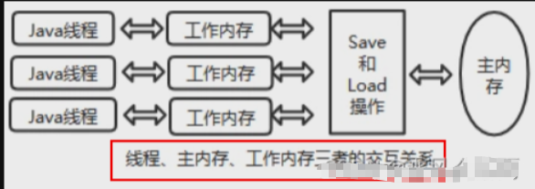
> 因此重排序时，不允许把内存屏障之后的指令重排序到内存屏障之前。
一句话：对一个 `volatile 域`的**写**, `happens-before` 于任意后续对这个 `volatile` 域的**读**，也叫写**后读**。
### 3）内存屏障分类
#### 一句话
- 上一章讲解过`happens-before`先行发生原则，类似接口规范，落地？
**落地**靠什么？你凭什么可以保证？你管用吗？
#### 粗分两种
- 写屏障
  - 在写指令之后插入写屏障，强制把写缓冲区的数据刷回到主内存中
- 读屏障
  - 在读指令之前插入读屏障，让工作内存或CPU高速缓存当中的缓存数据失效，重新回到主内存中获取最新数据。
#### 细分4种
> C++源码分析
```java
//Unsafe.class

    public native void loadFence();

    public native void storeFence();

    public native void fullFence();

```
```java
//Unsafe.java   
//同上
```
```java
//unsafe.cpp

UNSAFE_ENTRY(void, Unsafe_LoadFence(JNIEnv* env, jobject unsafe))//读屏障
  UnsafeWrapper("Unsafe_LoadFence");
  OrderAccess::acquire();
UNSAFE_END

UNSAFE_ENTRY(void, Unsafe_StoreFence(JNIEnv* env, jobject unsafe))//写屏障
  UnsafeWrapper("Unsafe_StoreFence");
  OrderAccess::release();
UNSAFE_END

UNSAFE_ENTRY(void, Unsafe_FullFence(JNIEnv* env, jobject unsafe))
  UnsafeWrapper("Unsafe_FullFence");
  OrderAccess::fence();
UNSAFE_END
```
```java
//OrderAccess.hpp
class OrderAccess : AllStatic {
 public:
  static void     loadload();//读读
  static void     storestore();//写写
  static void     loadstore();//读写
  static void     storeload();//写读

  static void     acquire();
  static void     release();
  static void     fence();
```
```java
//orderAccess_linux_x86
inline void OrderAccess::loadload()   { acquire(); }
inline void OrderAccess::storestore() { release(); }
inline void OrderAccess::loadstore()  { acquire(); }
inline void OrderAccess::storeload()  { fence(); }

inline void OrderAccess::acquire() {
  volatile intptr_t local_dummy;
#ifdef AMD64
  __asm__ volatile ("movq 0(%%rsp), %0" : "=r" (local_dummy) : : "memory");
#else__
  asm__ volatile ("movl 0(%%esp),%0" : "=r" (local_dummy) : : "memory");
#endif // AMD64
}
```
> 4种屏障

### 4）需要分2次讲解+复习的内容
#### 什么叫保证有序性
- 禁止指令重排
通过 **内存屏障** 禁止重排
> 1.  重排序有可能影响程序的执行和实现， 因此， 我们有时候希望告诉JVM你别“自作聪明”给我重排序， 我这里不需要排序， 听主人的。

> 2.  对于编译器的重排序， JMM会根据重排序的规则， 禁止特定类型的编译器重排序。

> 3.  对于处理器的重排序， Java编译器在生成指令序列的适当位置， 插入内存屏障指令， 来禁止特定类型的处理器排序。

#### happens-before之volatile变量规则

- 当第一个操作为`volatile`读时，不论第二个操作是什么，都不能 **重排序**。这个操作保证了`volatile` **读之后** 的操作不会被重排到`volatile`读之前。
- 当第二个操作为`volatile`写时，不论第一个操作是什么，都不能 **重排序**。这个操作保证了`volatile`**写之前** 的操作不会被重排到`volatile`写之后。
- 当第一个操作为`volatile`写时，第二个操作为`volatile`读时，**不能重排**。
#### JMM就将内存屏障插入策略分为4种规则
**读屏障**
- 在每个`volatile`读操作的 **后面** 插入一个`LoadLoad`屏障
- 在每个`volatile`读操作的 **后面** 插入一个`LoadStore`屏障

**写屏障**
- 在每个`volatile`写操作的 **前面** 插入一个`StoreStore`屏障
- 在每个`volatile`写操作的 **后面** 插入一个`StoreLoad`屏障


## 3：volatile特性
### 1）保证可见性
#### 说明
> 保证不同线程对某个变量完成操作后结果及时可见，即该共享变量一旦改变所有线程立即可见。

#### Code
```java
public class VolatileSeeDemo
{
    //static  boolean flag = true;       //不加volatile，没有可见性
    static volatile boolean flag = true;       //加了volatile，保证可见性

    public static void main(String[] args)
    {
        new Thread(() -> {
            System.out.println(Thread.currentThread().getName()+"\t come in");
            while (flag)//默认flag是true,如果未被修改就一直循环，下面那句话也打不出来
            {

            }
            System.out.println(Thread.currentThread().getName()+"\t flag被修改为false,退出.....");
        },"t1").start();

        //暂停几秒
        try { TimeUnit.SECONDS.sleep(2); } catch (InterruptedException e) { e.printStackTrace(); }

        flag = false;

        System.out.println("main线程修改完成");
    }
}
//没有volatile时
//t1   come in
//main线程修改完成
//--------程序一直在跑（在循环里）

//有volatile时
//t1   come in
//main线程修改完成
//t1   flag被修改为false,退出.....
```
#### 上述代码原理解释
> 线程t1中为何看不到被主线程main修改为false的flag的值？

问题可能:
- 主线程修改了flag之后没有将其刷新到主内存，所以t1线程看不到。
- 主线程将flag刷新到了主内存，但是t1一直读取的是自己工作内存中flag的值，没有去主内存中更新获取flag最新的值。

我们的诉求：
- 1.线程中修改了工作内存中的副本之后，立即将其刷新到主内存；
- 2.工作内存中每次读取共享变量时，都去主内存中重新读取，然后拷贝到工作内存。

解决：
> 使用volatile修饰共享变量，就可以达到上面的效果，被volatile修改的变量有以下特点：
- 线程中读取的时候，每次读取都会去主内存中读取共享变量最新的值 ，然后将其复制到工作内存
- 线程中修改了工作内存中变量的副本，修改之后会立即刷新到主内存
#### volatile变量的读写过程
> 原理一层层剖析：现象—失效/立刻刷新—内存屏障—缓存一致性协议/总线嗅探

read(读取)→load(加载)→use(使用)→assign(赋值)→store(存储)→write(写入)→lock(锁定)→unlock(解锁)

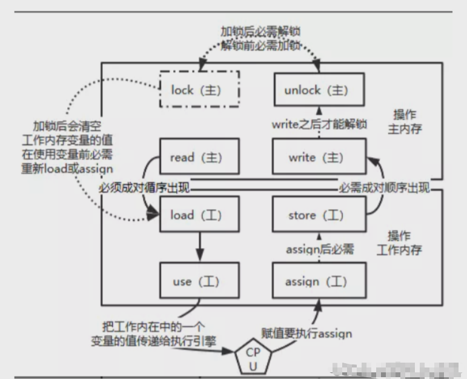
一个更清晰简单的图

`read`: 作用于 **主内存** ，将变量的值从主内存传输到工作内存，主内存到工作内存
`load`: 作用于 **工作内存** ，将read从主内存传输的变量值放入 **工作内存变量副本** 中，即数据加载
`use`: 作用于 **工作内存** ，将工作内存变量副本的值传递给执行引擎，每当JVM遇到需要该变量的字节码指令时会执行该操作
`assign`: 作用于 **工作内存** ，将从执行引擎接收到的值赋值给工作内存变量，每当JVM遇到一个给变量赋值字节码指令时会执行该操作
`store`: 作用于 **工作内存** ，将赋值完毕的工作变量的值写回给主内存
`write`: 作用于 **主内存** ，将store传输过来的变量值赋值给主内存中的变量
由于上述6条只能保证单条指令的原子性，针对多条指令的组合性原子保证，没有大面积加锁，所以，JVM提供了另外两个原子指令：
`lock`: 作用于 **主内存** ，将一个变量标记为一个线程独占的状态，只是写时候加锁，就只是锁了写变量的过程。
`unlock`: 作用于 **主内存** ，把一个处于锁定状态的变量释放，然后才能被其他线程占用

### 2）没有原子性
#### volatile变量的复合操作不具有原子性，比如number++
#### Code
- synchronized和volatile代码演示
```java
class MyNumber
{
    //volatile int number = 0;

    int number = 0;
    public synchronized void addPlusPlus()//加上synchronized
    {
        number++;
    }
}

public class VolatileNoAtomicDemo
{
    public static void main(String[] args) throws InterruptedException
    {
        MyNumber myNumber = new MyNumber();

        for (int i = 1; i <=10; i++) {
            new Thread(() -> {
                for (int j = 1; j <= 1000; j++) {
                    myNumber.addPlusPlus();
                }
            },String.valueOf(i)).start();
        }

        //暂停几秒钟线程
        try { TimeUnit.SECONDS.sleep(3); } catch (InterruptedException e) { e.printStackTrace(); }
        System.out.println(Thread.currentThread().getName() + "\t" + myNumber.number);
    }
}
//-------------volatile情况下
//main  8302
//-----------synchronized请款下
//main  10000
```
**读取赋值一个普通变量的情况**
当线程1对主内存对象发起read操作到write操作第一套流程的时间里，线程2随时都有可能对这个主内存对象发起第二套操作
> 各忙各的
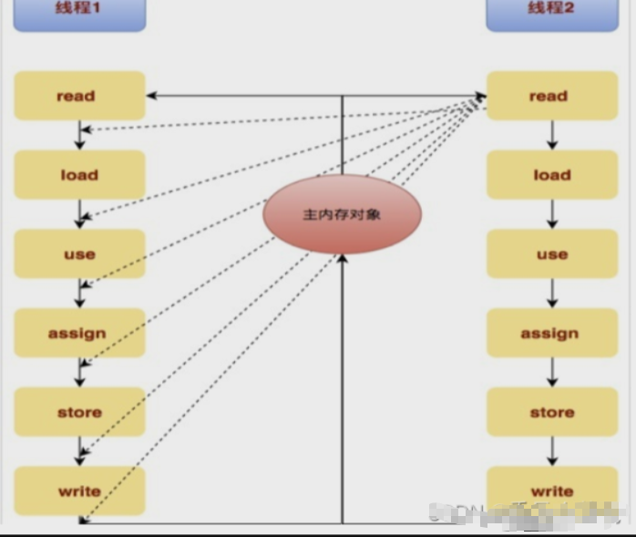
**不保证原子性**
- 从底层来说，`i++` 或者 `number++`（在执行引擎操作时）其实是分了三步的：**数据加载** 、**数据计算** 、**数据赋值** 。而这三步非原子操作 。

对于volatile变量 **具备可见性 ，JVM只是保证从主内存加载到线程工作内存的值是最新的，也仅是数据加载时是最新的。但是多线程环境下，“数据计算”和“数据赋值”操作可能多次出现，若数据在加载之后，若主内存volatile修饰变量发生修改之后，线程工作内存中的操作将会作废去读主内存最新值，操作出现写丢失问题**。即各线程私有内存和主内存公共内存中变量不同步 ，进而导致数据不一致。由此可见volatile解决的是变量读取时的可见性问题，但无法保证原子性，对于多线程修改主内存共享变量的场景必须使用加锁同步。
> 比如说你在计算的时候，别的线程已经提交了，所以你的计算直接失效了

再分析下

`synchronized`加了之后保证了串行执行，每次只有一个线程进来。
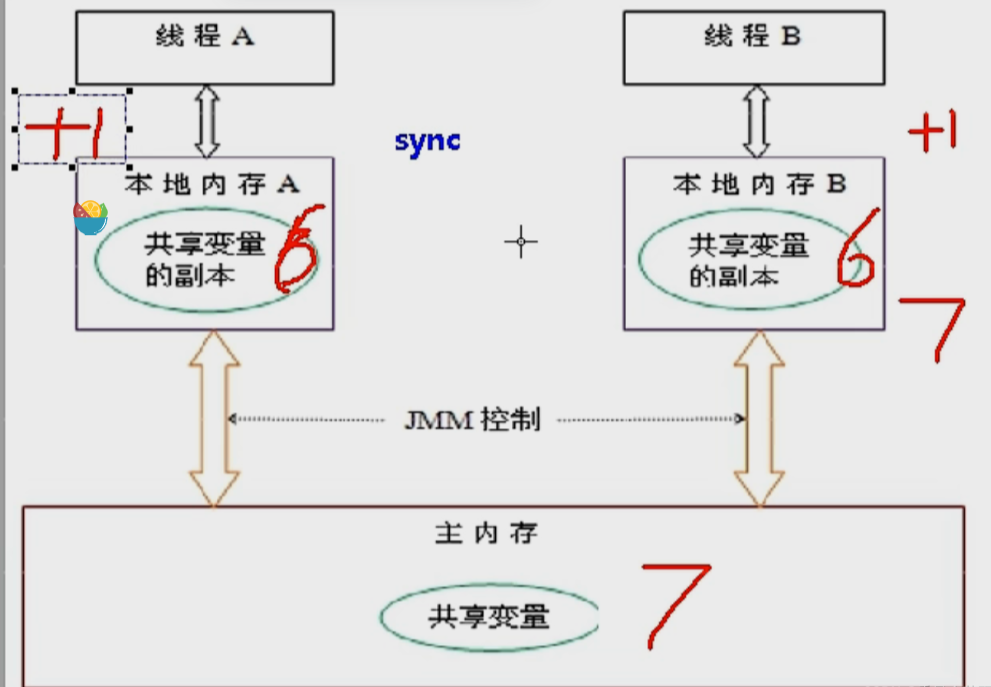
但`volatile`不能保证原子性，大家一起读，一起加一，就看谁提交的快了。提交快的直接让另一个失效。


从i++的字节码角度说明

原子性指的是一个操作是不可中断的，即使是在多线程环境下，一个操作一旦开始就不会被其他线程影响。

```java
public void add() {

  i++; //不具备原子性，该操作是先读取值，然后写回一个新值，相当于原来的值加上1，分3步完成

  }
```
如果第二个线程在第一个线程读取旧值和写回新值期间读取i的域值，那么第二个线程就会与第一个线程一起看到同一个值，

并执行相同值的加1操作，这也就造成了线程安全失败，因此对于`add方法`必须使用`synchronized`修饰，以便保证线程安全.
#### 结论
> volatile不适合参与到依赖当前值的运算，如i=i+1，i++之类的
那么依靠可见性的特点`volatile`可以用在哪些地方呢？通常`volatile`用作保存某个状态的`boolean`值或`or int`值。 （一旦布尔值被改变迅速被看到，就可以做其他操作）
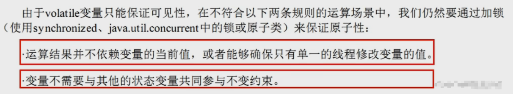
#### 面试回答
对于 `volatile` 变量，JVM只是保证从主内存加载到线程工作内存的值是最新的，也只是数据加载时是最新的。如果第二个线程在第一个线程 **读取旧值** 和 **写回新值期** 间读取i的阈值，也就造成了线程安全问题。
（中间这个蓝色框代表的是在执行引擎操作期间）

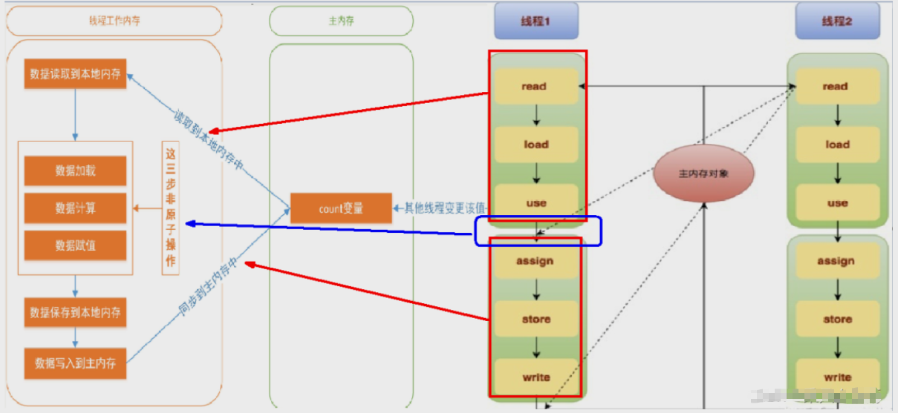
### 3）说明与案例
重排序

重排序是指编译器和处理器为了优化程序性能而对指令序列进行重新排序的一种手段，有时候会改变程序语句的先后顺序

不存在数据依赖关系，可以重排序；
> 存在数据依赖关系 ，禁止重排序

但重排后的指令绝对不能改变原有的串行语义！这点在并发设计中必须要重点考虑！

重排序的分类和执行流程

编译器优化的重排序： 编译器在不改变单线程串行语义的前提下，可以重新调整指令的执行顺序
指令级并行的重排序： 处理器使用指令级并行技术来讲多条指令重叠执行，若不存在数据依赖性，处理器可以改变语句对应机器指令的执行顺序
内存系统的重排序： 由于处理器使用缓存和读/写缓冲区，这使得加载和存储操作看上去可能是乱序执行

数据依赖性 ：若两个操作访问同一变量，且这两个操作中有一个为写操作，此时两操作间就存在数据依赖性。

案例

不存在数据依赖关系，可以重排序 ===> 重排序OK 。
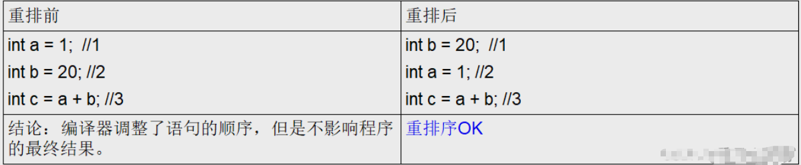
**存在** 数据依赖关系，**禁止重排序** ===> 重排序发生，会导致程序运行结果不同。

编译器和处理器在重排序时，会遵守数据依赖性，不会改变存在依赖关系的两个操作的执行,但不同处理器和不同线程之间的数据性不会被编译器和处理器考虑，其只会作用于单处理器和单线程环境，下面三种情况，只要重排序两个操作的执行顺序，程序的执行结果就会被改变。

#### volatile的底层实现是通过内存屏障，2次复习
> volatile有关的禁止指令重排的行为

> 四大屏障的插入情况

案例
```java
public class VolatileTest {
    int i = 0;
    volatile boolean flag = false;
    public void write(){
        i = 2;//假如不加volatile，这两句话的顺序就有可能颠倒，影像最终结果
        flag = true;
    }
    public void read(){
        if(flag){
            System.out.println("---i = " + i);
        }
    }
}
```
- `volatile`写
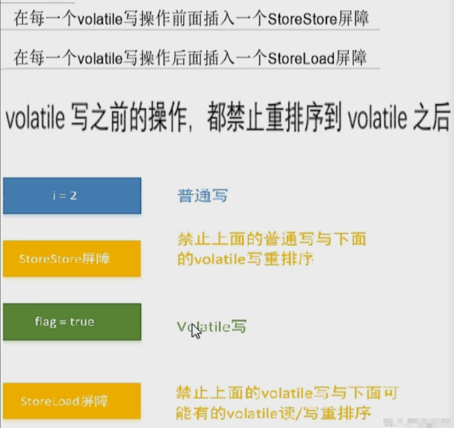
- `volatile`读（必须要先确保拿到最新值）
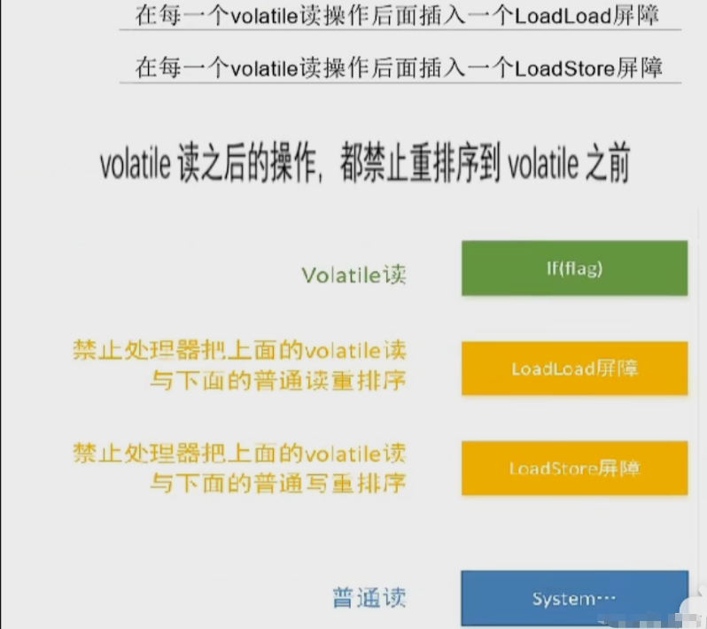
## 4：如何正确使用volatile（实际工作）
### 1）单一赋值可以，但是含有符合运算赋值不可以（比如i++）
> 下面这两个单一赋值可以的
- `volatile int a = 10;`
- `volatile boolean flag = false`
### 2）状态标志，判断业务是否结束
```java
//这个前面讲过
public class UseVolatileDemo
{
    private volatile static boolean flag = true;

    public static void main(String[] args)
    {
        new Thread(() -> {
            while(flag) {
                //do something......循环
            }
        },"t1").start();

        //暂停几秒钟线程
        try { TimeUnit.SECONDS.sleep(2L); } catch (InterruptedException e) { e.printStackTrace(); }

        new Thread(() -> {
            flag = false;
        },"t2").start();
    }
}

```
### 3）开销较低的读，写锁策略
当读远多于写

最土的方法就是加两个`synchronized`，但是 **读** 用`volatile`，**写** 用`synchronized`可以提高性能
```java
public class UseVolatileDemo
{
    //
   // 使用：当读远多于写，结合使用内部锁和 volatile 变量来减少同步的开销
   // 理由：利用volatile保证读取操作的可见性；利用synchronized保证复合操作的原子性
     
    public class Counter
    {
        private volatile int value;

        public int getValue()
        {
            return value;   //利用volatile保证读取操作的可见性
              }
        public synchronized int increment()
        {
            return value++; //利用synchronized保证复合操作的原子性
               }
    }
}
```

### 4）DCL双锁案例
```java
public class SafeDoubleCheckSingleton
{
    private static SafeDoubleCheckSingleton singleton; //-----这里没加volatile
    //私有化构造方法
    private SafeDoubleCheckSingleton(){
    }
    //双重锁设计
    public static SafeDoubleCheckSingleton getInstance(){
        if (singleton == null){
            //1.多线程并发创建对象时，会通过加锁保证只有一个线程能创建对象
            synchronized (SafeDoubleCheckSingleton.class){
                if (singleton == null){
                    //隐患：多线程环境下，由于重排序，该对象可能还未完成初始化就被其他线程读取
                    singleton = new SafeDoubleCheckSingleton();
                    //实例化分为三步
                    //1.分配对象的内存空间
                    //2.初始化对象
                    //3.设置对象指向分配的内存地址
                }
            }
        }
        //2.对象创建完毕，执行getInstance()将不需要获取锁，直接返回创建对象
        return singleton;
    }
}
```
#### 单线程情况下
单线程环境下(或者说正常情况下)，在"问题代码处"，会执行如下操作，保证能获取到已完成初始化的实例

```java
//三步
memory = allocate(); //1.分配对象的内存空间
ctorInstance(memory); //2.初始化对象
instance = memory; //3.设置对象指向分配的内存地址
```
#### 多线程情况下（由于指令重排序）
隐患：多线程环境下，在"问题代码处"，会执行如下操作，由于重排序导致2,3乱序，后果就是其他线程得到的是null而不是完成初始化的对象 。（没初始化完的就是null）
正常情况

```java
//三步
memory = allocate(); //1.分配对象的内存空间
ctorInstance(memory); //2.初始化对象
instance = memory; //3.设置对象指向分配的内存地址
```*

   非正常情况

```java
//三步
memory = allocate(); //1.分配对象的内存空间
instance = memory; //3.设置对象指向分配的内存地址---这里指令重排了，但是对象还没有初始化
ctorInstance(memory); //2.初始化对象

```

#### 解决
加volatile修饰

```java
public class SafeDoubleCheckSingleton
{
    //通过volatile声明，实现线程安全的延迟初始化。
    private volatile static SafeDoubleCheckSingleton singleton;
    //私有化构造方法
    private SafeDoubleCheckSingleton(){
    }
    //双重锁设计
    public static SafeDoubleCheckSingleton getInstance(){
        if (singleton == null){
            //1.多线程并发创建对象时，会通过加锁保证只有一个线程能创建对象
            synchronized (SafeDoubleCheckSingleton.class){
                if (singleton == null){
                    //隐患：多线程环境下，由于重排序，该对象可能还未完成初始化就被其他线程读取
                                      //原理:利用volatile，禁止 "初始化对象"(2) 和 "设置singleton指向内存空间"(3) 的重排序
                    singleton = new SafeDoubleCheckSingleton();
                }
            }
        }
        //2.对象创建完毕，执行getInstance()将不需要获取锁，直接返回创建对象
        return singleton;
    }
}
 
```
实例化`singleton`分多步执行（分配内存空间、初始化对象、将对象指向分配的内存空间），某些编译器为了性能原因，会将第二步和第三步进行重排序（分配内存空间、将对象指向分配的内存空间、初始化对象）。这样，某个线程可能会获得一个未完全初始化的实例。


## 5：最后的小总结
volatile可见性
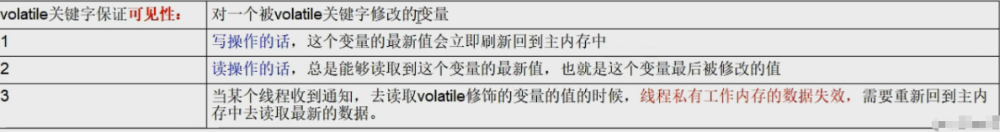
- volatile没有原子性
- volatile禁重排
  - 写指令
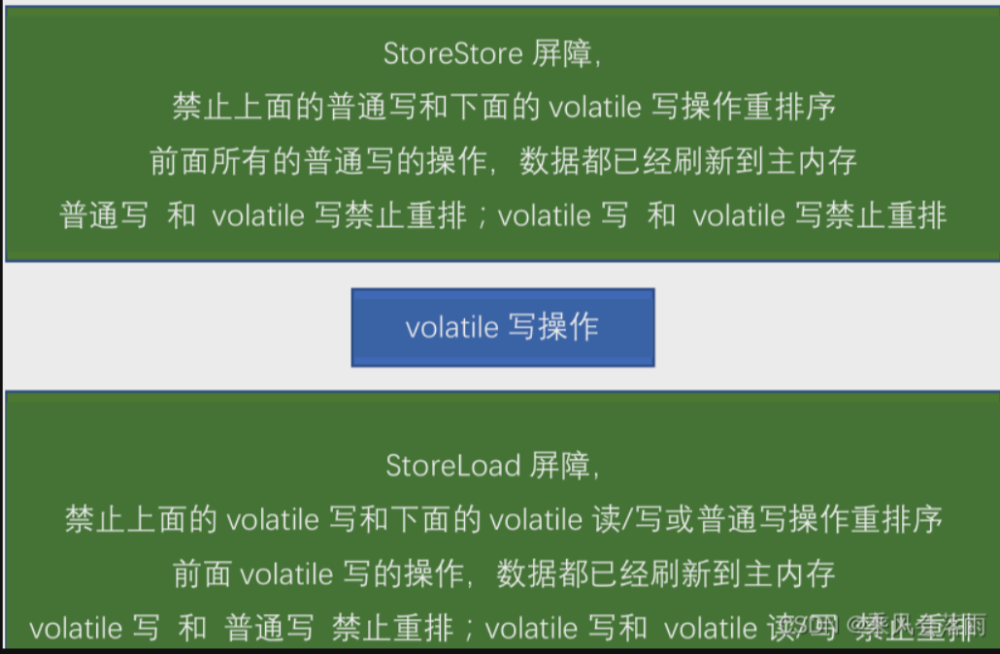
  - 读指令

凭什么我们java写了一个volatile关键字系统底层加入内存屏障？两者关系怎么勾搭上的？
字节码层面`javap -c xx.class`
它其实添加了一个`ACC_VOLATILE`
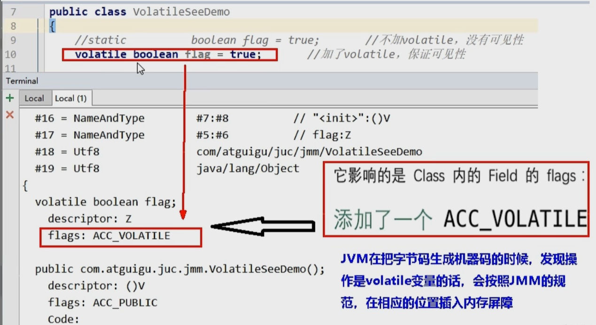
> 内存屏障是什么？  

内存屏障是一种屏障指令，它使得CPU或编译器对屏障指令的前和后所发出的内存操作执行一个排序的约束。也叫内存栅栏或栅栏指令
> 内存屏障能干嘛？

- 1. 阻止屏障两边的指令重排序
- 2. 写数据时假如屏障，强制将线程私有工作内存的数据刷回主物理内存
- 3. 读数据时加入屏障，线程私有工作内存的数据失效，重新到主物理内存中获取最新数据
> 内存屏障的四大指令


> 3句话总结
- `volatile`写之前的的操作，都禁止重排到`volatile`之后
- `volatile`读之后的操作，都禁止重排到`volatile`之前
- `volatile`写之后`volatile`读，禁止重排序


