## 1：是什么
都是 `java.util.concurrent.atomic` 包下的

有红框圈起来的，也有蓝框圈起来的，为什么？

- 阿里巴巴Java开发手册

为什么说18罗汉增强，却只有16个

## 2：再分类
### 1）基本类型原子类
```java
AtomicInteger
AtomicBoolean
AtomicLong
```
#### 常用API
```java
public final int get()
public final int getAndSet(int new Value)
public final int getAndIncrement()
public final int getAndDecrement()
public final int getAndAdd(int delta)
public comapreAndSet(int expect,int update)//如果
```
#### Case-CountDownLatch
案例
```java
class MyNumber{
    AtomicInteger atomicInteger = new AtomicInteger();
    public void addPlusPlus(){
        atomicInteger.getAndIncrement();
    }
}

public class AtomicIntegerDemo {
    public static final int SIZE = 50;
    public static void main(String[] args) {
        MyNumber myNumber = new MyNumber();
        for(int i = 1;i <= SIZE;i ++){
            new Thread(() -> {
                for(int j = 1;j <= 1000;j ++){
                    myNumber.addPlusPlus();
                }
            },String.valueOf(i)).start();
        }
        System.out.println(Thread.currentThread().getName()+"\t"+"result: "+myNumber.atomicInteger);
    }
}
//本来应该是50000
//1试-main  result: 39000
//2试-main  result: 40178
//?是不是我们的程序有问题？

//因为上面的50*  1000个计算还没结束，他就去get数值了
```*

   解决

```java
//方法一（不推荐，做做Demo还行）
public class AtomicIntegerDemo {
    public static final int SIZE = 50;
    public static void main(String[] args) {
        MyNumber myNumber = new MyNumber();
        for(int i = 1;i <= SIZE;i ++){
            new Thread(() -> {
                for(int j = 1;j <= 1000;j ++){
                    myNumber.addPlusPlus();
                }
            },String.valueOf(i)).start();
        }
        try {
            TimeUnit.SECONDS.sleep(2);
        } catch (InterruptedException e) {
            e.printStackTrace();
        }
        System.out.println(Thread.currentThread().getName()+"\t"+"result: "+myNumber.atomicInteger);
    }
}

//方法二-减法计数器CountDownLatch
public class AtomicIntegerDemo {
    public static final int SIZE = 50;
    public static void main(String[] args) throws InterruptedException {
        MyNumber myNumber = new MyNumber();
        CountDownLatch countDownLatch = new CountDownLatch(SIZE);
        for(int i = 1;i <= SIZE;i ++){
            new Thread(() -> {
                try {
                    for(int j = 1;j <= 1000;j ++){
                        myNumber.addPlusPlus();
                    }
                } finally {
                    countDownLatch.countDown();
                }
            },String.valueOf(i)).start();
        }
        countDownLatch.await();
        System.out.println(Thread.currentThread().getName()+"\t"+"result: "+myNumber.atomicInteger);
    }
}
//main  result: 50000
```
### 2）数组类型原子类 Case
基本原理同上，不做过多演示
```java
AtomicIntegerArray
AtomicLongArray
AtomicRreferenceArray
```
#### Case
```java
public class AtomicIntegerArrayDemo
{
    public static void main(String[] args)
    {
        AtomicIntegerArray atomicIntegerArray = new AtomicIntegerArray(new int[5]);//0 0 0 0 0
        //AtomicIntegerArray atomicIntegerArray = new AtomicIntegerArray(5);
        //AtomicIntegerArray atomicIntegerArray = new AtomicIntegerArray(new int[]{1,2,3,4,5});//1 2 3 4 5 

        for (int i = 0; i <atomicIntegerArray.length(); i++) {
            System.out.println(atomicIntegerArray.get(i));
        }
        System.out.println();
        System.out.println();
        System.out.println();
        int tmpInt = 0;

        tmpInt = atomicIntegerArray.getAndSet(0,1122);
        System.out.println(tmpInt+"\t"+atomicIntegerArray.get(0));
        atomicIntegerArray.getAndIncrement(1);
        atomicIntegerArray.getAndIncrement(1);
        tmpInt = atomicIntegerArray.getAndIncrement(1);
        System.out.println(tmpInt+"\t"+atomicIntegerArray.get(1));
    }
}
```
### 3）引用类型原子类
这三个相对比较重要

```java
AtomicReference
AtomicStampedReference
AtomicMarkableReference
```*

   `AtomicReference` 可以带泛型（前面讲过）

`AtomicReference<xxx> `*

   `AtomicStampedReference` 带版本号以防CAS中的ABA问题（前面讲过）

携带版本号的引用类型原子类，可以解决ABA问题。解决修改过几次的问题。*

   `AtomicMarkableReference`类似于上面的 ，但解决**一次性**问题

构造方法`AtomicMarkableReference(V initialRef, boolean initialMark)`

原子更新带有标记位的引用类型对象

解决是否修改过，它的定义就是将`状态戳`**简化**为`true|false`，类似一次性筷子

```java
//来个案例
public class AtomicMarkableReferenceDemo {

    static AtomicMarkableReference markableReference = new AtomicMarkableReference(100,false);

    public static void main(String[] args) {
        new Thread(()->{
            boolean marked = markableReference.isMarked();
            System.out.println(Thread.currentThread().getName()+"\t"+"默认标识"+marked);
            //暂停1秒钟线程，等待后面的T2线程和我拿到一样的模式flag标识，都是false
            try {TimeUnit.SECONDS.sleep(1);} catch (InterruptedException e) {e.printStackTrace();}
            markableReference.compareAndSet(100, 1000, marked, !marked);
        },"t1").start();

        new Thread(()->{
            boolean marked = markableReference.isMarked();
            System.out.println(Thread.currentThread().getName()+"\t"+"默认标识"+marked);
            //这里停2秒，让t1先修改,然后t2试着修改
            try {TimeUnit.SECONDS.sleep(2);} catch (InterruptedException e) {e.printStackTrace();}
            boolean t2Result = markableReference.compareAndSet(100, 1000, marked, !marked);
            System.out.println(Thread.currentThread().getName()+"\t"+"t2线程result--"+t2Result);
            System.out.println(Thread.currentThread().getName()+"\t"+markableReference.isMarked());
            System.out.println(Thread.currentThread().getName()+"\t"+markableReference.getReference());

        },"t2").start();
    }
}

```
## 3：对象的属性修改原子类
关键词FieldUpdater

```java
AtomicIntegerFieldUpdater//原子更新对象中int类型字段的值
AtomicLongFieldUpdater//原子更新对象中Long类型字段的值
AtomicReferenceFieldUpdater//原子更新引用类型字段的值
```

### 1）使用目的
> 以一种线程安全带 方式操作非线程安全对象内的某些字段

举个例子（它是更加细粒度的/影像某个字段，而不用锁住整个对象）


### 2）使用要求
> 更新的对象属性必须使用 `public volatile修饰符`

因为对象的属性修改类型原子类都是抽象类，**所以每次使用都必须使用静态方法`newUpdater()`创建一个更新器**，并且需要设置想要更新的类和属性。
### 3）Case
`AtomicIntegerFieldUpdater-`这个针对int类型
```java
class BankAccount{
    String bankName = "CCB";
    public volatile int money = 0;//条件一

    //synchronized版本
//    public synchronized void add(){
//        money++;
//    }
    //AtomicIntegerFieldUpdater版本
    AtomicIntegerFieldUpdater<BankAccount> fieldUpdater =
            AtomicIntegerFieldUpdater.newUpdater(BankAccount.class,"money");//只限制了money这个字段，条件二

    public void transMoney(BankAccount bankAccount){
        fieldUpdater.getAndIncrement(bankAccount);
    }

}

public class AtomicIntegerFieldUpdaterDemo {
    public static void main(String[] args) throws InterruptedException {
        BankAccount bankAccount = new BankAccount();
        CountDownLatch countDownLatch = new CountDownLatch(10);
        for(int i = 1;i <= 10;i ++){
            new Thread(()->{
                try {
                    for(int j = 1;j <= 1000;j ++){
                       // bankAccount.add();
                        bankAccount.transMoney(bankAccount);
                    }
                } finally {
                    countDownLatch.countDown();
                }
            },String.valueOf(i)).start();
        }
        countDownLatch.await();
        System.out.println(Thread.currentThread().getName()+"\t"+"result: "+bankAccount.money);
    }
}
//main  result: 10000

```*

   `AtomicReferenceFieldUpdater`-适用度更广

```java
//比如这个案例中是针对boolean类型的
class MyVar{
    public volatile Boolean isInit = Boolean.FALSE;
    AtomicReferenceFieldUpdater<MyVar,Boolean> referenceFieldUpdater =
            AtomicReferenceFieldUpdater.newUpdater(MyVar.class,Boolean.class,"isInit");
    public void init(MyVar myVar){
        if(referenceFieldUpdater.compareAndSet(myVar,Boolean.FALSE,Boolean.TRUE)){
            System.out.println(Thread.currentThread().getName()+"\t"+"-----start init,needs 3 seconds");
            try {TimeUnit.SECONDS.sleep(3);} catch (InterruptedException e) {e.printStackTrace();}
            System.out.println(Thread.currentThread().getName()+"\t"+"-----over init");
        }else{
            System.out.println(Thread.currentThread().getName()+"\t"+"抱歉，已经有其他线程进行了初始化");
        }
    }
}

public class AtomicReferenceFieldUpdaterDemo {
    public static void main(String[] args) {
        MyVar myVar = new MyVar();
        for(int i = 1;i <= 5;i ++){
            new Thread(()->{
                myVar.init(myVar);
            },String.valueOf(i)).start();
        }
    }
}
//1  -----start init,needs 3 seconds
//5  抱歉，已经有其他线程进行了初始化
//4  抱歉，已经有其他线程进行了初始化
//2  抱歉，已经有其他线程进行了初始化
//3  抱歉，已经有其他线程进行了初始化
//1  -----over init

```

### 4）面试
> 面试官问你：你在哪里用了volatile?

- 在`AtomicReferenceFieldUpdater`中，因为是规定好的 **必须** 由`volatile`修饰的
- 还有的话之前我们在DCL单例中，也用了`volatile`保证了可见性
## 4：原子操作增强类原理深度解析
开篇的时候我们将原子类分为了红框和蓝框，这里就是蓝框的内容

```java
//这几个都是java8开始有的，前面的都是java5就有了
DoubleAccumulator
DoubleAdder
LongAccumulator
LongAdder
```
### 1）阿里要命题目

- `热点商品点赞计算器`，点赞数加加统计，不要求实时精确
- 一个很大的List，里面都是int类型，如何实现加加，说说思路
### 2）模拟下点赞计数器，看看性能
> 要求：热点商品点赞计算器，点赞数加加统计，不要求实时精确
看看这个LongAdder

看看这个LongAccumulator
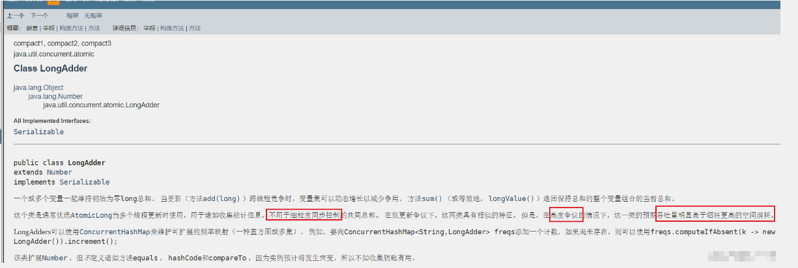
#### 常用API

#### 入门讲解
- `LongAdder` 只能用来计算加法 。**且从零开始计算**
- `LongAccumulator` 提供了自定义的函数操作 (利用lambda表达式)

```java
public class LongAdderAPIDemo {
    public static void main(String[] args) {
        LongAdder longAdder = new LongAdder();

        longAdder.increment();
        longAdder.increment();
        longAdder.increment();

        System.out.println(longAdder.longValue());//3

        LongAccumulator longAccumulator = new LongAccumulator((x, y) -> x + y, 0);//lambda表达式
        longAccumulator.accumulate(1);//1
        longAccumulator.accumulate(3);//4
        System.out.println(longAccumulator.get());//4
    }
}
```
#### LongAdder高性能对比Code演示
```java
//需求：50个线程，每个线程100w次，计算总点赞数
class ClickNumber{
    int number = 0;
    public synchronized void add1(){
        number++;
    }

    AtomicLong atomicLong =  new AtomicLong(0);
    public void add2(){
        atomicLong.incrementAndGet();
    }

    LongAdder longAdder =new LongAdder();
    public void add3(){
        longAdder.increment();
    }

    LongAccumulator longAccumulator = new  LongAccumulator((x,y) -> x + y,0);
    public void add4(){
        longAccumulator.accumulate(1);
    }
}
public class AccumulatorCompareDemo {
    public static final int _1W = 1000000;
    public static final int threadNumber = 50;
    public static void main(String[] args) throws InterruptedException {

        ClickNumber clickNumber = new ClickNumber();
        Long startTime;
        Long endTime;
        CountDownLatch countDownLatch1 = new CountDownLatch(50);
        CountDownLatch countDownLatch2 = new CountDownLatch(50);
        CountDownLatch countDownLatch3 = new CountDownLatch(50);
        CountDownLatch countDownLatch4 = new CountDownLatch(50);

        startTime = System.currentTimeMillis();
        for(int i = 1;i <= threadNumber;i ++){
            new Thread(()->{
                try {
                    for(int j = 1;j <=_ 1W;j ++){
                        clickNumber.add1();
                    }
                } finally {
                    countDownLatch1.countDown();
                }
            },String.valueOf(i)).start();
        }
        countDownLatch1.await();
        endTime = System.currentTimeMillis();
        System.out.println("costTime---"+(endTime-startTime)+"毫秒"+"\t"+"synchronized---"+clickNumber.number);

        startTime = System.currentTimeMillis();
        for(int i = 1;i <= threadNumber;i ++){
            new Thread(()->{
                try {
                    for(int j = 1;j <=_ 1W;j ++){
                        clickNumber.add2();
                    }
                } finally {
                    countDownLatch2.countDown();
                }
            },String.valueOf(i)).start();
        }
        countDownLatch2.await();
        endTime = System.currentTimeMillis();
        System.out.println("costTime---"+(endTime-startTime)+"毫秒"+"\t"+"atomicLong---"+clickNumber.atomicLong);

        startTime = System.currentTimeMillis();
        for(int i = 1;i <= threadNumber;i ++){
            new Thread(()->{
                try {
                    for(int j = 1;j <=_ 1W;j ++){
                        clickNumber.add3();
                    }
                } finally {
                    countDownLatch3.countDown();
                }
            },String.valueOf(i)).start();
        }
        countDownLatch3.await();
        endTime = System.currentTimeMillis();
        System.out.println("costTime---"+(endTime-startTime)+"毫秒"+"\t"+"LongAdder---"+clickNumber.longAdder.sum());

        startTime = System.currentTimeMillis();
        for(int i = 1;i <= threadNumber;i ++){
            new Thread(()->{
                try {
                    for(int j = 1;j <=_ 1W;j ++){
                        clickNumber.add4();
                    }
                } finally {
                    countDownLatch4.countDown();
                }
            },String.valueOf(i)).start();
        }
        countDownLatch4.await();
        endTime = System.currentTimeMillis();
        System.out.println("costTime---"+(endTime-startTime)+"毫秒"+"\t"+"LongAccumulator---"+clickNumber.longAccumulator.longValue());
    }
    //costTime---2205毫秒  synchronized---50000000
    //costTime---435毫秒  atomicLong---50000000
    //costTime---86毫秒  LongAdder---50000000
    //costTime---84毫秒  LongAccumulator---50000000
}//印证了阿里卡法手册中说的 【如果是JDK8，推荐使用LongAdder对象，比AtomicLong性能更好（减少乐观锁的重试次数）】

```
### 3）源码、原理分析
#### 架构

LongAdder是Striped64的子类

```java
public class LongAdder extends Striped64 implements Serializable {
    private static final long serialVersionUID = 7249069246863182397L;
 //---------------------------
 abstract class Striped64 extends Number {
```
#### 原理（LongAdder为什么这么快）
官网说明和阿里要求
- 阿里说明

- 官网说明

**LongAdder是Striped64的子类**

**Striped64**
- 重要的成员函数
```java
//Number of CPUS, to place bound on table size       
// CPU数量，即cells数组的最大长度 
static final int NCPU = Runtime.getRuntime().availableProcessors();


//Table of cells. When non-null, size is a power of 2.
//单元格数组|cells数组，为2的幂，2,4,8,16.....，方便以后位运算
transient volatile Cell[] cells;

//基础value值，当并发较低时，只累加该值主要用于没有竞争的情况，通过CAS更新。
//Base value, used mainly when there is no contention, but also as
//a fallback during table initialization races. Updated via CAS.
transient volatile long base;

//创建或者扩容Cells数组时使用的自旋锁变量调整单元格大小（扩容），创建单元格时使用的锁。
//Spinlock (locked via CAS) used when resizing and/or creating Cells. 
transient volatile int cellsBusy;
```
最重要的两个


- `Striperd64`中一些变量或者方法的定义

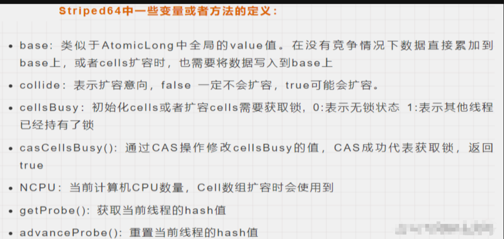

**Cell**
> 是 `java.util.concurrent.atomic`下 `Striped64` 的一个静态内部类
```java
@sun.misc.Contended static final class Cell {
        volatile long value;
        Cell(long x) { value = x; }
        final boolean cas(long cmp, long val) {
            return UNSAFE.compareAndSwapLong(this, valueOffset, cmp, val);
        }

        // Unsafe mechanics
        private static final sun.misc.Unsafe UNSAFE;
        private static final long valueOffset;
        static {
            try {
                UNSAFE = sun.misc.Unsafe.getUnsafe();
                Class<?> ak = Cell.class;
                valueOffset = UNSAFE.objectFieldOffset
                    (ak.getDeclaredField("value"));
            } catch (Exception e) {
                throw new Error(e);
            }
        }
    }
```
> LongAdder为什么这么快
其实在 **小并发** 下情况差不多；但在 **高并发** 情况下，在`AtomicLong`中，**等待的线程会不停的自旋**，导致效率比较低；而 `LongAdder` 用 `cell[]` 分了几个块出来，**最后统计总的结果值（base+所有的cell值），分散热点。**

举个形象的例子，火车站买火车票，`AtomicLong` 只要一个窗口，其他人都在排队；而`LongAdder` 利用 `cell` 开了多个卖票窗口，所以效率高了很多。
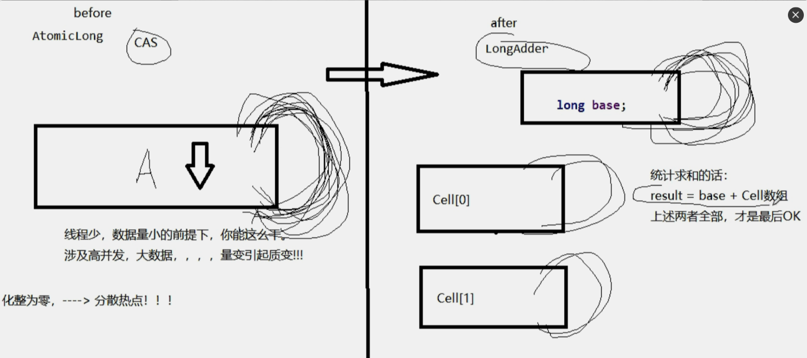
一句话

LongAdder的基本思路就是 **分散热点** ，**将`value`值分散到一个`Cell`数组中**，不同线程会命中到数组的不同槽中，各个线程只对自己槽中的那个值进行CAS操作，这样热点就被分散了，冲突的概率就小很多。如果要获取真正的long值，只要将各个槽中的变量值累加返回。

sum()会将所有Cell数组中的value和base累加作为返回值，核心的思想就是将之前AtomicLong一个value的更新压力分散到多个value中去，从而降级更新热点 。

- 内部有一个base变量，一个Cell[]数组。
- ase变量：非竞态条件下，直接累加到该变量上
- Cell[]数组：竞态条件下，累加各个线程自己的槽Cell[i]中
#### 源码解读深度分析
**小总结**
`LongAdder`在无竞争的情况，跟`AtomicLong`一样，对同一个base进行操作，当出现竞争关系时则是采用化整为零的做法，从空间换时间，用一个数组 \ \ ，将一个`value`拆分进这个数组cells。多个线程需要同时对value进行操作时候，可以对线程id进行hash得到hash值，再根据`hash值`映射到这个数组cells的某个下标，再对该下标所对应的值进行自增操作。当所有线程操作完毕，将数组cells的所有值和无竞争值base都加起来作为最终结果。

- 1-add(1L)
```java
public class LongAdder extends Striped64 implements Serializable {
    private static final long serialVersionUID = 7249069246863182397L;

    /***     
 Creates a new adder with initial sum of zero.*     
/
    public LongAdder() {
    }

    /***     
 Adds the given value.**     

      @param x the value to add*     
/
    public void add(long x) {
        Cell[] as; long b, v; int m; Cell a;
        if ((as = cells) != null || !casBase(b = base, b + x)) {
            boolean uncontended = true;
            if (as == null || (m = as.length - 1) < 0 ||
                (a = as[getProbe() & m]) == null ||
                !(uncontended = a.cas(v = a.value, v + x)))
                longAccumulate(x, null, uncontended);
        }
    }
    //真正干活的是longAccumulate
    //as表示cells引用
    //b表示获取的base值
    //v表示期望值
    //m表示cells数组的长度
    //a表示当前线程命中的cell单元格
    
```
`uncontended`代表没有冲突。

我们点进这个`casBase`发现他也是个CAS
```java
final boolean casBase(long cmp, long val) {
        return UNSAFE.compareAndSwapLong(this, BASE, cmp, val);
    }
```
一开始竞争小的时候CAS能成功，也就是casBase能成功，然后cells也是空的，所以不会进到循环

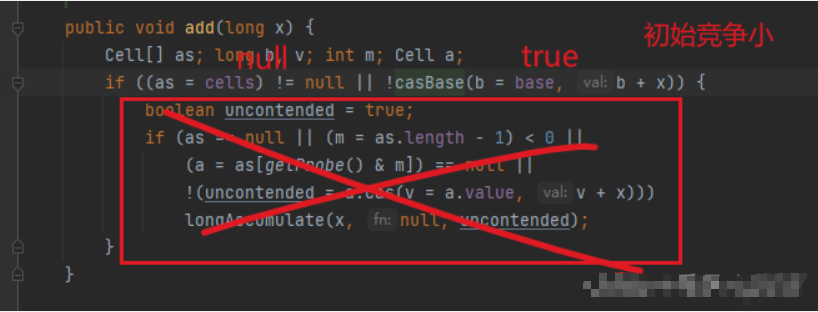
竞争大的时候，他会 `Cell[] rs = new Cell[2]`; 新建两个cell, 此时≠ null ，条件满足了，进入循环。

然后这里还有一层循环，这里是多个if并排

> 总结一下
> 1.最初无竞争时只更新base;
> 2.如果更新base失败后，首次新建一个Cell[]数组
> 3.当多个线程竞争同一个Cell比价激烈时，可能就要利用longAccumulate对Cell[]扩容。


> 再次小总结
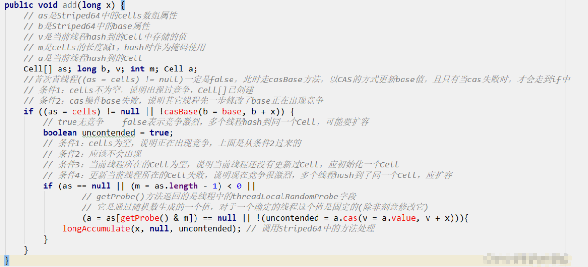

2-longAccumulate

```java
    final void longAccumulate(long x, LongBinaryOperator fn,
                              boolean wasUncontended) {
        int h;
        if ((h = getProbe()) == 0) {
            ThreadLocalRandom.current(); // force initialization
            h = getProbe();
            wasUncontended = true;
        }
        boolean collide = false;                // True if last slot nonempty
        for (;;) {
            Cell[] as; Cell a; int n; long v;
            if ((as = cells) != null && (n = as.length) > 0) {
            //这里是③ Cell数组不再为空且可能存在Cell数组扩容
                if ((a = as[(n - 1) & h]) == null) {
                    if (cellsBusy == 0) {       // Try to attach new Cell
                        Cell r = new Cell(x);   // Optimistically create
                        if (cellsBusy == 0 && casCellsBusy()) {
                            boolean created = false;
                            try {               // Recheck under lock
                                Cell[] rs; int m, j;
                                if ((rs = cells) != null &&
                                    (m = rs.length) > 0 &&
                                    rs[j = (m - 1) & h] == null) {
                                    rs[j] = r;
                                    created = true;
                                }
                            } finally {
                                cellsBusy = 0;
                            }
                            if (created)
                                break;
                            continue;           // Slot is now non-empty
                        }
                    }
                    collide = false;
                }
                else if (!wasUncontended)       // CAS already known to fail
                    wasUncontended = true;      // Continue after rehash
                else if (a.cas(v = a.value, ((fn == null) ? v + x :
                                             fn.applyAsLong(v, x))))
                    break;
                else if (n >= NCPU || cells != as)//不能超过cpu核数
                    collide = false;            // At max size or stale
                else if (!collide)
                    collide = true;
                else if (cellsBusy == 0 && casCellsBusy()) {
                    try {
                        if (cells == as) {      // Expand table unless stale
                            Cell[] rs = new Cell[n << 1];//扩容-左移一位，相当于x2
                            for (int i = 0; i < n; ++i)
                                rs[i] = as[i];
                            cells = rs;
                        }
                    } finally {
                        cellsBusy = 0;
                    }
                    collide = false;
                    continue;                   // Retry with expanded table
                }
                h = advanceProbe(h);
            }
            else if (cellsBusy == 0 && cells == as && casCellsBusy()) {
            //这里是①初始化
                boolean init = false;
                try {                           // Initialize table
                    if (cells == as) {
                        Cell[] rs = new Cell[2];
                        rs[h & 1] = new Cell(x);
                        cells = rs;
                        init = true;
//------可以先看这里，进行了初始化，长度是2
//------cells数组，为2的幂，2，4，8，16，方便以后位运算
                    }
                } finally {
                    cellsBusy = 0;
                }
                if (init)
                    break;
            }
            else if (casBase(v = base, ((fn == null) ? v + x :
                                        fn.applyAsLong(v, x))))//这里是②兜底
                break;                          // Fall back on using base
        }
    }
```
- LongAccumulate入参说明
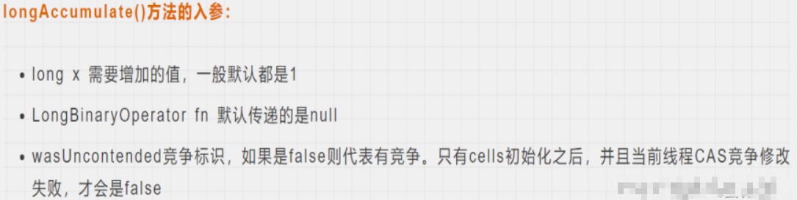
- Striped64中一些变量或者方法的定义
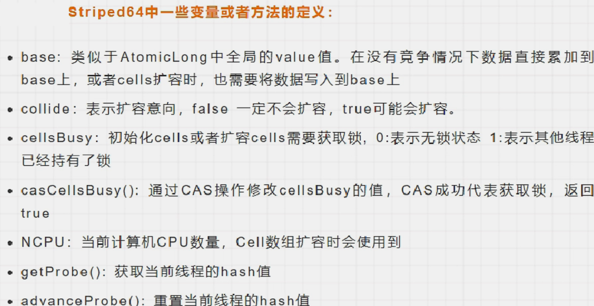
- 步骤
- 我们先讲这个 `(a = as[getProbe() & m])` 里的probe，这里其实拿了hash值，通过hash值知道我们去到哪个cell槽

```java
static final int getProbe() {
        return UNSAFE.getInt(Thread.currentThread(), PROBE);
    }

//其实就是得到了线程的Hash值
```
所以最前面的这一段就像是新员工入职获取工号（hash值）一样

- 总纲


上述代码首先给当前线程分配一个hash值，然后进入一个for(;;)自旋，这个自旋分为三个分支：
- CASE1：Cell[]数组已经初始化
- CASE2：Cell[]数组未初始化(首次新建)
- CASE3：Cell[]数组正在初始化中

计算
①刚刚要初始化Cell[]数组（首次新建）

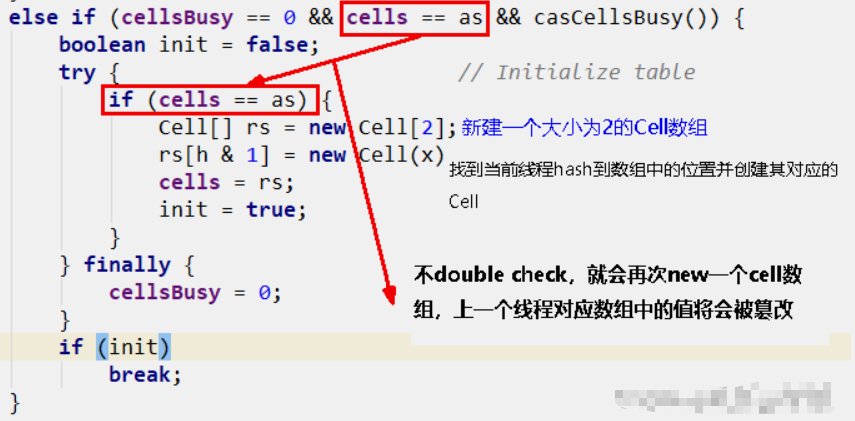
如果上面条件都执行成功就会执行数组的初始化及赋值操作， `Cell[] rs = new Cell[2]`表示数组的长度为2，
`rs[h & 1] = new Cell(x)` 表示创建一个新的Cell元素，value是x值，默认为1。
h & 1类似于我们之前HashMap常用到的计算散列桶index的算法，通常都是hash & (table.len - 1)。同hashmap一个意思。

②兜底

多个线程尝试CAS修改失败的线程会走到这个分支
```java
//排在最后面的
else if (casBase(v = base, ((fn == null) ? v + x :
                                        fn.applyAsLong(v, x))))
//该分支实现直接操作base基数，将值累加到base上，也即其它线程正在初始化，多个线程正在更新base的值。
```
③Cell数组不再为空且可能存在Cell数组扩容

多个线程同时命中一个cell的竞争,这个是最复杂的部分
(1)

上面代码判断当前线程hash后指向的数据位置元素是否为空，
如果为空则将Cell数据放入数组中，跳出循环。
如果不空则继续循环。
(2)
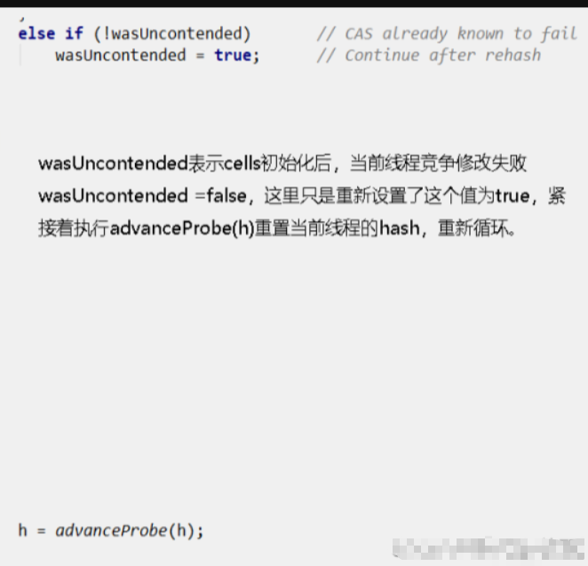
(3)
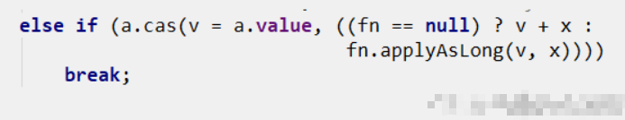
说明当前线程对应的数组中有了数据，也重置过hash值，
这时通过CAS操作尝试对当前数中的value值进行累加x操作，x默认为1，如果CAS成功则直接跳出循环。
(4)
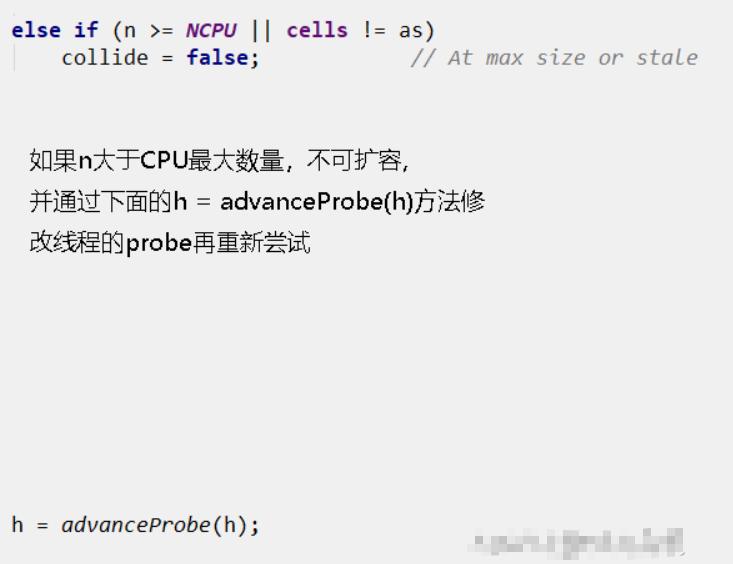
(5)

(6)
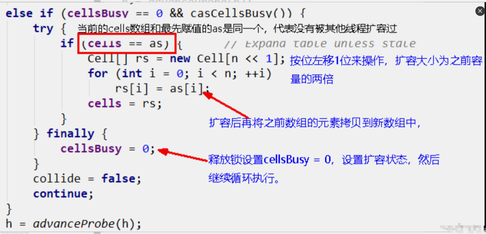
以上六步总结

3-sum

```java
//LongAdder.java
public long sum() {
        Cell[] as = cells; Cell a;
        long sum = base;
        if (as != null) {
            for (int i = 0; i < as.length; ++i) {
                if ((a = as[i]) != null)
                    sum += a.value;
            }
        }
        return sum;
    }
```
sum()会将所有Cell数组中的value和base **累加** 作为返回值。
核心的思想就是将之前AtomicLong一个value的更新压力分散到多个value中去，从而降级更新热点 。
> 为啥在并发情况下sum的值不精确？

sum执行时，并没有限制对base和cells的更新(一句要命的话)。所以LongAdder **不是强一致性**的，它是 **最终一致性** 的。

首先，最终返回的sum局部变量，初始被复制为base，而最终返回时，很可能base已经被更新了 ，而此时局部变量sum不会更新，造成不一致。
其次，这里对cell的读取也无法保证是最后一次写入的值。所以，sum方法在没有并发的情况下，可以获得正确的结果。

#### 使用总结
- AtomicLong
  - 线程安全，可允许一些性能损耗，要求高精度时可使用
  - 保证精度，性能代价
  - AtomicLong是多个线程针对单个热点值value进行原子操作
- LongAdder
  - 当需要在高并发下有较好的性能表现，且对值的精确度要求不高时，可以使用
  - 保证性能，精度代价
  - LongAdder是每个线程拥有自己的槽，各个线程一般只对自己槽中的那个值进行CAS操作

### 4）小总结
#### AtomicLong
**原理**  
CAS+自旋

incrementAndGet

**场景**  
低并发下的全局计算

AtomicLong能保证并发情况下计数的准确性，其内部通过CAS来解决并发安全性的问题

**缺陷**  
高并发后性能急剧下降

> why?AtomicLong的自旋会称为瓶颈（N个线程CAS操作修改线程的值，每次只有一个成功过，其它N - 1失败，失败的不停的自旋直到成功，这样大量失败自旋的情况，一下子cpu就打高了。）

#### LongAdder
**原理**  
CAS+Base+Cell数组分散

空间换时间并分散了热点数据

**场景**  
高并发的全局计算  

**缺陷**  
sum求和后还有计算线程修改结果的话，最后结果不够准确