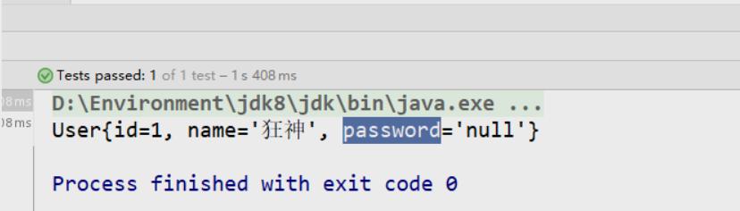
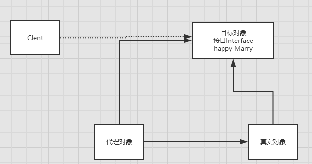
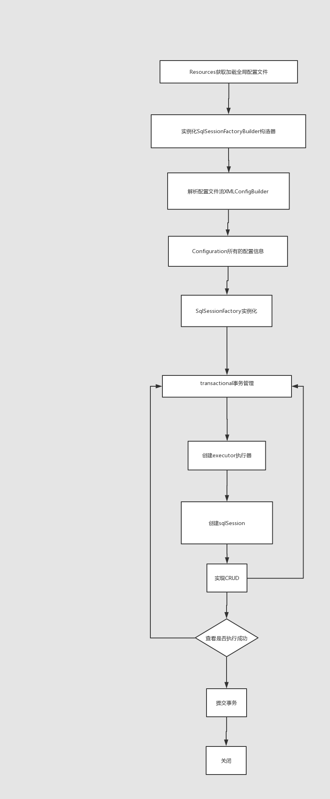

## 1：crud

### 1）namespace
> namespace中的包名要和 Dao/mapper 接口的包名一致！

### 2）select
选择，查询语句;

- id : 就是对应的namespace中的方法名；
- resultType：Sql语句执行的返回值！
- parameterType ： 参数类型！

1:编写接口
```java
//根据ID查询用户
User getUserById(int id);
```
2:编写对应的mapper中的sql语句
```xml
<select id="getUserById" parameterType="int" resultType="com.oddfar.pojo.User">
        select * from mybatis.user where id = #{id}
</select>
```
3:测试
```java
@Test
public void getUserById() {
    SqlSession sqlSession = MybatisUtils.getSqlSession();

    UserMapper mapper = sqlSession.getMapper(UserMapper.class);

    User user = mapper.getUserById(1);
    System.out.println(user);

    sqlSession.close();
}
```

### 3）Insert
```xml
<!--对象中的属性，可以直接取出来-->
<insert id="addUser" parameterType="com.oddfar.pojo.User">
    insert into mybatis.user (id, name, pwd) values (#{id},#{name},#{pwd});
</insert>
```
```java
@Test
public void addUser() {
    SqlSession sqlSession = MybatisUtils.getSqlSession();

    UserMapper mapper = sqlSession.getMapper(UserMapper.class);
    int res = mapper.addUser(new User(4, "zhiyuan", "212313"));
    if (res > 0) {
        //提交事务
        sqlSession.commit();
        System.out.println("添加成功");
    }
    sqlSession.close();
}
```
### 4）update
```xml
<update id="updateUser" parameterType="com.oddfar.pojo.User">
    update mybatis.user set name=#{name},pwd=#{pwd}  where id = #{id} ;
</update>
```
### 5）Delete
```xml
<delete id="deleteUser" parameterType="int">
    delete from mybatis.user where id = #{id};
</delete>
```
### 6）分析错误
- 标签不要匹配错
- `resource` 绑定 `mapper`，需要使用路径！
- 程序配置文件必须符合规范！
- `NullPointerException`，没有注册到资源!
- 输出的xml文件中存在中文乱码问题！
- maven资源没有导出问题！
### 7）万能Map
假设，我们的实体类，或者数据库中的表，字段或者参数过多，我们应当考虑使用Map！

```java
//万能的Map
int addUser2(Map<String,Object> map);
```
```xml
<!--    用map集合的方式插入-->
<insert id="addUser2" parameterType="map">
    insert into mybatis.user (id,name,pwd) values (#{userid},#{username},#{passWord});
</insert>
```
```java
/**
 * 用map的形式插入数据
 */
@Test
public void addUser2() {
    SqlSession sqlSession = MybatisUtils.getSqlSession();

    UserMapper mapper = sqlSession.getMapper(UserMapper.class);
    Map<String,Object> map = new HashMap<String, Object>();
    map.put("userid",5);
    map.put("passWord","2222333");
    map.put("username","map");

    int res = mapper.addUser2(map);
    if (res > 0) {
        //提交事务
        sqlSession.commit();
        System.out.println("添加成功");
    }
    sqlSession.close();
}
```
Map传递参数，直接在sql中取出key即可！ 【parameterType="map"】

对象传递参数，直接在sql中取对象的属性即可！【parameterType="Object"】

只有一个基本类型参数的情况下，可以直接在sql中取到！

多个参数用Map，或者注解！
### 8）思考题
模糊查询怎么写？  

有两种方式
- Java代码执行的时候，传递通配符 % %
```java
List<User> userList = mapper.getUserLike("%李%");
```
这是我们指定查询"%李%"，如果放个参数获取，这种方式则不能避免sql注入问题

- 在sql拼接中使用通配符！
```sql
select * from mybatis.user where name like "%"#{value}"%"
```
推荐使用这种方法


## 2：配置解析
### 1）类型别名（typeAliases）
类型别名是为 Java 类型设置一个短的名字。  
存在的意义仅在于用来减少类完全限定名的冗余。
```xml
<!--可以给实体类起别名-->
<typeAliases>
    <typeAlias type="com.oddfar.pojo.User" alias="User"/>
</typeAliases>
```
也可以指定一个包名，MyBatis 会在包名下面搜索需要的 Java Bean，比如：

扫描实体类的包，它的默认别名就为这个类的类名，首字母小写！
```xml
<!--可以给实体类起别名-->
<typeAliases>
    <package name="com.oddfar.pojo"/>
</typeAliases>
```
在实体类比较少的时候，使用第一种方式。

如果实体类十分多，建议使用第二种。

第一种可以自定义别名，第二种则不行（别名为文件名），如果非要改，需要在实体上增加注解
```java
@Alias("user")
public class User {}
```
## 3：属性名和字段名配置

### 1）问题
id   name   pwd  
id   name   password  
编写sql，测试出现问题  

解决方法有两种，一种起别名，一种resultMap（结果集映射）  
- 起别名
```xml
<select id="getUserById" resultType="com.kuang.pojo.User">
    select id,name,pwd as password from mybatis.user where id = #{id}
</select>
```
### 2）resultMap
结果集映射

```xml
<!--结果集映射-->
<resultMap id="UserMap" type="User">
    <!--column数据库中的字段，property实体类中的属性-->
    <result column="id" property="id"/>
    <result column="name" property="name"/>
    <result column="pwd" property="password"/>
</resultMap>

<select id="getUserById" resultMap="UserMap">
    select * from mybatis.user where id = #{id}
</select>
```

- `resultMap` 元素是 `MyBatis` 中最重要最强大的元素
- `ResultMap` 的设计思想是，对于简单的语句根本不需要配置显式的结果映射，而对于复杂一点的语句只需要描述它们的关系就行了。
- `ResultMap` 最优秀的地方在于，虽然你已经对它相当了解了，但是根本就不需要显式地用到他们。
- 如果世界总是这么简单就好了。
## 4：使用注解开发

### 1）使用注解开发
注解在接口上实现

```java
@Select("select * from user")
List<User> getUsers();
```
需要再核心配置文件中绑定接口！

```xml
<!--绑定接口-->
<mappers>
    <mapper class="com.kuang.dao.UserMapper"/>
</mappers>
```
本质：反射机制实现  

底层：动态代理！  

Mybatis详细的执行流程！


### 2）CRUD
我们可以在工具类创建的时候实现自动提交事务！

```java
public static SqlSession  getSqlSession(){
    return sqlSessionFactory.openSession(true);
}
```
编写接口，增加注解

```java
public interface UserMapper {

    @Select("select * from user")
    List<User> getUsers();

    // 方法存在多个参数，所有的参数前面必须加上 @Param("id")注解
    @Select("select * from user where id = #{id}")
    User getUserByID(@Param("id") int id);


    @Insert("insert into user(id,name,pwd) values (#{id},#{name},#{password})")
    int addUser(User user);

    
    @Update("update user set name=#{name},pwd=#{password} where id = #{id}")
    int updateUser(User user);

    
    @Delete("delete from user where id = #{uid}")
    int deleteUser(@Param("uid") int id);
}
```
关于 `@Param()` 注解

- 基本类型的参数或者String类型，需要加上
- 引用类型不需要加
- 如果只有一个基本类型的话，可以忽略，但是建议大家都加上！
- 我们在SQL中引用的就是我们这里的 @Param() 中设定的属性名！

## 5：动态 SQL
### 1）IF
```xml
<select id="queryBlogIF" parameterType="map" resultType="blog">
    select * from mybatis.blog where 1=1
    <if test="title != null">
        and title = #{title}
    </if>
    <if test="author != null">
        and author = #{author}
    </if>
</select>
```
```java
@Test
public void queryBlogIF() {
    SqlSession sqlSession = MybatisUtils.getSqlSession();
    BlogMapper mapper = sqlSession.getMapper(BlogMapper.class);
    HashMap map = new HashMap();
//        map.put("title","Mybatis如此简单");
    map.put("author","狂神说");
    List<Blog> blogList = mapper.queryBlogIF(map);
    for (Blog blog : blogList) {
        System.out.println(blog);
    }

    sqlSession.close();
}
```
### 2）choose (when, otherwise)
类似于java里的switch

```xml
<select id="queryBlogChoose" parameterType="map" resultType="blog">
    select * from mybatis.blog
    <where>
        <choose>
            <when test="title != null">
                title = #{title}
            </when>
            <when test="author != null">
                and author = #{author}
            </when>
            <otherwise>
                and views = #{views}
            </otherwise>
        </choose>
    </where>
</select>
```
```java
@Test
public void queryBlogChoose(){
    SqlSession sqlSession = MybatisUtils.getSqlSession();
    BlogMapper mapper = sqlSession.getMapper(BlogMapper.class);
    HashMap map = new HashMap();
    map.put("title","Mybatis如此简单2");
//        map.put("author","狂神说");
    map.put("id","5d3adbfea47b4493bc086cf8dbb8998a");
     mapper.updateBlog(map);

    sqlSession.close();
}
```
### 3）trim (where,set)
```xml
select * from mybatis.blog
<where>
    <if test="title != null">
        title = #{title}
    </if>
    <if test="author != null">
        and author = #{author}
    </if>
</where>
```
```xml
<update id="updateBlog" parameterType="map">
    update mybatis.blog
    <set>
        <if test="title != null">
            title = #{title},
        </if>
        <if test="author != null">
            author = #{author}
        </if>
    </set>
    where id = #{id}
</update>
```
```java
@Test
public void updateBlog(){
    SqlSession sqlSession = MybatisUtils.getSqlSession();
    BlogMapper mapper = sqlSession.getMapper(BlogMapper.class);
    HashMap map = new HashMap();
//        map.put("title","Mybatis如此简单");
//        map.put("author","狂神说");
    List<Blog> blogList = mapper.queryBlogChoose(map);
    for (Blog blog : blogList) {
        System.out.println(blog);
    }
    sqlSession.close();
}
```
所谓的动态SQL，本质还是SQL语句 ， 只是我们可以在SQL层面，去执行一个逻辑代码

if

where ， set ， choose ，when

### 4）SQL片段
有的时候，我们可能会将一些功能的部分抽取出来，方便复用！

1:使用SQL标签抽取公共的部分
```xml
<sql id="if-title-author">
    <if test="title != null">
        title = #{title}
    </if>
    <if test="author != null">
        and author = #{author}
    </if>
</sql>
```
2:在需要使用的地方使用Include标签引用即可

```xml
<select id="queryBlogIF" parameterType="map" resultType="blog">
    select * from mybatis.blog
    <where>
        <include refid="if-title-author"></include>
    </where>
</select>
```
注意事项：

- 最好基于单表来定义SQL片段！
- 不要存在where标签
### 5）Foreach

```xml
select * from user where 1=1 and 

  <foreach item="id" collection="ids"
      open="(" separator="or" close=")">
        #{id}
  </foreach>

(id=1 or id=2 or id=3)
```

```xml
<!--
        select * from mybatis.blog where 1=1 and (id=1 or id = 2 or id=3)

        我们现在传递一个万能的map ， 这map中可以存在一个集合！
-->
<select id="queryBlogForeach" parameterType="map" resultType="blog">
    select * from mybatis.blog

    <where>
        <foreach collection="ids" item="id" open="and (" close=")" separator="or">
            id = #{id}
        </foreach>
    </where>

</select>
```
最后sql为： `select * from mybatis.blog WHERE ( id = ? or id = ? or id = ? )`
```java
@Test
public void queryBlogForeach(){
    SqlSession sqlSession = MybatisUtils.getSqlSession();
    BlogMapper mapper = sqlSession.getMapper(BlogMapper.class);
    HashMap map = new HashMap();

    ArrayList<String> ids = new ArrayList<String>();
    ids.add("d97ca9c234df463e950f252d22fb5f85");
    ids.add("4cfe16fcebb145f894b6ec9033f8ae33");
    ids.add("5d3adbfea47b4493bc086cf8dbb8998a");

    map.put("ids",ids);

    List<Blog> blogList = mapper.queryBlogForeach(map);
    for (Blog blog : blogList) {
        System.out.println(blog);
    }
    sqlSession.close();
}
```
动态SQL就是在拼接SQL语句，我们只要保证SQL的正确性，按照SQL的格式，去排列组合就可以了

建议：

- 现在Mysql中写出完整的SQL,再对应的去修改成为我们的动态SQL实现通用即可！

