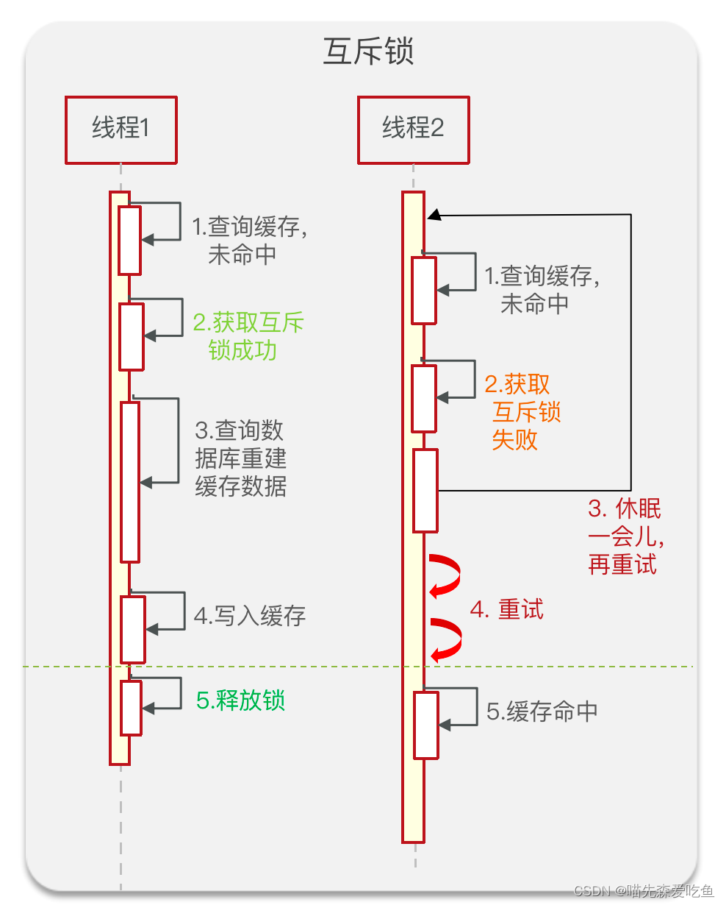
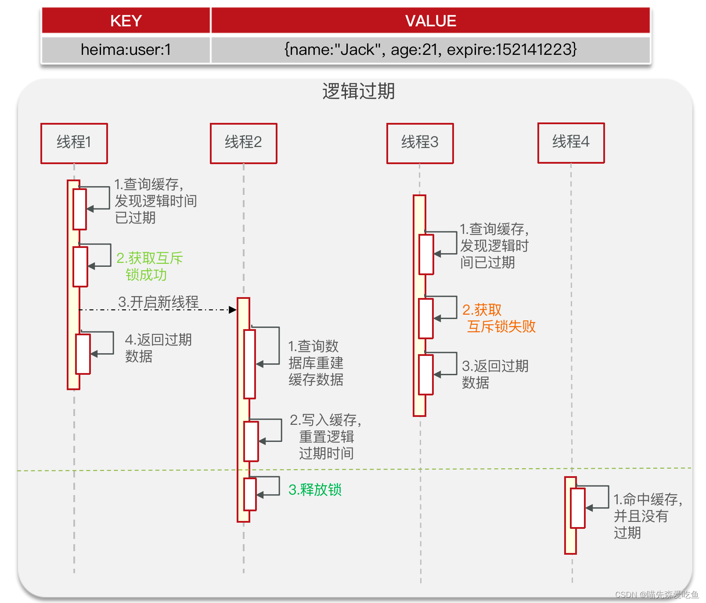
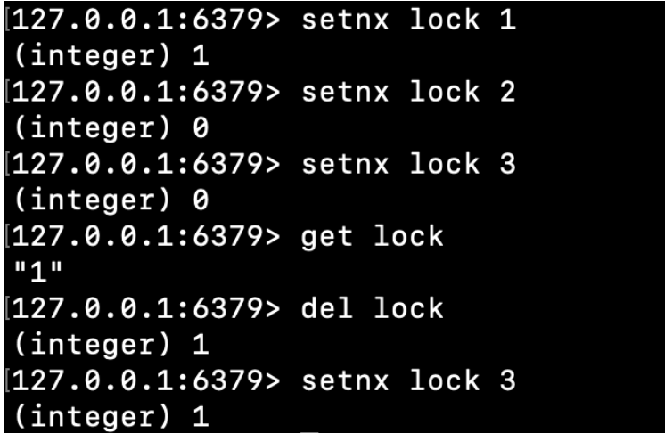
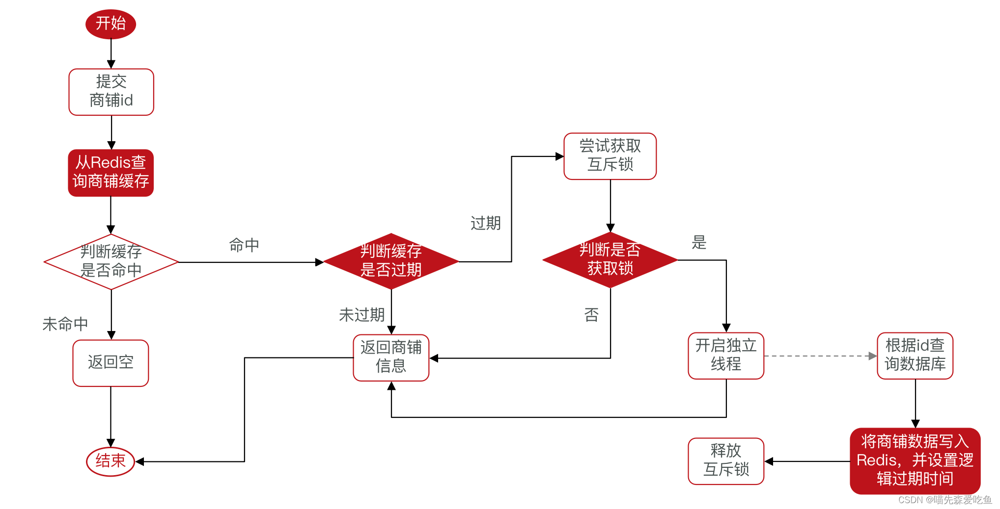

# 1：解决缓存击穿问题。

## 1：原因。

```
 缓存击穿问题也叫热点 key 问题，就是一个被高并发访问并且缓存重建业务较复杂的 key 突然失效了，
 无效的请求访问会在瞬间给数据库带来巨大压力。
```
## 2：常见的解决方案：

### 1:互斥锁

```
1:互斥锁
假设线程 1 查询缓存未命中，那么线程 1 就需要进行缓存重建工作，为了避免其他线程重复线程1 的工作，
那么线程 1 就必须要先获取互斥锁，只有获取锁成功的线程才能够重建缓存数据。
重建完成后，线程 1 就会将数据写入到缓存中，并将锁释放。
如果在线程 1 将数据写入缓存之前，其他线程涌入，这个时候，其他线程查询缓存依然是未命中的，
那么这些线程为了重建缓存，也必须先获取到互斥锁，
但是，由于此时线程 1 未释放锁，所以其他线程就会获取锁失败，一旦获取锁失败，
一般程序处理是让线程休眠一会儿，然后再重试（包括查询缓存以及获取互斥锁），
如果线程 1 执行缓存重建时间过长，就会导致其他线程一直处于阻塞等待重试的状态，效率过低。
```



### 2:逻辑过期

```
2:逻辑过期
当我们在向 Redis 中存储数据时，不再为 key 设置过期时间（TTL），但是，需要在 value 中额外添加一个逻辑时间（以当前时间为基础，加上需要设置的过期时间），也就是说，这个 key 一旦存入到 Redis 中，就会永不过期。假设线程 1 在查询缓存时发现逻辑时间已经过期，为了避免出现多个线程重建缓存，线程 1 就会去获取互斥锁，一旦线程 1 获取互斥锁成功，线程 1 就会开启一个独立线程，由独立线程去查询数据库重建缓存数据，以及写入缓存重置逻辑过期时间等操作，一旦完成操作，独立线程就会将互斥锁释放掉。线程 1 在开启独立线程后，会直接将过期数据返回。而在独立线程释放锁之前，缓存中的数据都是过期数据。当其他线程在此之前涌入程序时，去查询缓存获取到依旧是逻辑时间过期的数据，那么这些线程就会试图获取互斥锁，此时由于独立线程还未释放锁，所以会获取锁失败，一旦失败，这些线程就会将查询到的旧数据返回。只有当独立线程执行结束，其他线程才会从缓存中获取到新数据。
```



### 3:两种方案对比：


## 3：案例分析

### 1：基于互斥锁方式解决缓存击穿问题

需求：修改根据 id 查询商铺的业务，基于互斥锁方式来解决缓存击穿问题。业务流程如下：


我们使用 SETNX 命令来实现互斥锁。
SETNX 只有在 key 不存在的时候才能存储成功，并且返回；如果 Redis 中存在要设置的 key，则存储不成功，并且返回 0。



当有多个线程同时获取互斥锁时，根据 SETNX 的特性，那么只会有其中一个线程 SETNX 成功，其他线程在 SETNX 时，只能返回 0，而释放锁也很简单，只需要删除 key 即可。但是，这种方案会存在一个问题，当线程获取到互斥锁后，由于程序出现问题，导致锁迟迟无法释放，所以我们在获取互斥锁时，即在执行 SETNX 命令时，往往会添加上一个有效期，一般有效期时长会是业务程序执行时间10~20倍，避免异常情况。

#### 1：代码实现

```java
public class RedisConstants {
    public static final String LOGIN_CODE_KEY = "login:code:";
    public static final Long LOGIN_CODE_TTL = 2L;
    public static final String LOGIN_USER_KEY = "login:token:";
    public static final Long LOGIN_USER_TTL = 36000L;

    public static final Long CACHE_NULL_TTL = 2L;

    public static final Long CACHE_SHOP_TTL = 30L;
    public static final String CACHE_SHOP_KEY = "cache:shop:";

    public static final String LOCK_SHOP_KEY = "lock:shop:";
    public static final Long LOCK_SHOP_TTL = 10L;

    public static final String SECKILL_STOCK_KEY = "seckill:stock:";
    public static final String BLOG_LIKED_KEY = "blog:liked:";
    public static final String FEED_KEY = "feed:";
    public static final String SHOP_GEO_KEY = "shop:geo:";
    public static final String USER_SIGN_KEY = "sign:";
}

```


```java
@Service
public class ShopServiceImpl extends ServiceImpl<ShopMapper, Shop> implements IShopService {

    @Autowired
    private StringRedisTemplate stringRedisTemplate;

    @Override
    public Result queryById(Long id) {
        // 解决缓存穿透
//        Shop shop = queryWithPassThrough(id);

        // 互斥锁解决缓存击穿
        Shop shop = queryWithMetux(id);

        if(shop == null){
            return Result.fail("店铺不存在！");
        }

        // 7、返回
        return Result.ok(shop);
    }

    /**
     * 解决缓存击穿问题
     * */
    public Shop queryWithMetux(Long id){
        // 1、根据 Id 查询 Redis
        String shopJson = stringRedisTemplate.opsForValue().get(RedisConstants.CACHE_SHOP_KEY + id);
        // 2、判断 shopJSON 是否为空
        if (StrUtil.isNotBlank(shopJson)) {
            // 3、存在，直接返回
            Shop shop = JSONUtil.toBean(shopJson, Shop.class);
            return shop;
        }

        // 增加对空字符串的判断
        if(shopJson != null){
            return null;
        }

        // 获取互斥锁
        String lockKey = RedisConstants.LOCK_SHOP_KEY + id;
        Shop shop = null;
        try {
        	// 获取互斥锁
            boolean isLock = tryLock(lockKey);
            // 如果获取失败，则重新获取
            if (!isLock) {
                Thread.sleep(30);
                return queryWithMetux(id);
            }

            // 4、不存在，查询数据库
            shop = getById(id);

            // 5、不存在，返回错误
            if (shop == null) {
                // 店铺不存在时，缓存空值
                stringRedisTemplate.opsForValue().set(RedisConstants.CACHE_SHOP_KEY + id, "", RedisConstants.CACHE_NULL_TTL, TimeUnit.MINUTES);
                return null;
            }

            // 6、存在，写入 Redis
            stringRedisTemplate.opsForValue().set(RedisConstants.CACHE_SHOP_KEY + id, JSONUtil.toJsonStr(shop), RedisConstants.CACHE_SHOP_TTL, TimeUnit.MINUTES);
        }catch (InterruptedException e){
            throw new RuntimeException(e);
        } finally {
            // 释放互斥锁
            unLock(lockKey);
        }

        return shop;
    }

    /**
     * 解决缓存穿透
     * */
    public Shop queryWithPassThrough(Long id){
        // 1、根据 Id 查询 Redis
        String shopJson = stringRedisTemplate.opsForValue().get(RedisConstants.CACHE_SHOP_KEY + id);
        // 2、判断 shopJSON 是否为空
        if (StrUtil.isNotBlank(shopJson)) {
            // 3、存在，直接返回
            Shop shop = JSONUtil.toBean(shopJson, Shop.class);
            return shop;
        }

        // 增加对空字符串的判断
        if(shopJson != null){
            return null;
        }

        // 4、不存在，查询数据库
        Shop shop = getById(id);

        // 5、不存在，返回错误
        if(shop == null){
            // 店铺不存在时，缓存空值
            stringRedisTemplate.opsForValue().set(RedisConstants.CACHE_SHOP_KEY + id, "", RedisConstants.CACHE_NULL_TTL, TimeUnit.MINUTES);
            return null;
        }

        // 6、存在，写入 Redis
        stringRedisTemplate.opsForValue().set(RedisConstants.CACHE_SHOP_KEY + id, JSONUtil.toJsonStr(shop), RedisConstants.CACHE_SHOP_TTL, TimeUnit.MINUTES);
        return shop;
    }

    // 获取锁(根据setnx来实现)
    private boolean tryLock(String key){
        Boolean isTrue = stringRedisTemplate.opsForValue().setIfAbsent(key, "1", RedisConstants.LOCK_SHOP_TTL, TimeUnit.SECONDS);
        return BooleanUtil.isTrue(isTrue);
    }

    // 释放锁
    private void unLock(String key){
        stringRedisTemplate.delete(key);
    }

    @Override
    @Transactional
    public Result update(Shop shop) {

        Long id = shop.getId();
        if(id == null){
            return Result.fail("店铺 id 不能为空！");
        }
        updateById(shop);
        stringRedisTemplate.delete(RedisConstants.CACHE_SHOP_KEY + id);

        return Result.ok();
    }
}


```

### 2：基于逻辑过期方式解决缓存击穿问题

需求：修改根据id查询商铺的业务，基于逻辑过期方式来解决缓存击穿问题

理论上来讲，一旦热点 key 添加 Redis 中，key 就不会过期，就会永久存在，只有活动结束才会将热点 key 从缓存中删除。一般而言，热点 key 通常是参加活动的商品或者其他一些东西，这些数据会提前加入缓存，并设置逻辑过期时间，所以说，这些热点 key 理论上是一直存在的，直至活动结束删除。因此，当我们查询热点 key 时不用判断有没有命中，如果说缓存未命中，说明这个商品不在活动当中，不属于热点 key。
综上，在程序设计时，针对热点 key 可以不用进行缓存穿透的处理。



创建 RedisData，用于保存热点店铺以及设置过期时间，当然也可以使用继承方式

```java
@Data
public class RedisData {
    private LocalDateTime expireTime;
    private Object data;
}

```

```java
@Service
public class ShopServiceImpl extends ServiceImpl<ShopMapper, Shop> implements IShopService {

    @Autowired
    private StringRedisTemplate stringRedisTemplate;

    private static final ExecutorService CACHE_REBUILD_EXECUTOR = Executors.newFixedThreadPool(10);

    @Override
    public Result queryById(Long id) {
        // 解决缓存穿透
//        Shop shop = queryWithPassThrough(id);

        // 互斥锁解决缓存击穿
//        Shop shop = queryWithMetux(id);
        Shop shop = queryWithLogicalExpire(id);

        if(shop == null){
            return Result.fail("店铺不存在！");
        }

        // 7、返回
        return Result.ok(shop);
    }

    public Shop queryWithLogicalExpire(Long id){
        // 1、根据 Id 查询 Redis
        String shopJson = stringRedisTemplate.opsForValue().get(RedisConstants.CACHE_SHOP_KEY + id);
        // 2、判断 shopJSON 是否为空
        if (StrUtil.isBlank(shopJson)) {
            // 3、存在，直接返回
            return null;
        }

        // 命中，需要先把 json 反序列化为对象
        RedisData redisData = JSONUtil.toBean(shopJson, RedisData.class);
        LocalDateTime expireTime = redisData.getExpireTime();
        Shop shop = JSONUtil.toBean((JSONObject) redisData.getData(), Shop.class);

        // 判断是否过期
        if(expireTime.isAfter(LocalDateTime.now())){
            return shop;
        }

        // 已过期，需要缓存重建
        // 获取互斥锁
        String lockKey = RedisConstants.LOCK_SHOP_KEY + id;

        boolean isLock = tryLock(lockKey);
        if (isLock) {
            // 开辟独立线程
            CACHE_REBUILD_EXECUTOR.submit(() -> {
                    try {
                        // 缓存重建
                        this.saveShop2Redis(id, 20L);
                    }catch (Exception e) {
                        throw new RuntimeException(e);
                    } finally {
                        unLock(lockKey);
                    }
            });
        }

        // 6、存在，写入 Redis
        stringRedisTemplate.opsForValue().set(RedisConstants.CACHE_SHOP_KEY + id, JSONUtil.toJsonStr(shop), RedisConstants.CACHE_SHOP_TTL, TimeUnit.MINUTES);

        return shop;
    }

    /**
     * 解决缓存击穿问题
     * */
    public Shop queryWithMetux(Long id){
        // 1、根据 Id 查询 Redis
        String shopJson = stringRedisTemplate.opsForValue().get(RedisConstants.CACHE_SHOP_KEY + id);
        // 2、判断 shopJSON 是否为空
        if (StrUtil.isNotBlank(shopJson)) {
            // 3、存在，直接返回
            Shop shop = JSONUtil.toBean(shopJson, Shop.class);
            return shop;
        }

        // 增加对空字符串的判断
        if(shopJson != null){
            return null;
        }

        // 获取互斥锁
        String lockKey = RedisConstants.LOCK_SHOP_KEY + id;
        Shop shop = null;
        try {
            boolean isLock = tryLock(lockKey);
            if (!isLock) {
                Thread.sleep(30);
                return queryWithMetux(id);
            }


            // 4、不存在，查询数据库
            shop = getById(id);

            // 5、不存在，返回错误
            if (shop == null) {
                // 店铺不存在时，缓存空值
                stringRedisTemplate.opsForValue().set(RedisConstants.CACHE_SHOP_KEY + id, "", RedisConstants.CACHE_NULL_TTL, TimeUnit.MINUTES);
                return null;
            }

            // 6、存在，写入 Redis
            stringRedisTemplate.opsForValue().set(RedisConstants.CACHE_SHOP_KEY + id, JSONUtil.toJsonStr(shop), RedisConstants.CACHE_SHOP_TTL, TimeUnit.MINUTES);
        }catch (InterruptedException e){
            throw new RuntimeException(e);
        } finally {
            // 释放互斥锁
            unLock(lockKey);
        }

        return shop;
    }

    /**
     * 解决缓存穿透
     * */
    public Shop queryWithPassThrough(Long id){
        // 1、根据 Id 查询 Redis
        String shopJson = stringRedisTemplate.opsForValue().get(RedisConstants.CACHE_SHOP_KEY + id);
        // 2、判断 shopJSON 是否为空
        if (StrUtil.isNotBlank(shopJson)) {
            // 3、存在，直接返回
            Shop shop = JSONUtil.toBean(shopJson, Shop.class);
            return shop;
        }

        // 增加对空字符串的判断
        if(shopJson != null){
            return null;
        }

        // 4、不存在，查询数据库
        Shop shop = getById(id);

        // 5、不存在，返回错误
        if(shop == null){
            // 店铺不存在时，缓存空值
            stringRedisTemplate.opsForValue().set(RedisConstants.CACHE_SHOP_KEY + id, "", RedisConstants.CACHE_NULL_TTL, TimeUnit.MINUTES);
            return null;
        }

        // 6、存在，写入 Redis
        stringRedisTemplate.opsForValue().set(RedisConstants.CACHE_SHOP_KEY + id, JSONUtil.toJsonStr(shop), RedisConstants.CACHE_SHOP_TTL, TimeUnit.MINUTES);
        return shop;
    }

    // 获取锁
    private boolean tryLock(String key){
        Boolean isTrue = stringRedisTemplate.opsForValue().setIfAbsent(key, "1", RedisConstants.LOCK_SHOP_TTL, TimeUnit.SECONDS);
        return BooleanUtil.isTrue(isTrue);
    }

    // 释放锁
    private void unLock(String key){
        stringRedisTemplate.delete(key);
    }

    public void saveShop2Redis(Long id, Long expireSeconds) throws InterruptedException {
        // 查询数据库
        Shop shop = getById(id);
        Thread.sleep(200);
        // 封装缓存过期时间
        RedisData redisData = new RedisData();
        redisData.setData(shop);
        redisData.setExpireTime(LocalDateTime.now().plusSeconds(expireSeconds));
        stringRedisTemplate.opsForValue().set(RedisConstants.CACHE_SHOP_KEY, JSONUtil.toJsonStr(redisData));
    }

    @Override
    @Transactional
    public Result update(Shop shop) {

        Long id = shop.getId();
        if(id == null){
            return Result.fail("店铺 id 不能为空！");
        }
        updateById(shop);
        stringRedisTemplate.delete(RedisConstants.CACHE_SHOP_KEY + id);

        return Result.ok();
    }
}


```

# 2： Redis 工具类

 R queryWithPassThrough(String keyPrefix, ID id, Class<R> type, Function<ID, R> dbFallback, Long time, TimeUnit unit){
        String key = keyPrefix + id;
        // 1、根据 Id 查询 Redis
        String json = stringRedisTemplate.opsForValue().get(RedisConstants.CACHE_SHOP_KEY + id);
        // 2、判断 shopJSON 是否为空
        if (StrUtil.isNotBlank(json)) {
            // 3、存在，直接返回
            R r = JSONUtil.toBean(json, type);
            return r;
        }

        // 增加对空字符串的判断
        if(json != null){
            return null;
        }

        // 4、不存在，查询数据库
        R r = dbFallback.apply(id);

        // 5、不存在，返回错误
        if(r == null){
            // 店铺不存在时，缓存空值
            stringRedisTemplate.opsForValue().set(RedisConstants.CACHE_SHOP_KEY + id, "", RedisConstants.CACHE_NULL_TTL, TimeUnit.MINUTES);
            return null;
        }

        // 6、存在，写入 Redis
        this.set(key, r, time, unit);
        return r;
    }


    public <R, ID> R queryWithLogicalExpire(String keyPrefix, ID id,Class<R> type, Function<ID, R> dbFallback, Long time, TimeUnit unit){
        String key = keyPrefix + id;
        // 1、根据 Id 查询 Redis
        String json = stringRedisTemplate.opsForValue().get(key);
        // 2、判断 shopJSON 是否为空
        if (StrUtil.isBlank(json)) {
            // 3、存在，直接返回
            return null;
        }

        // 命中，需要先把 json 反序列化为对象
        RedisData redisData = JSONUtil.toBean(json, RedisData.class);
        LocalDateTime expireTime = redisData.getExpireTime();
        R r = JSONUtil.toBean((JSONObject) redisData.getData(), type);

        // 判断是否过期
        if(expireTime.isAfter(LocalDateTime.now())){
            return r;
        }

        // 已过期，需要缓存重建
        // 获取互斥锁
        String lockKey = RedisConstants.LOCK_SHOP_KEY + id;

        boolean isLock = tryLock(lockKey);
        if (isLock) {
            // 开辟独立线程
            CACHE_REBUILD_EXECUTOR.submit(() -> {
                try {
                    // 缓存重建
                    R r1 = dbFallback.apply(id);
                    this.setWithLogicalExpire(key, r1, time, unit);
                }catch (Exception e) {
                    throw new RuntimeException(e);
                } finally {
                    unLock(lockKey);
                }
            });
        }

        // 6、存在，写入 Redis
        this.set(key, r, time, unit);
        return r;
    }


    // 获取锁
    private boolean tryLock(String key){
        Boolean isTrue = stringRedisTemplate.opsForValue().setIfAbsent(key, "1", RedisConstants.LOCK_SHOP_TTL, TimeUnit.SECONDS);
        return BooleanUtil.isTrue(isTrue);
    }

    // 释放锁
    private void unLock(String key){
        stringRedisTemplate.delete(key);
    }


}


```

ShopServiceImpl

```java
@Service
public class ShopServiceImpl extends ServiceImpl<ShopMapper, Shop> implements IShopService {

    @Autowired
    private StringRedisTemplate stringRedisTemplate;

    @Autowired
    private CacheClient cacheClient;

    private static final ExecutorService CACHE_REBUILD_EXECUTOR = Executors.newFixedThreadPool(10);

    @Override
    public Result queryById(Long id) {
        // 解决缓存穿透
//        Shop shop = cacheClient.queryWithPassThrough(CACHE_SHOP_KEY, id, Shop.class, this::getById, RedisConstants.CACHE_SHOP_TTL, TimeUnit.MINUTES);

        // 互斥锁解决缓存击穿
//        Shop shop = queryWithMetux(id);

        // 使用逻辑过期时间解决缓存击穿问题
//        Shop shop = queryWithLogicalExpire(id);
        Shop shop = cacheClient.queryWithLogicalExpire(CACHE_SHOP_KEY, id, Shop.class, this::getById, RedisConstants.CACHE_SHOP_TTL, TimeUnit.MINUTES);

        if(shop == null){
            return Result.fail("店铺不存在！");
        }

        // 7、返回
        return Result.ok(shop);
    }

    public Shop queryWithLogicalExpire(Long id){
        // 1、根据 Id 查询 Redis
        String shopJson = stringRedisTemplate.opsForValue().get(RedisConstants.CACHE_SHOP_KEY + id);
        // 2、判断 shopJSON 是否为空
        if (StrUtil.isBlank(shopJson)) {
            // 3、存在，直接返回
            return null;
        }

        // 命中，需要先把 json 反序列化为对象
        RedisData redisData = JSONUtil.toBean(shopJson, RedisData.class);
        LocalDateTime expireTime = redisData.getExpireTime();
        Shop shop = JSONUtil.toBean((JSONObject) redisData.getData(), Shop.class);

        // 判断是否过期
        if(expireTime.isAfter(LocalDateTime.now())){
            return shop;
        }

        // 已过期，需要缓存重建
        // 获取互斥锁
        String lockKey = RedisConstants.LOCK_SHOP_KEY + id;

        boolean isLock = tryLock(lockKey);
        if (isLock) {
            // 开辟独立线程
            CACHE_REBUILD_EXECUTOR.submit(() -> {
                    try {
                        // 缓存重建
                        this.saveShop2Redis(id, 20L);
                    }catch (Exception e) {
                        throw new RuntimeException(e);
                    } finally {
                        unLock(lockKey);
                    }
            });
        }

        // 6、存在，写入 Redis
        stringRedisTemplate.opsForValue().set(RedisConstants.CACHE_SHOP_KEY + id, JSONUtil.toJsonStr(shop), RedisConstants.CACHE_SHOP_TTL, TimeUnit.MINUTES);

        return shop;
    }

}


```


