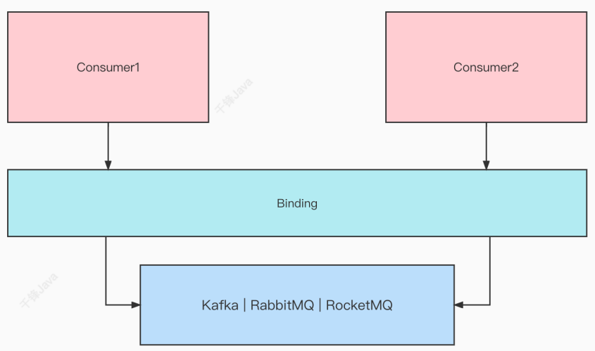
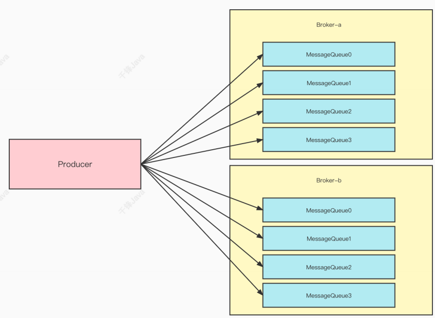

## 1：环境安装
### 1）Windows安装
在这里下载的是5.1.2的版本
[下载jar地址](https://rocketmq.apache.org/zh/download)

#### 启动mqnameserver
进入bin目录下，双击启动mqnamesrv.cmd

#### 再启动mqbroker
进入bin目录，打开cmd命令窗口：  

输入：`start mqbroker.cmd -n 127.0.0.1:9876 autoCreateTopicEnable=true`  或者直接双击  `mqbroker.cmd`这个文件来启动。

<p style="color:yellow">在这里可能会启动失败，打开mqbroker.cmd文件，可以看到，他其实是执行runbroker.cmd这个文件，也就是这个文件有问题。只需要在环境变量这里加上双引号就行。</p>


### 2）Linux安装

## 2：消息示例
### 1）构建Java基础环境
引入依赖
```xml
<dependencies>
  <dependency>
    <groupId>org.apache.rocketmq</groupId>
    <artifactId>rocketmq-client</artifactId>
    <version>4.7.1</version>
  </dependency>
</dependencies>
```
### 2）简单消息示例
简单消息分成三种：`同步消息`、`异步消息`、`单向消息`。
- 同步消息
⽣产者发送消息后，必须等待broker返回信息后才继续之后的业务逻辑，在broker返回信息之前，⽣产者阻塞等待。
```java
package com.qf.rocketmq.simple;

import org.apache.rocketmq.client.exception.MQBrokerException;
import org.apache.rocketmq.client.exception.MQClientException;
import org.apache.rocketmq.client.producer.DefaultMQProducer;
import org.apache.rocketmq.client.producer.SendResult;
import org.apache.rocketmq.common.message.Message;
import org.apache.rocketmq.remoting.common.RemotingHelper;
import org.apache.rocketmq.remoting.exception.RemotingException;

import java.io.UnsupportedEncodingException;

public class SyncProducer {

    public static void main(String[] args) throws MQClientException, UnsupportedEncodingException, RemotingException, InterruptedException, MQBrokerException {

        //Instantiate with a producer group name.
        DefaultMQProducer producer = new
                DefaultMQProducer("producerGroup1");
        // Specify name server addresses.
        producer.setNamesrvAddr("172.16.253.101:9876");
        //Launch the instance.
        producer.start();
        for (int i = 0; i < 100; i++) {
            //Create a message instance, specifying topic, tag and message body.
            Message msg = new Message("TopicTest" /* Topic */,
                    "TagA" /* Tag */,
                    ("Hello RocketMQ " +
                            i).getBytes(RemotingHelper.DEFAULT_CHARSET) /* Message body */
            );
            //Call send message to deliver message to one of brokers.
            SendResult sendResult = producer.send(msg);
            System.out.printf("%s%n", sendResult);
        }
        //Shut down once the producer instance is not longer in use.
        producer.shutdown();
    }
}
```
同步消息的应⽤场景：如重要通知消息、短信通知、短信营销系统等。
- 异步消息  
⽣产者发完消息后，不需要等待broker的回信，可以直接执⾏之后的业务逻辑。⽣产者提供⼀个回调函数供broker调⽤，体现了异步的⽅式。
```java
package com.qf.rocketmq.simple;

import org.apache.rocketmq.client.producer.DefaultMQProducer;
import org.apache.rocketmq.client.producer.SendCallback;
import org.apache.rocketmq.client.producer.SendResult;
import org.apache.rocketmq.common.message.Message;
import org.apache.rocketmq.remoting.common.RemotingHelper;

import java.util.concurrent.CountDownLatch;
import java.util.concurrent.TimeUnit;

public class AsyncProducer {

    public static void main(String[] args) throws Exception {
        //Instantiate with a producer group name.
        DefaultMQProducer producer = new DefaultMQProducer("please_rename_unique_group_name");
        // Specify name server addresses.
        producer.setNamesrvAddr("172.16.253.101:9876");
        //Launch the instance.
        producer.start();
        producer.setRetryTimesWhenSendAsyncFailed(0);

        int messageCount = 100;
        final CountDownLatch countDownLatch = new CountDownLatch(messageCount);
        for (int i = 0; i < messageCount; i++) {
            try {
                final int index = i;
                Message msg = new Message("Jodie_topic_1023",
                        "TagA",
                        "OrderID188",
                        "Hello world".getBytes(RemotingHelper.DEFAULT_CHARSET));
                producer.send(msg, new SendCallback() {
                    @Override
                    public void onSuccess(SendResult sendResult) {
                        countDownLatch.countDown();
                        System.out.printf("%-10d OK %s %n", index, sendResult.getMsgId());
                    }

                    @Override
                    public void onException(Throwable e) {
                        countDownLatch.countDown();
                        System.out.printf("%-10d Exception %s %n", index, e);
                        e.printStackTrace();
                    }
                });
            } catch (Exception e) {
                e.printStackTrace();
            }
        }
        System.out.println("=============");
        countDownLatch.await(5, TimeUnit.SECONDS);
        producer.shutdown();
    }
}
```
异步传输⼀般⽤于响应时间敏感的业务场景。
- 单向消息
⽣产者发送完消息后不需要等待任何回复，直接进⾏之后的业务逻辑，单向传输⽤于需要中等可靠性的情况，例如⽇志收集。
```java
package com.qf.rocketmq.simple;

import org.apache.rocketmq.client.producer.DefaultMQProducer;
import org.apache.rocketmq.common.message.Message;
import org.apache.rocketmq.remoting.common.RemotingHelper;

public class OnewayProducer {

    public static void main(String[] args) throws Exception {
        //Instantiate with a producer group name.
        DefaultMQProducer producer = new DefaultMQProducer("please_rename_unique_group_name");
        // Specify name server addresses.
        producer.setNamesrvAddr("172.16.253.101:9876");
        //Launch the instance.
        producer.start();
        for (int i = 0; i < 100; i++) {
            //Create a message instance, specifying topic, tag and message body.
            Message msg = new Message("TopicTest" /* Topic */,
                    "TagA" /* Tag */,
                    ("Hello RocketMQ " +
                            i).getBytes(RemotingHelper.DEFAULT_CHARSET) /* Message body */
            );
            //Call send message to deliver message to one of brokers.
            producer.sendOneway(msg);
        }
        //Wait for sending to complete
        Thread.sleep(5000);
        producer.shutdown();
    }

}
```

### 3）顺序消息
顺序消息指的是消费者消费消息的顺序按照发送者发送消息的顺序执⾏。顺序消息分成两种：`局部顺序`和`全局顺序`。
#### 局部顺序
局部消息指的是消费者消费某个topic的某个队列中的消息是顺序的。消费者使⽤`MessageListenerOrderly`类做消息监听，实现局部顺序。

生产者代码
```java
package com.qf.rocketmq.order;

import org.apache.rocketmq.client.producer.DefaultMQProducer;
import org.apache.rocketmq.client.producer.MQProducer;
import org.apache.rocketmq.client.producer.MessageQueueSelector;
import org.apache.rocketmq.client.producer.SendResult;
import org.apache.rocketmq.common.message.Message;
import org.apache.rocketmq.common.message.MessageQueue;
import org.apache.rocketmq.remoting.common.RemotingHelper;

import java.util.List;

public class OrderProducer {

    public static void main(String[] args) throws Exception {

        //Instantiate with a producer group name.
        MQProducer producer = new DefaultMQProducer("example_group_name");
        //名字服务器的地址已经在环境变量中配置好了：NAMESRV_ADDR=172.16.253.101:9876
        //Launch the instance.
        producer.start();
        for (int i = 0; i < 10; i++) {
            int orderId = i;

            for(int j = 0 ; j <= 5 ; j ++){
                Message msg =
                        new Message("OrderTopicTest", "order_"+orderId, "KEY" + orderId,
                                ("order_"+orderId+" step " + j).getBytes(RemotingHelper.DEFAULT_CHARSET));
                SendResult sendResult = producer.send(msg, new MessageQueueSelector() {
                    @Override
                    public MessageQueue select(List<MessageQueue> mqs, Message msg, Object arg) {
                        Integer id = (Integer) arg;
                        int index = id % mqs.size();
                        return mqs.get(index);
                    }
                }, orderId);

                System.out.printf("%s%n", sendResult);
            }
        }
        //server shutdown
        producer.shutdown();
    }

}
```
消费者代码
```java
package com.qf.rocketmq.order;

import org.apache.rocketmq.client.consumer.DefaultMQPushConsumer;
import org.apache.rocketmq.client.consumer.listener.*;
import org.apache.rocketmq.client.exception.MQClientException;
import org.apache.rocketmq.common.consumer.ConsumeFromWhere;
import org.apache.rocketmq.common.message.MessageExt;

import java.util.List;

public class OrderConsumer {
    public static void main(String[] args) throws MQClientException {
        DefaultMQPushConsumer consumer = new DefaultMQPushConsumer("example_group_name");

        consumer.setConsumeFromWhere(ConsumeFromWhere.CONSUME_FROM_FIRST_OFFSET);

        consumer.subscribe("OrderTopicTest", "*");

        consumer.registerMessageListener(new MessageListenerOrderly() {

            @Override
            public ConsumeOrderlyStatus consumeMessage(List<MessageExt> msgs,
                                                       ConsumeOrderlyContext context) {
                context.setAutoCommit(true);
                for(MessageExt msg:msgs){
                    System.out.println("消息内容："+new String(msg.getBody()));
                }
                return ConsumeOrderlyStatus.SUCCESS;

            }
        });

/*        consumer.registerMessageListener(new MessageListenerConcurrently() {
            @Override
            public ConsumeConcurrentlyStatus consumeMessage(List<MessageExt> msgs, ConsumeConcurrentlyContext context) {
                for(MessageExt msg:msgs){
                    System.out.println("消息内容："+new String(msg.getBody()));
                }
                return ConsumeConcurrentlyStatus.CONSUME_SUCCESS;
            }
        });*/

        consumer.start();

        System.out.printf("Consumer Started.%n");
    }
}
```

#### 全局顺序
消费者消费全部消息都是顺序的，只能通过⼀个某个topic只有⼀个队列才能实现，这种应⽤场景较少，且性能较差。
#### 乱序消费
消费者消费消息不需要关注消息的顺序。消费者使⽤MessageListenerConcurrently
类做消息监听。

```java
package com.qf.rocketmq.order;

import org.apache.rocketmq.client.consumer.DefaultMQPushConsumer;
import org.apache.rocketmq.client.consumer.listener.*;
import org.apache.rocketmq.client.exception.MQClientException;
import org.apache.rocketmq.common.consumer.ConsumeFromWhere;
import org.apache.rocketmq.common.message.MessageExt;

import java.util.List;

public class OrderConsumer {
    public static void main(String[] args) throws MQClientException {
        DefaultMQPushConsumer consumer = new DefaultMQPushConsumer("example_group_name");

        consumer.setConsumeFromWhere(ConsumeFromWhere.CONSUME_FROM_FIRST_OFFSET);

        consumer.subscribe("OrderTopicTest", "*");

        // consumer.registerMessageListener(new MessageListenerOrderly() {
        //
        //     @Override
        //     public ConsumeOrderlyStatus consumeMessage(List<MessageExt> msgs,
        //                                                ConsumeOrderlyContext context) {
        //         context.setAutoCommit(true);
        //         for(MessageExt msg:msgs){
        //             System.out.println("消息内容："+new String(msg.getBody()));
        //         }
        //         return ConsumeOrderlyStatus.SUCCESS;
        //
        //     }
        // });

        consumer.registerMessageListener(new MessageListenerConcurrently() {
            @Override
            public ConsumeConcurrentlyStatus consumeMessage(List<MessageExt> msgs, ConsumeConcurrentlyContext context) {
                for(MessageExt msg:msgs){
                    System.out.println("消息内容："+new String(msg.getBody()));
                }
                return ConsumeConcurrentlyStatus.CONSUME_SUCCESS;
            }
        });

        consumer.start();

        System.out.printf("Consumer Started.%n");
    }
}
```

### 4）广播消息
⼴播是向主题（topic）的所有订阅者发送消息。订阅同⼀个topic的多个消费者，能
全量收到⽣产者发送的所有消息  
消费者
```java
package com.qf.rocketmq.broadcast;

import org.apache.rocketmq.client.consumer.DefaultMQPushConsumer;
import org.apache.rocketmq.client.consumer.listener.ConsumeConcurrentlyContext;
import org.apache.rocketmq.client.consumer.listener.ConsumeConcurrentlyStatus;
import org.apache.rocketmq.client.consumer.listener.MessageListenerConcurrently;
import org.apache.rocketmq.common.consumer.ConsumeFromWhere;
import org.apache.rocketmq.common.message.MessageExt;
import org.apache.rocketmq.common.protocol.heartbeat.MessageModel;

import java.util.List;

public class BroadcastConsumer {
    public static void main(String[] args) throws Exception {
        DefaultMQPushConsumer consumer = new DefaultMQPushConsumer("example_group_name");

        consumer.setConsumeFromWhere(ConsumeFromWhere.CONSUME_FROM_FIRST_OFFSET);

        //set to broadcast mode
        consumer.setMessageModel(MessageModel.BROADCASTING);

        consumer.subscribe("TopicTest", "*");

        consumer.registerMessageListener(new MessageListenerConcurrently() {

            @Override
            public ConsumeConcurrentlyStatus consumeMessage(List<MessageExt> msgs,
                                                            ConsumeConcurrentlyContext context) {
                for(MessageExt msg:msgs){
                    System.out.println("消息内容："+new String(msg.getBody()));
                }
                return ConsumeConcurrentlyStatus.CONSUME_SUCCESS;
            }
        });

        consumer.start();
        System.out.printf("Broadcast Consumer Started.%n");
    }
}
```
生产者
```java
package com.qf.rocketmq.broadcast;

import org.apache.rocketmq.client.producer.DefaultMQProducer;
import org.apache.rocketmq.client.producer.SendResult;
import org.apache.rocketmq.common.message.Message;
import org.apache.rocketmq.remoting.common.RemotingHelper;

public class BroadcastProducer {

    public static void main(String[] args) throws Exception {
        DefaultMQProducer producer = new DefaultMQProducer("ProducerGroupName");
        producer.start();

        for (int i = 0; i < 100; i++){
            Message msg = new Message("TopicTest",
                    "TagA",
                    "OrderID188",
                    ("Hello world"+i).getBytes(RemotingHelper.DEFAULT_CHARSET));
            SendResult sendResult = producer.send(msg);
            System.out.printf("%s%n", sendResult);
        }
        producer.shutdown();
    }
}
```
### 5）延迟消息
延迟消息与普通消息的不同之处在于，它们要等到指定的时间之后才会被传递。
生产者
```java
package com.qf.rocketmq.scheduled;

import org.apache.rocketmq.client.producer.DefaultMQProducer;
import org.apache.rocketmq.common.message.Message;

public class ScheduledProducer {
    public static void main(String[] args) throws Exception {
        // Instantiate a producer to send scheduled messages
        DefaultMQProducer producer = new DefaultMQProducer("ExampleProducerGroup");
        // Launch producer
        producer.start();
        int totalMessagesToSend = 100;
        for (int i = 0; i < totalMessagesToSend; i++) {
            Message message = new Message("TestTopic", ("Hello scheduled message " + i).getBytes());
            // This message will be delivered to consumer 10 seconds later.
            message.setDelayTimeLevel(3);
            // Send the message
            producer.send(message);
        }
        // Shutdown producer after use.
        producer.shutdown();
    }
}
```
消费者
```java
package com.qf.rocketmq.scheduled;

import org.apache.rocketmq.client.consumer.DefaultMQPushConsumer;
import org.apache.rocketmq.client.consumer.listener.ConsumeConcurrentlyContext;
import org.apache.rocketmq.client.consumer.listener.ConsumeConcurrentlyStatus;
import org.apache.rocketmq.client.consumer.listener.MessageListenerConcurrently;
import org.apache.rocketmq.client.exception.MQClientException;
import org.apache.rocketmq.common.message.MessageExt;

import java.util.List;

public class ScheduledConsumer {
    public static void main(String[] args) throws MQClientException {
        // Instantiate message consumer
        DefaultMQPushConsumer consumer = new DefaultMQPushConsumer("ExampleConsumer");
        // Subscribe topics
        consumer.subscribe("TestTopic", "*");
        // Register message listener
        consumer.registerMessageListener(new MessageListenerConcurrently() {
            @Override
            public ConsumeConcurrentlyStatus consumeMessage(List<MessageExt> messages, ConsumeConcurrentlyContext context) {
                for (MessageExt message : messages) {
                    // Print approximate delay time period
                    System.out.println("Receive message[msgId=" + message.getMsgId() + "] "
                            + (System.currentTimeMillis() - message.getStoreTimestamp()) + "ms later");
                }
                return ConsumeConcurrentlyStatus.CONSUME_SUCCESS;
            }
        });
        // Launch consumer
        consumer.start();
    }
}
```
::: warning 注意
RocketMQ设计了18个延迟等级，分别是：  
1s 5s 10s 30s 1m 2m 3m 4m 5m 6m 7m 8m 9m 10m 20m 30m 1h 2
:::
在商业版RocketMQ中，不仅可以设置延迟等级，还可以设置具体的延迟时间，但是
在社区版RocketMQ中，只能设置延迟等级。
### 6）批量消息
批量发送消息提⾼了传递⼩消息的性能。
- 使⽤批量消息
```java
package com.qf.rocketmq.batch;

import org.apache.rocketmq.client.producer.DefaultMQProducer;
import org.apache.rocketmq.common.message.Message;

import java.util.ArrayList;
import java.util.List;

public class BatchProducer {

    public static void main(String[] args) throws Exception {

        DefaultMQProducer producer = new DefaultMQProducer("ProducerGroupName");
        producer.start();
        String topic = "BatchTest";
        List<Message> messages = new ArrayList<>();
        messages.add(new Message(topic, "TagA", "OrderID001", "Hello world 0".getBytes()));
        messages.add(new Message(topic, "TagA", "OrderID002", "Hello world 1".getBytes()));
        messages.add(new Message(topic, "TagA", "OrderID003", "Hello world 2".getBytes()));
        producer.send(messages);
        producer.shutdown();
    }
}
```
- 超出限制的批量消息
官⽅建议批量消息的总⼤⼩不应超过1m，实际不应超过4m。如果超过4m的批量消息需要进⾏分批处理，同时设置broker的配置参数为4m（在broker的配置⽂件中修改： maxMessageSize=4194304 ）
```java
package com.qf.rocketmq.batch;

import org.apache.rocketmq.client.producer.DefaultMQProducer;
import org.apache.rocketmq.common.message.Message;

import java.util.ArrayList;
import java.util.List;

public class MaxBatchProducer {

    public static void main(String[] args) throws Exception {

        DefaultMQProducer producer = new DefaultMQProducer("BatchProducerGroupName");
        producer.start();

        //large batch
        String topic = "BatchTest";
        List<Message> messages = new ArrayList<>(100*1000);
        for (int i = 0; i < 100*1000; i++) {
            messages.add(new Message(topic, "Tag", "OrderID" + i, ("Hello world " + i).getBytes()));
        }
//        producer.send(messages);

        //split the large batch into small ones:
        ListSplitter splitter = new ListSplitter(messages);
        while (splitter.hasNext()) {
            List<Message> listItem = splitter.next();
            producer.send(listItem);
        }
        producer.shutdown();
    }
}
```
ListSplitter
```java
package com.qf.rocketmq.batch;

import org.apache.rocketmq.common.message.Message;

import java.util.Iterator;
import java.util.List;
import java.util.Map;

public class ListSplitter implements Iterator<List<Message>> {
    private int sizeLimit = 1000 * 1000;
    private final List<Message> messages;
    private int currIndex;

    public ListSplitter(List<Message> messages) {
        this.messages = messages;
    }

    @Override
    public boolean hasNext() {
        return currIndex < messages.size();
    }

    @Override
    public List<Message> next() {
        int nextIndex = currIndex;
        int totalSize = 0;
        for (; nextIndex < messages.size(); nextIndex++) {
            Message message = messages.get(nextIndex);
            int tmpSize = message.getTopic().length() + message.getBody().length;
            Map<String, String> properties = message.getProperties();
            for (Map.Entry<String, String> entry : properties.entrySet()) {
                tmpSize += entry.getKey().length() + entry.getValue().length();
            }
            tmpSize = tmpSize + 20; //for log overhead
            if (tmpSize > sizeLimit) {
                //it is unexpected that single message exceeds the sizeLimit
                //here just let it go, otherwise it will block the splitting process
                if (nextIndex - currIndex == 0) {
                    //if the next sublist has no element, add this one and then break, otherwise just break
                    nextIndex++;
                }
                break;
            }
            if (tmpSize + totalSize > sizeLimit) {
                break;
            } else {
                totalSize += tmpSize;
            }

        }
        List<Message> subList = messages.subList(currIndex, nextIndex);
        currIndex = nextIndex;
        return subList;
    }
}
```
- 使⽤限制
同⼀批次的消息应该具有：相同的主题、相同的 waitStoreMsgOK 并且不⽀持延迟消息和事务消息。
### 7）过滤消息
在⼤多数情况下，标签是⼀种简单⽽有⽤的设计，可以⽤来选择您想要的消息。
- tag过滤的⽣产者
```java
package com.qf.rocketmq.filter;

import org.apache.rocketmq.client.exception.MQClientException;
import org.apache.rocketmq.client.producer.DefaultMQProducer;
import org.apache.rocketmq.client.producer.SendResult;
import org.apache.rocketmq.common.message.Message;
import org.apache.rocketmq.remoting.common.RemotingHelper;

public class TagProducer {

    public static void main(String[] args) throws Exception {
        DefaultMQProducer producer = new DefaultMQProducer("please_rename_unique_group_name");
        producer.start();

        String[] tags = new String[] {"TagA", "TagB", "TagC"};

        for (int i = 0; i < 15; i++) {
            Message msg = new Message("TagFilterTest",
                    tags[i % tags.length],
                    "Hello world".getBytes(RemotingHelper.DEFAULT_CHARSET));

            SendResult sendResult = producer.send(msg);
            System.out.printf("%s%n", sendResult);
        }

        producer.shutdown();
    }

}
```
- tag过滤的消费者
```java
package com.qf.rocketmq.filter;

import org.apache.rocketmq.client.consumer.DefaultMQPushConsumer;
import org.apache.rocketmq.client.consumer.listener.ConsumeConcurrentlyContext;
import org.apache.rocketmq.client.consumer.listener.ConsumeConcurrentlyStatus;
import org.apache.rocketmq.client.consumer.listener.MessageListenerConcurrently;
import org.apache.rocketmq.client.exception.MQClientException;
import org.apache.rocketmq.common.message.MessageExt;

import java.util.List;

public class TagConsumer {
    public static void main(String[] args) throws MQClientException {
        DefaultMQPushConsumer consumer = new DefaultMQPushConsumer("please_rename_unique_group_name");

        consumer.subscribe("TagFilterTest", "TagA || TagC");

        consumer.registerMessageListener(new MessageListenerConcurrently() {

            @Override
            public ConsumeConcurrentlyStatus consumeMessage(List<MessageExt> msgs,
                                                            ConsumeConcurrentlyContext context) {
                System.out.printf("%s Receive New Messages: %s %n", Thread.currentThread().getName(), msgs);
                return ConsumeConcurrentlyStatus.CONSUME_SUCCESS;
            }
        });

        consumer.start();

        System.out.printf("Consumer Started.%n");
    }
}
```
消费者将收到包含 TAGA 或 TAGB 或 TAGC 的消息。但是限制是⼀条消息只能有⼀个标签，这可能不适⽤于复杂的场景。在这种情况下，您可以使⽤ SQL 表达式来过滤掉消息。
- 使⽤SQL过滤
SQL 功能可以通过您在发送消息时输⼊的属性进⾏⼀些计算。在 RocketMQ 定义的
语法下，可以实现⼀些有趣的逻辑。这是⼀个例⼦：
> ------------
| message |
| ------- |a > 5 AND b = 'abc'
| a = 10 | --------------------> Gotten
| b = 'abc'|
| c = true |
------------
------------
| message |
| ------- |a > 5 AND b = 'abc'
| a = 1 | --------------------> Missed
| b = 'abc'|
| c = true |
------------

语法:
RocketMQ 只定义了⼀些基本的语法来⽀持这个特性，也可以轻松扩展它。
- 1. 数值⽐较，如`>`, `>=`, `<`, `<=`, `BETWEEN`, `=`;
- 2. 字符⽐较，如`=`, `<>`, `IN`;
- 3. `IS NULL`或`IS NOT NULL`；
- 4. 逻辑`AND`, `OR`, `NOT`;
常量类型有：
- 1. 数字，如 123、3.1415；
- 2. 字符，如'abc'，必须⽤单引号；
- 3. `NULL`，特殊常数；
- 4. 布尔值，`TRUE`或`FALSE`；
> 使⽤注意：只有推模式的消费者可以使⽤SQL过滤。拉模式是⽤不了的
- SQL过滤的⽣产者示例
```java
package com.qf.rocketmq.filter;

import org.apache.rocketmq.client.exception.MQClientException;
import org.apache.rocketmq.client.producer.DefaultMQProducer;
import org.apache.rocketmq.client.producer.SendResult;
import org.apache.rocketmq.common.message.Message;
import org.apache.rocketmq.remoting.common.RemotingHelper;

public class SQLProducer {
    public static void main(String[] args) throws Exception {
        DefaultMQProducer producer = new DefaultMQProducer("please_rename_unique_group_name");

        producer.start();

        String[] tags = new String[] {"TagA", "TagB", "TagC"};

        for (int i = 0; i < 15; i++) {
            Message msg = new Message("SqlFilterTest",
                    tags[i % tags.length],
                    ("Hello RocketMQ " + i).getBytes(RemotingHelper.DEFAULT_CHARSET)
            );
            // Set some properties.
            msg.putUserProperty("a", String.valueOf(i));

            SendResult sendResult = producer.send(msg);
            System.out.printf("%s%n", sendResult);
        }

        producer.shutdown();
    }
}
```
- SQL过滤的消费者示例
```java
package com.qf.rocketmq.filter;

import org.apache.rocketmq.client.consumer.DefaultMQPushConsumer;
import org.apache.rocketmq.client.consumer.MessageSelector;
import org.apache.rocketmq.client.consumer.listener.ConsumeConcurrentlyContext;
import org.apache.rocketmq.client.consumer.listener.ConsumeConcurrentlyStatus;
import org.apache.rocketmq.client.consumer.listener.MessageListenerConcurrently;
import org.apache.rocketmq.client.exception.MQClientException;
import org.apache.rocketmq.common.message.MessageExt;

import java.util.List;

public class SQLConsumer {
    public static void main(String[] args) throws MQClientException {

        DefaultMQPushConsumer consumer = new DefaultMQPushConsumer("please_rename_unique_group_name");

        // Don't forget to set enablePropertyFilter=true in broker
        consumer.subscribe("SqlFilterTest",
                MessageSelector.bySql("(TAGS is not null and TAGS in ('TagA', 'TagB'))" +
                        "and (a is not null and a between 0 and 3)"));

        consumer.registerMessageListener(new MessageListenerConcurrently() {

            @Override
            public ConsumeConcurrentlyStatus consumeMessage(List<MessageExt> msgs,
                                                            ConsumeConcurrentlyContext context) {
                System.out.printf("%s Receive New Messages: %s %n", Thread.currentThread().getName(), msgs);
                return ConsumeConcurrentlyStatus.CONSUME_SUCCESS;
            }
        });

        consumer.start();
        System.out.printf("Consumer Started.%n");
    }
}
```
### 8）事务消息
> 事务消息的定义
它可以被认为是⼀个两阶段的提交消息实现，以确保分布式系统的最终⼀致性。事务性消息确保本地事务的执⾏和消息的发送可以原⼦地执⾏。  
事务消息有三种状态：  
- a.TransactionStatus.CommitTransaction：提交事务，表示允许消费者消费该消息。
- b.TransactionStatus.RollbackTransaction：回滚事务，表示该消息将被删除，不允许
消费。
- c.TransactionStatus.Unknown：中间状态，表示需要MQ回查才能确定状态。

事务消息的实现流程


生产者
```java
package com.qf.rocketmq.transaction;

import org.apache.rocketmq.client.exception.MQClientException;
import org.apache.rocketmq.client.producer.SendResult;
import org.apache.rocketmq.client.producer.TransactionListener;
import org.apache.rocketmq.client.producer.TransactionMQProducer;
import org.apache.rocketmq.common.message.Message;
import org.apache.rocketmq.remoting.common.RemotingHelper;

import java.io.UnsupportedEncodingException;
import java.util.concurrent.*;

public class TransactionProducer {
    public static void main(String[] args) throws Exception {
        TransactionListener transactionListener = new TransactionListenerImpl();
        TransactionMQProducer producer = new TransactionMQProducer("please_rename_unique_group_name");
        producer.setNamesrvAddr("172.16.253.101:9876");
        ExecutorService executorService = new ThreadPoolExecutor(2, 5, 100, TimeUnit.SECONDS, new ArrayBlockingQueue<Runnable>(2000), new ThreadFactory() {
            @Override
            public Thread newThread(Runnable r) {
                Thread thread = new Thread(r);
                thread.setName("client-transaction-msg-check-thread");
                return thread;
            }
        });

        producer.setExecutorService(executorService);
        producer.setTransactionListener(transactionListener);
        producer.start();

        String[] tags = new String[] {"TagA", "TagB", "TagC", "TagD", "TagE"};
        for (int i = 0; i < 10; i++) {
            try {
                Message msg =
                        new Message("TopicTest", tags[i % tags.length], "KEY" + i,
                                ("Hello RocketMQ " + i).getBytes(RemotingHelper.DEFAULT_CHARSET));
                SendResult sendResult = producer.sendMessageInTransaction(msg, null);
                System.out.printf("%s%n", sendResult);

                Thread.sleep(10);
            } catch (MQClientException | UnsupportedEncodingException e) {
                e.printStackTrace();
            }
        }

        for (int i = 0; i < 100000; i++) {
            Thread.sleep(1000);
        }
        producer.shutdown();
    }
}
```
本地事务处理-TransactionListener
```java
package com.qf.rocketmq.transaction;

import org.apache.commons.lang3.StringUtils;
import org.apache.rocketmq.client.producer.LocalTransactionState;
import org.apache.rocketmq.client.producer.TransactionListener;
import org.apache.rocketmq.common.message.Message;
import org.apache.rocketmq.common.message.MessageExt;

public class TransactionListenerImpl implements TransactionListener {
    /**
     * When send transactional prepare(half) message succeed, this method will be invoked to execute local transaction.
     *
     * @param msg Half(prepare) message
     * @param arg Custom business parameter
     * @return Transaction state
     */
    @Override
    public LocalTransactionState executeLocalTransaction(Message msg, Object arg) {
        String tags = msg.getTags();
        if(StringUtils.contains(tags,"TagA")){
            return LocalTransactionState.COMMIT_MESSAGE;
        }else if(StringUtils.contains(tags,"TagB")){
            return LocalTransactionState.ROLLBACK_MESSAGE;
        }else{
            return LocalTransactionState.UNKNOW;
        }
    }

    /**
     * When no response to prepare(half) message. broker will send check message to check the transaction status, and this
     * method will be invoked to get local transaction status.
     *
     * @param msg Check message
     * @return Transaction state
     */
    @Override
    public LocalTransactionState checkLocalTransaction(MessageExt msg) {
        String tags = msg.getTags();
        if(StringUtils.contains(tags,"TagC")){
            return LocalTransactionState.COMMIT_MESSAGE;
        }else if(StringUtils.contains(tags,"TagD")){
            return LocalTransactionState.ROLLBACK_MESSAGE;
        }else{
            return LocalTransactionState.UNKNOW;
        }
    }
}
```
消费者
```java
package com.qf.rocketmq.transaction;

import org.apache.rocketmq.client.consumer.DefaultMQPushConsumer;
import org.apache.rocketmq.client.consumer.listener.ConsumeConcurrentlyContext;
import org.apache.rocketmq.client.consumer.listener.ConsumeConcurrentlyStatus;
import org.apache.rocketmq.client.consumer.listener.MessageListenerConcurrently;
import org.apache.rocketmq.client.exception.MQClientException;
import org.apache.rocketmq.common.message.MessageExt;

import java.util.List;

public class TransactionConsumer {

    public static void main(String[] args) throws MQClientException {
        //1.创建消费者对象
        DefaultMQPushConsumer consumer = new DefaultMQPushConsumer("my-consumer-group1");
        //2.指明nameserver的地址
        consumer.setNamesrvAddr("172.16.253.101:9876");
        //3.订阅主题:topic 和过滤消息用的tag表达式
        consumer.subscribe("TopicTest","*");
        //4.创建一个监听器，当broker把消息推过来时调用
        consumer.registerMessageListener(new MessageListenerConcurrently() {
            @Override
            public ConsumeConcurrentlyStatus consumeMessage(List<MessageExt> msgs, ConsumeConcurrentlyContext context) {

                for (MessageExt msg : msgs) {
//                    System.out.println("收到的消息："+new String(msg.getBody()));
                    System.out.println("收到的消息："+msg);
                }

                return ConsumeConcurrentlyStatus.CONSUME_SUCCESS;
            }
        });
        //5.启动消费者
        consumer.start();
        System.out.println("消费者已启动");
    }
}
```
> 使⽤限制
- 事务性消息没有调度和批处理⽀持。
- 为避免单条消息被检查次数过多，导致半队列消息堆积，我们默认将单条消息的检查次数限制为15次，但⽤户可以通过更改“transactionCheckMax”更改此限制”参数在broker的配置中，如果⼀条消息的检查次数超过“transactionCheckMax”次，broker默认会丢弃这条消息，同时打印错误⽇志。⽤户可以通过重写“AbstractTransactionCheckListener”类来改变这种⾏为。
- 事务消息将在⼀定时间后检查，该时间由代理配置中的参数“transactionTimeout”确定。并且⽤户也可以在发送事务消息时通过设置⽤户属性“CHECK_IMMUNITY_TIME_IN_SECONDS”来改变这个限制，这个参数优先于“transactionMsgTimeout”参数。
- ⼀个事务性消息可能会被检查或消费不⽌⼀次。
- 提交给⽤户⽬标主题的消息reput可能会失败。⽬前，它取决于⽇志记录。⾼可⽤是由 RocketMQ 本身的⾼可⽤机制来保证的。如果要保证事务消息不丢失，保证事务完整性，推荐使⽤同步双写机制。
- 事务性消息的⽣产者 ID 不能与其他类型消息的⽣产者 ID 共享。与其他类型的消息不同，事务性消息允许向后查询。MQ 服务器通过其⽣产者 ID 查询客户端。

## 3：SpringBoot整合RocketMQ
注意依赖的版本需要和RocketMQ的版本相同。

### 1）引入依赖
```xml
    <dependencies>
        <dependency>
            <groupId>org.apache.rocketmq</groupId>
            <artifactId>rocketmq-spring-boot-starter</artifactId>
            <version>2.1.1</version>
        </dependency>
        <dependency>
            <groupId>org.springframework.boot</groupId>
            <artifactId>spring-boot-starter-web</artifactId>
        </dependency>

        <dependency>
            <groupId>org.springframework.boot</groupId>
            <artifactId>spring-boot-starter-test</artifactId>
            <scope>test</scope>
            <exclusions>
                <exclusion>
                    <groupId>org.junit.vintage</groupId>
                    <artifactId>junit-vintage-engine</artifactId>
                </exclusion>
            </exclusions>
        </dependency>
    </dependencies>
```
### 2）配置文件编写
```yml
# 应用名称
spring.application.name=my-boot-producer-demo
# 应用服务 WEB 访问端口
server.port=8081
# nameserver
rocketmq.name-server=0.0.0.0:9876
# 生产者组
rocketmq.producer.group=my-boot-producer-group
```

### 3）编写生产者发送普通消息
```java
package com.qf.my.boot.producer.demo.producer;

import org.apache.rocketmq.client.producer.TransactionSendResult;
import org.apache.rocketmq.spring.core.RocketMQTemplate;
import org.springframework.beans.factory.annotation.Autowired;
import org.springframework.messaging.Message;
import org.springframework.messaging.support.MessageBuilder;
import org.springframework.stereotype.Component;

@Component
public class MyProducer {

    @Autowired
    private RocketMQTemplate rocketMQTemplate;


    public void sendMessage(String topic,String message){
        rocketMQTemplate.convertAndSend(topic,message);
    }

     /**
     * 发送事务消息
     * @param topic
     * @param msg
     * @throws InterruptedException
     */
    public void sendMessageInTransaction(String topic,String msg) throws InterruptedException {
        String[] tags = new String[]{"TagA","TagB","TagC","TagD","TagE"};
        for (int i = 0; i < 10; i++) {
            Message<String> message = MessageBuilder.withPayload(msg).build();
            //topic和tag整合在一起
            String destination = topic+":"+tags[ i % tags.length];
            //第一个destination是消息要发送的目的地topic，第二个destination消息携带的业务数据
            TransactionSendResult sendResult = rocketMQTemplate.sendMessageInTransaction(destination, message, destination);
            System.out.println(sendResult);
            Thread.sleep(10);
        }
    }

}
```

### 4）编写JUnit单元测试发送消息
```java
@SpringBootTest
class MyBootProducerDemoApplicationTests {

    @Autowired
    private MyProducer producer;

    @Test
    void contextLoads() {
    }

    @Test
    void testSendMessage(){
        String topic = "MyBootTopic";
        String message = "hello rocket mq springboot message111";
        producer.sendMessage(topic,message);
        System.out.println("消息发送成功！");
    }
}
```
### 5）编写JUnit单元测试发送消息
```java
package com.qf.my.boot.producer.demo.consumer;

import org.apache.rocketmq.spring.annotation.RocketMQMessageListener;
import org.apache.rocketmq.spring.core.RocketMQListener;
import org.springframework.stereotype.Component;

/**
 * @author 小泽
 * @create 2023-10-08  11:22
 * 记得每天敲代码哦
 */
@Component
@RocketMQMessageListener(consumerGroup = "my-boot-consumer-group", topic = "MyBootTopic")
public class MyConsumer implements RocketMQListener<String> {

       public void onMessage(String msg) {
              System.out.println("收到的消息:" + msg);
       }
}

```

### 6）发送事务消息
#### 编写生产者
```java
 /**
     * 发送事务消息
     * @param topic
     * @param msg
     * @throws InterruptedException
     */
    public void sendMessageInTransaction(String topic,String msg) throws InterruptedException {
        String[] tags = new String[]{"TagA","TagB","TagC","TagD","TagE"};
        for (int i = 0; i < 10; i++) {
            Message<String> message = MessageBuilder.withPayload(msg).build();
            //topic和tag整合在一起
            String destination = topic+":"+tags[ i % tags.length];
            //第一个destination是消息要发送的目的地topic，第二个destination消息携带的业务数据
            TransactionSendResult sendResult = rocketMQTemplate.sendMessageInTransaction(destination, message, destination);
            System.out.println(sendResult);
            Thread.sleep(10);
        }
    }
```
#### 编写事务监听器类
```java
package com.qf.my.boot.producer.demo.listener;

import org.apache.commons.lang3.StringUtils;
import org.apache.rocketmq.spring.annotation.RocketMQTransactionListener;
import org.apache.rocketmq.spring.core.RocketMQLocalTransactionListener;
import org.apache.rocketmq.spring.core.RocketMQLocalTransactionState;
import org.apache.rocketmq.spring.support.RocketMQUtil;
import org.springframework.messaging.Message;
import org.springframework.messaging.converter.StringMessageConverter;

@RocketMQTransactionListener(rocketMQTemplateBeanName = "rocketMQTemplate")
public class MyTransactionListener implements RocketMQLocalTransactionListener {
    /**
     * 执行本地事务
     * @param msg
     * @param arg 业务参数
     * @return
     */
    @Override
    public RocketMQLocalTransactionState executeLocalTransaction(Message msg, Object arg) {
        String destination = (String) arg;
        //把spring的message转换成Rocketmq的message
        org.apache.rocketmq.common.message.Message message = RocketMQUtil.convertToRocketMessage(
                new StringMessageConverter(),
                "utf-8",
                destination,
                msg
        );
        //如何得到message上的tag的内容
        String tags = message.getTags();
        if(StringUtils.contains(tags,"TagA")){
            return RocketMQLocalTransactionState.COMMIT;
        }else if(StringUtils.contains(tags,"TagB")){
            return RocketMQLocalTransactionState.ROLLBACK;
        }else{
            return RocketMQLocalTransactionState.UNKNOWN;
        }
    }

    @Override
    public RocketMQLocalTransactionState checkLocalTransaction(Message msg) {
        return null;
    }
}
```
### 7）编写单元测试发送事务消息
```java
    @Test
    void testSendMessageInTransaction() throws InterruptedException {
        String topic = "MyBootTopic";
        String message = "hello rocket mq transaction springboot message";
        producer.sendMessageInTransaction(topic,message);
        System.out.println("事务消息发送成功");
    }
```

## 4：Spring Cloud Stream整合RocketMQ
### 1）Spring Cloud Stream介绍
> Spring Cloud Stream 是⼀个框架，⽤于构建与共享消息系统连接的⾼度可扩展的事件驱动微服务。    

> 该框架提供了⼀个灵活的编程模型，该模型基于已经建⽴和熟悉的 Spring 习惯⽤法和最佳实践，包括对持久 pub/sub 语义、消费者组和有状态分区的⽀持。  



Spring Cloud Stream 的核⼼构建块是：
- `Destination Binders`：负责提供与外部消息传递系统集成的组件。
- `Destination Bindings`：外部消息系统和最终⽤户提供的应⽤程序代码（⽣产者/消费者）之间的桥梁。
- `Message`：⽣产者和消费者⽤来与⽬标绑定器（以及通过外部消息系统的其他
应⽤程序）进⾏通信的规范数据结构。
### 2）编写⽣产者
- 引⼊依赖
```xml
<?xml version="1.0" encoding="UTF-8"?>
<project xmlns="http://maven.apache.org/POM/4.0.0" xmlns:xsi="http://www.w3.org/2001/XMLSchema-instance"
         xsi:schemaLocation="http://maven.apache.org/POM/4.0.0 https://maven.apache.org/xsd/maven-4.0.0.xsd">
    <modelVersion>4.0.0</modelVersion>
    <groupId>com.qf</groupId>
    <artifactId>my-spring-cloud-rocketmq-producer</artifactId>
    <version>0.0.1-SNAPSHOT</version>
    <name>my-spring-cloud-rocketmq-producer</name>
    <description>Demo project for Spring Boot</description>

    <properties>
        <java.version>1.8</java.version>
        <project.build.sourceEncoding>UTF-8</project.build.sourceEncoding>
        <project.reporting.outputEncoding>UTF-8</project.reporting.outputEncoding>
        <spring-boot.version>2.3.7.RELEASE</spring-boot.version>
        <spring-cloud-alibaba.version>2.2.2.RELEASE</spring-cloud-alibaba.version>
    </properties>

    <dependencies>
        <dependency>
            <groupId>org.springframework.boot</groupId>
            <artifactId>spring-boot-starter-web</artifactId>
        </dependency>
        <dependency>
            <groupId>com.alibaba.cloud</groupId>
            <artifactId>spring-cloud-starter-stream-rocketmq</artifactId>
            <exclusions>
                <exclusion>
                    <groupId>org.apache.rocketmq</groupId>
                    <artifactId>rocketmq-client</artifactId>
                </exclusion>
                <exclusion>
                    <groupId>org.apache.rocketmq</groupId>
                    <artifactId>rocketmq-acl</artifactId>
                </exclusion>
            </exclusions>
        </dependency>

        <dependency>
            <groupId>org.apache.rocketmq</groupId>
            <artifactId>rocketmq-client</artifactId>
            <version>4.7.1</version>
        </dependency>
        <dependency>
            <groupId>org.apache.rocketmq</groupId>
            <artifactId>rocketmq-acl</artifactId>
            <version>4.7.1</version>
        </dependency>

        <dependency>
            <groupId>org.springframework.boot</groupId>
            <artifactId>spring-boot-starter-test</artifactId>
            <scope>test</scope>
            <exclusions>
                <exclusion>
                    <groupId>org.junit.vintage</groupId>
                    <artifactId>junit-vintage-engine</artifactId>
                </exclusion>
            </exclusions>
        </dependency>
    </dependencies>

    <dependencyManagement>
        <dependencies>
            <dependency>
                <groupId>org.springframework.boot</groupId>
                <artifactId>spring-boot-dependencies</artifactId>
                <version>${spring-boot.version}</version>
                <type>pom</type>
                <scope>import</scope>
            </dependency>
            <dependency>
                <groupId>com.alibaba.cloud</groupId>
                <artifactId>spring-cloud-alibaba-dependencies</artifactId>
                <version>${spring-cloud-alibaba.version}</version>
                <type>pom</type>
                <scope>import</scope>
            </dependency>
        </dependencies>
    </dependencyManagement>

    <build>
        <plugins>
            <plugin>
                <groupId>org.apache.maven.plugins</groupId>
                <artifactId>maven-compiler-plugin</artifactId>
                <version>3.8.1</version>
                <configuration>
                    <source>1.8</source>
                    <target>1.8</target>
                    <encoding>UTF-8</encoding>
                </configuration>
            </plugin>
            <plugin>
                <groupId>org.springframework.boot</groupId>
                <artifactId>spring-boot-maven-plugin</artifactId>
                <version>2.3.7.RELEASE</version>
                <configuration>
                    <mainClass>com.qf.my.spring.cloud.rocketmq.producer.MySpringCloudRocketmqProducerApplication
                    </mainClass>
                </configuration>
                <executions>
                    <execution>
                        <id>repackage</id>
                        <goals>
                            <goal>repackage</goal>
                        </goals>
                    </execution>
                </executions>
            </plugin>
        </plugins>
    </build>

</project>
```
注意，Rocket官⽅维护的spring-cloud-stream依赖中rocket⽤的版本为4.4，需要排除后加⼊4.7.1的依赖。
- 编写配置⽂件

```yml
# 应用名称
spring.application.name=my-spring-cloud-rocketmq-producer
# 应用服务 WEB 访问端口
server.port=8080
# output 生产者的目的地topic
spring.cloud.stream.bindings.output.destination=TopicTest
# 配置rocketmq连接的nameserver地址
spring.cloud.stream.rocketmq.binder.name-server=172.16.253.101:9876
```

- 启动类上打上注解
```java
package com.qf.my.spring.cloud.rocketmq.producer;

import org.springframework.boot.SpringApplication;
import org.springframework.boot.autoconfigure.SpringBootApplication;
import org.springframework.cloud.stream.annotation.EnableBinding;
import org.springframework.cloud.stream.messaging.Source;

@EnableBinding(Source.class)
@SpringBootApplication
public class MySpringCloudRocketmqProducerApplication {

    public static void main(String[] args) {
        SpringApplication.run(MySpringCloudRocketmqProducerApplication.class, args);
    }

}
```
其中 `@EnableBinding(Source.class)` 指向配置⽂件的output参数。
- 编写⽣产者程序
```java
package com.qf.my.spring.cloud.rocketmq.producer;

import org.apache.rocketmq.common.message.MessageConst;
import org.springframework.cloud.stream.messaging.Source;
import org.springframework.messaging.Message;
import org.springframework.messaging.MessageHeaders;
import org.springframework.messaging.support.MessageBuilder;
import org.springframework.stereotype.Component;
import sun.misc.Contended;

import javax.annotation.Resource;
import java.util.HashMap;
import java.util.Map;

@Component
public class MyProducer {

    @Resource
    private Source source;

    public void sendMessage(String msg){
        //封装消息头
        Map<String, Object> headers = new HashMap<>();
        headers.put(MessageConst.PROPERTY_TAGS,"TagA");
        MessageHeaders messageHeaders = new MessageHeaders(headers);
        //创建消息对象
        Message<String> message = MessageBuilder.createMessage(msg, messageHeaders);
        //发送消息
        source.output().send(message);
    }

}
```

- 编写单元测试发送消息
```java
 @Test
    void testSendMessage(){
        producer.sendMessage("hello spring cloud stream message");
    }
```
### 3）编写消费者
- 引⼊依赖
```xml
Copyright © 小泽
Link: http://localhost:8080/xiaoze-blog/blogs/后端/rocketmq/1：RocketMq.html

<?xml version="1.0" encoding="UTF-8"?>
<project xmlns="http://maven.apache.org/POM/4.0.0" xmlns:xsi="http://www.w3.org/2001/XMLSchema-instance"
         xsi:schemaLocation="http://maven.apache.org/POM/4.0.0 https://maven.apache.org/xsd/maven-4.0.0.xsd">
    <modelVersion>4.0.0</modelVersion>
    <groupId>com.qf</groupId>
    <artifactId>my-spring-cloud-rocketmq-producer</artifactId>
    <version>0.0.1-SNAPSHOT</version>
    <name>my-spring-cloud-rocketmq-producer</name>
    <description>Demo project for Spring Boot</description>

    <properties>
        <java.version>1.8</java.version>
        <project.build.sourceEncoding>UTF-8</project.build.sourceEncoding>
        <project.reporting.outputEncoding>UTF-8</project.reporting.outputEncoding>
        <spring-boot.version>2.3.7.RELEASE</spring-boot.version>
        <spring-cloud-alibaba.version>2.2.2.RELEASE</spring-cloud-alibaba.version>
    </properties>

    <dependencies>
        <dependency>
            <groupId>org.springframework.boot</groupId>
            <artifactId>spring-boot-starter-web</artifactId>
        </dependency>
        <dependency>
            <groupId>com.alibaba.cloud</groupId>
            <artifactId>spring-cloud-starter-stream-rocketmq</artifactId>
            <exclusions>
                <exclusion>
                    <groupId>org.apache.rocketmq</groupId>
                    <artifactId>rocketmq-client</artifactId>
                </exclusion>
                <exclusion>
                    <groupId>org.apache.rocketmq</groupId>
                    <artifactId>rocketmq-acl</artifactId>
                </exclusion>
            </exclusions>
        </dependency>

        <dependency>
            <groupId>org.apache.rocketmq</groupId>
            <artifactId>rocketmq-client</artifactId>
            <version>4.7.1</version>
        </dependency>
        <dependency>
            <groupId>org.apache.rocketmq</groupId>
            <artifactId>rocketmq-acl</artifactId>
            <version>4.7.1</version>
        </dependency>

        <dependency>
            <groupId>org.springframework.boot</groupId>
            <artifactId>spring-boot-starter-test</artifactId>
            <scope>test</scope>
            <exclusions>
                <exclusion>
                    <groupId>org.junit.vintage</groupId>
                    <artifactId>junit-vintage-engine</artifactId>
                </exclusion>
            </exclusions>
        </dependency>
    </dependencies>

    <dependencyManagement>
        <dependencies>
            <dependency>
                <groupId>org.springframework.boot</groupId>
                <artifactId>spring-boot-dependencies</artifactId>
                <version>${spring-boot.version}</version>
                <type>pom</type>
                <scope>import</scope>
            </dependency>
            <dependency>
                <groupId>com.alibaba.cloud</groupId>
                <artifactId>spring-cloud-alibaba-dependencies</artifactId>
                <version>${spring-cloud-alibaba.version}</version>
                <type>pom</type>
                <scope>import</scope>
            </dependency>
        </dependencies>
    </dependencyManagement>

    <build>
        <plugins>
            <plugin>
                <groupId>org.apache.maven.plugins</groupId>
                <artifactId>maven-compiler-plugin</artifactId>
                <version>3.8.1</version>
                <configuration>
                    <source>1.8</source>
                    <target>1.8</target>
                    <encoding>UTF-8</encoding>
                </configuration>
            </plugin>
            <plugin>
                <groupId>org.springframework.boot</groupId>
                <artifactId>spring-boot-maven-plugin</artifactId>
                <version>2.3.7.RELEASE</version>
                <configuration>
                    <mainClass>com.qf.my.spring.cloud.rocketmq.producer.MySpringCloudRocketmqProducerApplication
                    </mainClass>
                </configuration>
                <executions>
                    <execution>
                        <id>repackage</id>
                        <goals>
                            <goal>repackage</goal>
                        </goals>
                    </execution>
                </executions>
            </plugin>
        </plugins>
    </build>

</project>
```
- 编写配置⽂件

```yml
# 应用名称
spring.application.name=my-spring-cloud-rocketmq-consumer
# 应用服务 WEB 访问端口
server.port=8081
# input 配置消费者的信息
spring.cloud.stream.bindings.input.destination=TopicTest
spring.cloud.stream.bindings.input.group=spring-cloud-stream-consumer-group
# 配置nameserver的地址
spring.cloud.stream.rocketmq.binder.name-server=172.16.253.101:9876

```
- 启动类上打上注解
```java
package com.qf.my.spring.cloud.rocketmq.consumer;

import org.springframework.boot.SpringApplication;
import org.springframework.boot.autoconfigure.SpringBootApplication;
import org.springframework.cloud.stream.annotation.EnableBinding;
import org.springframework.cloud.stream.messaging.Sink;

@EnableBinding(Sink.class)
@SpringBootApplication
public class MySpringCloudRocketmqConsumerApplication {

    public static void main(String[] args) {
        SpringApplication.run(MySpringCloudRocketmqConsumerApplication.class, args);
    }

}
```
其中 `@EnableBinding(Sink.class)` 指向配置⽂件的input参数。
- 编写消费者程序
```java
package com.qf.my.spring.cloud.rocketmq.consumer;

import org.springframework.cloud.stream.annotation.StreamListener;
import org.springframework.cloud.stream.messaging.Sink;
import org.springframework.stereotype.Component;

@Component
public class MyConsumer {

    @StreamListener(Sink.INPUT)
    public void processMessage(String message){
        System.out.println("收到的消息："+message);
    }
}
```

## 5：RocketMQ核⼼概念
### 1）消息模型（Message Model）
RocketMQ主要由 Producer、Broker、Consumer 三部分组成，其中Producer 负责⽣产消息，Consumer 负责消费消息，Broker 负责存储消息。Broker 在实际部署过程中对应⼀台服务器，每个 Broker 可以存储多个Topic的消息，每个Topic的消息也可以分⽚存储于不同的 Broker。Message Queue ⽤于存储消息的物理地址，每个Topic中的消息地址存储于多个 Message Queue 中。ConsumerGroup 由多个Consumer 实例构成。

### 2）消息⽣产者（Producer）
负责⽣产消息，⼀般由业务系统负责⽣产消息。⼀个消息⽣产者会把业务应⽤系统⾥产⽣的消息发送到broker服务器。RocketMQ提供多种发送⽅式，同步发送、异步发送、顺序发送、单向发送。同步和异步⽅式均需要Broker返回确认信息，单向发送不需要。
⽣产者组将多个⽣产者归为⼀组。⽤于保证⽣产者的⾼可⽤，⽐如在事务消息中回查本地事务状态，需要⽣产者具备⾼可⽤的特性，才能完成整个任务。
### 3）消息消费者（Consumer）
负责消费消息，⼀般是后台系统负责异步消费。⼀个消息消费者会从Broker服务器拉取消息、并将其提供给应⽤程序。从⽤户应⽤的⻆度⽽⾔提供了两种消费形式：拉取式消费、推动式消费。
消费者组将多个消息消费者归为⼀组，⽤于保证消费者的⾼可⽤和⾼性能。
### 4）主题（Topic）
表示⼀类消息的集合，每个主题包含若⼲条消息，每条消息只能属于⼀个主题，是RocketMQ进⾏消息订阅的基本单位。
### 5）代理服务器（Broker Server）
消息中转⻆⾊，负责存储消息、转发消息。代理服务器在RocketMQ系统中负责接收从⽣产者发送来的消息并存储、同时为消费者的拉取请求作准备。代理服务器也存储消息相关的元数据，包括消费者组、消费进度偏移和主题和队列消息等。
### 6）名字服务（Name Server）
名称服务充当路由消息的提供者。⽣产者或消费者能够通过名字服务查找各主题相应的Broker IP列表。多个Namesrv实例组成集群，但相互独⽴，没有信息交换。
### 7）拉取式消费（Pull Consumer）
Consumer消费的⼀种类型，应⽤通常主动调⽤Consumer的拉消息⽅法从Broker服务器拉消息、主动权由应⽤控制。⼀旦获取了批量消息，应⽤就会启动消费过程。
### 8）推动式消费（Push Consumer）
Consumer消费的⼀种类型，该模式下Broker收到数据后会主动推送给消费端，该消费模式⼀般实时性较⾼。
### 9）⽣产者组（Producer Group）
同⼀类Producer的集合，这类Producer发送同⼀类消息且发送逻辑⼀致。如果发送的是事务消息且原始⽣产者在发送之后崩溃，则Broker服务器会联系同⼀⽣产者组的其他⽣产者实例以提交或回溯消费。
### 10）消费者组（Consumer Group）
同⼀类Consumer的集合，这类Consumer通常消费同⼀类消息且消费逻辑⼀致。消费者组使得在消息消费⽅⾯，实现负载均衡和容错的⽬标变得⾮常容易。要注意的是，消费者组的消费者实例必须订阅完全相同的Topic。RocketMQ ⽀持两种消息模式：集群消费（Clustering）和⼴播消费（Broadcasting）。
### 11）集群消费（Clustering）
集群消费模式下,相同Consumer Group的每个Consumer实例平均分摊消息。

### 12）⼴播消费（Broadcasting）
⼴播消费模式下，相同Consumer Group的每个Consumer实例都接收全量的消息。
### 13）普通顺序消息（Normal Ordered Message）
普通顺序消费模式下，消费者通过同⼀个消费队列收到的消息是有顺序的，不同消息队列收到的消息则可能是⽆顺序的。
### 14）严格顺序消息（Strictly Ordered Message）
严格顺序消息模式下，消费者收到的所有消息均是有顺序的。
### 15）消息（Message）
消息系统所传输信息的物理载体，⽣产和消费数据的最⼩单位，每条消息必须属于⼀个主题。RocketMQ中每个消息拥有唯⼀的Message ID，且可以携带具有业务标识的Key。系统提供了通过Message ID和Key查询消息的功能。
### 16）标签（Tag）
为消息设置的标志，⽤于同⼀主题下区分不同类型的消息。来⾃同⼀业务单元的消息，可以根据不同业务⽬的在同⼀主题下设置不同标签。标签能够有效地保持代码的清晰度和连贯性，并优化RocketMQ提供的查询系统。消费者可以根据Tag实现对不同⼦主题的不同消费逻辑，实现更好的扩展性。
## 6：RocketMQ核⼼概念
### 1）消息存储整体架构

消息存储架构图中主要有下⾯三个跟消息存储相关的⽂件构成。
- CommitLog  
消息主体以及元数据的存储主体，存储Producer端写⼊的消息主体内容,消息内容不是定⻓的。单个⽂件⼤⼩默认1G ，⽂件名⻓度为20位，左边补零，剩余为起始偏移量，⽐00000000000000000000代表了第⼀个⽂件，起始偏移量为0，⽂件⼤⼩为1G=1073741824；当第⼀个⽂件写满了，第⼆个⽂件为00000000001073741824，起始偏移量为1073741824，以此类推。消息主要是顺序写⼊⽇志⽂件，当⽂件满了，写⼊下⼀个⽂件；
- ConsumeQueue  
消息消费队列，引⼊的⽬的主要是提⾼消息消费的性能，由于RocketMQ是基于主题topic的订阅模式，消息消费是针对主题进⾏的，如果要遍历commitlog⽂件中根据topic检索消息是⾮常低效的。Consumer即可根据ConsumeQueue来查找待消费的消息。其中，ConsumeQueue（逻辑消费队列）作为消费消息的索引，保存了指定Topic下的队列消息在CommitLog中的起始物理偏移量offset，消息⼤⼩size和消息Tag的HashCode值。consumequeue⽂件可以看成是基于topic的commitlog索引⽂件，故consumequeue⽂件夹的组织⽅式如下：topic/queue/file三层组织结构，具体存储路径为：$HOME/store/consumequeue/{topic}/{queueId}/{fileName}。同样consumequeue⽂件采取定⻓设计，每⼀个条⽬共20个字节，分别为8字节的commitlog物理偏移量、4字节的消息⻓度、8字节tag hashcode，单个⽂件由30W个条⽬组成，可以像数组⼀样随机访问每⼀个条⽬，每个ConsumeQueue⽂件⼤⼩约5.72M；
- IndexFile  
IndexFile（索引⽂件）提供了⼀种可以通过key或时间区间来查询消息的⽅法。Index⽂件的存储位置是：$HOME \store\index${fileName}，⽂件名fileName是以创建时的时间戳命名的，固定的单个IndexFile⽂件⼤⼩约为400M，⼀个IndexFile可以保存 2000W个索引，IndexFile的底层存储设计为在⽂件系统中实现HashMap结构，故rocketmq的索引⽂件其底层实现为hash索引。在上⾯的RocketMQ的消息存储整体架构图中可以看出，RocketMQ采⽤的是混合型的存储结构，即为Broker单个实例下所有的队列共⽤⼀个⽇志数据⽂件（即为CommitLog）来存储。RocketMQ的混合型存储结构(多个Topic的消息实体内容都存储于⼀个CommitLog中)针对Producer和Consumer分别采⽤了数据和索引部分相分离的存储结构，Producer发送消息⾄Broker端，然后Broker端使⽤同步或者异步的⽅式对消息刷盘持久化，保存⾄CommitLog中。只要消息被刷盘持久化⾄磁盘⽂件CommitLog中，那么Producer发送的消息就不会丢失。正因为如此，Consumer也就肯定有机会去消费这条消息。当⽆法拉取到消息后，可以等下⼀次消息拉取，同时服务端也⽀持⻓轮询模式，如果⼀个消息拉取请求未拉取到消息，Broker允许等待30s的时间，只要这段时间内有新消息到达，将直接返回给消费端。这⾥，RocketMQ的具体做法是，使⽤Broker端的后台服务线程—ReputMessageService不停地分发请求并异步构建ConsumeQueue（逻辑消费队列）和IndexFile（索引⽂件）数据。
### 2）⻚缓存与内存映射
⻚缓存（PageCache)是OS对⽂件的缓存，⽤于加速对⽂件的读写。⼀般来说，程序对⽂件进⾏顺序读写的速度⼏乎接近于内存的读写速度，主要原因就是由于OS使⽤PageCache机制对读写访问操作进⾏了性能优化，将⼀部分的内存⽤作PageCache。对于数据的写⼊，OS会先写⼊⾄Cache内，随后通过异步的⽅式由pdflush内核线程将Cache内的数据刷盘⾄物理磁盘上。对于数据的读取，如果⼀次读取⽂件时出现未命中PageCache的情况，OS从物理磁盘上访问读取⽂件的同时，会顺序对其他相邻块的数据⽂件进⾏预读取。


在RocketMQ中，ConsumeQueue逻辑消费队列存储的数据较少，并且是顺序读取，在page cache机制的预读取作⽤下，Consume Queue⽂件的读性能⼏乎接近读内存，即使在有消息堆积情况下也不会影响性能。⽽对于CommitLog消息存储的⽇志数据⽂件来说，读取消息内容时候会产⽣较多的随机访问读取，严重影响性能。如果选择合适的系统IO调度算法，⽐如设置调度算法为“Deadline”（此时块存储采⽤SSD的话），随机读的性能也会有所提升。

另外，RocketMQ主要通过MappedByteBuffer对⽂件进⾏读写操作。其中，利⽤了NIO中的FileChannel模型将磁盘上的物理⽂件直接映射到⽤户态的内存地址中（这种Mmap的⽅式减少了传统IO将磁盘⽂件数据在操作系统内核地址空间的缓冲区和⽤户应⽤程序地址空间的缓冲区之间来回进⾏拷⻉的性能开销），将对⽂件的操作转化为直接对内存地址进⾏操作，从⽽极⼤地提⾼了⽂件的读写效率（正因为需要使⽤内存映射机制，故RocketMQ的⽂件存储都使⽤定⻓结构来存储，⽅便⼀次将整
个⽂件映射⾄内存）。
### 3）消息刷盘


- 同步刷盘  
如上图所示，只有在消息真正持久化⾄磁盘后RocketMQ的Broker端才会真正返回给Producer端⼀个成功的ACK响应。同步刷盘对MQ消息可靠性来说是⼀种不错的保障，但是性能上会有较⼤影响，⼀般适⽤于⾦融业务应⽤该模式较多。
- 异步刷盘  
能够充分利⽤OS的PageCache的优势，只要消息写⼊PageCache即可将成功的ACK返回给Producer端。消息刷盘采⽤后台异步线程提交的⽅式进⾏，降低了读写延迟，提⾼了MQ的性能和吞吐量。

## 7：集群核⼼概念
### 1）消息主从复制
RocketMQ官⽅提供了三种集群搭建⽅式。
- 2主2从异步通信⽅式  
使⽤异步⽅式进⾏主从之间的数据复制，吞吐量⼤，但可能会丢消息。
使⽤ `conf/2m-2s-async` ⽂件夹内的配置⽂件做集群配置。
- 2主2从同步通信⽅式  
使⽤同步⽅式进⾏主从之间的数据复制，保证消息安全投递，不会丢失，但影响吞吐量。
使⽤ `conf/2m-2s-sync` ⽂件夹内的配置⽂件做集群配置。
- 2主⽆从⽅式  
不存在复制消息，会存在单点故障，且读的性能没有前两种⽅式好。
使⽤ `conf/2m-noslave` ⽂件夹内的配置⽂件做集群配置。
### 2）负载均衡
RocketMQ中的负载均衡都在Client端完成，具体来说的话，主要可以分为Producer端发送消息时候的负载均衡和Consumer端订阅消息的负载均衡。

- Producer的负载均衡
Producer端在发送消息的时候，会先根据Topic找到指定的TopicPublishInfo，在获取了TopicPublishInfo路由信息后，RocketMQ的客户端在默认⽅式下selectOneMessageQueue()⽅法会从TopicPublishInfo中的messageQueueList中选择⼀个队列（MessageQueue）进⾏发送消息。具体的容错策略均在MQFaultStrategy这个类中定义。这⾥有⼀个sendLatencyFaultEnable开关变量，如果开启，在随机递增取模的基础上，再过滤掉not available的Broker代理。所谓的"latencyFaultTolerance"，是指对之前失败的，按⼀定的时间做退避。例如，如果上次请求的latency超过550Lms，就退避3000Lms；超过1000L，就退避60000L；如果关闭，采⽤随机递增
取模的⽅式选择⼀个队列（MessageQueue）来发送消息，latencyFaultTolerance机制是实现消息发送⾼可⽤的核⼼关键所在。 



- Consumer的负载均衡
在RocketMQ中，Consumer端的两种消费模式（Push/Pull）都是基于拉模式来获取消息的，⽽在Push模式只是对pull模式的⼀种封装，其本质实现为消息拉取线程在从服务器拉取到⼀批消息后，然后提交到消息消费线程池后，⼜“⻢不停蹄”的继续向服务器再次尝试拉取消息。如果未拉取到消息，则延迟⼀下⼜继续拉取。在两种基于拉模式的消费⽅式（Push/Pull）中，均需要Consumer端在知道从Broker端的哪⼀个消息队列—队列中去获取消息。因此，有必要在Consumer端来做负载均衡，即
Broker端中多个MessageQueue分配给同⼀个ConsumerGroup中的哪些Consumer消费。  
Consumer的负责均衡可以通过consumer的api进⾏设置：
```java
consumer.setAllocateMessageQueueStrategy(new AllocateMessageQueueAveragelyByCircle());
```

AllocateMessageQueueStrategy接⼝的实现类表达了不同的负载均衡策略：

- a.AllocateMachineRoomNearby :基于机房近侧优先级的代理分配策略。可以指定实际的分配策略。如果任何使⽤者在机房中活动，则部署在同⼀台机器中的代理的消息队列应仅分配给这些使⽤者。否则，这些消息队列可以与所有消费者共享，因为没有活着的消费者可以垄断它们
- b.AllocateMessageQueueAveragely:平均哈希队列算法
- c.AllocateMessageQueueAveragelyByCircle:循环平均哈希队列算法
- d.AllocateMessageQueueByConfig:不分配，通过指定MessageQueue列表来消费
- e.AllocateMessageQueueByMachineRoom:机房哈希队列算法，如⽀付宝逻辑机房
- f.AllocateMessageQueueConsistentHash:⼀致哈希队列算法，带有虚拟节点的⼀致性哈希环。
注意，在MessageQueue和Consumer之间⼀旦发⽣对应关系的改变，就会触发rebalance，进⾏重新分配。
### 3）消息重试
⾮⼴播模式下，Consumer消费消息失败后，要提供⼀种重试机制，令消息再消费⼀次。Consumer消费消息失败通常可以认为有以下⼏种情况：
- 由于消息本身的原因，例如反序列化失败，消息数据本身⽆法处理（例如话费充值，当前消息的⼿机号被注销，⽆法充值）等。这种错误通常需要跳过这条消息，再消费其它消息，⽽这条失败的消息即使⽴刻重试消费，99%也不成功，所以最好提供⼀种定时重试机制，即过10秒后再重试。
- 由于依赖的下游应⽤服务不可⽤，例如db连接不可⽤，外系统⽹络不可达等。遇到这种错误，即使跳过当前失败的消息，消费其他消息同样也会报错。这种情况建议应⽤sleep 30s，再消费下⼀条消息，这样可以减轻Broker重试消息的压⼒。  
在代码层⾯，如果消费者返回的是以下三种情况，则消息会重试消费
```java
consumer.registerMessageListener(new MessageListenerConcurrently() {
    @Override
    public ConsumeConcurrentlyStatus consumeMessage(List<MessageExt> msgs, ConsumeConcurrentlyContext context) {
        for (MessageExt msg : msgs) {
            System.out.println("收到的消息："+msg);
        }
         return null;
        //return
        ConsumeConcurrentlyStatus.RECONSUME_LATER;
        //抛出异常
     }
 });
```
消费者返回null，或者返回`ConsumeConcurrentlyStatus.RECONSUME_LATER` ，或者抛出异常，都会触发重试。

> 关于重试次数  

RocketMQ会为每个消费组都设置⼀个Topic名称为“%RETRY%+consumerGroup”的重试队列（这⾥需要注意的是，这个Topic的重试队列是针对消费组，⽽不是针对每个Topic设置的），⽤于暂时保存因为各种异常⽽导致Consumer端⽆法消费的消息。考虑到异常恢复起来需要⼀些时间，会为重试队列设置多个重试级别，每个重试级别都有与之对应的重新投递延时，重试次数越多投递延时就越⼤。RocketMQ对于重试消息的处理是先保存⾄Topic名称为“SCHEDULE_TOPIC_XXXX”的延迟队列中，后
台定时任务按照对应的时间进⾏Delay后重新保存⾄“%RETRY%+consumerGroup”的重试队列中。
与延迟队列的设置相同，消息默认会重试16次，每次重试的时间间隔如下：

> 10s 30s 1m 2m 3m 4m 5m 6m 7m 8m 9m 10m 20m 30m 1h 2h

重试超过指定次数的消息，将会进⼊到死信队列中 `%DLQ%my-consumergroup1` 。
### 4）死信队列
死信队列⽤于处理⽆法被正常消费的消息。当⼀条消息初次消费失败，消息队列会⾃动进⾏消息重试；达到最⼤重试次数后，若消费依然失败，则表明消费者在正常情况下⽆法正确地消费该消息，此时，消息队列 不会⽴刻将消息丢弃，⽽是将其发送到该消费者对应的特殊队列中。RocketMQ将这种正常情况下⽆法被消费的消息称为死信消息（Dead-LetterMessage），将存储死信消息的特殊队列称为死信队列（Dead-Letter Queue）。在RocketMQ中，可以通过使⽤console控制台对死信队列中的消息进⾏重发来使得消费者实例再次进⾏消费。  
死信队列具备以下特点：
- RocketMQ会⾃动为需要死信队列的ConsumerGroup创建死信队列。
- 死信队列与ConsumerGroup对应，死信队列中包含该ConsumerGroup所有相关topic的死信消息。
- 死信队列中消息的有效期与正常消息相同，默认48⼩时。
- 若要消费死信队列中的消息，需在控制台将死信队列的权限设置为6，即可读可写。
### 5）幂等消息
幂等性：多次操作造成的结果是⼀致的。对于⾮幂等的操作，幂等性如何保证？
> 1）在请求⽅式中的幂等性的体现  
- `get`：多次get 结果是⼀致的
- `post`：添加，⾮幂等
- `put`：修改：幂等，根据id修改
- `delete`：根据id删除，幂等

对于⾮幂等的请求，我们在业务⾥要做幂等性保证。
> 2）在消息队列中的幂等性体现

消息队列中，很可能⼀条消息被冗余部署的多个消费者收到，对于⾮幂等的操作，⽐如`⽤户的注册`，就需要做幂等性保证，否则消息将会被重复消费。可以将情况概括为以下⼏种：
- `⽣产者重复发送`：由于⽹络抖动，导致⽣产者没有收到broker的ack⽽再次重发消息，实际上broker收到了多条重复的消息，造成消息重复
- `消费者重复消费`：由于⽹络抖动，消费者没有返回ack给broker，导致消费者重试消费。
- `rebalance时的重复消费`：由于⽹络抖动，在rebalance重分配时也可能出现消费者重复消费某条消息。
> 3）如何保证幂等性消费

- mysql 插⼊业务id作为主键，主键是唯⼀的，所以⼀次只能插⼊⼀条
- 使⽤redis或zk的分布式锁（主流的⽅案）
