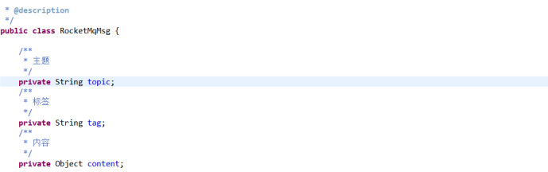

## 1：原生RocketMq集成

### 1）引入依赖
```xml
<dependency>
    <groupId>org.apache.rocketmq</groupId>
    <artifactId>rocketmq-client</artifactId>
    <version>4.7.0</version>
</dependency>
```
### 2）配置yml
```yml
# 是否开启自动配置
rocketmq:
  consumer:
    isOnOff: false
  # 发送同一类消息设置为同一个group，保证唯一默认不需要设置，rocketmq会使用ip@pid（pid代表jvm名字）作为唯一标识
    groupName: ${spring.application.name}
  # mq的nameserver地址
    namesrvAddr: 192.168.236.128:9876
  # 消费者订阅的主题topic和tags（*标识订阅该主题下所有的tags），格式: topic~tag1||tag2||tags3;
    topics: AK_PROJECT_MQ~TagA
  # 消费者线程数据量
    consumeThreadMin: 5
    consumeThreadMax: 32
  # 设置一次消费信心的条数，默认1
    consumeMessageBatchMaxSize: 1
```
### 3）消息发送
新增一个 `MQProducerConfigure` 配置类，用来初始化MQ生产者
```java
package com.dap.flow.design.delegate.mq;

import lombok.Getter;
import lombok.Setter;
import lombok.ToString;
import org.apache.rocketmq.client.exception.MQClientException;
import org.apache.rocketmq.client.producer.DefaultMQProducer;
import org.slf4j.Logger;
import org.slf4j.LoggerFactory;
import org.springframework.boot.autoconfigure.condition.ConditionalOnProperty;
import org.springframework.boot.context.properties.ConfigurationProperties;
import org.springframework.context.annotation.Bean;
import org.springframework.context.annotation.Configuration;

/**
 * @author: lockie
 * @Date: 2020/4/21 10:28
 * @Description: mq生产者配置
 */
@Getter
@Setter
@ToString
@Configuration
@ConfigurationProperties(prefix = "rocketmq.producer")
public class MQProducerConfigure {
    public static final Logger LOGGER = LoggerFactory.getLogger(MQProducerConfigure.class);

    private String groupName;
    private String namesrvAddr;
    // 消息最大值
    private Integer maxMessageSize;
    // 消息发送超时时间
    private Integer sendMsgTimeOut;
    // 失败重试次数
    private Integer retryTimesWhenSendFailed;

    /**
     * mq 生成者配置
     * @return
     * @throws MQClientException
     */
    @Bean
    @ConditionalOnProperty(prefix = "rocketmq.producer", value = "isOnOff", havingValue = "true")
    public DefaultMQProducer defaultProducer() throws MQClientException {
        LOGGER.info("defaultProducer 正在创建---------------------------------------");
        DefaultMQProducer producer = new DefaultMQProducer(groupName);
        producer.setNamesrvAddr(namesrvAddr);
        producer.setVipChannelEnabled(false);
        producer.setMaxMessageSize(maxMessageSize);
        producer.setSendMsgTimeout(sendMsgTimeOut);
        producer.setRetryTimesWhenSendAsyncFailed(retryTimesWhenSendFailed);
        producer.start();
        LOGGER.info("rocketmq producer server 开启成功----------------------------------");
        return producer;
    }
}
```
### 4）测试消息发送
```java
package com.dap.flow.design.delegate.mq;

import org.apache.commons.lang3.StringUtils;
import org.apache.ibatis.annotations.Results;
import org.apache.rocketmq.client.exception.MQBrokerException;
import org.apache.rocketmq.client.exception.MQClientException;
import org.apache.rocketmq.client.producer.DefaultMQProducer;
import org.apache.rocketmq.client.producer.SendResult;
import org.apache.rocketmq.common.message.Message;
import org.apache.rocketmq.remoting.exception.RemotingException;
import org.slf4j.Logger;
import org.slf4j.LoggerFactory;
import org.springframework.beans.factory.annotation.Autowired;
import org.springframework.web.bind.annotation.GetMapping;
import org.springframework.web.bind.annotation.RequestMapping;
import org.springframework.web.bind.annotation.RestController;

/**
 * @author: lockie
 * @Date: 2020/4/21 11:17
 * @Description:
 */
@RestController
@RequestMapping("/mqProducer")
public class MQProducerController {
    public static final Logger LOGGER = LoggerFactory.getLogger(MQProducerController.class);

    @Autowired
    DefaultMQProducer defaultMQProducer;

    /**
     * 发送简单的MQ消息
     * @param msg
     * @return
     */
    @GetMapping("/send")
    public String send(String msg) throws InterruptedException, RemotingException, MQClientException, MQBrokerException {
        if (StringUtils.isEmpty(msg)) {
            return "sucess";
        }
        LOGGER.info("发送MQ消息内容：" + msg);
        Message sendMsg = new Message("AK_PROJECT_MQ", "TagA", msg.getBytes());
        // 默认3秒超时
        SendResult sendResult = defaultMQProducer.send(sendMsg);
        LOGGER.info("消息发送响应：" + sendResult.toString());
        return "sucess";
    }

}
```
### 5）消息接收
新建一个 `MQConsumerConfigure` 类用来初始化MQ消费者
```java
package com.dap.flow.design.delegate.mq;

import lombok.Getter;
import lombok.Setter;
import lombok.ToString;
import org.apache.rocketmq.client.consumer.DefaultMQPushConsumer;
import org.apache.rocketmq.client.exception.MQClientException;
import org.apache.rocketmq.common.consumer.ConsumeFromWhere;
import org.slf4j.Logger;
import org.slf4j.LoggerFactory;
import org.springframework.beans.factory.annotation.Autowired;
import org.springframework.boot.autoconfigure.condition.ConditionalOnProperty;
import org.springframework.boot.context.properties.ConfigurationProperties;
import org.springframework.context.annotation.Bean;
import org.springframework.context.annotation.Configuration;

/**
 * @author: lockie
 * @Date: 2020/4/21 10:28
 * @Description: mq消费者配置
 */
@Getter
@Setter
@ToString
@Configuration
@ConfigurationProperties(prefix = "rocketmq.consumer")
public class MQConsumerConfigure {
    public static final Logger LOGGER = LoggerFactory.getLogger(MQConsumerConfigure.class);

    private String groupName;
    private String namesrvAddr;
    private String topics;
    // 消费者线程数据量
    private Integer consumeThreadMin;
    private Integer consumeThreadMax;
    private Integer consumeMessageBatchMaxSize;

    @Autowired
    private MQConsumeMsgListenerProcessor consumeMsgListenerProcessor;
    /**
     * mq 消费者配置
     * @return
     * @throws MQClientException
     */
    @Bean
    @ConditionalOnProperty(prefix = "rocketmq.consumer", value = "isOnOff", havingValue = "true")
    public DefaultMQPushConsumer defaultConsumer() throws MQClientException {
        LOGGER.info("defaultConsumer 正在创建---------------------------------------");
        DefaultMQPushConsumer consumer = new DefaultMQPushConsumer(groupName);
        consumer.setNamesrvAddr(namesrvAddr);
        consumer.setConsumeThreadMin(consumeThreadMin);
        consumer.setConsumeThreadMax(consumeThreadMax);
        consumer.setConsumeMessageBatchMaxSize(consumeMessageBatchMaxSize);
        // 设置监听
        consumer.registerMessageListener(consumeMsgListenerProcessor);

        /**
         * 设置consumer第一次启动是从队列头部开始还是队列尾部开始
         * 如果不是第一次启动，那么按照上次消费的位置继续消费
         */
        consumer.setConsumeFromWhere(ConsumeFromWhere.CONSUME_FROM_LAST_OFFSET);
        /**
         * 设置消费模型，集群还是广播，默认为集群
         */
//        consumer.setMessageModel(MessageModel.CLUSTERING);

        try {
            // 设置该消费者订阅的主题和tag，如果订阅该主题下的所有tag，则使用*,
            String[] topicArr = topics.split(";");
            for (String tag : topicArr) {
                String[] tagArr = tag.split("~");
                consumer.subscribe(tagArr[0], tagArr[1]);
            }
            consumer.start();
            LOGGER.info("consumer 创建成功 groupName={}, topics={}, namesrvAddr={}",groupName,topics,namesrvAddr);
        } catch (MQClientException e) {
            LOGGER.error("consumer 创建失败!");
        }
        return consumer;
    }
}
```
### 6）消息消费实现
```java
package com.dap.flow.design.delegate.mq;

import org.apache.rocketmq.client.consumer.listener.ConsumeConcurrentlyContext;
import org.apache.rocketmq.client.consumer.listener.ConsumeConcurrentlyStatus;
import org.apache.rocketmq.client.consumer.listener.MessageListenerConcurrently;
import org.apache.rocketmq.common.message.MessageExt;
import org.slf4j.Logger;
import org.slf4j.LoggerFactory;
import org.springframework.stereotype.Component;
import org.springframework.util.CollectionUtils;

import java.util.List;

/**
 * @author: lockie
 * @Date: 2020/4/21 11:05
 * @Description: 消费者监听
 */
@Component
public class MQConsumeMsgListenerProcessor implements MessageListenerConcurrently {
    public static final Logger LOGGER = LoggerFactory.getLogger(MQConsumeMsgListenerProcessor.class);


    /**
     * 默认msg里只有一条消息，可以通过设置consumeMessageBatchMaxSize参数来批量接收消息
     * 不要抛异常，如果没有return CONSUME_SUCCESS ，consumer会重新消费该消息，直到return CONSUME_SUCCESS
     * @param msgList
     * @param consumeConcurrentlyContext
     * @return
     */
    @Override
    public ConsumeConcurrentlyStatus consumeMessage(List<MessageExt> msgList, ConsumeConcurrentlyContext consumeConcurrentlyContext) {
        if (CollectionUtils.isEmpty(msgList)) {
            LOGGER.info("MQ接收消息为空，直接返回成功");
            return ConsumeConcurrentlyStatus.CONSUME_SUCCESS;
        }
        MessageExt messageExt = msgList.get(0);
        LOGGER.info("MQ接收到的消息为：" + messageExt.toString());
        try {
            String topic = messageExt.getTopic();
            String tags = messageExt.getTags();
            String body = new String(messageExt.getBody(), "utf-8");

            LOGGER.info("MQ消息topic={}, tags={}, 消息内容={}", topic,tags,body);
        } catch (Exception e) {
            LOGGER.error("获取MQ消息内容异常{}",e);
        }
        // TODO 处理业务逻辑
        return ConsumeConcurrentlyStatus.CONSUME_SUCCESS;
    }
}
```

## 2：rocketmq-spring-boot-starter集成

### 1）引入依赖
```xml
<dependency>
    <groupId>org.apache.rocketmq</groupId>
    <artifactId>rocketmq-spring-boot-starter</artifactId>
    <version>2.1.1</version>
</dependency>
```
注：服务管控平台由于引入的 `springboot` 版本太低，引入 `rocketmq-spring-boot-starter`后，启动时会提示某些类找不到，所以需要将 `rocketmq-client` 包单独引入进来
```xml
<dependency>
    <groupId>org.apache.rocketmq</groupId>
    <artifactId>rocketmq-client</artifactId>
    <version>4.7.0</version>
</dependency>

<dependency>
    <groupId>org.apache.rocketmq</groupId>
    <artifactId>rocketmq-spring-boot-starter</artifactId>
    <version>2.1.1</version>
</dependency>
```
### 2）配置yml
```yml
rocketmq:
  name-server: 192.168.236.128:9876
  topic: AK_PROJECT_MQ
  producer:
    group: pro_group
  consumer:
    group: con_group
```
### 3）消息发送
```java
package com.dap.flow.design.mq;

import lombok.SneakyThrows;
import org.apache.rocketmq.client.producer.SendCallback;
import org.apache.rocketmq.client.producer.SendResult;
import org.apache.rocketmq.spring.core.RocketMQTemplate;
import org.springframework.beans.factory.annotation.Autowired;
import org.springframework.beans.factory.annotation.Value;
import org.springframework.web.bind.annotation.GetMapping;
import org.springframework.web.bind.annotation.RestController;

@RestController
public class RocketProduce {

    @Value("${rocketmq.topic}")
    private String my_topic;

    @Value("${rocketmq.producer.group}")
    private String my_consumer_group;

    @Autowired
    private RocketMQTemplate rocketMQTemplate;

    //同步发送
    @SneakyThrows
    @GetMapping("/sync")
    public void sync(){
        String msg = "hello world";
        SendResult sendResult = rocketMQTemplate.syncSend(my_topic, msg);
        System.out.println("同步发送字符串: " + msg + "至topic: "+my_topic+",发送结果: " + sendResult);
    }

    //异步发送
    @SneakyThrows
    @GetMapping("/async")
    public void async(){

        rocketMQTemplate.asyncSend("test", "Hello world!", new SendCallback() {
            @Override
            public void onSuccess(SendResult var1) {
                System.out.println("异步发送成功: "+ var1);
            }
            @Override
            public void onException(Throwable var1) {
                System.out.println("异步发送失败: "+ var1);
            }
        });
    }

    //单向发送
    @SneakyThrows
    @GetMapping("/sendOneWay")
    public void oneway(){
        rocketMQTemplate.sendOneWay("test", "Hello world!");
        System.out.println("单向发送");
    }
}
```
模拟消息发送还可以通过控制台完成
登录rocketMq管控平台地址：http://192.168.236.128:8080/

### 4）消息接收
```java
package com.dap.flow.design.delegate.mq;

import com.alibaba.fastjson.JSON;
import com.alibaba.fastjson.JSONObject;
import com.dap.flow.design.config.exception.DesignerException;
import io.vavr.control.Try;
import lombok.extern.slf4j.Slf4j;
import org.apache.rocketmq.common.message.MessageExt;
import org.apache.rocketmq.spring.annotation.RocketMQMessageListener;
import org.apache.rocketmq.spring.core.RocketMQListener;
import org.springframework.stereotype.Service;

/**
 * @author: gtli
 * @create: 2021-01-09 20:18
 * @description: 云效需求任务下发
 **/
@Slf4j
@Service
@RocketMQMessageListener(consumerGroup = "${rocketmq.consumer.group}", selectorExpression = "*", topic = "${rocketmq.topic}")
public class OpsReqTaskConsumer implements RocketMQListener<MessageExt> {
    private final static String ISSUE_CREATE ="issue.create";
    private final static String ISSUE_UPDATE ="issue.update";
    private final static String ISSUE_DELETE ="issue.delete";

    @Override
    public void onMessage(MessageExt messageExt) {
        String tag = messageExt.getTags();
        byte[] body = messageExt.getBody();
        String msg = new String(body);
        log.info("获取云效需求任务信息[]",msg);

        try {
            JSONObject json = JSON.parseObject(msg);
            // 获取云效需求任务信息
            JSONObject reqTask = json.getJSONObject("data");


            // 任务新增
            if(tag.equals(ISSUE_CREATE)) {

            }

            //任务修改
            if(tag.equals(ISSUE_UPDATE)) {

            }

            //任务删除
            if(tag.equals(ISSUE_DELETE)) {

            }

            System.out.println(new String(body));
            throw new DesignerException("sasa");
        } catch (Exception e) {
            log.error("接收到的云效任务处理失败");
        }
    }

}
```
## 3：普元EOS平台rocketmq-spring-boot-starter集成

### 1）引入依赖
```xml
  <dependency>
    <groupId>org.apache.rocketmq</groupId>
    <artifactId>rocketmq-spring-boot-starter</artifactId>
    <version>2.1.1</version>
</dependency>
```
### 2）配置application-*.properties

### 3）消息发送
消息信息映射 `RocketMqMsg` ：


消息信息输入 `AsRocketMqProducerInput` :


消息信息生产服务 `RocketMqProducerService` :


### 4）消息接收

