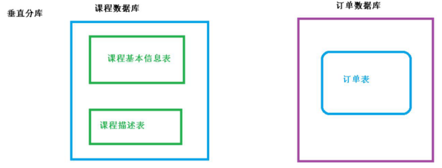
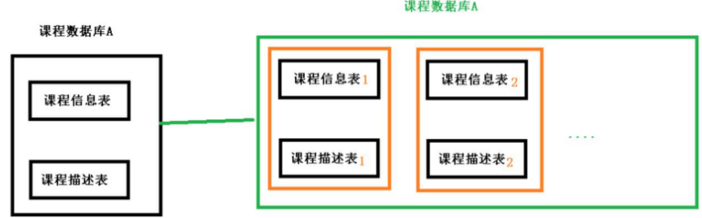

[官方网址](https://shardingsphere.apache.org/index_zh.html)

## 1：ShardingSphere简介
- 1、一套开源的 **分布式数据库中间件** 解决方案
- 2、有三个产品：`Sharding-JDBC` 和 `Sharding-Proxy`
- 3、定位为 **关系型数据库中间件** ，合理在分布式环境下使用关系型数据库操作

## 2：什么是分库分表

- 1、数据库数据量不可控的，随着时间和业务发展，造成表里面数据越来越多，如果再去对数
据库表 curd 操作时候，造成性能问题。
- 2、方案 1：从硬件上
- 3、方案 2：分库分表

**为了解决由于数据量过大而造成数据库性能降低问题。**

## 3：分库分表的方式

> 分库分表有两种方式：
- 垂直 **切分**
  - 垂直 **分表**
  - 垂直 **分库**
- 水平 **切分**
  - 水平 **分表**
  - 水平 **分库**

### 垂直分表

（1）操作数据库中某张表，把这张表中 `一部分字段数据` 存到 `一张新表` 里面，再把 `这张表另一部分字段数据` 存到 `另外一张表` 里面

### 垂直分库

（1）把单一数据库按照业务进行划分，`专库专表`

### 水平分表

（1）把一张表中的数据按照 `一定规则` ，分散到 `多张表` 中，这样就可以把一个表的数据分散到多个表中，这样可以减少一个表的数据量，减少锁的冲突，提高并发性能。

### 水平分库

（1）把一个数据库按照 `一定规则` ，分散到 `多张数据库` 中，每个数据库中的表结构都是一致的

## 4：分库分表应用和问题
> 1、应用
- （1）在数据库设计时候考虑 `垂直分库` 和 `垂直分表`
- （2）随着数据库数据量增加，**不要马上考虑做水平切分，首先考虑缓存处理，读写分离，使用索引等等方式**，如果这些方式不能根本解决问题了，再考虑做水平分库和水平分表

> 2、分库分表问题
- （1）跨节点连接查询问题（分页、排序）
- （2）多数据源管理问题

