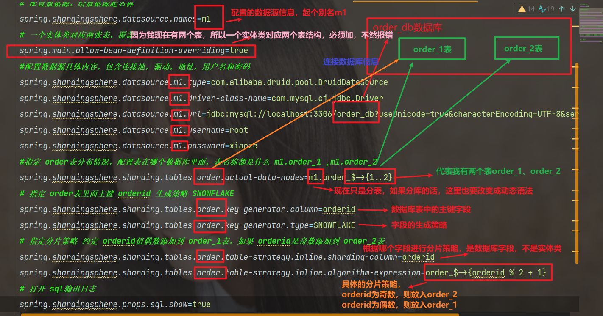
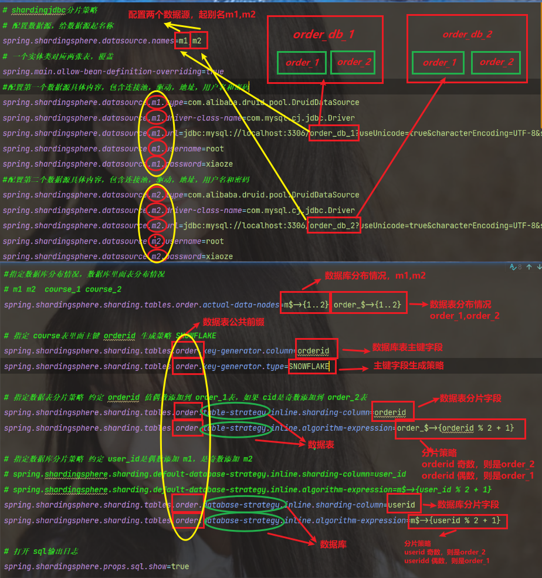
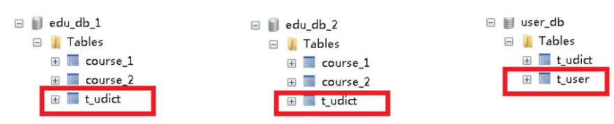

[官方网址](https://shardingsphere.apache.org/document/4.0.0/cn/user-manual/shardingsphere-jdbc/)

## 1：简介

- 1、是轻量级的 java 框架，是增强版的 JDBC 驱动
- 2、Sharding-JDBC
  - （1）主要目的是：简化对分库分表之后数据相关操作
  
## 2：使用

### 1）环境搭建

#### pom.xml

```xml
        <dependency>
            <groupId>org.springframework.boot</groupId>
            <artifactId>spring-boot-starter-web</artifactId>
        </dependency>

        <dependency>
            <groupId>org.projectlombok</groupId>
            <artifactId>lombok</artifactId>
            <optional>true</optional>
        </dependency>
        <!--mybatis-plus 持久层-->
        <dependency>
            <groupId>com.baomidou</groupId>
            <artifactId>mybatis-plus-boot-starter</artifactId>
            <version>3.4.2</version>
        </dependency>
        <dependency>
            <groupId>com.alibaba</groupId>
            <artifactId>druid-spring-boot-starter</artifactId>
            <version>1.1.20</version>
        </dependency>
        <dependency>
            <groupId>mysql</groupId>
            <artifactId>mysql-connector-java</artifactId>
        </dependency>
        <dependency>
            <groupId>org.apache.shardingsphere</groupId>
            <artifactId>sharding-jdbc-spring-boot-starter</artifactId>
            <version>4.0.0-RC1</version>
        </dependency>
```

### 2）水平分表

#### 1）主要配置哪些东西？

- 1、配置 `数据源`，给数据源起名称
- 2、一个实体类对应两张表，覆盖
- 3、配置数据源具体内容，包含连接池，驱动，地址，用户名和密码
- 4、指定 `order` 表分布情况，配置表在哪个数据库里面，表名称都是什么 `m1.order_1` , `m1.order_2`
- 5、指定 `order` 表里面主键 `orderid` 生成策略 `SNOWFLAKE`
- 6、指定 `分片策略` 约定 **orderid值偶数添加到 order_1表，如果 orderid是奇数添加到 order_2表**
- 7、打开 `sql输出日志`


#### 2）配置讲解图



#### 3）配置

```properties
# 应用服务 WEB 访问端口
server.port=8080

# shardingjdbc分片策略
# 配置数据源，给数据源起名称
spring.shardingsphere.datasource.names=m1
# 一个实体类对应两张表，覆盖
spring.main.allow-bean-definition-overriding=true
#配置数据源具体内容，包含连接池，驱动，地址，用户名和密码
spring.shardingsphere.datasource.m1.type=com.alibaba.druid.pool.DruidDataSource
spring.shardingsphere.datasource.m1.driver-class-name=com.mysql.cj.jdbc.Driver
spring.shardingsphere.datasource.m1.url=jdbc:mysql://localhost:3306/order_db?useUnicode=true&characterEncoding=UTF-8&serverTimezone=Asia/Shanghai
spring.shardingsphere.datasource.m1.username=root
spring.shardingsphere.datasource.m1.password=xiaoze

#指定 order表分布情况，配置表在哪个数据库里面，表名称都是什么 m1.order_1 ,m1.order_2
spring.shardingsphere.sharding.tables.order.actual-data-nodes=m1.order_$->{1..2}

# 指定 order表里面主键 orderid 生成策略 SNOWFLAKE
spring.shardingsphere.sharding.tables.order.key-generator.column=orderid
spring.shardingsphere.sharding.tables.order.key-generator.type=SNOWFLAKE

# 指定分片策略 约定 orderid值偶数添加到 order_1表，如果 orderid是奇数添加到 order_2表
spring.shardingsphere.sharding.tables.order.table-strategy.inline.sharding-column=orderid
spring.shardingsphere.sharding.tables.order.table-strategy.inline.algorithm-expression=order_$->{orderid % 2 + 1}

# 打开 sql输出日志
spring.shardingsphere.props.sql.show=true
```

### 3）水平分库分表

#### 1）主要配置哪些东西？

- 1、配置 `数据源`，给数据源起名称
- 2、一个实体类对应两张表，覆盖
- 3、配置 `第一个数据源` 具体内容，包含连接池，驱动，地址，用户名和密码
- 4、配置 `第二个数据源` 具体内容，包含连接池，驱动，地址，用户名和密码
- 5、指定 **数据库分布情况，数据库里面表分布情况**
- 6、指定 `order` 表里面主键 `orderid` 生成策略 `SNOWFLAKE`
- 7、指定 `数据表分片策略` 约定 **`orderid` 值偶数添加到 `order_1` 表，如果 `orderid` 是奇数添加到 `order_2` 表**
- 8、指定 `数据库分片策略` 约定 **`userid`是偶数添加 `m1`，是奇数添加 `m2`**
- 9、打开 sql输出日志

#### 2）配置讲解图


#### 3）配置

```properties
# 应用服务 WEB 访问端口
server.port=8080

# shardingjdbc分片策略
# 配置数据源，给数据源起名称
spring.shardingsphere.datasource.names=m1,m2
# 一个实体类对应两张表，覆盖
spring.main.allow-bean-definition-overriding=true
#配置第一个数据源具体内容，包含连接池，驱动，地址，用户名和密码
spring.shardingsphere.datasource.m1.type=com.alibaba.druid.pool.DruidDataSource
spring.shardingsphere.datasource.m1.driver-class-name=com.mysql.cj.jdbc.Driver
spring.shardingsphere.datasource.m1.url=jdbc:mysql://localhost:3306/order_db_1?useUnicode=true&characterEncoding=UTF-8&serverTimezone=Asia/Shanghai
spring.shardingsphere.datasource.m1.username=root
spring.shardingsphere.datasource.m1.password=xiaoze
#配置第二个数据源具体内容，包含连接池，驱动，地址，用户名和密码
spring.shardingsphere.datasource.m2.type=com.alibaba.druid.pool.DruidDataSource
spring.shardingsphere.datasource.m2.driver-class-name=com.mysql.cj.jdbc.Driver
spring.shardingsphere.datasource.m2.url=jdbc:mysql://localhost:3306/order_db_2?useUnicode=true&characterEncoding=UTF-8&serverTimezone=Asia/Shanghai
spring.shardingsphere.datasource.m2.username=root
spring.shardingsphere.datasource.m2.password=xiaoze

#指定数据库分布情况，数据库里面表分布情况
# m1 m2  order_1 order_2
spring.shardingsphere.sharding.tables.order.actual-data-nodes=m$->{1..2}.order_$->{1..2}

# 指定 order表里面主键 orderid 生成策略 SNOWFLAKE
spring.shardingsphere.sharding.tables.order.key-generator.column=orderid
spring.shardingsphere.sharding.tables.order.key-generator.type=SNOWFLAKE

# 指定数据表分片策略 约定 orderid 值偶数添加到 order_1表，如果 cid是奇数添加到 order_2表
spring.shardingsphere.sharding.tables.order.table-strategy.inline.sharding-column=orderid
spring.shardingsphere.sharding.tables.order.table-strategy.inline.algorithm-expression=order_$->{orderid % 2 + 1}

# 指定数据库分片策略 约定 user_id是偶数添加 m1，是奇数添加 m2
# spring.shardingsphere.sharding.default-database-strategy.inline.sharding-column=user_id
# spring.shardingsphere.sharding.default-database-strategy.inline.algorithm-expression=m$->{user_id % 2 + 1}
spring.shardingsphere.sharding.tables.order.database-strategy.inline.sharding-column=userid
spring.shardingsphere.sharding.tables.order.database-strategy.inline.algorithm-expression=m$->{userid % 2 + 1}

# 打开 sql输出日志
spring.shardingsphere.props.sql.show=true
```

### 4）垂直分库

```properties
# shardingjdbc分片策略
# 配置数据源，给数据源起名称,
# 水平分库，配置两个数据源
spring.shardingsphere.datasource.names=m1,m2,m0
# 一个实体类对应两张表，覆盖
spring.main.allow-bean-definition-overriding=true
#配置第一个数据源具体内容，包含连接池，驱动，地址，用户名和密码
spring.shardingsphere.datasource.m1.type=com.alibaba.druid.pool.DruidDataSource
spring.shardingsphere.datasource.m1.driver-class-name=com.mysql.cj.jdbc.Driver
spring.shardingsphere.datasource.m1.url=jdbc:mysql://localhost:3306/edu_db_1?serverTimezone=GMT%2B8
spring.shardingsphere.datasource.m1.username=root
spring.shardingsphere.datasource.m1.password=xiaoze
#配置第二个数据源具体内容，包含连接池，驱动，地址，用户名和密码
spring.shardingsphere.datasource.m2.type=com.alibaba.druid.pool.DruidDataSource
spring.shardingsphere.datasource.m2.driver-class-name=com.mysql.cj.jdbc.Driver
spring.shardingsphere.datasource.m2.url=jdbc:mysql://localhost:3306/edu_db_2?serverTimezone=GMT%2B8
spring.shardingsphere.datasource.m2.username=root
spring.shardingsphere.datasource.m2.password=xiaoze

#配置第三个数据源具体内容，包含连接池，驱动，地址，用户名和密码
spring.shardingsphere.datasource.m0.type=com.alibaba.druid.pool.DruidDataSource
spring.shardingsphere.datasource.m0.driver-class-name=com.mysql.cj.jdbc.Driver
spring.shardingsphere.datasource.m0.url=jdbc:mysql://localhost:3306/user_db?serverTimezone=GMT%2B8
spring.shardingsphere.datasource.m0.username=root
spring.shardingsphere.datasource.m0.password=xiaoze


# 配置 user_db数据库里面 t_user 专库专表
spring.shardingsphere.sharding.tables.t_user.actual-data-nodes=m$->{0}.t_user
# 指定 t_user表里面主键 user_id 生成策略 SNOWFLAKE
spring.shardingsphere.sharding.tables.t_user.key-generator.column=user_id
spring.shardingsphere.sharding.tables.t_user.key-generator.type=SNOWFLAKE
# 指定表分片策略 约定 user_id 值偶数添加到 t_user_1表，如果 user_id 是奇数添加到 t_user_2 表
spring.shardingsphere.sharding.tables.t_user.table-strategy.inline.sharding-column=user_id
spring.shardingsphere.sharding.tables.t_user.table-strategy.inline.algorithm-expression=t_user
```

### 5）操作公共表

- 1、公共表
  - （1）存储固定数据的表，表数据很少发生变化，查询时候经常进行关联
  - （2）**在每个数据库中创建出相同结构公共表**
- 2、在多个数据库都创建相同结构公共表



- 3、在项目配置文件 `application.properties` 进行公共表配置
# 配置公共表
```properties
spring.shardingsphere.sharding.broadcast-tables=t_udict
spring.shardingsphere.sharding.tables.t_udict.key-generator.column=dictid
spring.shardingsphere.sharding.tables.t_udict.key-generator.type=SNOWFLAKE
```
