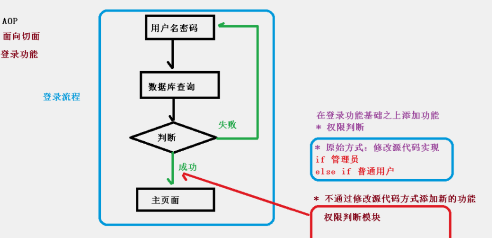
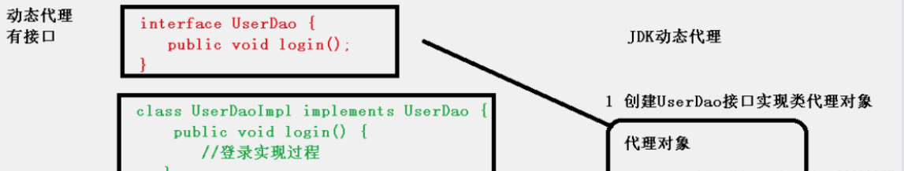
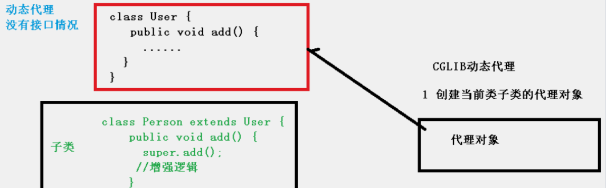
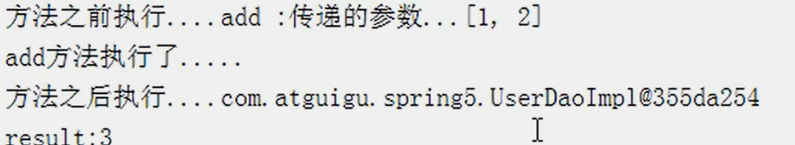

## 1：AOP基本概念

- （1）`面向切面编程（方面`，利用 AOP 可以对业务逻辑的各个部分进行隔离，从而使得业务逻辑各部分之间的耦合度降低，提高程序的可重用性，同时提高了开发的效率。

- （2）`通俗描述`：不通过修改源代码方式，在主干功能里面添加新功能。

- （3）`使用登录例子说明 AOP`:



## 2：AOP代理类型

> AOP 底层使用动态代理 

动态代理包括：`JDK 动态代理（接口）`、`CGLIB 动态代理（子类）`。

### 1）JDK 动态代理

**​创建接口实现类代理对象**，增强类的方法



### 2）CGLIB 动态代理

**创建子类的代理对象**，增强类的方法




## 3：AOP（JDK 动态代理 原理！）

### 1） 使用 JDK 动态代理

> 使用 Proxy 类里面的方法创建代理对象。调用 `newProxyInstance` 方法，方法有三个参数：

```java
public static Object newProxyInstance(ClassLoader loader,Class<?>[] interfaces,InvocationHandler h)
```

- `loader` : 代理类加载器。

- `interfaces` : 需要增强方法的类（被），这个类实现的接口，支持多个接口。

- `h` : 实现这个接口 `InvocationHandler`，创建代理对象，写增强的部分 。

### 2）编写 JDK 动态代理代码
```java
//（1）创建接口，定义方法
public interface UserDao {
 public int add(int a,int b);
 public String update(String id);
}

//（2）创建接口实现类，实现方法
public class UserDaoImpl implements UserDao {
 @Override
 public int add(int a, int b) {
     return a+b;
 }
 @Override
 public String update(String id) {
     return id;
 }
}

//（3）使用 Proxy 类创建接口代理对象
public class JDKProxy {
 public static void main(String[] args) {
     //创建接口实现类代理对象
     Class[] interfaces = {UserDao.class};
     UserDaoImpl userDao = new UserDaoImpl(); 
    /** 第一参数，类加载器 
        第二参数，增强方法所在的类，这个类实现的接口，(支持多个接口)
        第三参数，实现这个接口 InvocationHandler，创建代理对象，写增强的部分  */
     UserDao dao =(UserDao)Proxy.newProxyInstance(JDKProxy.class.getClassLoader(), interfaces,
                        new UserDaoProxy(userDao));
     int result = dao.add(1, 2);
     System.out.println("result:"+result);
 }
}

//创建代理对象代码
class UserDaoProxy implements InvocationHandler {
 //1 把创建的是谁的代理对象，把谁传递过来
 //有参数构造传递
 private Object obj;
 public UserDaoProxy(Object obj) {
     this.obj = obj;
 }
 //增强的逻辑
 @Override
 public Object invoke(Object proxy, Method method, Object[] args) throws Throwable {
     //方法之前
     System.out.println("方法之前执行...."+method.getName()+" :传递的参数..."+ Arrays.toString(args));
     //被增强的方法执行
     Object res = method.invoke(obj, args);
     //方法之后
     System.out.println("方法之后执行...."+obj);
     return res;
 }
}
```



## 4：AOP（术语）(!)

- （1）***连接点*** ：类里面哪些方法可以被增强，这些方法称为连接点。

- （2）***切入点*** ：实际要被真正增强的方法称为切入点。

- （3）***通知（增强）*** ：实际增强的逻辑部分称为通知，且分为以下五种类型：

  - 1）前置通知
  - 2）后置通知
  - 3）环绕通知(包括前置通知和后置通知)
  - 4）异常通知
  - 5）最终通知(finally 无论异常怎样 都需要执行)

- （4）***切面*** ：把通知应用到切入点过程。

## 5：AOP操作-准备工作

> `Spring` 框架一般都是基于 `AspectJ` 实现 `AOP` 操作，`AspectJ` 不是 `Spring` 组成部分，是独立 `AOP` 框架，一般把 `AspectJ` 和 `Spirng` 框架一起使用，进行 `AOP` 操作。

### 1）切入点表达式
> （1）***切入点表达式作用*** ：知道对哪个类里面的哪个方法进行增强     
（2）***语法结构*** ： `execution([权限修饰符(public、private)] [返回类型] [类全路径] [方法名称]([参数列表]) ) `   
（3）***例子如下*** ：  
例 1：对 `com.xiaoze.exer.Aspect.AopTest.TestMethods` 类里面的 `add` 进行增强
`execution(*(任意修饰符都行) (返回类型可省略不写) com.xiaoze.exer.Aspect.AopTest.TestMethods.add(..))` // ..表示方法中的参数     
例 2：对 `com.xiaoze.exer.Aspect.AopTest.TestMethods` 类里面的所有的方法进行增强
`execution(* com.xiaoze.exer.Aspect.AopTest.TestMethods.* (..)) `   
例 3：对 `com.xiaoze.exer.Aspect.AopTest` 包里面所有类的所有方法进行增强 `execution(* com.xiaoze.exer.Aspect.AopTest.*.* (..))`

## 6：实现

### 1）要被增强的方法
```java
@RestController
@Api(tags = "Aop测试")
@CrossOrigin
public class TestMethods {

    @GetMapping("/AopTest")
    public String add(String username) {
        System.out.println("-----------------------------------");
        System.out.println("add.......,输入的用户姓名是：" + username);
        System.out.println("-----------------------------------");

        return "方法中的返回值是：" + username;
    }
}
```
### 2）aop进行增强

```java
  //相同切入点抽取（封装） ==> 公共相同的切入点进行抽取，
   @Pointcut(value = "execution(* com.xiaoze.exer.Aspect.AopTest.TestMethods.add(..))")
   public void pointdemo() {
   }
```
`@Before(value = "pointdemo()")` 和 `@Before(value = "execution(* com.xiaoze.exer.Aspect.AopTest.TestMethods.add(..))")` 这两段代码其实相等，***使用切点是为了可以进行抽取重复利用*** ，在五种通知类型中直接使用切点就可以了，不用单独写 `execution(* com.xiaoze.exer.Aspect.AopTest.TestMethods.add(..)`

```java
package com.xiaoze.exer.Aspect.AopTest;

import org.aspectj.lang.JoinPoint;
import org.aspectj.lang.ProceedingJoinPoint;
import org.aspectj.lang.annotation.*;
import org.springframework.stereotype.Component;

/**
 * @author 小泽
 * @create 2023-11-29  22:21
 * 记得每天敲代码哦
 */
@Aspect
@Component
public class AopTest {

       //相同切入点抽取（封装） ==> 公共相同的切入点进行抽取，
       @Pointcut(value = "execution(* com.xiaoze.exer.Aspect.AopTest.TestMethods.add(..))")
       public void pointdemo() {
       }

       //前置通知 ==> 抽取相同的切入点的应用。
       //@Before注解表示作为前置通知 ==> 在Aspectj中
       @Before(value = "pointdemo()")//相同切入点抽取（封装）的调用
       public void before(JoinPoint joinPoint) {
              Object[] args = joinPoint.getArgs();
              for (Object arg : args) {
                     System.out.println("在前置通知中输出被增强方法的参数是：" + arg);
              }
              System.out.println("before.........");
       }

       //后置通知（返回通知）
       @AfterReturning(value = "execution(* com.xiaoze.exer.Aspect.AopTest.TestMethods.add(..))",returning = "result") // 自定义切入点
       public void afterReturning0(JoinPoint joinPoint,Object result) {
              System.out.println("后置通知中获取的返回值是："+result);
              System.out.println("afterReturning.........");
       }

       //最终通知
       @After(value = "execution(* com.xiaoze.exer.Aspect.AopTest.TestMethods.add(..))")
       public void after() {
              System.out.println("after.........");
       }

       //异常通知
       @AfterThrowing(value = "execution(* com.xiaoze.exer.Aspect.AopTest.TestMethods.add(..))")
       public void afterThrowing() {
              System.out.println("afterThrowing.........");
       }

       //环绕通知
       @Around(value = "execution(* com.xiaoze.exer.Aspect.AopTest.TestMethods.add(..))")
       public void around(ProceedingJoinPoint proceedingJoinPoint) throws Throwable {
              System.out.println("环绕之前.........");

              Object[] args = proceedingJoinPoint.getArgs();
              for (Object arg : args) {
                     System.out.println("在环绕通知中输出被增强方法的参数是：" + arg);
              }
              //被增强的方法执行
              proceedingJoinPoint.proceed();

              System.out.println("环绕之后.........");
       }

}
```


### 3）设置增强类优先级
- 有多个增强类对同一个方法进行增强，可以设置 **增强的优先级** 
- 在增强类上面添加注解 `@Order(数字类型值)`，数字类型 ***值越小优先级越高*** 

```java
@Component
@Aspect
@Order(1)
public class PersonProxy{     
    //后置通知（返回通知）
    @AfterReturning(value = "execution(* com.xiaoze.exer.Aspect.AopTest.TestMethods.add(..))")
    public void afterReturning() {
        System.out.println("afterReturning.........");
    }}


@Component
@Aspect
@Order(2)
public class UserProxy{    
    //后置通知（返回通知）
    @AfterReturning(value = "execution(* com.xiaoze.exer.Aspect.AopTest.TestMethods.add(..))")
    public void afterReturning() {
        System.out.println("afterReturning.........");
    } }

则先执行PersonProxy的切入，后执行UserProxy的切入。
```