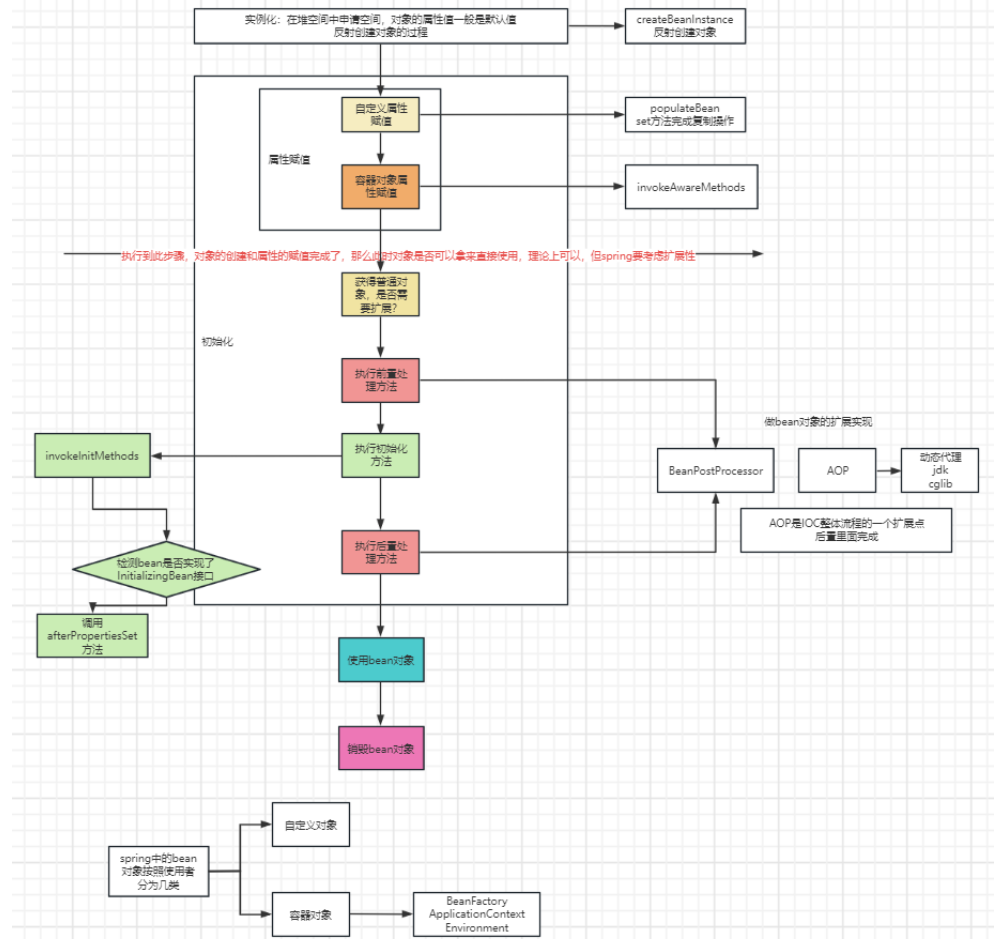

- **控制反转IoC(Inversion of Control)**，是一种设计思想，
- **DI(依赖注入)**，是实现IoC的一种方法


## 1：IOC

### 1.1 Spring Ioc的由来

首先，我们要清楚 **Spring IoC** 是一种 **设计思想**，假如一个系统有大量的组件，都需要我们手动去管理其生命周期和维持它们之间的关系，对于程序员来说，是非常不好管理的，**这不仅大大增加了系统的复杂度，同时还会使它们的依赖具有很强的耦合性**，那么为了更好的管理组件，由此引入了 `Spring IoC`的思想，利用Spring容器去管理大量组件。其实，**Spring IoC 就相当于一个中间层，用来负责解耦的容器，负责创建，管理，销毁bean的过程**。

> 那么IoC容器主要有的好处：

- 一是容器管理所有的对象，我们不需要去手动创建对象；
- 二是容器管理所有的依赖项，在创建实例的时候不需要了解其中的细节。

### 1.2 Ioc思想

**IoC（Inversion of Control，控制反转）**，将对象的控制权交给 IOC 容器，是由容器（Spring）创建，管理，销毁bean的过程，是Spring的核心。在日常的开发过程中，我们一般是通过new来创建对象的；**当我们使用IoC控制反转时，创建对象是由Spring容器来替我们new出对象实例。目的是为了降低耦合度。**

### 1.3 Ioc实现

#### 1.3.1 实现原理

利用（**反射+工厂**）技术，根据 **配置文件** 中给出的 **类名** 生成相应的 **对象**。


#### 1.3.2 实现过程

​`Spring` 通过配置文件描述 `Bean` 及 `Bean` 之间的依赖关系（或者是注解@annotation），利用Java语言的反射功能实例化Bean并建立Bean之间的依赖关系。（其中我们主要讲解的部分为注解形式，xml形式会以一个实例来表示。

##### xml方式

```java
public class Hello {
    private String name;
    @Override
    public String toString() {
        return "Hello{" +
                "name='" + name + '\'' +
                '}';
    }
    public String getName() {
        return name;
    }
    public void setName(String name) {
        this.name = name;
    }
    public void show(){
        System.out.println("Hello,"+name);
    }
}
//测试类
public class Test {
    public static void main(String[] args) {
        //解析bean.xml文件，生成管理相应的Bean对象
        ApplicationContext context = new ClassPathXmlApplicationContext("bean.xml");
        //getBean:参数即为spring配置文件中的bean的id
        Hello hello = (Hello) context.getBean("hello");
        hello.show();
    }
}
```

```xml
<!--此文件命名为bean.xml-->
<?xml version="1.0" encoding="UTF-8"?>
<beans xmlns="http://www.springframework.org/schema/beans"
       xmlns:xsi="http://www.w3.org/2001/XMLSchema-instance"
       xsi:schemaLocation="http://www.springframework.org/schema/beans
        https://www.springframework.org/schema/beans/spring-beans.xsd">
    <!--id=变量名 class 相当于new 的类 property 相当于给对象中的属性赋值-->
    <bean id="hello" class="com.jm.helloWorld.Hello">
        <property name="name" value="jm"></property>
    </bean>
</beans>
```

##### 注解方式

​首先我们需要创建组件（IOC）的注解，通过@Bean，在配置类集中创建第三方的bean。我们先来了解一下`@Bean` 和 `@Configuration` 注解：
- `@Bean`：用于实例化表示方法,配置和初始化一个新的对象由Spring IoC容器管理。类似于bean.xml配置文件中的bean元素。
- `@Configuration`：用来告诉容器Spring，这是一个配置类，相当于bean.xml文件。


```java
//配置类
@Configuration    //当配置ComponentScan 此注解也会被托管
@ComponentScan(basePackages = "com.jm.ioc1.bean")  //当没有配置时 默认找此包或者此包下的子包
public class AppConfig {
    //对于第三方引入的类
    @Bean
    public Teacher teacher(){
        return new Teacher();
    }
}
//外部类
public class Teacher {

    private String name;

    public Teacher() {
        System.out.println("Teacher无参构造");
    }
    public String getName() {
        return name;
    }
    public void setName(String name) {
        this.name = name;
    }
    @Override
    public String toString() {
        return "Teacher{" +
                "name='" + name + '\'' +
                '}';
    }
}
//测试类
public class Test {
    public static void main(String[] args) {
        //引入spring来托管
        ApplicationContext applicationContext = new AnnotationConfigApplicationContext(AppConfig.class);
        Teacher teacher = (Teacher) applicationContext.getBean("teacher");   
        //如果Bean中没有赋值，那么默认以类的首字母小写取到其bean
        System.out.println(teacher);
    }
}

```
## 2：DI

### 2.1 DI的含义
DI（Dependency Injection），依赖注入，当一个对象biz依赖另一个对象dao时，在程序运行期，由容器将依赖装配进去的过程，称为DI

### 2.2 注入依赖的方式

#### 构造方法注入

```java
public class Student {
    private Integer id;
    private String name;

    public Student(Integer id, String name) {
        this.id = id;
        this.name = name;
    }
}
```

#### set方法注入

```java
public class Student {
    private Integer id;
    private String name;

    public void setId(Integer id) {
        this.id = id;
    }

    public void setName(String name) {
        this.name = name;
    }
}
```

#### 属性方法注入

```java
public class Student {
    private Integer id;
    private String name;
    
    public void findStudent(String name){
        //功能
    }

    public static void main(String[] args) {
        Student s = new Student();
        s.findStudent("jm");
    }
}
```

#### 注解方式注入

##### @Value，以下为连接数据库的案例

```java
//配置类
@Configuration
@ComponentScan
@PropertySource("classpath:druid.properties")   //是由SpringIOC的属性读取对象
public class AppConfig {

    private Logger logger = Logger.getLogger(AppConfig.class.getName());

    @Value("${jdbc.username}")   //DI:依赖注入  String类型的参数
    private String user;
    @Value("${jdbc.password}")   //DI:依赖注入  String类型的参数
    private String password;
    @Value("${jdbc.url}")   //DI:依赖注入  String类型的参数
    private String url;
    @Value("${jdbc.driverClassName}")   //DI:依赖注入  String类型的参数
    private String driverClassName;

//    @Value("10")
    @Value("#{T(java.lang.Runtime).getRuntime().availableProcessors()*2}")    //Spring 表达式语言
    private int cpuCount;

    @Bean(initMethod = "init")
    public DruidDataSource ds( @Value("${jdbc.username}") String user){
//        DataSource ds = new DruidDataSource();
        DruidDataSource dds = new DruidDataSource();

        dds.setUsername(user);
        dds.setPassword(password);
        dds.setUrl(url);
        dds.setDriverClassName(driverClassName);

        //当前主机的cpu数*2
        //1、
//        int c = Runtime.getRuntime().availableProcessors() * 2;
        logger.info("配置druid连接池的大小:" + cpuCount);
        dds.setMaxActive(cpuCount);
        return dds;
    }
}

```xml
jdbc.driverClassName=com.mysql.cj.jdbc.Driver
jdbc.url=jdbc:mysql://localhost:3306/test?serverTimezone=UTC
jdbc.username=****
jdbc.password=****
```
还有一点需要了解的是，@value中可以应用Spring的表达式语言。

##### @Autowired: 按类型装配

```java
//接口类
@Repository
public interface StudentDao {
    void addStudent();
    void findStudent();
}

//实现类
@Service
@Scope
public class StudentBizImpl {

    public StudentBizImpl() {
        System.out.println("构造");
    }
//    @Inject
//    @Named("studentDaoMongoImpl")
    @Autowired
    @Qualifier("studentDaoMongoImpl")  //当有多个相同类型的对象时，用来区分
//    @Resource(name="studentDaoMongoImpl")
    private StudentDao studentDao;

    public boolean regStudent(){
        studentDao.findStudent();
        studentDao.addStudent();
        return true;
    }
}

@Repository
@Primary
@Repository
@Primary
public class StudentDaoMongoImpl implements StudentDao {
    @Override
    public void addStudent() {
        System.out.println("add");
    }

    @Override
    public void findStudent() {
        System.out.println("find");
    }
}

@Repository
public class StudentDaoMyBatisImpl implements StudentDao{
    @Override
    public void addStudent() {
        System.out.println("add");
    }

    @Override
    public void findStudent() {
        System.out.println("find");
    }
    
    public void findStudent() {
        System.out.println("find");
    }
}
```

`@Qualifier`: 当有多个相同类型的对象时， 用`@Qualifier`来区分

有多个相同的bean时，使用 `@Primary`指定优先

##### `@Inject`：类似于 `@Autowired` 注解，但 `@Inject`注解由javax提供，要引入 `javax.inject` 包。

##### `@Named(“studentDaoJpaImpl”)` 来区分多个相同类型的对象.

##### `JSR250` 的注解 `@Resouce`：替换上面的 `@Autowired` 和 `@Qualifier`


### 2.3 对一个类生命周期回调方法的注解

#### 方案一

`@Bean` 中指定 `init` 和 `destroy`

```java
public class Person {

    public Person(){
        System.out.println("构造方法");
    }
    public void init(){
        System.out.println("初始化方法");
    }
    public void destroy(){
        System.out.println("destroy()");
    }
}

@Configuration
public class AppConfig {
    public static void main(String[] args) {
        ApplicationContext ac=new AnnotationConfigApplicationContext( ConfigClass4.class );
        ( (AnnotationConfigApplicationContext)ac).close();
    }

    @Bean(initMethod = "init",destroyMethod = "destroy")
    public Person p(){
        return new Person();
    }
}
```

#### 方案二

​使用 `JSR250` 规则定义的( `java规范`)两个注解来实现  

- `@PostConstruct`: 在Bean创建完成,且属于赋值完成后进行初始化,属于JDK规范的注解
- `@PreDestroy`: 在bean将被移除之前进行通知, 在容器销毁之前进行清理工作


#### 方案三

- 实现 `InitializingBean` 接口的 `afterPropertiesSet()`方法,当 `beanFactory`创建好对象,且把`bean`所有属性设置好之后,会调这个方法,相当于初始化方法
- 实现 `DisposableBean` 的 `destory()`方法,当 `bean` 销毁时,会把单实例 `bean`进行销毁。


## 3：Spring IOC的底层原理



### 3.1 概总

- **控制反转**：原来的对象是由使用者来进行控制，有了sping之后，可以把整个对象交给spring来管理
- **DI**：依赖注入，**把对应的属性的值注入到具体的对象中**，@Autowired，populatieBean完成属性的注入
- **容器**：存储对象，使用map结构来存储，在spring中一般存在三级缓存，singletonObject存放完整的bean对象，整个bean的生命周期从创建到使用到销毁的过程全都是由容器来管理（bean的生命周期）。

### 3.2 详总

- 1、一般聊IOC容器的时候要设计到**容器的创建过程**（`beanFactory`，`DefaultListableBeanFactory`）`beanFactory`：容器有一个 **最上层** 的父接口叫做 `beanFactory`，里面只是一个接口，没有对应的子类实现，在实际调用过程中，最普遍的就是`DefaultListableBeanFactory`，包括在使用的时候，**会优先创建当前bean工厂**，优先向bean工厂中设置一些参数（`BeanPostProcessor`，`Aware`接口的子类）等等属性
- 2、**加载解析bean对象**，准备要创建的bean对象的定义对象 `beanDefinition`，（xml或者注解的解析过程）
- 3、`beanFactoryPostProcessor`的处理，此处是扩展点，`PlaceHolderConfigurSupport`，`ConfigurationClassPostProcessor`
- 4、`BeanPostProcessor`的注册功能，方便后续对bean对象完成具体的扩展功能
- 5、通过 **反射** 的方式将 `BeanDefinition` 对象实例化具体的 `bean` 对象
- 6、`bean` 对象的初始化过程（填充属性，调用 `Aware`子类的方法，调用 `BeanPostProcessor`前置处理方法，调用 `init-method` 方法，调用 `BeanPostProcessor` 的后置处理方法）
- 7、生成完整的 `bean` 对象，通过 `getBean`方法可以直接获取
- 8、销毁过程
