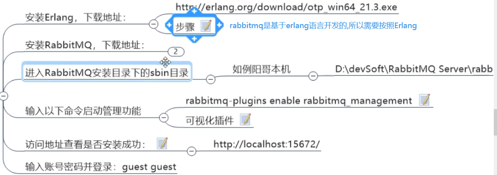

`SpringCloud Bus` 能管理和传播分布式系统间的消息，就像一个分布式执行器，可用于广播状态更改、事件推送等，也可以当作微服务间的通信通道


> 注意,这里年张图片,就代表两种广播方式

- 图1: **它是Bus直接通知给其中一个客户端,由这个客户端开始蔓延,传播给其他所有客户端**
- 图2: **它是通知给配置中心的服务端,有服务端广播给所有客户端**


> 为什么被称为总线?

- **什么是总线**
在微服务架构的系统中，通常会使用 **轻量级的消息代理** 来构建一个共用的 **消息主题** ，并让系统中所有微服务实例都连接上来。由于 **该主题中产生的消息会被所有实例监听和消费，所以称它为消息总线** 。在总线上的各个实例，都可以方便地广播一些需要让其他连接在该主题上的实例都知道的消息。
- **基本原理**
`configclient` 实例都监听 `MQ` 中同一个 `topic` (默认是 `springcloudBus`) 。当一个服务**刷新数据** 的时候，它会把这个信息放入到 **Topic** 中，这样其它监听 **Topic** 的服务就能得到通知，然后去 **更新自身的配置**

:::warning 本质
就是通过 **消息队列** 达到广播的效果，我们要广播每个消息时,主要放到某个topic中,所有监听的节点都可以获取到
:::

## 1：使用bus

### 1）配置rabbitmq环境



### 2）创建3366客户端

之前有个3355客户端，在创建一个，搭配测试使用，全部复制3355即可

### 3）使用Bus实现全局广播的方式

> Bus广播有两种方式:
- 1）利用消息总线触发一个 **客户端/bus/refresh**,而刷新所有客户端的配置
- 2）利用消息总线触发一个 **服务端ConfigServer的/bus/refresh端点**，而刷新所有客户端的配置

这两种方式,第二种更合适,因为:

第一种的缺点：


### 4）第二种方式实现

#### 配置3344(配置中心服务端):


##### pom.xml
springboot的监控组件,和消息总线
```xml
    <!--添加消息总线RabbitMQ支持-->
    <dependency>
        <groupId>org.springframework.cloud</groupId>
        <artifactId>spring-cloud-starter-bus-amqp</artifactId>
    </dependency>
    <dependency>
        <groupId>org.springframework.boot</groupId>
        <artifactId>spring-boot-starter-actuator</artifactId>
    </dependency>
```
##### 修改配置文件

```yml
server:
  port: 3344

spring:
  application:
    name: cloud-config-center #注册进Eureka服务器的微服务名
  cloud:
    config:
      server:
        git:
          uri: https://gitee.com/lixiaogou/sprincloud-config.git #GitHub上面的git仓库名字
          search-paths: #搜索目录
            - springcloud-config
      label: master #读取分支
      #启动成功后访问的路径 http://ip:3344/{label}/{application}-{profile}.yml 能访问的配置文件 就表示成功了
    #rabbitmq相关配置
  rabbitmq:
    host: localhost
    port: 15672
    username: guest
    password: guest

eureka:
  client:
    service-url:
      defaultZone: http://localhost:7001/eureka


##rabbitmq相关配置,暴露bus刷新配置的端点 SpringCloud Bus动态刷新全局广播
management:
  endpoints: #暴露bus刷新配置的端点
    web:
      exposure:
        include: 'bus-refresh'
```

#### 修改3355(配置中心的客户端)
##### pom.xml
springboot的监控组件,和消息总线
```xml
    <!--添加消息总线RabbitMQ支持-->
    <dependency>
        <groupId>org.springframework.cloud</groupId>
        <artifactId>spring-cloud-starter-bus-amqp</artifactId>
    </dependency>
    <dependency>
        <groupId>org.springframework.boot</groupId>
        <artifactId>spring-boot-starter-actuator</artifactId>
    </dependency>
```
##### 修改配置文件
注意配置文件的名字,要改为 `bootstrap.yml`
```yml
server:
  port: 3355

spring:
  application:
    name: config-client
  cloud:
    config:
      label: master  #分支名称
      name: config  #配置文件名称
      profile: dev  #读取后缀名称   上述三个综合http://localhost:3344/master/config-dev.yml
      uri: http://localhost:3344  #配置中心的地址
    #rabbitmq相关配置
  rabbitmq:
    host: localhost
    port: 15672
    username: guest
    password: guest

#服务注册到eureka地址
eureka:
  client:
    service-url:
      #设置与eureka server交互的地址查询服务和注册服务都需要依赖这个地址
      defaultZone: http://localhost:7001/eureka #单机版

# 暴露监控端点 否则 curl -X POST "http://localhost:3355/actuator/refresh" 不可使用
management:
  endpoints:
    web:
      exposure:
        include: "*"
#SpringCloud Bus动态刷新定点通知 公式：http://localhost:配置中心的端口号/actuator/bus-refresh/{destination}
#例如 只通知3355，curl -X POST "http://localhost:3344/actuator/bus-refresh/config-client:3355"
```

#### 修改3366(也是配置中心的客户端)

修改与3355是一模一样的

#### 测试

- 启动7001,3344,3355,3366
- 此时修改GitHub上的配置文件
- 此时只需要刷新3344,即可让3355,3366动态获取最新的配置文件


> 其原理就是:  
`ConfigClient` 实例都监听 `MQ` 中同一个 `topic` (默认是 `springCloudBus` )。当一个服务刷新数据的时候，它会把这个信息放入到 `Topic` 中，这样其它监听同一Topic的服务就能得到通知，然后去更新自身的配置。

<p style="color:yellow">所有客户端都监听了一个rabbitMq的topic,我们将信息放入这个topic,所有客户端都可以送到,从而实时更新</p>

### 5）配置定点通知

> 就是只通知部分服务,比如只通知3355,不通知3366


**只通知3355**


```shell
curl -X POST "http://localhost:3355/actuator/bus-refresh/config-client:3355"
```

可以看到,实际上就是通过 `微服务的名称` + `端口号` 进行指定
