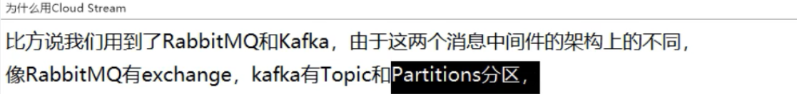
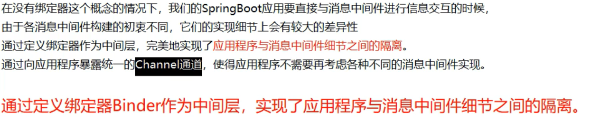
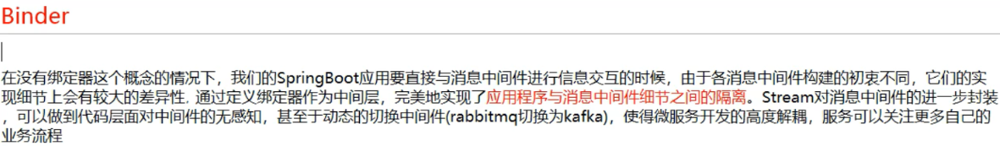
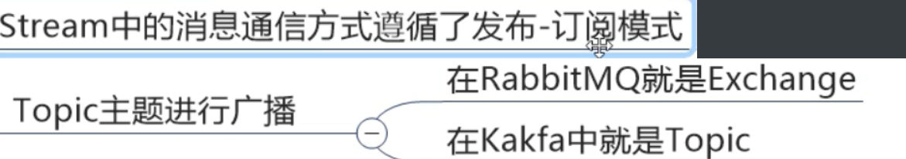
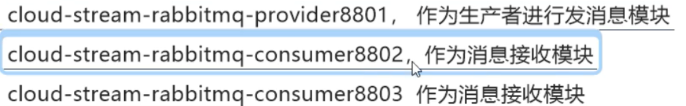
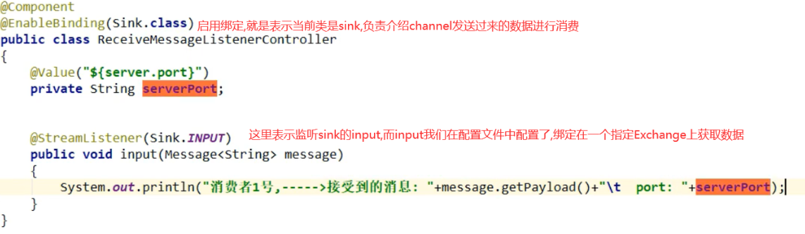
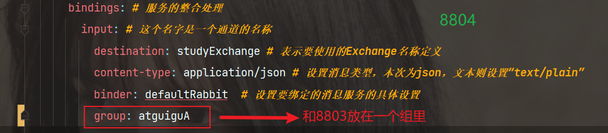

:::warning 解释
现在一个很项目可能分为三部分:  
        前端--->后端---->大数据  
        而后端开发使用消息中间件,可能会使用RabbitMq  
        而大数据开发,一般都是使用Kafka,  
        那么一个项目中有多个消息中间件,对于程序员,因为人员都不友好  
:::

而 `Spring Cloud Stream` 就类似 `jpa` ,屏蔽 `底层消息中间件` 的差异,程序员主要操作`Spring Cloud Stream` 即可，不需要管底层是 `kafka` 还是 `rabbitMq`，**屏蔽底层消息中间件的差异,降低切换成本，统一消息的编程模型**

## 1：SpringCloud-Stream介绍





这些中间件的差异性导致我们实际项目开发给我们造成了一定的困扰，我们如果用了 **两个消息队列的其中一种** ，后面的业务需求，我想往另外一种消息队列进行迁移，这时候无疑就是一个灾难性的，**一大堆东西都要重新推倒重新做**，因为它跟我们的系统耦合了，这时候 `springcloud Stream` 给我们提供了一种解耦合的方式。

## 2：SpringCloudStream是怎么屏蔽底层差异的



**绑定器**





## 3：SpringCloudStreamd通信模式



## 4：SpringCloudStream的业务流程


> 类似flume中的channel,source,sink 估计是借鉴(抄袭)的
- `source` 用于获取数据(要发送到mq的数据)
- `channel` 类似 `SpringCloudStream` 中的中间件,用于存放 `source` 接收到的数据,或者是存放 `binder` 拉取的数据 

## 5：常用注解和api


## 6：使用SpringCloudStream

需要创建三个项目,一个生产者,两个消费者



## 7：创建生产者
### pom.xml

```xml
   <dependencies>
        <dependency>
            <groupId>org.springframework.cloud</groupId>
            <artifactId>spring-cloud-starter-stream-rabbit</artifactId>
        </dependency>

        <!-- https://mvnrepository.com/artifact/org.springframework.cloud/spring-cloud-starter-eureka-server -->
        <dependency>
            <groupId>org.springframework.cloud</groupId>
            <artifactId>spring-cloud-starter-netflix-eureka-client</artifactId>
        </dependency>

        <dependency>
            <groupId>com.atguigu.springcloud</groupId>
            <artifactId>cloud-api-commons</artifactId>
            <version>${project.version}</version>
        </dependency>

        <!-- https://mvnrepository.com/artifact/org.springframework.boot/spring-boot-starter-web -->
        <dependency>
            <groupId>org.springframework.boot</groupId>
            <artifactId>spring-boot-starter-web</artifactId>
        </dependency>

        <!-- https://mvnrepository.com/artifact/org.springframework.boot/spring-boot-starter-web -->
        <dependency>
            <groupId>org.springframework.boot</groupId>
            <artifactId>spring-boot-starter-actuator</artifactId>
        </dependency>

        <!-- https://mvnrepository.com/artifact/org.springframework.boot/spring-boot-devtools -->
        <!--        <dependency>-->
        <!--            <groupId>org.springframework.boot</groupId>-->
        <!--            <artifactId>spring-boot-devtools</artifactId>-->
        <!--            <scope>runtime</scope>-->
        <!--            <optional>true</optional>-->
        <!--        </dependency>-->

        <!-- https://mvnrepository.com/artifact/org.projectlombok/lombok -->
        <dependency>
            <groupId>org.projectlombok</groupId>
            <artifactId>lombok</artifactId>
            <optional>true</optional>
        </dependency>

        <!-- https://mvnrepository.com/artifact/org.springframework.boot/spring-boot-starter-test -->
        <dependency>
            <groupId>org.springframework.boot</groupId>
            <artifactId>spring-boot-starter-test</artifactId>
            <scope>test</scope>
        </dependency>
    </dependencies>
```

### application.yml
```yml
server:
  port: 8801

spring:
  application:
    name: cloud-stream-provider
  cloud:
    stream:
      binders: # 在此处配置要绑定的rabbitmq的服务信息；
        defaultRabbit: # 表示定义的名称，用于于binding整合
          type: rabbit # 消息组件类型
          environment: # 设置rabbitmq的相关的环境配置
            spring:
              rabbitmq:
                host: localhost
                port: 5672
                username: guest
                password: guest
      bindings: # 服务的整合处理
        output: # 这个名字是一个通道的名称
          destination: studyExchange # 表示要使用的Exchange名称定义
          content-type: application/json # 设置消息类型，本次为json，文本则设置“text/plain”
          binder: defaultRabbit  # 设置要绑定的消息服务的具体设置

eureka:
  client: # 客户端进行Eureka注册的配置
    service-url:
      defaultZone: http://localhost:7001/eureka
#  instance:
#    lease-renewal-interval-in-seconds: 2 # 设置心跳的时间间隔（默认是30秒）
#    lease-expiration-duration-in-seconds: 5 # 如果现在超过了5秒的间隔（默认是90秒）
#    instance-id: send-8801.com  # 在信息列表时显示主机名称
#    prefer-ip-address: true     # 访问的路径变为IP地址
```

### 主启动类
```java
@SpringBootApplication
public class CloudStreamRabbitmqProvider8801Application {

    public static void main(String[] args) {
        SpringApplication.run(CloudStreamRabbitmqProvider8801Application.class, args);
        System.out.println("启动成功");
    }
}
```

### service和实现类
```java
public interface IMessageProviderService {
    /**
     * 定义消息的推送管道
     *
     * @return
     */
    String send();
}
```

```java
package com.atguigu.springcloud.service.impl;

import com.atguigu.springcloud.service.IMessageProviderService;
import org.springframework.cloud.stream.annotation.EnableBinding;
import org.springframework.cloud.stream.messaging.Source;
import org.springframework.integration.support.MessageBuilder;
import org.springframework.messaging.Message;
import org.springframework.messaging.MessageChannel;

import javax.annotation.Resource;
import java.util.UUID;


/**
 * @EnableBinding(Source.class) 定义消息的推送管道 将Channel和Exchanges绑定在一起
 */
@EnableBinding(Source.class)
public class MessageProviderServiceImpl implements IMessageProviderService {
    /**
     * 消息发送管道/信道
     */
    @Resource
    private MessageChannel output;

    @Override
    public String send() {
        String serial = UUID.randomUUID().toString();
        Message<String> stringMessage = MessageBuilder.withPayload(serial).build();
        output.send(stringMessage);

        System.out.println("*****serial: " + serial);
        return serial;
    }
}
```


**这里,就会调用 `send` 方法,将消息发送给 `channel` ，然后 `channel` 将消费发送给 `binder` ,然后发送到 `rabbitmq` 中**

### controller

```java
@RestController
public class SendMessageController {
    @Resource
    private IMessageProviderService messageProviderService;
    @GetMapping(value = "/sendMessage")
    public String sendMessage() {
        return messageProviderService.send();
    }
}
```

### 测试

**启动rabbitmq**

**启动7001,8801**

 确定 `8801` 后,会在 `rabbitmq` 中创建一个 `Exchange` ,就是我们配置文件中配置的`exchange`

**访问 `8801`的/ `sendMessage`** 


## 8：创建消费者8802

### pom.xml

```xml
        <dependency>
            <groupId>org.springframework.cloud</groupId>
            <artifactId>spring-cloud-starter-stream-rabbit</artifactId>
        </dependency>

        <!-- https://mvnrepository.com/artifact/org.springframework.cloud/spring-cloud-starter-eureka-server -->
        <dependency>
            <groupId>org.springframework.cloud</groupId>
            <artifactId>spring-cloud-starter-netflix-eureka-client</artifactId>
        </dependency>

        <dependency>
            <groupId>com.atguigu.springcloud</groupId>
            <artifactId>cloud-api-commons</artifactId>
            <version>${project.version}</version>
        </dependency>


        <!-- https://mvnrepository.com/artifact/org.springframework.boot/spring-boot-starter-web -->
        <dependency>
            <groupId>org.springframework.boot</groupId>
            <artifactId>spring-boot-starter-web</artifactId>
        </dependency>

        <!-- https://mvnrepository.com/artifact/org.springframework.boot/spring-boot-starter-web -->
        <dependency>
            <groupId>org.springframework.boot</groupId>
            <artifactId>spring-boot-starter-actuator</artifactId>
        </dependency>


        <!-- https://mvnrepository.com/artifact/org.springframework.boot/spring-boot-devtools -->
        <!--        <dependency>-->
        <!--            <groupId>org.springframework.boot</groupId>-->
        <!--            <artifactId>spring-boot-devtools</artifactId>-->
        <!--            <scope>runtime</scope>-->
        <!--            <optional>true</optional>-->
        <!--        </dependency>-->

        <!-- https://mvnrepository.com/artifact/org.projectlombok/lombok -->
        <dependency>
            <groupId>org.projectlombok</groupId>
            <artifactId>lombok</artifactId>
            <optional>true</optional>
        </dependency>

        <!-- https://mvnrepository.com/artifact/org.springframework.boot/spring-boot-starter-test -->
        <dependency>
            <groupId>org.springframework.boot</groupId>
            <artifactId>spring-boot-starter-test</artifactId>
            <scope>test</scope>
        </dependency>
    </dependencies>
```

### 配置文件

`input` 就表示,当前服务是一个消费者,需要消费消息,下面就是指定消费哪个Exchange中的消息

```yml
server:
  port: 8802

spring:
  application:
    name: cloud-stream-consumer
  cloud:
    stream:
      binders: # 在此处配置要绑定的rabbitmq的服务信息；
        defaultRabbit: # 表示定义的名称，用于于binding整合
          type: rabbit # 消息组件类型
          environment: # 设置rabbitmq的相关的环境配置
            spring:
              rabbitmq:
                host: localhost
                port: 5672
                username: guest
                password: guest
      bindings: # 服务的整合处理
        input: # 这个名字是一个通道的名称
          destination: studyExchange # 表示要使用的Exchange名称定义
          content-type: application/json # 设置消息类型，本次为json，文本则设置“text/plain”
          binder: defaultRabbit  # 设置要绑定的消息服务的具体设置


eureka:
  client: # 客户端进行Eureka注册的配置
    service-url:
      defaultZone: http://localhost:7001/eureka
#  instance:
#    lease-renewal-interval-in-seconds: 2 # 设置心跳的时间间隔（默认是30秒）
#    lease-expiration-duration-in-seconds: 5 # 如果现在超过了5秒的间隔（默认是90秒）
#    instance-id: receive-8802.com  # 在信息列表时显示主机名称
#    prefer-ip-address: true     # 访问的路径变为IP地址

```

### 主启动类

```java
@SpringBootApplication
public class CloudStreamRabbitmqConsumer8802Application {

    public static void main(String[] args) {
        SpringApplication.run(CloudStreamRabbitmqConsumer8802Application.class, args);
        System.out.println("启动成功");
    }

}
```

### 业务类(消费数据)
```java
package com.atguigu.springcloud.controller;

import org.springframework.beans.factory.annotation.Value;
import org.springframework.cloud.stream.annotation.EnableBinding;
import org.springframework.cloud.stream.annotation.StreamListener;
import org.springframework.cloud.stream.messaging.Sink;
import org.springframework.messaging.Message;
import org.springframework.stereotype.Component;

/**
 * 8802 接收消息
 */
@Component
@EnableBinding(Sink.class)
public class ReceiveMessageListener {
    @Value("${server.port}")
    private String serverPort;

    @StreamListener(Sink.INPUT)
    public void input(Message<String> message) {
        System.out.println("port:" + serverPort + "\t接受：" + message.getPayload());
    }

}

```



**生产者发送消息时,使用 `send` 方法发送, `send` 方法发送的是一个个 `Message` ,里面封装了数据**

### 测试

启动7001.8801.8802

**此时使用生产者生产消息**


**可以看到,消费者已经接收到消息了**

## 9：创建消费者8803

> 与8802创建一模一样,就不写了==

**创建8803主要是为了演示重复消费等问题**

## 10：重复消费问题

此时启动 `7001`. `8801` . `8802` . `8803`

此时生产者生产一条消息

但是此时查询消费者,发现 `8802`, `8803` ==都消费到了同一条数据==


### 自定义分组
8802、8804和8803一样  
**修改8803,8804的配置文件**




## 11：持久化问题:

> 就是当服务挂了,怎么消费没有消费的数据??

- 这里,先将8802移除A组,
- 然后将02,03服务关闭
- 此时生产者开启,发送3条消息
- 此时重启02,03
- 可以看到,当02退出A组后,它就获取不到在它宕机的时间段内的数据
- 但是03重启后,直接获取到了宕机期间它没有消费的数据,并且消费了

> 总结:  
也就是,当我们 **没有配置分组** 时,会出现消息漏消费的问题，而配置分组后,我们可以自动获取未消费的数据