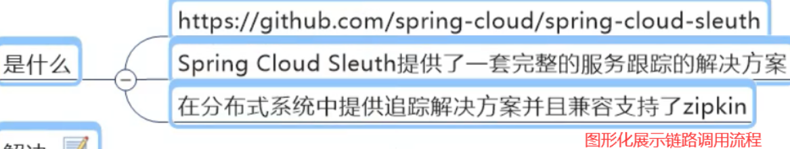
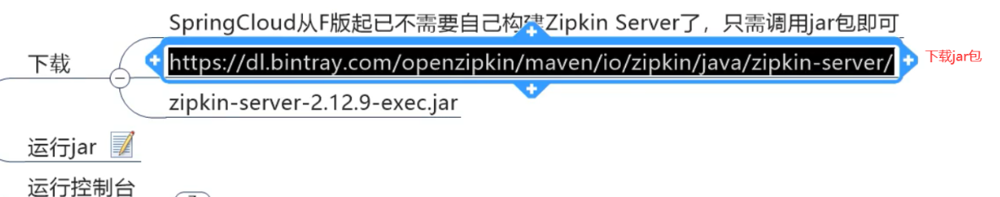
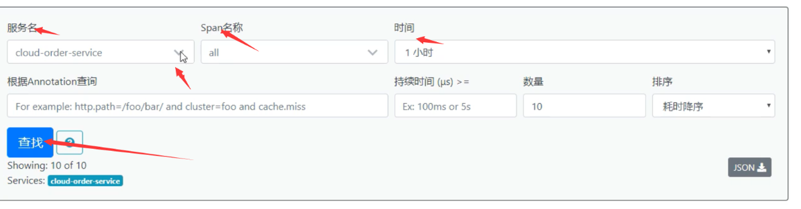

## 1：sleuth要解决的问题

在微服务框架中，一个由客户端发起的请求在 **后端系统** 中会经过 **多个不同的的服务节点调用来协同产生最后的请求结果**，每一个前段请求都会形成一条复杂的 `分布式服务调用链路` ，链路中的任何一环出现高延时或错误都会引起整个请求最后的失败。

> 而来sleuth就是用于追踪每个请求的整体链路




## 2：安装zipkin

安装链接如下 [安装地址](https://dl.bintray.com/openzipkin/maven/io/zipkin/java/zipkin-server/)



**运行jar包**

```shell
java -jar xxxx.jar
```

**然后就可以访问web界面, 默认 `zipkin` 监听的端口是 `9411`**

[localhost:9411/zipkin/](localhost:9411/zipkin/)

**一条链路完整图片:**


**精简版:**


**可以看到,类似链表的形式**

## 3：使用sleuth

> 既然是要进行链路调用展示，那肯定要进行 `远程调用`，也就是 `生产者` 发消息给 `消费者` 进行消费  
不需要额外创建项目,使用之前的 `8001` 和 `order` 的 `80` 即可

### 1）修改80

#### 引入 `pom` :

```xml
  <!--包含了sleuth+zipkin-->
  <dependency>
    <groupId>org.springframework.cloud</groupId>
    <artifactId>spring-cloud-starter-zipkin</artifactId>
  </dependency>
```

这个包虽然叫 `zipkin` 但是,里面包含了 `zpikin` 与 `sleuth`

#### 修改配置文件:

```yml
spring:
  application:
    name: cloud-order-service
  zipkin:
    base-url: http://localhost:9411
  sleuth:
    sampler:
      probability: 1
```

### 2）修改80

和修改8001一样

### 3）测试

启动 `7001(eureka)`，`8001(消费者)`，`80(生产者)`，`9411(zpikin与sleuth)`


