实现熔断与限流,就是 `Hystrix`


## 1：使用sentinel

### 下载地址

[Sentinel下载地址](https://github.com/alibaba/Sentinel/releases)

### 运行sentinel

> 由于是一个jar包,所以可以直接 `java -jar` 运行

注意,默认 `sentinel` 占用 `8080` 端口

### 访问sentinel

[localhost:8080](localhost:8080)

## 2：微服务整合sentinel

### 启动Nacos

### 新建8401

> 主要用于配置sentinel

#### pom

```xml
    <dependencies>
        <dependency><!-- 引入自己定义的api通用包，可以使用Payment支付Entity -->
            <groupId>com.atguigu.springcloud</groupId>
            <artifactId>cloud-api-commons</artifactId>
            <version>${project.version}</version>
        </dependency>
        <!--SpringCloud ailibaba nacos -->
        <dependency>
            <groupId>com.alibaba.cloud</groupId>
            <artifactId>spring-cloud-starter-alibaba-nacos-discovery</artifactId>
        </dependency>
        <!--SpringCloud ailibaba sentinel-datasource-nacos 后续sentinel做持久化用到-->
        <dependency>
            <groupId>com.alibaba.csp</groupId>
            <artifactId>sentinel-datasource-nacos</artifactId>
        </dependency>
        <!--SpringCloud ailibaba sentinel -->
        <dependency>
            <groupId>com.alibaba.cloud</groupId>
            <artifactId>spring-cloud-starter-alibaba-sentinel</artifactId>
        </dependency>
        <!--openfeign-->
        <dependency>
            <groupId>org.springframework.cloud</groupId>
            <artifactId>spring-cloud-starter-openfeign</artifactId>
        </dependency>
        <!-- SpringBoot整合Web组件+actuator -->
        <dependency>
            <groupId>org.springframework.boot</groupId>
            <artifactId>spring-boot-starter-web</artifactId>
        </dependency>
        <dependency>
            <groupId>org.springframework.boot</groupId>
            <artifactId>spring-boot-starter-actuator</artifactId>
        </dependency>
        <!--日常通用jar包配置-->
        <!--        <dependency>-->
        <!--            <groupId>org.springframework.boot</groupId>-->
        <!--            <artifactId>spring-boot-devtools</artifactId>-->
        <!--            <scope>runtime</scope>-->
        <!--            <optional>true</optional>-->
        <!--        </dependency>-->
        <dependency>
            <groupId>cn.hutool</groupId>
            <artifactId>hutool-all</artifactId>
            <version>4.6.3</version>
        </dependency>
        <dependency>
            <groupId>org.projectlombok</groupId>
            <artifactId>lombok</artifactId>
            <optional>true</optional>
        </dependency>
        <dependency>
            <groupId>org.springframework.boot</groupId>
            <artifactId>spring-boot-starter-test</artifactId>
            <scope>test</scope>
        </dependency>

    </dependencies>
```

#### 配置文件

```yml
server:
  port: 8401

spring:
  application:
    name: cloudalibaba-sentinel-service
  cloud:
    nacos:
      discovery:
        server-addr: localhost:8848 #Nacos服务注册中心地址
    sentinel:
      transport:
        dashboard: localhost:8080 #配置Sentinel dashboard地址
        #默认8719端口，假如被占用会自动从8719开始依次+1扫描，直至找到未被占用的端口
        port: 8719

management:
  endpoints:
    web:
      exposure:
        include: '*'
```

#### 主启动类

```java
@EnableDiscoveryClient
@SpringBootApplication
public class CloudalibabaSentinelService8401Application {

    public static void main(String[] args) {
        SpringApplication.run(CloudalibabaSentinelService8401Application.class, args);
        System.out.println("启动成功");
    }

}
```

#### controller

```java
@GetMapping("/testA")
    public String testA() {
        // 测试阈值类型：线程数
        /*try {
            TimeUnit.MILLISECONDS.sleep(800);
        } catch (InterruptedException e) {
            e.printStackTrace();
        }*/
        return "------testA";
    }

    @GetMapping("/testB")
    public String testB() {
        log.info(Thread.currentThread().getName() + "\t" + "...testB");
        return "------testB";
    }
```

#### 启动8401

此时我们到 `sentinel` 中查看,发现并没有关于 `8401` 的任何信息

是因为, `sentinel` 是懒加载, **需要我们执行一次访问,才会有信息**

访问 `localhost/8401/testA`


#### 可以看到.已经开始监听了

## 3：sentinel的流控规则

### 流量限制控制规则

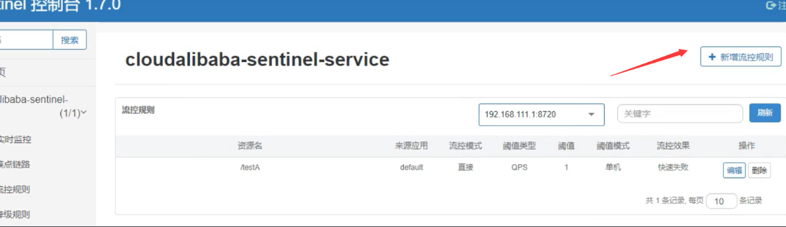

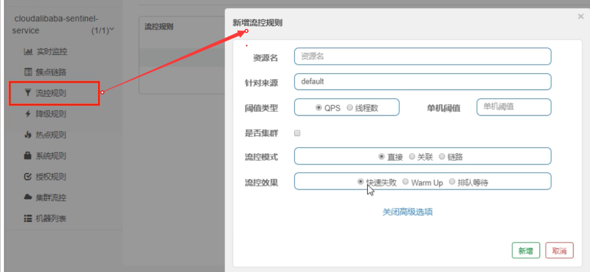


### 流控模、流控效果

#### 直接快速失败

`QPS(每秒钟的请求数量)` ：当调用 `该api` 的 `QPS达到阈值` 的时候，进行限流

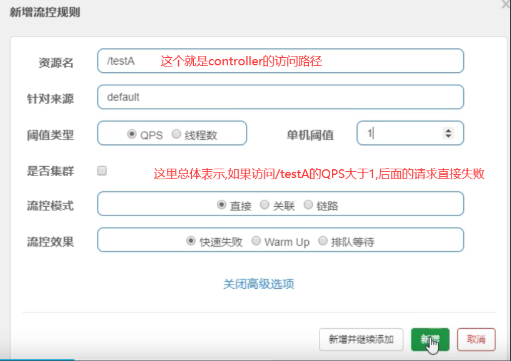

直接失败的效果：


#### 线程数

线程数：当调用该 `api` 的线程数达到阈值的时候，进行限流

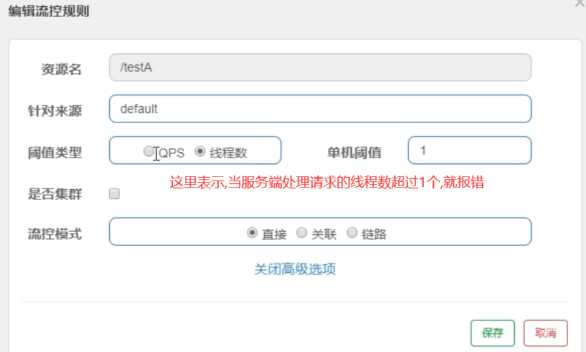

:::warning 举例
比如a请求过来,处理很慢,在一直处理,此时b请求又过来了  
        此时因为a占用一个线程,此时要处理b请求就只有额外开启一个线程  
        那么就会报错
:::


#### 关联


==应用场景:  比如**支付接口**达到阈值,就要限流下**订单的接口**,防止一直有订单==


**当testA达到阈值,qps大于1,就让testB之后的请求直接失败**

可以使用postman压测

#### 链路

多个请求调用同一个微服务

#### 预热Warm up


 ==应用场景==

 

 #### 排队等待

 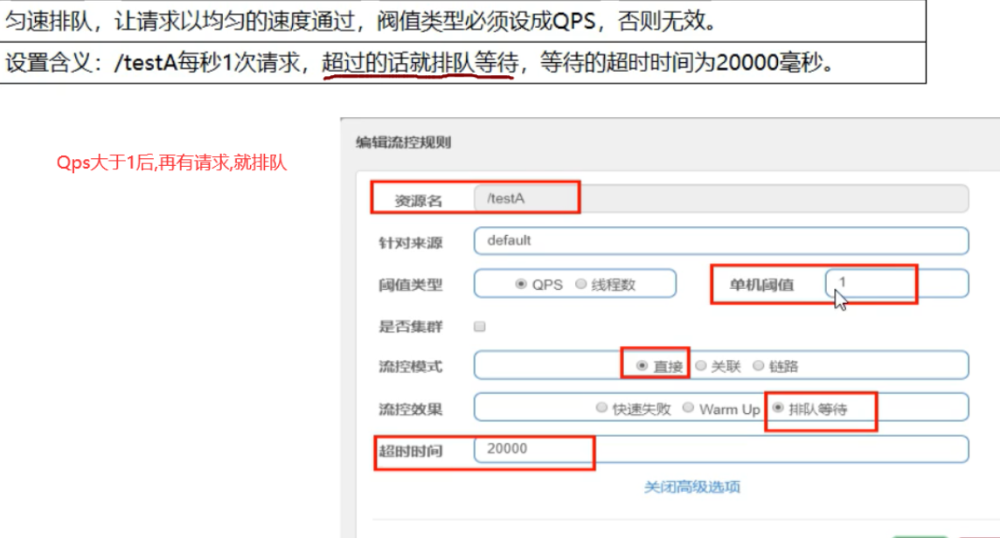

 


 ## 4：sentinel的降级规则

**就是熔断降级**


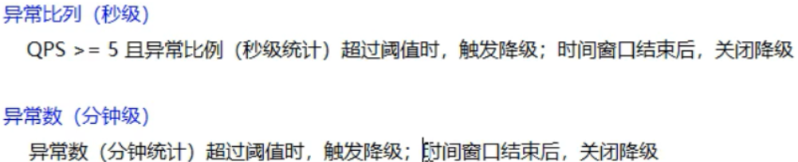


### RT配置

#### 新增一个请求方法用于测试
```java
    @GetMapping("/testD")
    public String testD() {
        try {
            TimeUnit.SECONDS.sleep(1);
        } catch (InterruptedException e) {
            e.printStackTrace();
        }
        log.info("testD 测试RT");
        return "------testD";
    }
```

#### 配置RT

这里配置的 `PT` ,默认是 `秒级` 的 **平均响应时间**


**默认计算平均时间是** : 1秒类进入5个请求,并且响应的平均值超过阈值(这里的200ms),就报错

1秒5请求是 `Sentinel` 默认设置的
#### 测试

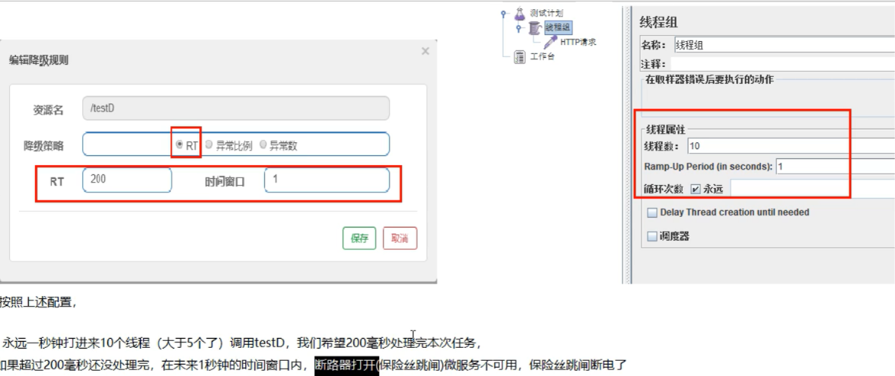


**默认熔断后.就直接抛出异常**

### 异常比例


#### 请求方法
```java
    @GetMapping("/testC")
    public String testC() {
        log.info("testC 异常比例");
        int age = 10 / 0;
        return "------testC";
    }
```

#### 配置


#### 如果没触发熔断,这正常抛出异常

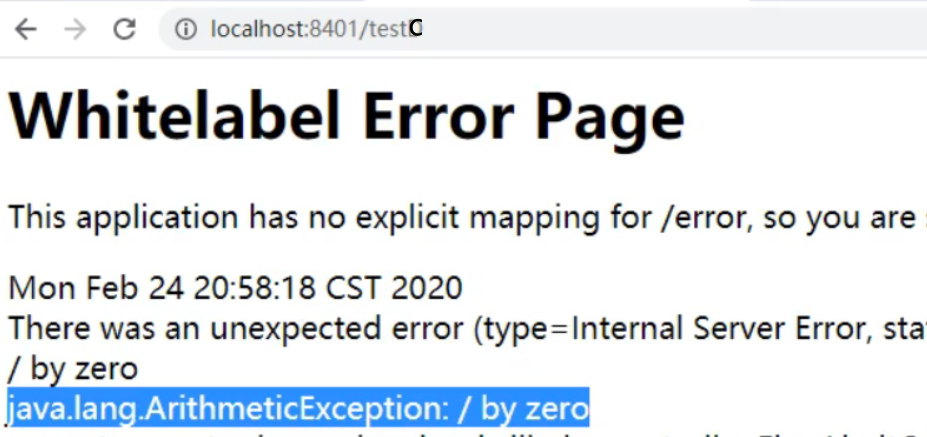

#### 触发熔断

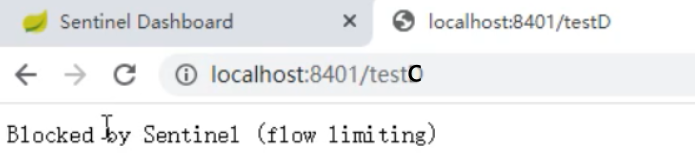

### 异常数


```java
    @GetMapping("/testE")
    public String testE() {
        log.info("testE 测试异常数");
        int age = 10 / 0;
        return "------testE 测试异常数";
    }
```


**一分钟之内,有5个请求发送异常,进入熔断**

## 5：sentinel的热点规则

### 热点规则


比如:

 `localhost:8080/aa?name=aa`

 `localhost:8080/aa?name=bb`

 加入两个请求中,带有参数 `aa` 的请求访问频次非常高,我们就现在 `name==aa` 的请求,但是bb的不限制

==如何自定义降级方法,而不是默认的抛出异常?==

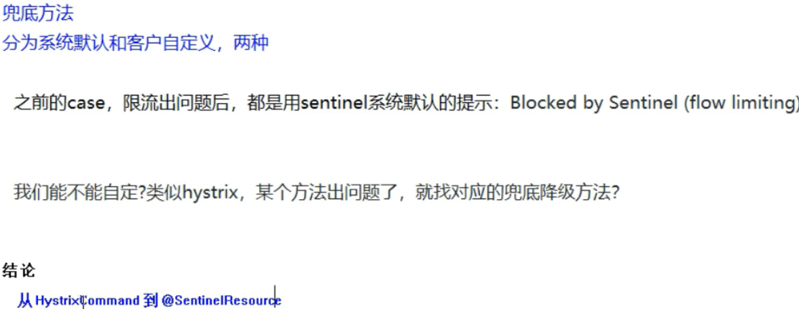

**使用 `@SentinelResource` 直接实现降级方法,它 `Hystrix` 的 `@HystrixCommand`**

```java
    @GetMapping("/testHotKey")
    @SentinelResource(value = "testHotKey", blockHandler = "deal_testHotKey")
    public String testHotKey(@RequestParam(value = "p1", required = false) String p1,
                             @RequestParam(value = "p2", required = false) String p2) {
        int age = 10 / 0;
        return "------testHotKey";
    }

    public String deal_testHotKey(String p1, String p2, BlockException exception) {
        //sentinel系统默认的提示：Blocked by Sentinel (flow limiting)
        return "------deal_testHotKey,o(╥﹏╥)o";
    }
```

==定义热点规则:==

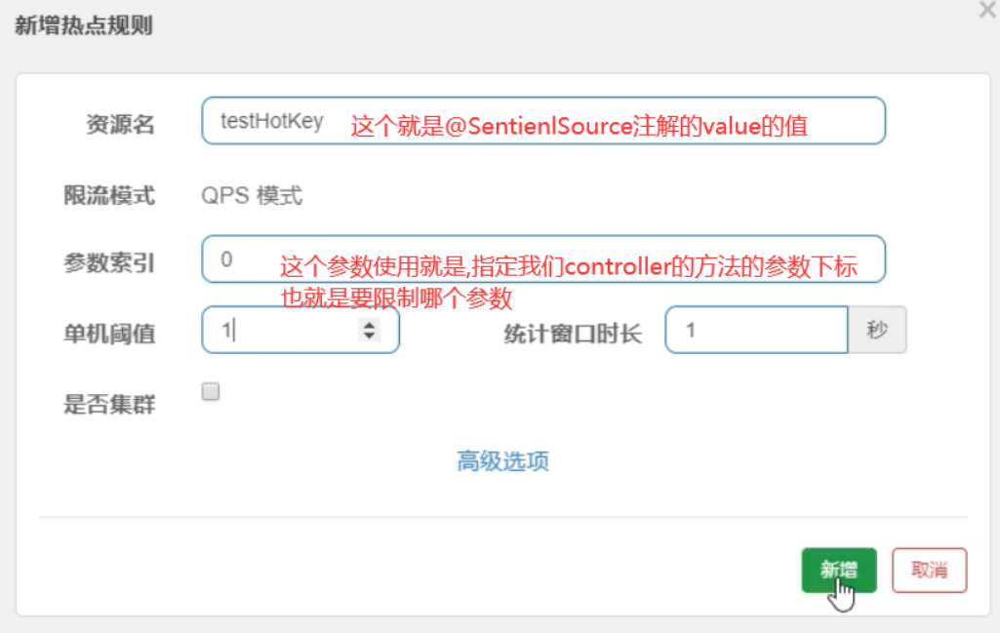

@SentinelResource(`value = "testHotKey"`, blockHandler = "deal_testHotKey")

**此时我们访问 `/testHotkey` 并且带上才是p1**


**但是我们的参数是P2,就没有问题**


只有带了p1,才可能会触发热点限流


### 设置热点规则中的其他选项


需求:

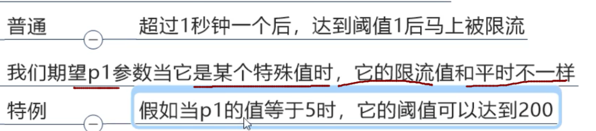


==测试==


注意:
参数类型只支持,8种基本类型+String类

==注意:==

如果我们程序出现异常,是不会走 `blockHander` 的降级方法的,因为这个方法只配置了 `热点规则`,没有配置 `限流规则`

我们这里配置的降级方法是 `sentinel` 针对热点规则配置的

只有触发热点规则才会降级

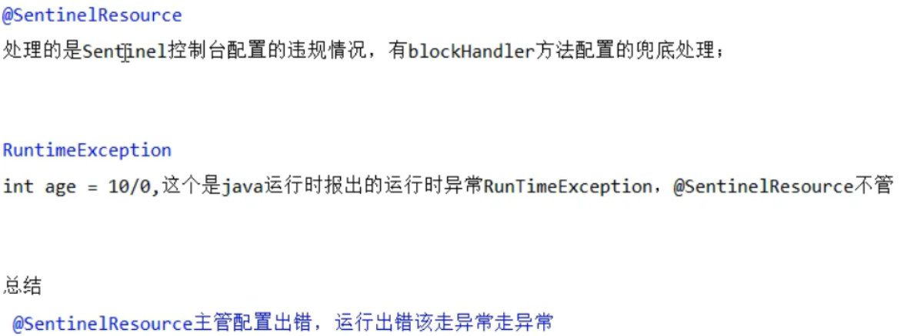

### 系统规则

系统自适应限流:  从整体维度对 `应用入口` 进行限流

对整体限流,比如设置qps到达100,这里限流会限制整个系统不可以


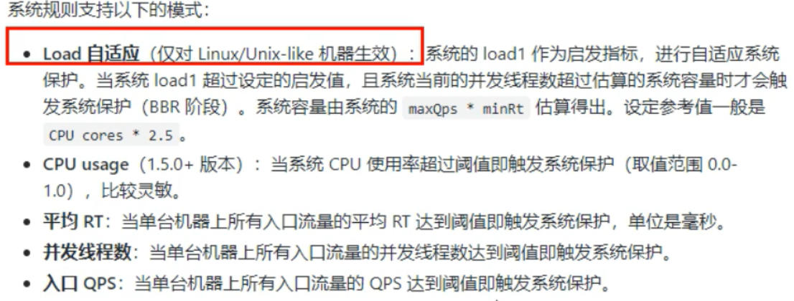

==测试==:

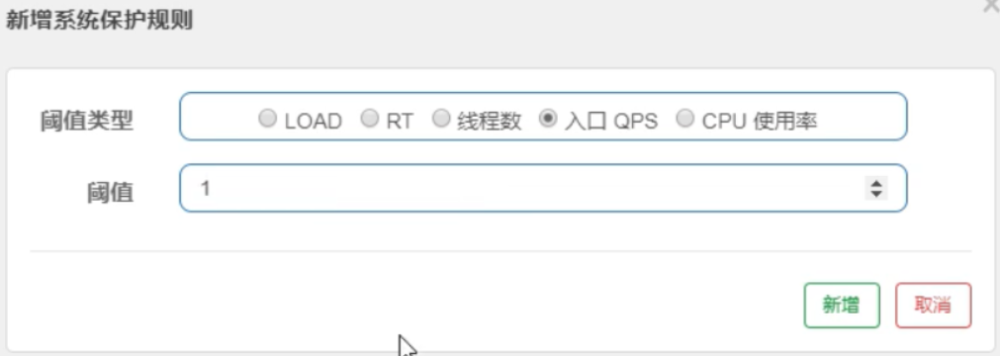


## 6：@SentinelResource注解

> **用于配置降级等功能**

1,环境搭建

- 1.为8401添加依赖,添加我们自己的common包的依赖
```xml
        <dependency><!-- 引入自己定义的api通用包，可以使用Payment支付Entity -->
            <groupId>com.atguigu.springcloud</groupId>
            <artifactId>cloud-api-commons</artifactId>
            <version>${project.version}</version>
        </dependency>
```
- 2.额外创建一个controller类
```java
    @GetMapping("/byResource")
    @SentinelResource(value = "byResource", blockHandler = "handleException")
    public CommonResult byResource() {
        return new CommonResult(200, "按资源名称限流测试OK", new Payment(2020L, "serial001"));
    }

    public CommonResult handleException(BlockException exception) {
        return new CommonResult(444, exception.getClass().getCanonicalName() + "\t 服务不可用");
    }
```
- 3.配置限流

**注意,我们这里配置规则,资源名指定的是 `@SentinelResource` 注解value的值,**

**这样也是可以的,也就是不一定要指定访问路径**

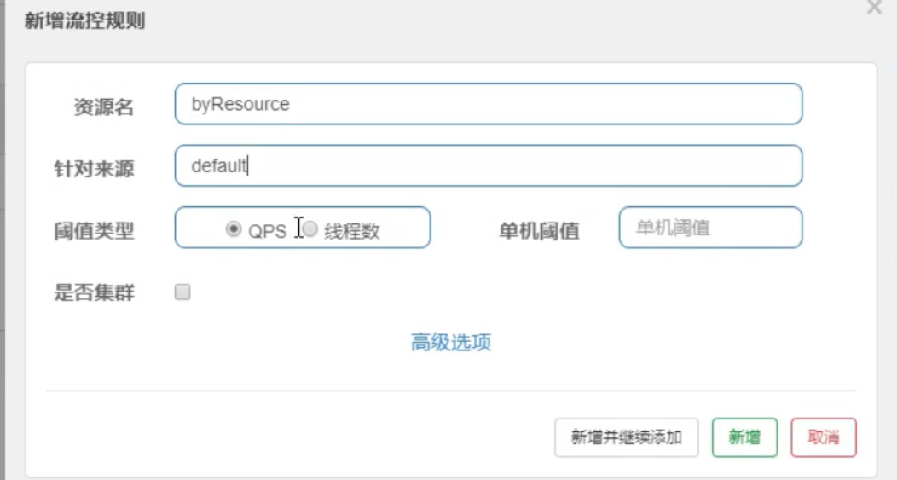

- 4.测试

可以看到已经进入降级方法了

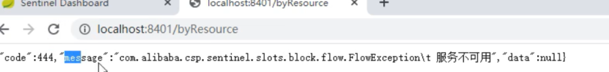

- 此时我们关闭8401服务

可以看到,这些定义的规则是临时的,关闭服务,规则就没有了

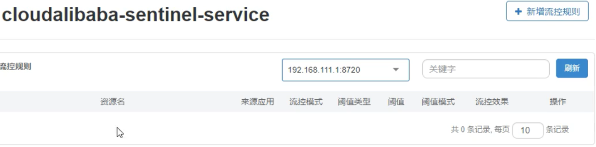

**可以看到,上面配置的降级方法,又出现Hystrix遇到的问题了**

- 降级方法与业务方法耦合
- 每个业务方法都需要对应一个降级方法

### 自定义限流处理逻辑
- 1.单独创建一个类,用于处理限流
```java
public class CustomerBlockHandler {


    public static CommonResult handlerException(BlockException exception) {
        return new CommonResult(4444, "按客戶自定义,global handlerException----1");
    }


    public static CommonResult handlerException2(BlockException exception) {
        return new CommonResult(4444, "按客戶自定义,global handlerException----2");
    }
}
```
- 2.在controller中,指定使用自定义类中的方法作为降级方法
  
```java
 @GetMapping("/rateLimit/customerBlockHandler")
    @SentinelResource(value = "customerBlockHandler",
            blockHandlerClass = CustomerBlockHandler.class,
            blockHandler = "handlerException2")
    public CommonResult customerBlockHandler() {
        return new CommonResult(200, "按客戶自定义", new Payment(2020L, "serial003"));
    }
```

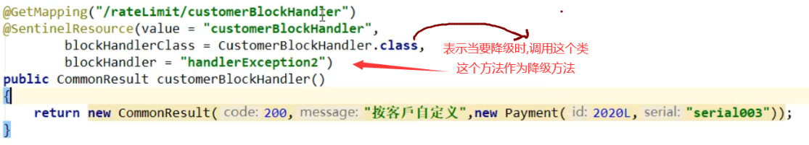

- 3.Sentinel中定义流控规则

这里资源名,是以url指定,也可以使用 `@SentinelResource` 注解value的值指定


- 4.测试

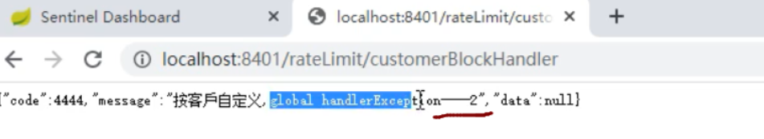


### @SentinelResource注解的其他属性

[官方地址](https://github.com/alibaba/Sentinel/wiki/%E6%B3%A8%E8%A7%A3%E6%94%AF%E6%8C%81)

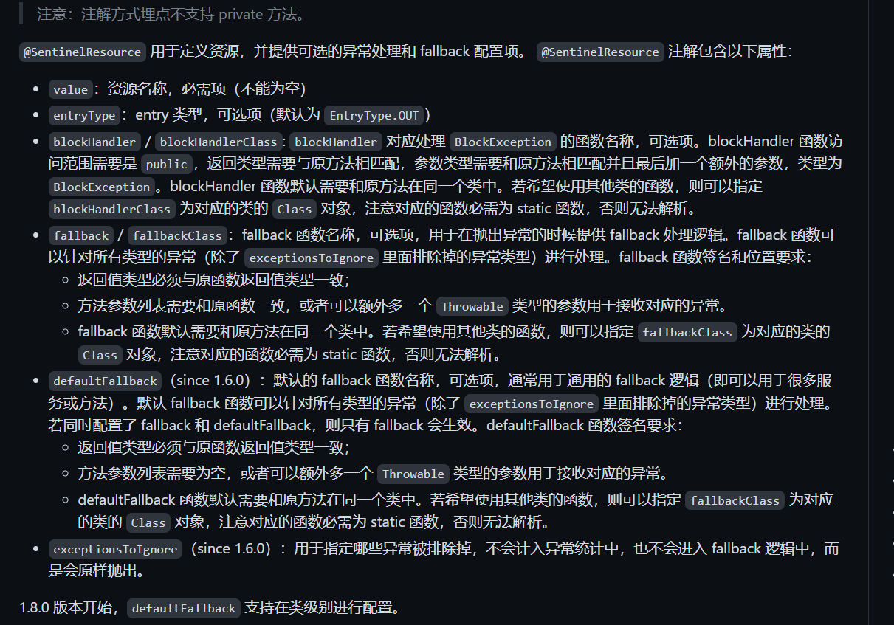


## 7：服务熔断

- 1. **启动nacos和sentinel**
- 2. **新建两个pay模块 9003和9004**
- 3. pom
- 4. 配置文件
```yml
server:
  port: 9003

spring:
  application:
    name: nacos-payment-provider
  cloud:
    nacos:
      discovery:
        server-addr: localhost:8848 #配置Nacos地址

management:
  endpoints:
    web:
      exposure:
        include: '*'
```
- 5.主启动类
```java
@SpringBootApplication
@EnableDiscoveryClient
public class PaymentMain9003 {

    public static void main(String[] args) {
        SpringApplication.run(PaymentMain9003.class,args);
    }
}
```
- 6.新建一个controller类
```java
@RestController
public class PaymentController {
    @Value("${server.port}")
    private String serverPort;

    public static HashMap<Long, Payment> hashMap = new HashMap<>();

    static {
        hashMap.put(1L, new Payment(1L, "28a8c1e3bc2742d8848569891fb42181"));
        hashMap.put(2L, new Payment(2L, "bba8c1e3bc2742d8848569891ac32182"));
        hashMap.put(3L, new Payment(3L, "6ua8c1e3bc2742d8848569891xt92183"));
    }

    @GetMapping(value = "/paymentSQL/{id}")
    public CommonResult<Payment> paymentSQL(@PathVariable("id") Long id) {
        Payment payment = hashMap.get(id);
        CommonResult<Payment> result = new CommonResult(200, "from mysql,serverPort:  " + serverPort, payment);
        return result;
    }


}
```

 **然后启动9003.9004**

- 7. **新建一个order-84消费者模块:**
- 8. pom  
与上面的pay一模一样
- 9. 配置文件
```yml
server:
  port: 84

spring:
  application:
    name: nacos-order-consumer
  cloud:
    nacos:
      discovery:
        server-addr: localhost:8848
    sentinel:
      transport:
        #配置Sentinel dashboard地址
        dashboard: localhost:8080
        #默认8719端口，假如被占用会自动从8719开始依次+1扫描,直至找到未被占用的端口
        port: 8719

#消费者将要去访问的微服务名称(注册成功进nacos的微服务提供者)
service-url:
  nacos-user-service: http://nacos-payment-provider

# 激活Sentinel对Feign的支持
feign:
  sentinel:
    enabled: true
```
- 10.主启动类
```java
@EnableDiscoveryClient
@SpringBootApplication
@EnableFeignClients
public class CloudalibabaConsumerNacosOrder84Application {

    public static void main(String[] args) {
        SpringApplication.run(CloudalibabaConsumerNacosOrder84Application.class, args);
        System.out.println("启动成功");
    }

}
```
- 11.配置类
```java
@Configuration
public class ApplicationContextConfig {
    @Bean
    @LoadBalanced
    public RestTemplate getRestTemplate() {
        return new RestTemplate();
    }
}
```
- 12.新建一个controller类
```java
@RequestMapping("/consumer/fallback/{id}")
    @SentinelResource(value = "fallback") //没有配置
//    @SentinelResource(value = "fallback", fallback = "handlerFallback") //fallback只负责业务异常
//    @SentinelResource(value = "fallback",blockHandler = "blockHandler") //blockHandler只负责sentinel控制台配置违规
//     @SentinelResource(value = "fallback", fallback = "handlerFallback", blockHandler = "blockHandler",
//             exceptionsToIgnore = {IllegalArgumentException.class})
    public CommonResult<Payment> fallback(@PathVariable Long id) {
        CommonResult<Payment> result = restTemplate.getForObject(SERVICE_URL + "/paymentSQL/" + id, CommonResult.class, id);

        if (id == 4) {
            throw new IllegalArgumentException("IllegalArgumentException,非法参数异常....");
        } else if (result.getData() == null) {
            throw new NullPointerException("NullPointerException,该ID没有对应记录,空指针异常");
        }

        return result;
    }
```

**为业务方法添加 `fallback` 来指定降级方法**

```java
    @RequestMapping("/consumer/fallback/{id}")
    // @SentinelResource(value = "fallback") //没有配置
    @SentinelResource(value = "fallback", fallback = "handlerFallback") //fallback只负责业务异常
//    @SentinelResource(value = "fallback",blockHandler = "blockHandler") //blockHandler只负责sentinel控制台配置违规
//     @SentinelResource(value = "fallback", fallback = "handlerFallback", blockHandler = "blockHandler",
//             exceptionsToIgnore = {IllegalArgumentException.class})
    public CommonResult<Payment> fallback(@PathVariable Long id) {
        CommonResult<Payment> result = restTemplate.getForObject(SERVICE_URL + "/paymentSQL/" + id, CommonResult.class, id);

        if (id == 4) {
            throw new IllegalArgumentException("IllegalArgumentException,非法参数异常....");
        } else if (result.getData() == null) {
            throw new NullPointerException("NullPointerException,该ID没有对应记录,空指针异常");
        }

        return result;
    }

    //本例是fallback
    public CommonResult handlerFallback(@PathVariable Long id, Throwable e) {
        Payment payment = new Payment(id, "null");
        return new CommonResult<>(444, "兜底异常handlerFallback,exception内容  " + e.getMessage(), payment);
    }
```

重启order 测试

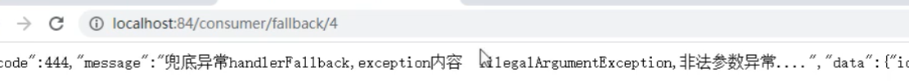

- 所以,fallback是用于管理异常的,当业务方法发生异常,可以降级到指定方法

- 注意,我们这里并没有使用 `sentinel` 配置任何规则,但是却降级成功,就是因为

- `fallback` 是用于管理异常的,当业务方法发生异常,可以降级到指定方法


**为业务方法添加 `blockHandler` ,看看是什么效果**

```java
    @RequestMapping("/consumer/fallback/{id}")
    // @SentinelResource(value = "fallback") //没有配置
    // @SentinelResource(value = "fallback", fallback = "handlerFallback") //fallback只负责业务异常
   @SentinelResource(value = "fallback",blockHandler = "blockHandler") //blockHandler只负责sentinel控制台配置违规
//     @SentinelResource(value = "fallback", fallback = "handlerFallback", blockHandler = "blockHandler",
//             exceptionsToIgnore = {IllegalArgumentException.class})
    public CommonResult<Payment> fallback(@PathVariable Long id) {
        CommonResult<Payment> result = restTemplate.getForObject(SERVICE_URL + "/paymentSQL/" + id, CommonResult.class, id);

        if (id == 4) {
            throw new IllegalArgumentException("IllegalArgumentException,非法参数异常....");
        } else if (result.getData() == null) {
            throw new NullPointerException("NullPointerException,该ID没有对应记录,空指针异常");
        }

        return result;
    }
     //本例是blockHandler
    public CommonResult blockHandler(@PathVariable Long id, BlockException blockException) {
        Payment payment = new Payment(id, "null");
        return new CommonResult<>(445, "blockHandler-sentinel限流,无此流水: blockException  " + blockException.getMessage(), payment);
    }
```

**重启84,访问业务方法:**


 可以看到.,直接报错了,并没有降级，也就是说, **`blockHandler`只对 `sentienl` 定义的规则降级**


**如果fallback和blockHandler都配置呢?**

```java
    public static final String SERVICE_URL = "http://nacos-payment-provider";

    @Resource
    private RestTemplate restTemplate;

    @RequestMapping("/consumer/fallback/{id}")
    // @SentinelResource(value = "fallback") //没有配置
    // @SentinelResource(value = "fallback", fallback = "handlerFallback") //fallback只负责业务异常
   // @SentinelResource(value = "fallback",blockHandler = "blockHandler") //blockHandler只负责sentinel控制台配置违规
    @SentinelResource(value = "fallback", fallback = "handlerFallback", blockHandler = "blockHandler",
            exceptionsToIgnore = {IllegalArgumentException.class})
    public CommonResult<Payment> fallback(@PathVariable Long id) {
        CommonResult<Payment> result = restTemplate.getForObject(SERVICE_URL + "/paymentSQL/" + id, CommonResult.class, id);

        if (id == 4) {
            throw new IllegalArgumentException("IllegalArgumentException,非法参数异常....");
        } else if (result.getData() == null) {
            throw new NullPointerException("NullPointerException,该ID没有对应记录,空指针异常");
        }

        return result;
    }

    //本例是fallback
    public CommonResult handlerFallback(@PathVariable Long id, Throwable e) {
        Payment payment = new Payment(id, "null");
        return new CommonResult<>(444, "兜底异常handlerFallback,exception内容  " + e.getMessage(), payment);
    }

    //本例是blockHandler
    public CommonResult blockHandler(@PathVariable Long id, BlockException blockException) {
        Payment payment = new Payment(id, "null");
        return new CommonResult<>(445, "blockHandler-sentinel限流,无此流水: blockException  " + blockException.getMessage(), payment);
    }
```

设置qps规则,阈值1

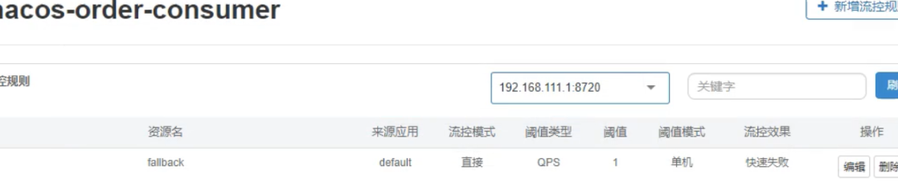

测试


 可以看到,当两个都同时生效时,== `blockhandler` 优先生效==

**==`@SentinelResource`还有一个属性, `exceptionsToIgnore`==**


**exceptionsToIgnore指定一个异常类,**

**表示如果当前方法抛出的是指定的异常,不降级,直接对用户抛出异常**

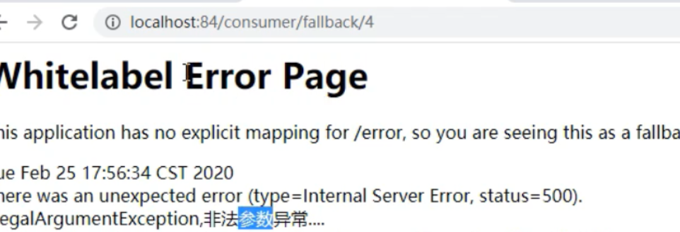
## 8：sentinel整合ribbon+openFeign+fallback

修改 `84` 模块,使其支持 `feign`

### 1.pom.xml

```xml
        <dependency>
            <groupId>org.springframework.cloud</groupId>
            <artifactId>spring-cloud-starter-openfeign</artifactId>
        </dependency>
```

### 2.application.yml

```yaml
server:
  port: 84

spring:
  application:
    name: nacos-order-consumer
  cloud:
    nacos:
      discovery:
        server-addr: localhost:8848
    sentinel:
      transport:
        #配置Sentinel dashboard地址
        dashboard: localhost:8080
        #默认8719端口，假如被占用会自动从8719开始依次+1扫描,直至找到未被占用的端口
        port: 8719

#消费者将要去访问的微服务名称(注册成功进nacos的微服务提供者)
service-url:
  nacos-user-service: http://nacos-payment-provider

# 激活Sentinel对Feign的支持
feign:
  sentinel:
    enabled: true
```
### 3.主启动类,也要修改

```java
@EnableDiscoveryClient
@SpringBootApplication
@EnableFeignClients
public class CloudalibabaConsumerNacosOrder84Application {

    public static void main(String[] args) {
        SpringApplication.run(CloudalibabaConsumerNacosOrder84Application.class, args);
        System.out.println("启动成功");
    }

}
```

### 4.创建远程调用pay模块的接口

```java
@FeignClient(value = "nacos-payment-provider")
public interface PaymentService {
    @GetMapping(value = "/paymentSQL/{id}")
    CommonResult<Payment> paymentSQL(@PathVariable("id") Long id);
}
```

### 5.创建远程调用pay模块的接口的实现类

```java
@Component
public class PaymentFallbackService implements PaymentService {
    @Override
    public CommonResult<Payment> paymentSQL(Long id) {
        return new CommonResult<>(44444, "服务降级返回,---PaymentFallbackService", new Payment(id, "errorSerial"));
    }
}
```

### 6.再次修改接口,指定降级类
```java
@FeignClient(value = "nacos-payment-provider", fallback = PaymentFallbackService.class)
public interface PaymentService {
    @GetMapping(value = "/paymentSQL/{id}")
    CommonResult<Payment> paymentSQL(@PathVariable("id") Long id);
}
```

### 7.controller添加远程调用

```java

        //==================OpenFeign
    @Resource
    private PaymentService paymentService;

    @GetMapping(value = "/consumer/paymentSQL/{id}")
    public CommonResult<Payment> paymentSQL(@PathVariable("id") Long id) {
        return paymentService.paymentSQL(id);
    }
```

### 8.启动9003,84

### 9.测试

> 如果关闭9003.看看84会不会降级


熔断框架比较


## 9：sentinel持久化规则

默认规则是临时存储的,重启 `sentinel` 就会消失


**这里以之前的8401为案例进行修改:**

### 1.修改8401的pom
```xml
<!-- SpringCloud ailibaba sentinel-datasource-nacos 持久化需要用到-->
<dependency>
    <groupId>com.alibaba.csp</groupId>
    <artifactId>sentinel-datasource-nacos</artifactId>
</dependency>
```

### 2.修改8401的application.yml

```yaml
server:
  port: 8401

spring:
  application:
    name: cloudalibaba-sentinel-service
  cloud:
    nacos:
      discovery:
        server-addr: localhost:8848 #Nacos服务注册中心地址
    sentinel:
      transport:
        dashboard: localhost:8080 #配置Sentinel dashboard地址
        #默认8719端口，假如被占用会自动从8719开始依次+1扫描，直至找到未被占用的端口
        port: 8719
      datasource:
        ds1:
          nacos:
            server-addr: localhost:8848
            dataId: ${spring.application.name}
            groupId: DEFAULT_GROUP
            data-type: json
            rule-type: flow

management:
  endpoints:
    web:
      exposure:
        include: '*'
```

添加的内容

```yml
      datasource:
        ds1:
          nacos:
            server-addr: localhost:8848
            dataId: ${spring.application.name}
            groupId: DEFAULT_GROUP
            data-type: json
            rule-type: flow
```

**实际上就是指定,我们的规则要保证在哪个名称空间的哪个分组下**

这里没有指定namespace, 但是是可以指定的


### 3.在nacos中创建一个配置文件,dataId就是上面配置文件中指定的

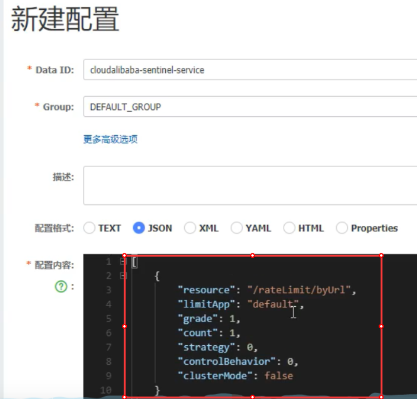

==json中,这些属性的含义:==


### 4.启动8401

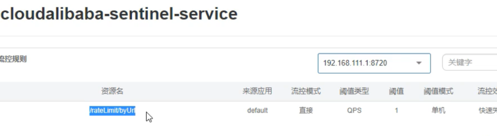

可以看到,直接读取到了规则

### 5.关闭8401

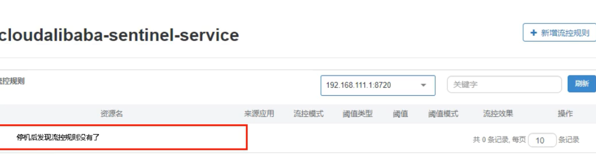

### 6.此时重启8401

> 如果sentinel又可以正常读取到规则,那么证明持久化成功

可以看到,又重新出现了

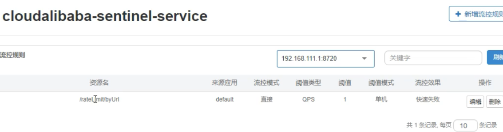