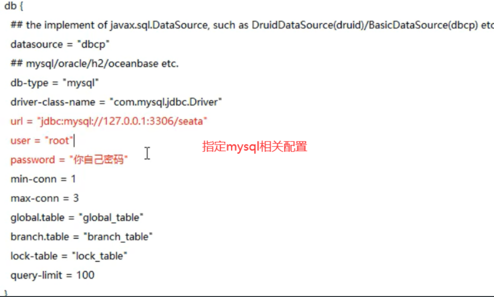
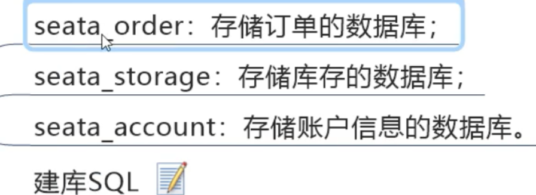
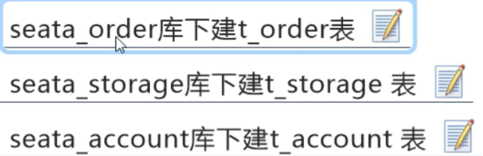
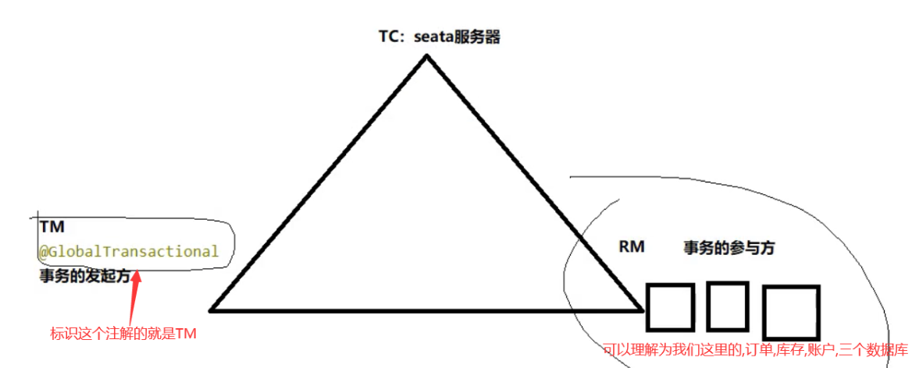
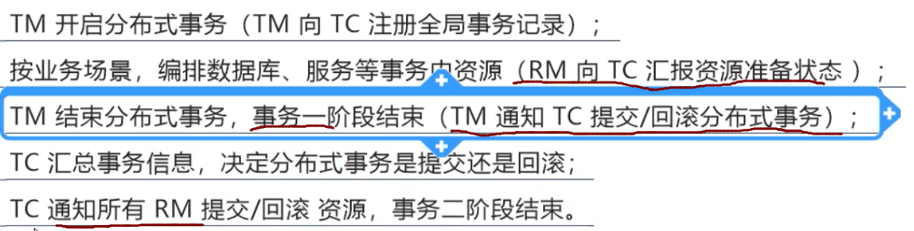
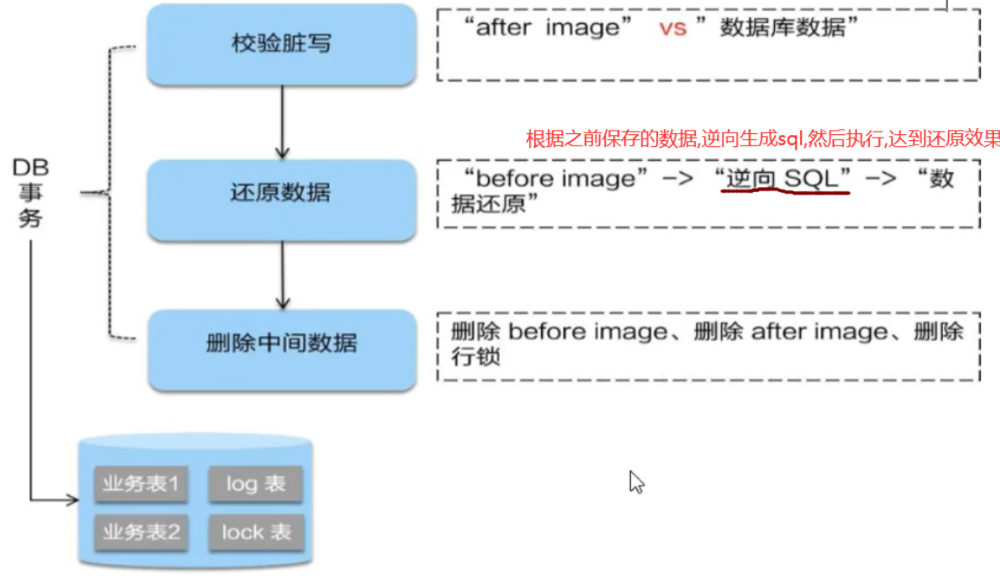
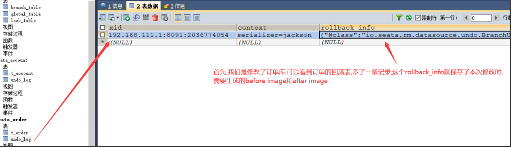
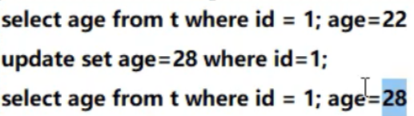

[官方文档](https://seata.io/zh-cn/docs/overview/what-is-seata)

## 1：seata安装

### 下载

[下载地址](https://github.com/apache/incubator-seata/releases)

### 修改file.conf




### mysql建库建表

- 1,上面指定了数据库为 `seata` ,所以创建一个数据库名为 `seata`
- 2,建表,在 `seata` 的安装目录下有一个 `db_store.sql` ,运行即可

### 修改registry.conf

配置 `seata` 作为微服务,指定注册中心


### 启动

- 先启动 `nacos`
- 在启动 `seata-server` (运行安装目录下的, `seata-server.bat` )


## 2：举例
业务说明


### 创建三个数据库



### 创建对应的表



### 创建回滚日志表,方便查看


**注意每个库都要执行一次这个sql,生成 `回滚日志表`**

### 创建seata-order-2001

#### pom.xml
```xml
<dependencies>
        <!--nacos-->
        <dependency>
            <groupId>com.alibaba.cloud</groupId>
            <artifactId>spring-cloud-starter-alibaba-nacos-discovery</artifactId>
        </dependency>
        <!--seata-->
        <dependency>
            <groupId>com.alibaba.cloud</groupId>
            <artifactId>spring-cloud-starter-alibaba-seata</artifactId>
            <exclusions>
                <exclusion>
                    <artifactId>seata-all</artifactId>
                    <groupId>io.seata</groupId>
                </exclusion>
            </exclusions>
        </dependency>
        <dependency>
            <groupId>io.seata</groupId>
            <artifactId>seata-all</artifactId>
            <version>0.9.0</version>
        </dependency>
        <!--feign-->
        <dependency>
            <groupId>org.springframework.cloud</groupId>
            <artifactId>spring-cloud-starter-openfeign</artifactId>
        </dependency>
        <!--web-actuator-->
        <dependency>
            <groupId>org.springframework.boot</groupId>
            <artifactId>spring-boot-starter-web</artifactId>
        </dependency>
        <dependency>
            <groupId>org.springframework.boot</groupId>
            <artifactId>spring-boot-starter-actuator</artifactId>
        </dependency>
        <!--mysql-druid-->
        <dependency>
            <groupId>mysql</groupId>
            <artifactId>mysql-connector-java</artifactId>
            <version>5.1.37</version>
        </dependency>
        <dependency>
            <groupId>com.alibaba</groupId>
            <artifactId>druid-spring-boot-starter</artifactId>
            <version>1.1.10</version>
        </dependency>
        <dependency>
            <groupId>org.mybatis.spring.boot</groupId>
            <artifactId>mybatis-spring-boot-starter</artifactId>
            <version>2.0.0</version>
        </dependency>
        <dependency>
            <groupId>org.springframework.boot</groupId>
            <artifactId>spring-boot-starter-test</artifactId>
            <scope>test</scope>
        </dependency>
        <dependency>
            <groupId>org.projectlombok</groupId>
            <artifactId>lombok</artifactId>
            <optional>true</optional>
        </dependency>
    </dependencies>
```

#### application.yml
```yml
server:
  port: 2001


spring:
  application:
    name: seata-order-service
  cloud:
    alibaba:
      seata:
        tx-service-group: fsp_tx_group #自定义事务组名称需要与seata-server中的对应
    nacos:
      discovery:
        server-addr: localhost:8848
  datasource:
    type: com.alibaba.druid.pool.DruidDataSource
    driver-class-name: org.gjt.mm.mysql.Driver
    url: jdbc:mysql://localhost:3306/seata_order?useUnicode=true&characterEncoding=utf-8&useSSL=false
    username: root
    password: root

feign:
  hystrix:
    enabled: false

logging:
  level:
    io:
      seata: info

mybatis:
  mapperLocations: classpath:mapper/*.xml
```

#### 创建一个file.conf

```conf
service {
  #transaction service group mapping
  vgroup_mapping.fsp_tx_group = "default" #修改自定义事务组名称
  #only support when registry.type=file, please don't set multiple addresses
  default.grouplist = "127.0.0.1:8091"
  #disable seata
  disableGlobalTransaction = false
}

## transaction log store, only used in seata-server
store {
  ## store mode: file、db
  mode = "db"

  ## file store property
  file {
    ## store location dir
    dir = "sessionStore"
  }

  ## database store property
  db {
    ## the implement of javax.sql.DataSource, such as DruidDataSource(druid)/BasicDataSource(dbcp) etc.
    datasource = "dbcp"
    ## mysql/oracle/h2/oceanbase etc.
    db-type = "mysql"
    driver-class-name = "com.mysql.jdbc.Driver"
    url = "jdbc:mysql://localhost:3306/seata"
    user = "root"
    password = "root"
  }
}
```

#### 创建registry.conf

```conf
registry {
  # file 、nacos 、eureka、redis、zk、consul、etcd3、sofa
  type = "nacos"
 
  nacos {
    #serverAddr = "localhost"
    serverAddr = "localhost:8848"
    namespace = ""
    cluster = "default"
  }
  eureka {
    serviceUrl = "http://localhost:8761/eureka"
    application = "default"
    weight = "1"
  }
  redis {
    serverAddr = "localhost:6379"
    db = "0"
  }
  zk {
    cluster = "default"
    serverAddr = "127.0.0.1:2181"
    session.timeout = 6000
    connect.timeout = 2000
  }
  consul {
    cluster = "default"
    serverAddr = "127.0.0.1:8500"
  }
  etcd3 {
    cluster = "default"
    serverAddr = "http://localhost:2379"
  }
  sofa {
    serverAddr = "127.0.0.1:9603"
    application = "default"
    region = "DEFAULT_ZONE"
    datacenter = "DefaultDataCenter"
    cluster = "default"
    group = "SEATA_GROUP"
    addressWaitTime = "3000"
  }
  file {
    name = "file.conf"
  }
}
 
config {
  # file、nacos 、apollo、zk、consul、etcd3
  type = "file"
 
  nacos {
    serverAddr = "localhost"
    namespace = ""
  }
  consul {
    serverAddr = "127.0.0.1:8500"
  }
  apollo {
    app.id = "seata-server"
    apollo.meta = "http://192.168.1.204:8801"
  }
  zk {
    serverAddr = "127.0.0.1:2181"
    session.timeout = 6000
    connect.timeout = 2000
  }
  etcd3 {
    serverAddr = "http://localhost:2379"
  }
  file {
    name = "file.conf"
  }
}
```

**实际上,就是要将 `seata` 中的我们之前修改的两个配置文件复制到这个项目下**

#### 主启动类

```java
@SpringBootApplication(exclude = DataSourceAutoConfiguration.class) //取消数据源的自动创建
@EnableDiscoveryClient
@EnableFeignClients
public class SeataOrderMain2001 {

    public static void main(String[] args) {
        SpringApplication.run(SeataOrderMain2001.class,args);
    }
}
```

#### service层

订单
```java
public interface OrderService {
    void create(Order order);
}
```
远程调用
```java
@FeignClient(value = "seata-storage-service")
public interface StorageService {

    /**
     * 减库存
     * @param productId
     * @param count
     * @return
     */
    @PostMapping(value = "/storage/decrease")
    CommonResult decrease(@RequestParam("productId") Long productId, @RequestParam("count") Integer count);
}
```

```java
@FeignClient(value = "seata-account-service")
public interface AccountService {

    /**
     * 减余额
     * @param userId
     * @param money
     * @return
     */
    @PostMapping(value = "/account/decrease")
    CommonResult decrease(@RequestParam("userId") Long userId, @RequestParam("money") BigDecimal money);
}
```

```java
@Service
@Slf4j
public class OrderServiceImpl implements OrderService {

    @Resource
    private OrderDao orderDao;
    @Resource
    private AccountService accountService;
    @Resource
    private StorageService storageService;

    /**
     * 创建订单->调用库存服务扣减库存->调用账户服务扣减账户余额->修改订单状态
     * 简单说:
     * 下订单->减库存->减余额->改状态
     * GlobalTransactional seata开启分布式事务,异常时回滚,name保证唯一即可
     * @param order 订单对象
     */
    @Override
    @GlobalTransactional(name = "fsp-create-order", rollbackFor = Exception.class)
    public void create(Order order) {
        // 1 新建订单
        log.info("----->开始新建订单");
        orderDao.create(order);

        // 2 扣减库存
        log.info("----->订单微服务开始调用库存,做扣减Count");
        storageService.decrease(order.getProductId(), order.getCount());
        log.info("----->订单微服务开始调用库存,做扣减End");

        // 3 扣减账户
        log.info("----->订单微服务开始调用账户,做扣减Money");
        accountService.decrease(order.getUserId(), order.getMoney());
        log.info("----->订单微服务开始调用账户,做扣减End");

        // 4 修改订单状态,从0到1,1代表已完成
        log.info("----->修改订单状态开始");
        orderDao.update(order.getUserId(), 0);

        log.info("----->下订单结束了,O(∩_∩)O哈哈~");
    }
}
```

## 3：setat原理





### seata提供了四个模式

> AT 模式
> TCC 模式
> SAGA 模式
> XA 模式


### 第一阶段


### 二阶段之提交


### 二阶段之回滚




### 断点


可以看到,他们的xid全局事务id是一样的,证明他们在一个事务下



### before和after的原理



**在更新数据之前,先解析这个更新sql,然后查询要更新的数据,进行保存**


