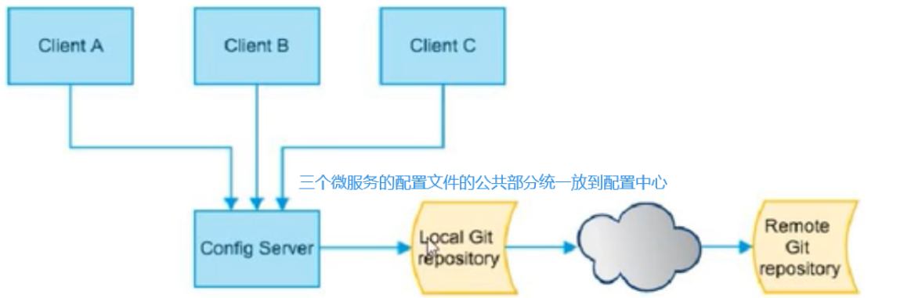
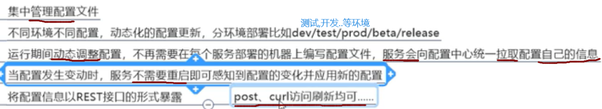
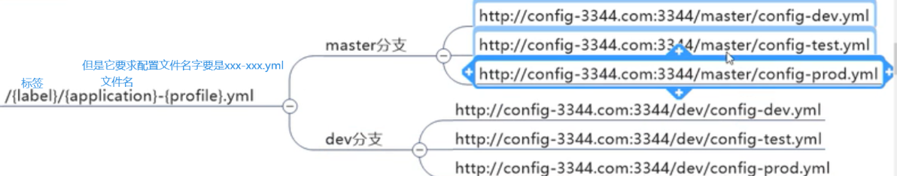
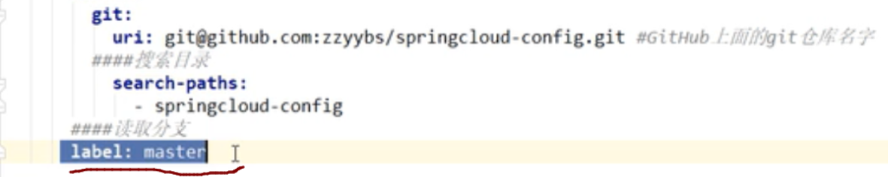
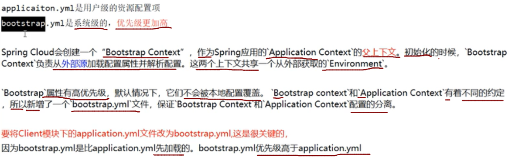

> 微服务面临的问题

可以看到，每个微服务都需要一个配置文件，并且，如果有几个微服务都需要连接数据库，那么就需要配4次数据库相关配置，并且当数据库发生改动，那么需要同时修改4个微服务的配置文件才可以

**所以有了 `springconfig` 配置中心**

:::warning 介绍
SpringCloud Config为微服务架构中的微服务提供集中化的外部配置支持，配置服务器为 **各个不同微服务应用** 的所有环境提供了一个 **中心化的外部配置**
:::



`SpringCloud Config` 分为 `服务端` 和 `客户端` 两部分。
- 服务端也称为 `分布式配置中心` ，**它是一个独立的微服务应用**，用来连接配置服务器并为客户端提供获取配置信息，加密/解密信息等访问接口
- 客户端则是 **通过指定的配置中心来管理应用资源，以及与业务相关的配置内容，并在启动的时候从配置中心获取和加载配置信息配置服务器默认采用git来存储配置信息**，这样就有助于对环境配置进行版本管理，并且可以通过git客户端工具来方便的管理和访问配置内容



## 1：使用配置中心
### 使用github作为配置中心的仓库

**初始化git环境:**


### 新建config模块

服务名：`cloud-config-3344`

### pom

```xml
<?xml version="1.0" encoding="UTF-8"?>
<project xmlns="http://maven.apache.org/POM/4.0.0"
         xmlns:xsi="http://www.w3.org/2001/XMLSchema-instance"
         xsi:schemaLocation="http://maven.apache.org/POM/4.0.0 http://maven.apache.org/xsd/maven-4.0.0.xsd">
    <parent>
        <artifactId>cloud2020</artifactId>
        <groupId>com.atguigu.springcloud</groupId>
        <version>1.0-SNAPSHOT</version>
    </parent>
    <modelVersion>4.0.0</modelVersion>

    <artifactId>cloud-config-center-3344</artifactId>

    <dependencies>

        <!--        Config服务端-->
        <dependency>
            <groupId>org.springframework.cloud</groupId>
            <artifactId>spring-cloud-config-server</artifactId>
        </dependency>
        <dependency>
            <groupId>org.springframework.cloud</groupId>
            <artifactId>spring-cloud-starter-netflix-eureka-client</artifactId>
        </dependency>
        <dependency>
            <groupId>com.atguigu.springcloud</groupId>
            <artifactId>cloud-api-commons</artifactId>
            <version>${project.version}</version>
        </dependency>
        <dependency>
            <groupId>org.springframework.boot</groupId>
            <artifactId>spring-boot-starter-web</artifactId>
        </dependency>

        <dependency>
            <groupId>org.springframework.boot</groupId>
            <artifactId>spring-boot-starter-actuator</artifactId>
        </dependency>

        <!--        <dependency>-->
        <!--            <groupId>org.springframework.boot</groupId>-->
        <!--            <artifactId>spring-boot-devtools</artifactId>-->
        <!--            <scope>runtime</scope>-->
        <!--            <optional>true</optional>-->
        <!--        </dependency>-->

        <dependency>
            <groupId>org.projectlombok</groupId>
            <artifactId>lombok</artifactId>
            <optional>true</optional>
        </dependency>
        <dependency>
            <groupId>org.springframework.boot</groupId>
            <artifactId>spring-boot-starter-test</artifactId>
            <scope>test</scope>
        </dependency>
    </dependencies>


</project>
```
### 配置文件

```yml
server:
  port: 3344

spring:
  application:
    name: cloud-config-center #注册进Eureka服务器的微服务名
  cloud:
    config:
      server:
        git:
          uri: https://gitee.com/lixiaogou/sprincloud-config.git #GitHub上面的git仓库名字
          search-paths: #搜索目录
            - springcloud-config
      label: master #读取分支
      #启动成功后访问的路径 http://ip:3344/{label}/{application}-{profile}.yml 能访问的配置文件 就表示成功了
    #rabbitmq相关配置
  rabbitmq:
    host: localhost
    port: 15672
    username: guest
    password: guest

eureka:
  client:
    service-url:
      defaultZone: http://localhost:7001/eureka


##rabbitmq相关配置,暴露bus刷新配置的端点 SpringCloud Bus动态刷新全局广播
management:
  endpoints: #暴露bus刷新配置的端点
    web:
      exposure:
        include: 'bus-refresh'

```

### 主启动类
```java
@SpringBootApplication
@EnableConfigServer
@ServletComponentScan("com.atguigu.springcloud.filter")
public class CloudConfigCenter3344Application {

    public static void main(String[] args) {
        SpringApplication.run(CloudConfigCenter3344Application.class, args);
        System.out.println("启动成功");

    }

}
```

### 修改hosts
windows下修改hosts文件，增加映射  `127.0.0.1 config-3344.com`

### 配置完成

测试, `3344` 是否可以从 `github` 上获取配置

启动3344    (要先启动eureka)


它实际上就是,读取到配置文件中的GitHub的地址,然后拼接上 `/master/config-dev.yml`

### 读取配置文件的规则
1



2


这里默认会读取master分支,因为我们配置文件中配置了



3


> 注意,这个方式读取到的配置是 `json格式` 的

所有规则:


## 2：创建配置中心客户端

### 创建config客户端项目

名字:    `cloud-config-client-3355`

### pom
```xml
<?xml version="1.0" encoding="UTF-8"?>
<project xmlns="http://maven.apache.org/POM/4.0.0"
         xmlns:xsi="http://www.w3.org/2001/XMLSchema-instance"
         xsi:schemaLocation="http://maven.apache.org/POM/4.0.0 http://maven.apache.org/xsd/maven-4.0.0.xsd">
    <parent>
        <artifactId>cloud2020</artifactId>
        <groupId>com.atguigu.springcloud</groupId>
        <version>1.0-SNAPSHOT</version>
    </parent>
    <modelVersion>4.0.0</modelVersion>

    <artifactId>cloud-config-client-3355</artifactId>

    <dependencies>
        <dependency>
            <groupId>org.springframework.cloud</groupId>
            <artifactId>spring-cloud-starter-config</artifactId>
        </dependency>
        <dependency>
            <groupId>org.springframework.cloud</groupId>
            <artifactId>spring-cloud-starter-netflix-eureka-client</artifactId>
        </dependency>
        <dependency>
            <groupId>com.atguigu.springcloud</groupId>
            <artifactId>cloud-api-commons</artifactId>
            <version>${project.version}</version>
        </dependency>
        <dependency>
            <groupId>org.springframework.boot</groupId>
            <artifactId>spring-boot-starter-web</artifactId>
        </dependency>

        <dependency>
            <groupId>org.springframework.boot</groupId>
            <artifactId>spring-boot-starter-actuator</artifactId>
        </dependency>

        <!--        <dependency>-->
        <!--            <groupId>org.springframework.boot</groupId>-->
        <!--            <artifactId>spring-boot-devtools</artifactId>-->
        <!--            <scope>runtime</scope>-->
        <!--            <optional>true</optional>-->
        <!--        </dependency>-->

        <dependency>
            <groupId>org.projectlombok</groupId>
            <artifactId>lombok</artifactId>
            <optional>true</optional>
        </dependency>
        <dependency>
            <groupId>org.springframework.boot</groupId>
            <artifactId>spring-boot-starter-test</artifactId>
            <scope>test</scope>
        </dependency>


    </dependencies>


</project>
```
### 配置文件

注意这个配置文件就不是 `application.yml` ，而是 `bootstrap.yml`

这个配置文件的作用是,先到配置中心加载配置,然后加载到 `application.yml` 中



```yml
server:
  port: 3355

spring:
  application:
    name: config-client
  cloud:
    config:
      label: master  #分支名称
      name: config  #配置文件名称
      profile: dev  #读取后缀名称   上述三个综合http://localhost:3344/master/config-dev.yml
      uri: http://localhost:3344  #配置中心的地址
    #rabbitmq相关配置
  rabbitmq:
    host: localhost
    port: 15672
    username: guest
    password: guest

#服务注册到eureka地址
eureka:
  client:
    service-url:
      #设置与eureka server交互的地址查询服务和注册服务都需要依赖这个地址
      defaultZone: http://localhost:7001/eureka #单机版
```


### 主启动类

```java
@SpringBootApplication
@EnableEurekaClient
public class CloudConfigClient3355Application {
    public static void main(String[] args) {
        SpringApplication.run(CloudConfigClient3355Application.class, args);
        System.out.println("启动成功");

    }
}
```

### controller类
```java
/**
 * @RefreshScope 实现热加载 自动获取刷新内容
 */
@RestController
public class ConfigController {

    @Value("${config.info}")
    private String configInfo;

    @GetMapping("/configInfo")
    public String getConfigInfo() {
        return configInfo;
    }
}
```


**如果客户端运行正常,就会读取到github上配置文件的, `config.info` 下的配置**

### 测试
启动3344,3355

访问3355的 /configInfo


### 问题
> 上面 `3355` 确实获取到了配置文件,但是如果此时配置文件修改了, `3355` 是获取不到的，`3344` 可以实时获取到最新配置文件,但是 `3355` 却获取不到，除非重启服务


### 客户端实现动态刷新

#### 修改3355,添加一个pom依赖
```xml
    <dependency>
        <groupId>org.springframework.boot</groupId>
        <artifactId>spring-boot-starter-actuator</artifactId>
    </dependency>
```
#### 修改配置文件,添加一个配置
```yml
server:
  port: 3355

spring:
  application:
    name: config-client
  cloud:
    config:
      label: master  #分支名称
      name: config  #配置文件名称
      profile: dev  #读取后缀名称   上述三个综合http://localhost:3344/master/config-dev.yml
      uri: http://localhost:3344  #配置中心的地址
    #rabbitmq相关配置
  rabbitmq:
    host: localhost
    port: 15672
    username: guest
    password: guest

#服务注册到eureka地址
eureka:
  client:
    service-url:
      #设置与eureka server交互的地址查询服务和注册服务都需要依赖这个地址
      defaultZone: http://localhost:7001/eureka #单机版

# 暴露监控端点 否则 curl -X POST "http://localhost:3355/actuator/refresh" 不可使用
management:
  endpoints:
    web:
      exposure:
        include: "*"
#SpringCloud Bus动态刷新定点通知 公式：http://localhost:配置中心的端口号/actuator/bus-refresh/{destination}
#例如 只通知3355，curl -X POST "http://localhost:3344/actuator/bus-refresh/config-client:3355"
```

新添加的内容

```yml
# 暴露监控端点 否则 curl -X POST "http://localhost:3355/actuator/refresh" 不可使用
management:
  endpoints:
    web:
      exposure:
        include: "*"
#SpringCloud Bus动态刷新定点通知 公式：http://localhost:配置中心的端口号/actuator/bus-refresh/{destination}
#例如 只通知3355，curl -X POST "http://localhost:3344/actuator/bus-refresh/config-client:3355"
```

#### 修改controller

```java
/**
 * @author lixiaolong
 * @RefreshScope 实现热加载 自动获取刷新内容
 */
@RestController
@RefreshScope
public class ConfigController {

    @Value("${config.info}")
    private String configInfo;

    @GetMapping("/configInfo")
    public String getConfigInfo() {
        return configInfo;
    }
}
```
#### 此时重启服务

**此时3355还不可以动态获取**

因为此时,还需要 `外部发送post请求通知3355`

```shell
curl -X POST "http://localhost:3355/actuator/refresh"
```


此时在刷新3355,发现可以获取到最新的配置文件了,这就实现了动态获取配置文件,因为3355并没有重启

> 具体流程就是

- 我们启动好服务后
- 运维人员,修改了配置文件,然后发送一个post请求通知3355
- 3355就可以获取最新配置文件


> 问题

- 如果有多个客户端怎么办(3355,3356,3357.....)
- 虽然可以使用shell脚本,循环刷新
- 但是,可不可以使用广播,一次通知??
- 这些springconfig做不到,需要使用springcloud Bus消息总线