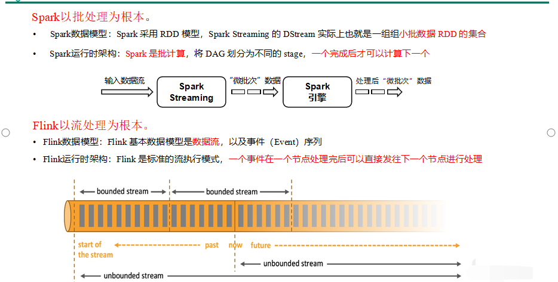
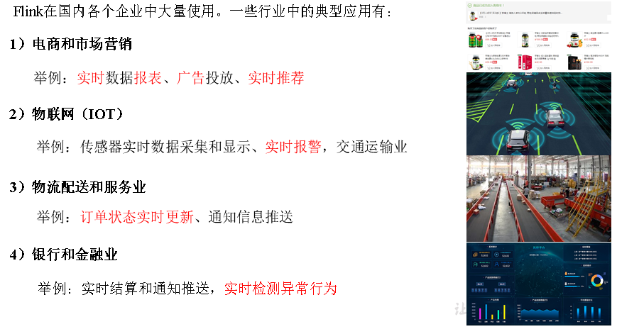

## 1：Flink是什么

### 1）概念
Flink的 [官网主页地址](https://flink.apache.org/)

Flimk核心目标，是“ **`数据流上的有状态计算`** ”( Stateful Computations over Data Streams )

具体说明: `Apache Flink` 是一个框架和分布式处理引擎，用于对 `无界` 和 `有界` 数据流进行有
状态计算。

--- 

### 2）有界无界流

> **无界流** 和 **有界流** 

- `无界数据流`
  - 有定义流的开始，但没有定义流的结束;
  - 它们会无休止的产生数据;
  - 无界流的数据必须持续处理，即数据被摄取后需要立刻处理。
  - 我们不能等到所有数据都到达再处理，因为输入是无限的。 
- `有界数据流`
  - 有定义流的开始，也有定义流的结束
  - 有界流可以在摄取所有数据后再进行计算
  - 有界流所有数据可以被排序，所以并不需要有序摄取
  - 有界流处理通常被称为批处理 

### 3）有状态流处理
把流处理需要的 ***`额外数据保存成一个“状态”`*** ，然后针对这条数据进行处理，***并且更新状态***。这就是所谓的 ***`“有状态的流处理”`***

- 状态在 `内存` 中:
  - 优点，速度快
  - 缺点，可靠性差
- 状态在 `分布式系统` 中
  - 优点，可靠性高
  - 缺点，速度慢
## 2：Flink特点

我们处理数据的目标是: 低延迟、高吞吐、结果的准确性和良好的容错性

> Flink主要特点如下:

- `高吞吐和低延迟`。每秒处理数百万个事件，毫秒级延迟。
- `结果的准确性`。Flink提供了 `事件时间 (event-time)` 和 `处理时间 (processing-time)` 语义。对于乱序事件流，事件时间语义仍然能提供一致且准确的结果。
- `精确一次` (exactly-once)的状态一致性保证
- `可以连接到最常用的外部系统`，如 `Kaka`、`Hve`、`JDBC`、`HDES`、`Reds` 等。
- `高可用`。本身高可用的设置，加上与 `K8s`，`YARN` 和 `Mesos` 的紧密集成，再加上从故障中快速恢复和动态扩展任务的能力，Flink能做到以极少的停机时间7X24全天候运行

## 3：Flink vs SparkStreaming

## 4：Flink的应用场景

## 5：Flink分层API
