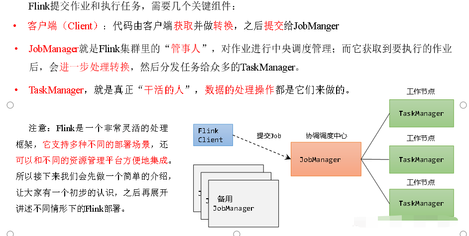
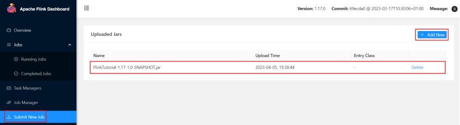
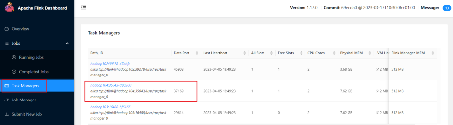
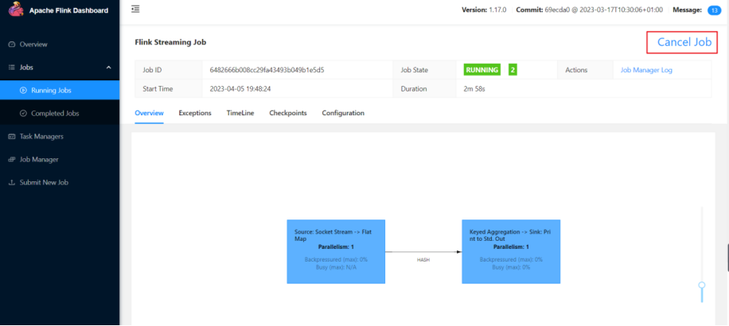
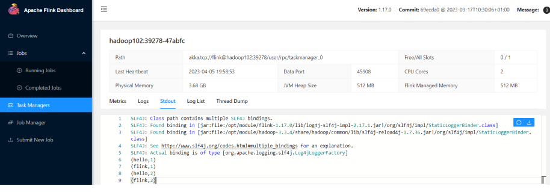

## 1：集群角色



## 2：集群搭建
### 1）集群启动
#### 集群规划


#### 1-下载并解压安装包

（1）下载安装包 `flink-1.17.0-bin-scala_2.12.tgz`，将该jar包上传到 `hadoop102` 节点服务器的 `/opt/software` 路径上。  
（2）在 `/opt/software` 路径上解压 `flink-1.17.0-bin-scala_2.12.tgz` 到 `/opt/module` 路径上。

```shell
tar -zxvf flink-1.17.0-bin-scala_2.12.tgz -C /opt/module/
```
#### 2-修改集群配置

（1）进入 `conf` 路径，修改 `flink-conf.yaml` 文件，指定 `hadoop102` 节点服务器为 `JobManager`

```shell
vim flink-conf.yaml
```

修改如下内容：

```shell
# JobManager节点地址.  
jobmanager.rpc.address: hadoop102  
jobmanager.bind-host: 0.0.0.0  
rest.address: hadoop102  
rest.bind-address: 0.0.0.0  
# TaskManager节点地址.需要配置为当前机器名  
taskmanager.bind-host: 0.0.0.0  
taskmanager.host: hadoop102  
```

（2）修改 `workers` 文件，指定 `hadoop102`、`hadoop103` 和 `hadoop104` 为 `TaskManager`

```shell
vim workers
```

修改如下内容:
```shell
hadoop102  
hadoop103  
hadoop104  
```

（3）修改 `masters` 文件

```shell
vim masters
```
修改如下内容：
```shell
hadoop102:8081
```

（4）另外，在 `flink-conf.yaml` 文件中还可以对集群中的 `JobManager` 和 `TaskManager` 组件进行优化配置，主要配置项如下：
- `jobmanager.memory.process.size`：对JobManager进程可使用到的全部内存进行配置，包括JVM元空间和其他开销，默认为 `1600M` ，可以根据集群规模进行适当调整。
- `taskmanager.memory.process.size`：对TaskManager进程可使用到的全部内存进行配置，包括JVM元空间和其他开销，默认为 `1728M`，可以根据集群规模进行适当调整。
- `taskmanager.numberOfTaskSlots`：对每个TaskManager能够分配的Slot数量进行配置，默认为1，可根据TaskManager所在的机器能够提供给Flink的CPU数量决定。所谓Slot就是TaskManager中具体运行一个任务所分配的计算资源。
- `parallelism.default`：Flink任务执行的并行度，默认为1。优先级低于代码中进行的并行度配置和任务提交时使用参数指定的并行度数量。

#### 3-分发安装目录

（1）配置修改完毕后，将Flink安装目录发给另外两个节点服务器。

```shell
xsync flink-1.17.0/
```

（2）修改 `hadoop103` 的 `taskmanager.host`

```shell
vim flink-conf.yaml
```

修改如下内容：
> TaskManager节点地址.需要配置为当前机器名

```shell
taskmanager.host: hadoop103
```

（3）修改 `hadoop104` 的 `taskmanager.host`
```shell
vim flink-conf.yaml
```
修改如下内容：
> TaskManager节点地址.需要配置为当前机器名

```shell
taskmanager.host: hadoop104
```

#### 4-启动集群

（1）在 `hadoop102` 节点服务器上执行 `start-cluster.sh` 启动 `Flink` 集群：

```shell
flink-1.17.0]$ bin/start-cluster.sh
```

（2）查看进程情况：
```shell
[atguigu@hadoop102 flink-1.17.0]$ jpsall 
=============== hadoop102 ===============
4453 StandaloneSessionClusterEntrypoint
4458 TaskManagerRunner
4533 Jps
=============== hadoop103 ===============
2872 TaskManagerRunner
2941 Jps
=============== hadoop104 ===============
2948 Jps
2876 TaskManagerRunner
```

#### 5-访问Web UI

启动成功后，同样可以访问 `http://hadoop102:8081` 对 `flink集群` 和 `任务进行监控管理`。


这里可以明显看到，当前集群的 `TaskManager` 数量为 `3` ；由于默认每个 `TaskManager` 的 `Slot` 数量为 `1` ，所以 `总Slot数` 和 `可用Slot数` 都为 `3` 。

### 2）向集群提交作业

我们已经编写 `读取socket` 发送的 `单词并统计单词的个数` 程序案例。本节我们将以该程序为例，演示如何将 `任务提交到集群中进行执行` 。具体步骤如下：

#### 1-环境准备

在 `hadoop102` 中执行以下命令启动 `netcat`。

```shell
nc -lk 7777
```

#### 2-程序打包

（1）在我们编写的 `Flink` 入门程序的 `pom.xml` 文件中添加打包插件的配置，具体如下：
```xml
<build>
    <plugins>
        <plugin>
            <groupId>org.apache.maven.plugins</groupId>
            <artifactId>maven-shade-plugin</artifactId>
            <version>3.2.4</version>
            <executions>
                <execution>
                    <phase>package</phase>
                    <goals>
                        <goal>shade</goal>
                    </goals>
                    <configuration>
                        <artifactSet>
                            <excludes>
                                <exclude>com.google.code.findbugs:jsr305</exclude>
                                <exclude>org.slf4j:*</exclude>
                                <exclude>log4j:*</exclude>
                            </excludes>
                        </artifactSet>
                        <filters>
                            <filter>
                                <!-- Do not copy the signatures in the META-INF folder.
                                Otherwise, this might cause SecurityExceptions when using the JAR. -->
                                <artifact>*:*</artifact>
                                <excludes>
                                    <exclude>META-INF/*.SF</exclude>
                                    <exclude>META-INF/*.DSA</exclude>
                                    <exclude>META-INF/*.RSA</exclude>
                                </excludes>
                            </filter>
                        </filters>
                        <transformers combine.children="append">
                            <transformer
                                    implementation="org.apache.maven.plugins.shade.resource.ServicesResourceTransformer">
                            </transformer>
                        </transformers>
                    </configuration>
                </execution>
            </executions>
        </plugin>
    </plugins>
</build>
```

（2）插件配置完毕后，可以使用IDEA的 `Maven` 工具执行 `package` 命令，出现如下提示即表示打包成功。

打包完成后，在 `target` 目录下即可找到所需JAR包，JAR包会有两个，`FlinkTutorial-1.0-SNAPSHOT.jar` 和 `FlinkTutorial-1.0-SNAPSHOT-jar-with-dependencies.jar` ，因为集群中已经具备任务运行所需的所有依赖，所以建议使用 `FlinkTutorial-1.0-SNAPSHOT.jar` 。

#### 3-在Web UI上提交作业

（1）任务打包完成后，我们打开 `Flink` 的 `WEB UI` 页面，在右侧导航栏点击 `“Submit New Job”` ，然后点击按钮 `“+ Add New”` ，选择要上传运行的JAR包，如下图所示。


JAR包上传完成，如下图所示：



（2）点击该JAR包，出现任务配置页面，进行相应配置。

主要配置程序入口主类的全类名，任务运行的并行度，任务运行所需的配置参数和保存点路径等，如下图所示，配置完成后，即可点击按钮 `“Submit”` ，将任务提交到集群运行。


（3）任务提交成功之后，可点击左侧导航栏的 `“Running Jobs”` 查看程序运行列表情况。


（4）测试

①在 `socket` 端口中输入 `hello`
```shell
nc -lk 7777  
hello
```

②先点击 `Task Manager`，然后点击右侧的 `192.168.10.104` 服务器节点



③点击 `Stdout` ，就可以看到 `hello` 单词的统计


<P style="color:red">	注意：如果hadoop104节点没有统计单词数据，可以去其他TaskManager节点查看。</P>

（4）点击该任务，可以查看任务运行的具体情况，也可以通过点击 `“Cancel Job”` 结束任务运行。



#### 4-命令行提交作业

除了通过 `WEB UI` 界面提交任务之外，也可以直接通过命令行来提交任务。这里为方便起见，我们可以先把 `jar` 包直接上传到目录 `flink-1.17.0` 下

（1）首先需要启动集群。
```shell
bin/start-cluster.sh
``` 

（2）在 `hadoop102` 中执行以下命令启动 `netcat` 。

```shell
nc -lk 7777
```

（3）将 `flink` 程序运行jar包上传到 `/opt/module/flink-1.17.0` 路径。  
（4）进入到 `flink` 的安装路径下，在命令行使用 `flink run` 命令提交作业。 

```shell
bin/flink run -m hadoop102:8081 -c com.atguigu.wc.SocketStreamWordCount ./FlinkTutorial-1.0-SNAPSHOT.jar
```

这里的参数 `-m` 指定了提交到的 `JobManager` ，`-c`指定了入口类。

（5）在浏览器中打开 `Web UI`， `http://hadoop102:8081` 查看应用执行情况。
用 `netcat` 输入数据，可以在 `TaskManager` 的标准输出（Stdout）看到对应的统计结果



（6）在 `/opt/module/flink-1.17.0/log` 路径中，可以查看 `TaskManager` 节点。

```shell
cat flink-atguigu-standalonesession-0-hadoop102.out

(hello,1)
(hello,2)
(flink,1)
(hello,3)
(scala,1)
```