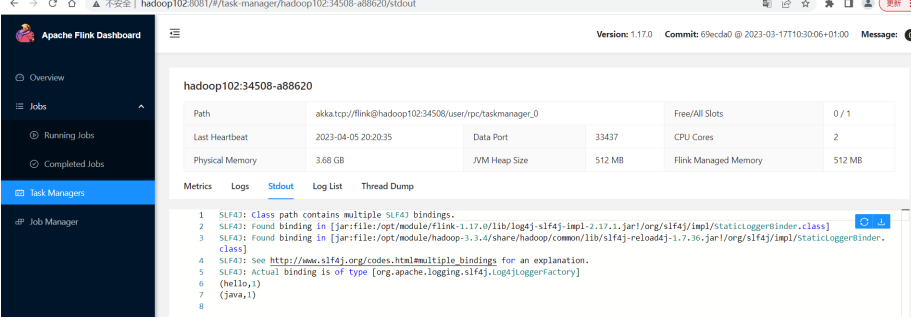

独立模式是独立运行的，不依赖任何外部的资源管理平台；当然独立也是有代价的：如果 ***资源不足，或者出现故障，没有自动扩展或重分配资源的保证，必须手动处理*** 。所以独立模式一般 ***只用在开发测试或作业非常少的场景下*** 。

## 1：会话模式部署

提前启动集群，并通过Web页面客户端提交任务（可以多个任务，但是集群资源固定）。


## 2：单作业模式部署

`Flink` 的 `Standalone` 集群并不支持单作业模式部署。因为单作业模式需要借助一些资源管理平台。

## 3：应用模式部署

应用模式下不会提前创建集群，所以不能调用 `start-cluster.sh` 脚本。我们可以使用同样在bin目录下的 `standalone-job.sh` 来创建一个 `JobManager` 。


具体步骤如下：

- （0）环境准备。在 `hadoop102` 中执行以下命令启动 `netcat` 。

```shell
nc -lk 7777
``` 
- （1）进入到 `Flink` 的安装路径下，将应用程序的jar包放到lib/目录下。

```shell
mv FlinkTutorial-1.0-SNAPSHOT.jar lib/
```

- （2）执行以下命令，启动 `JobManager` 。

```shell
bin/standalone-job.sh start --job-classname com.atguigu.wc.SocketStreamWordCount
```

这里我们直接指定作业入口类，脚本会到lib目录扫描所有的jar包。

- （3）同样是使用bin目录下的脚本，启动 `TaskManager` 。

```shell
bin/taskmanager.sh start
```

- 在 `hadoop102` 上模拟发送单词数据。

```shell
nc -lk 7777  
hello
```

- （5）在 `hadoop102:8081` 地址中观察输出数据



- （6）如果希望停掉集群，同样可以使用脚本，命令如下。

```shell
bin/taskmanager.sh stop
bin/standalone-job.sh stop
```