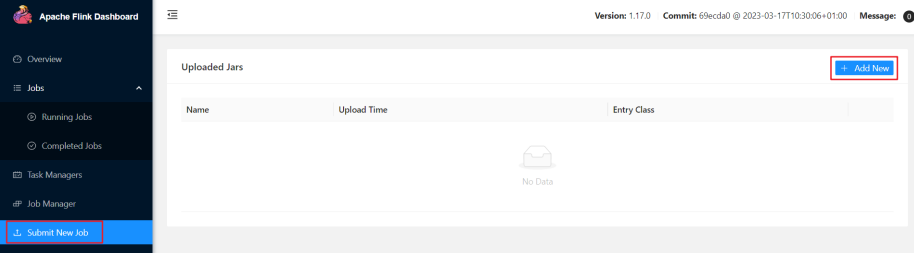
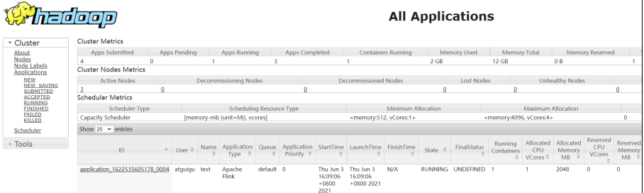
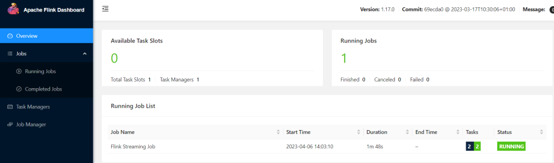

`YARN` 上部署的过程是：客户端把 `Flink` 应用提交给 `Yarn` 的 `ResourceManager`，`Yarn`的 `ResourceManager` 会向 `Yarn` 的 `NodeManager` 申请容器。在这些容器上，`Flink` 会部署 `JobManager` 和 `TaskManager` 的实例，从而启动集群。***`Flink` 会根据运行在 `JobManger`上的作业所需要的 `Slot` 数量动态分配 `TaskManager`资源***。

## 1：相关准备和配置

在将 `Flink` 任务部署至 `YARN` 集群之前，需要确认集群是否安装有 `Hadoop`，保证 `Hadoop` 版本至少在2.2以上，并且集群中安装有 `HDFS` 服务。     
具体配置步骤如下：

（1）配置环境变量，增加环境变量配置如下：
```shell
$ sudo vim /etc/profile.d/my_env.sh

HADOOP_HOME=/opt/module/hadoop-3.3.4
export PATH=$PATH:$HADOOP_HOME/bin:$HADOOP_HOME/sbin
export HADOOP_CONF_DIR=${HADOOP_HOME}/etc/hadoop
export HADOOP_CLASSPATH=`hadoop classpath`
```

（2）启动 `Hadoop` 集群，包括 `HDFS` 和 `YARN` 。

```shell
start-dfs.sh
start-yarn.sh
```
（3）在 `hadoop102` 中执行以下命令启动 `netcat` 。

```shell
nc -lk 7777
```

## 2：会话模式部署

`YARN` 的会话模式与独立集群略有不同，需要首先申请一个 `YARN` 会话（YARN Session）来启动`Flink` 集群。具体步骤如下：

### 1）启动集群
（1）启动 `Hadoop` 集群（`HDFS、YARN`）。  
（2）执行脚本命令向 `YARN` 集群申请资源，开启一个 `YARN` 会话，启动 `Flink` 集群。

```shell
bin/yarn-session.sh -nm test
```

可用参数解读：

- `-d` ：分离模式，如果你不想让Flink YARN客户端一直前台运行，可以使用这个参数，即使关掉当前对话窗口，YARN session也可以后台运行。
- `-jm（--jobManagerMemory）` ：配置JobManager所需内存，默认单位MB。
- `-nm（--name）` ：配置在YARN UI界面上显示的任务名。
- `-qu（--queue）` ：指定YARN队列名。
- `-tm（--taskManager）` ：配置每个TaskManager所使用内存。

注意：`Flink1.11.0` 版本不再使用 `-n` 参数和 `-s` 参数分别指定 `TaskManager` 数量和 `slot` 数量，`YARN` 会按照需求动态分配 `TaskManager` 和 `slot` 。所以从这个意义上讲，`YARN` 的会话模式也不会把集群资源固定，同样是动态分配的。    
`YARN Session` 启动之后会给出一个 `Web UI` 地址以及一个 `YARN application ID`，如下所示，用户可以通过 `Web UI` 或者命令行两种方式提交作业。

```shell
2022-11-17 15:20:52,711 INFO  org.apache.flink.yarn.YarnClusterDescriptor                  [] - Found Web Interface hadoop104:40825 of application 'application_1668668287070_0005'.
JobManager Web Interface: http://hadoop104:40825
```

### 2）提交作业
（1）通过Web UI提交作业  
这种方式比较简单，与上文所述Standalone部署模式基本相同。



（2）通过命令行提交作业  
① 将 `FlinkTutorial-1.0-SNAPSHOT.jar` 任务上传至集群。
② 执行以下命令将该任务提交到已经开启的 `Yarn-Session` 中运行。

```shell
bin/flink run
-c com.atguigu.wc.SocketStreamWordCount FlinkTutorial-1.0-SNAPSHOT.jar
```

客户端可以自行确定 `JobManager` 的地址，也可以通过 `-m` 或者 `-jobmanager` 参数指定`JobManager` 的地址，`JobManager` 的地址在 `YARN Session` 的启动页面中可以找到。    
③ 任务提交成功后，可在 `YARN` 的 `Web UI` 界面查看运行情况。`hadoop103:8088`。



从上图中可以看到我们创建的 `Yarn-Session` 实际上是一个 `Yarn` 的 `Application`，并且有唯一的 `Application ID`。  
④也可以通过 `Flink` 的 `Web UI` 页面查看提交任务的运行情况，如下图所示。


## 3：单作业模式部署

在 `YARN` 环境中，由于有了外部平台做资源调度，所以我们也可以直接向 `YARN` 提交一个单独的作业，从而启动一个 `Flink` 集群。

（1）执行命令提交作业。
```shell
bin/flink run -d -t yarn-per-job -c com.atguigu.wc.SocketStreamWordCount FlinkTutorial-1.0-SNAPSHOT.jar
```
注意：如果启动过程中报如下异常。

```shell
Exception in thread “Thread-5” java.lang.IllegalStateException: Trying to access closed classloader. Please check if you store classloaders directly or indirectly in static fields. If the stacktrace suggests that the leak occurs in a third party library and cannot be fixed immediately, you can disable this check with the configuration ‘classloader.check-leaked-classloader’.
at org.apache.flink.runtime.execution.librarycache.FlinkUserCodeClassLoaders
```

解决办法：在 `flink` 的 `/opt/module/flink-1.17.0/conf/flink-conf.yaml` 配置文件中设置
```shell
[atguigu@hadoop102 conf]$ vim flink-conf.yaml

classloader.check-leaked-classloader: false
```

（2）在 `YARN` 的 `ResourceManager` 界面查看执行情况。


点击可以打开 `Flink Web UI` 页面进行监控，如下图所示：



（3）可以使用命令行查看或取消作业，命令如下。

```shell
bin/flink list -t yarn-per-job -Dyarn.application.id=application_XXXX_YY

bin/flink cancel -t yarn-per-job -Dyarn.application.id=application_XXXX_YY <jobId>
```

这里的 `application_XXXX_YY` 是当前应用的 `ID`，`<jobId>` 是作业的 `ID` 。注意如果取消作业，整个 `Flink` 集群也会停掉。

## 4：应用模式部署

应用模式同样非常简单，与单作业模式类似，直接执行 `flink run-application` 命令即可。

### 1）命令行提交

（1）执行命令提交作业。

```shell
bin/flink run-application -t yarn-application -c com.atguigu.wc.SocketStreamWordCount FlinkTutorial-1.0-SNAPSHOT.jar 
```

（2）在命令行中查看或取消作业。

```shell
bin/flink list -t yarn-application -Dyarn.application.id=application_XXXX_YY

bin/flink cancel -t yarn-application -Dyarn.application.id=application_XXXX_YY <jobId>
```

### 2）上传HDFS提交

可以通过 `yarn.provided.lib.dirs` 配置选项指定位置，将 `flink` 的依赖上传到远程。

（1）上传 `flink` 的 `lib` 和 `plugins` 到 `HDFS` 上

```shell
 hadoop fs -mkdir /flink-dist
 hadoop fs -put lib/ /flink-dist
 hadoop fs -put plugins/ /flink-dist
```

（2）上传自己的jar包到HDFS

```shell
 hadoop fs -mkdir /flink-jars
 hadoop fs -put FlinkTutorial-1.0-SNAPSHOT.jar /flink-jars
```

（3）提交作业

```shell
bin/flink run-application -t yarn-application	-Dyarn.provided.lib.dirs="hdfs://hadoop102:8020/flink-dist"	-c com.atguigu.wc.SocketStreamWordCount  hdfs://hadoop102:8020/flink-jars/FlinkTutorial-1.0-SNAPSHOT.jar
```

这种方式下，`flink` 本身的依赖和用户 `jar` 可以预先上传到 `HDFS`，而不需要单独发送到集群，这就使得作业提交更加轻量了。