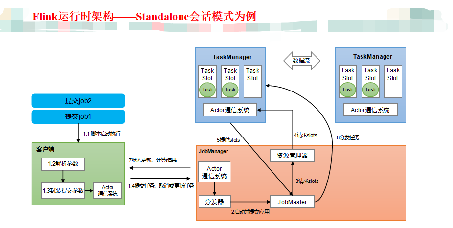

## 1：作业管理器（JobManager）

`JobManager` 是一个 `Flink` 集群中任务管理和调度的核心，是控制应用执行的主进程。也就是说，***每个应用都应该被唯一的JobManager所控制执行。***

`JobManger` 又包含3个不同的组件。

> 1）JobMaster

`JobMaster` 是 `JobManager` 中最核心的组件，负责处理单独的作业（Job）。所以 `JobMaster` 和具体的 `Job` 是一一对应的，多个 `Job` 可以同时运行在一个Flink集群中, 每个Job都有一个自己的 `JobMaster` 。需要注意在早期版本的 `Flink` 中，没有 `JobMaster` 的概念；而`JobManager` 的概念范围较小，实际指的就是现在所说的 `JobMaster` 。

在作业提交时，`JobMaster` 会先接收到要执行的应用。`JobMaster` 会把 `JobGraph` 转换成一个物理层面的数据流图，这个图被叫作 `“执行图”（ExecutionGraph）` ，它包含了所有可以并发执行的任务。`JobMaster` 会向资源管理器（ResourceManager）发出请求，申请执行任务必要的资源。一旦它获取到了足够的资源，就会将执行图分发到真正运行它们的TaskManager上。

而在运行过程中，`JobMaster`会负责所有需要中央协调的操作，比如说检查点（checkpoints）的协调。

> 2）资源管理器（ResourceManager）

`ResourceManager` 主要负责资源的分配和管理，在Flink 集群中只有一个。所谓“资源”，主要是指`TaskManager` 的任务槽 `（task slots）` 。任务槽就是 `Flink` 集群中的资源调配单元，包含了机器用来执行计算的一组CPU和内存资源。每一个任务（Task）都需要分配到一个slot上执行。
这里注意要把Flink内置的 `ResourceManager` 和其他资源管理平台（比如YARN）的`ResourceManager` 区分开。

> （3）分发器（Dispatcher）

`Dispatcher` 主要负责提供一个 `REST` 接口，用来提交应用，并且负责为每一个新提交的作业启动一个新的 `JobMaster` 组件。`Dispatcher` 也会启动一个 `Web UI` ，用来方便地展示和监控作业执行的信息。`Dispatcher` 在架构中并不是必需的，在不同的部署模式下可能会被忽略掉。

## 2：任务管理器（TaskManager）

`TaskManager` 是 `Flink` 中的工作进程，数据流的具体计算就是它来做的。Flink集群中必须至少有一个 `TaskManager` ；每一个 `TaskManager` 都包含了一定数量的任务槽 `（task slots）` 。 ***`Slot` 是资源调度的最小单位*** ，slot的数量限制了 `TaskManager` 能够并行处理的任务数量。
启动之后，`TaskManager` 会向资源管理器注册它的 `slots` ；收到资源管理器的指令后，`TaskManager` 就会将一个或者多个槽位提供给 `JobMaster` 调用，`JobMaster` 就可以分配任务来执行了。
在执行过程中，`TaskManager` 可以缓冲数据，还可以跟其他运行同一应用的 `TaskManager` 交换数据。