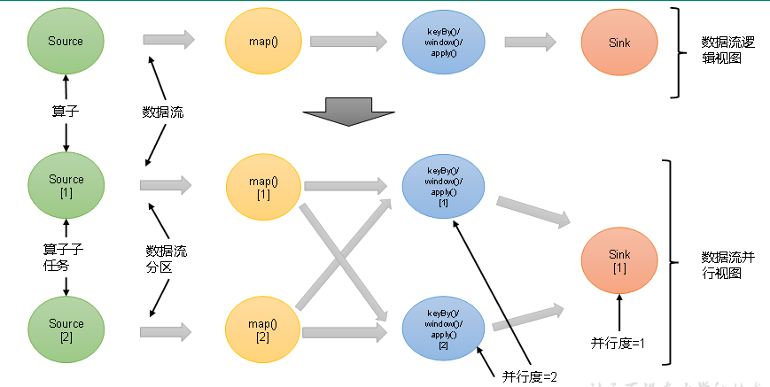

## 1：并行度（Parallelism）

### 1）并行子任务和并行度

当要处理的数据量非常大时，**我们可以把一个算子操作，“复制”多份到多个节点**，数据来了之后就可以到其中任意一个执行。这样一来，一个算子任务就被拆分成了多个并行的“子任务”（`subtasks`），再将它们分发到不同节点，**就真正实现了并行计算**。

**在Flink执行过程中，每一个算子（operator）可以包含一个或多个子任务（operator subtask），这些子任务在不同的线程、不同的物理机或不同的容器中完全独立地执行。**

