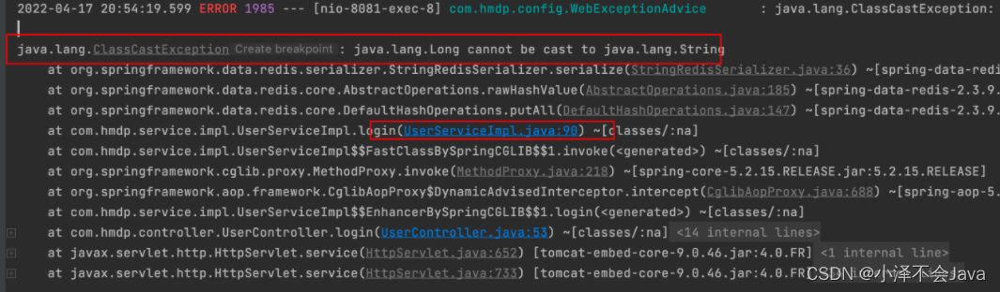
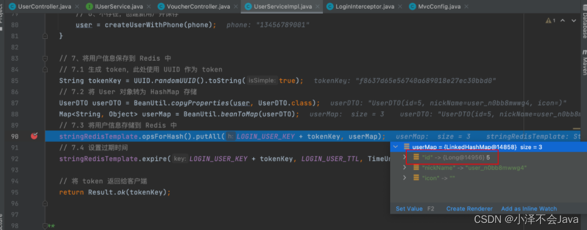
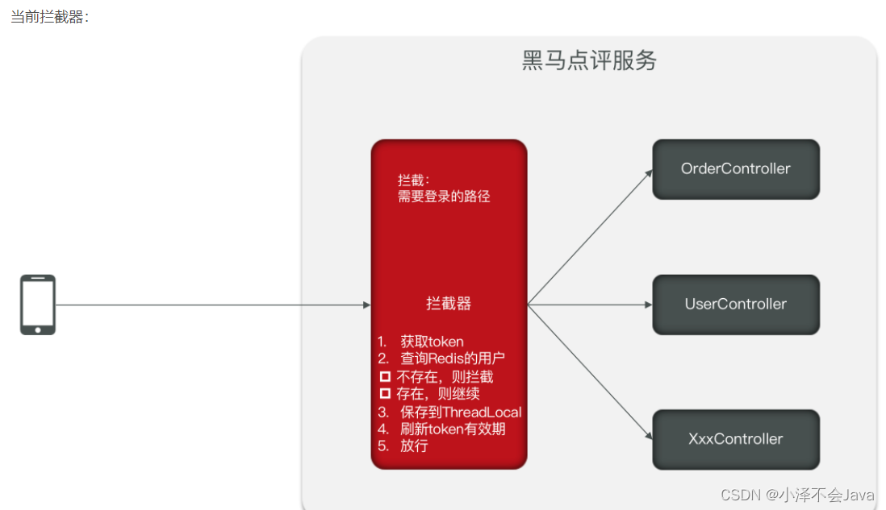

## 1：前期知识详解


> 那么又该选用什么形式的 key 来存储用户数据呢？

在这我们选择随机的 `token` 作为 `key` 来存储用户数据。在短信验证码登录时，我们还需要将这个随机 `token` 返回给客户端，***这是因为后期我们在访问各个页面时都是需要校验登录状态***，来判断哪些页面用户可以在未登录状态下访问，哪些页面需要登录后才能访问。

> 来看下前端是如何存储 `token` 的。

当我们访问接口 `/user/login` 时，如果访问成功，会将 `token` 返回给前端登录页面，而前端则会将该 `token` 保存到 `session` 中（通过 `sessionStorage.setItem` 方法）。


再来看下 `common.js`
可以看到，`common.js` 中将 `token` 数据保存到了请求头中，该请求头的名字叫做`”authorization“`，这样在后续所有的 `Ajax` 请求中，都会在请求头中携带该 `token`。


而在此处为什么没有使用 **手机号作** 为 `token` 呢？这是因为 `token` 需要保存在 `客户端`，如果以手机号作为 `token`，会有泄露用户隐私的风险。 

## 2：代码实现
```java
public class UserHolder {
    private static final ThreadLocal<UserDTO> tl = new ThreadLocal<>();
 
    public static void saveUser(UserDTO user){
        tl.set(user);
    }
 
    public static UserDTO getUser(){
        return tl.get();
    }
 
    public static void removeUser(){
        tl.remove();
    }
}
```
```java
package com.hmdp.service.impl;
 
import cn.hutool.core.bean.BeanUtil;
import cn.hutool.core.lang.UUID;
import cn.hutool.core.util.RandomUtil;
import com.baomidou.mybatisplus.extension.service.impl.ServiceImpl;
import com.hmdp.dto.LoginFormDTO;
import com.hmdp.dto.Result;
import com.hmdp.dto.UserDTO;
import com.hmdp.entity.User;
import com.hmdp.mapper.UserMapper;
import com.hmdp.service.IUserService;
import com.hmdp.utils.RegexUtils;
import lombok.extern.slf4j.Slf4j;
import org.springframework.beans.factory.annotation.Autowired;
import org.springframework.data.redis.core.StringRedisTemplate;
import org.springframework.stereotype.Service;
 
import javax.servlet.http.HttpSession;
 
import java.util.Map;
import java.util.concurrent.TimeUnit;
 
import static com.hmdp.utils.RedisConstants.*;
import static com.hmdp.utils.SystemConstants.USER_NICK_NAME_PREFIX;
 
@Slf4j
@Service
public class UserServiceImpl extends ServiceImpl<UserMapper, User> implements IUserService {
 
    @Autowired
    private StringRedisTemplate stringRedisTemplate;
 
    @Override
    public Result sendCode(String phone, HttpSession session) {
        // 1、校验手机号
        if (RegexUtils.isPhoneInvalid(phone)) {
            // 2、如果不符合，返回错误信息
            return Result.fail("手机号格式错误！");
        }
        // 3、符合，生成验证码
        String code = RandomUtil.randomNumbers(6);
        // 4、保存验证码到 Redis 中
        stringRedisTemplate.opsForValue().set(LOGIN_CODE_KEY + phone, code, LOGIN_CODE_TTL, TimeUnit.MINUTES);
        // 5、发送验证码
        log.debug("发送短信验证码成功，验证码：{}", code);
        return Result.ok();
    }
 
    @Override
    public Result login(LoginFormDTO loginForm, HttpSession session) {
        // 1、校验手机号
        String phone = loginForm.getPhone();
        String code = loginForm.getCode();
        if (RegexUtils.isPhoneInvalid(phone)) {
            return Result.fail("手机号格式错误！");
        }
 
        // 2、从 Redis 中获取验证码
        String cacheCode = stringRedisTemplate.opsForValue().get(LOGIN_CODE_KEY + phone);
 
        // 3、不一致，报错
        if(cacheCode == null || !cacheCode.equals(code)){
            return Result.fail("验证码错误！");
        }
        // 4、一致，根据手机号去查询用户
        User user = query().eq("phone", phone).one();
 
        // 5、判断用户是否存在
        if(user == null){
            // 6、不存在，创建新用户并保存
            user = createUserWithPhone(phone);
        }
 
        // 7、将用户信息保存到 Redis 中
        // 7.1 生成 token，此处使用 UUID 作为 token
        String tokenKey = UUID.randomUUID().toString(true);
        // 7.2 将 User 对象转为 HashMap 存储
        UserDTO userDTO = BeanUtil.copyProperties(user, UserDTO.class);
        Map<String, Object> userMap = BeanUtil.beanToMap(userDTO);
        // 7.3 将用户信息存储到 Redis 中
        stringRedisTemplate.opsForHash().putAll(LOGIN_USER_KEY + tokenKey, userMap);
        // 7.4 设置过期时间
        stringRedisTemplate.expire(LOGIN_USER_KEY + tokenKey, LOGIN_USER_TTL, TimeUnit.MINUTES);
 
        // 将 token 返回给客户端
        return Result.ok(tokenKey);
    }
 
    /**
     * 根据手机号创建用户
     * */
    private User createUserWithPhone(String phone) {
        // 创建用户
        User user = new User();
        user.setPhone(phone);
        user.setNickName(USER_NICK_NAME_PREFIX + RandomUtil.randomString(10));
        // 保存用户
        save(user);
        return user;
    }
}
```

### 1）代码实现分析

- 1、`sendCode` 方法，将 `session` 存储验证码改为 `Redis` 存储，同时设置`过期时间`
- 2、`login` 方法中，将 `session` 存储用户信息，修改为 `Redis` 存储，`value` 值采用 `Hash` 类型，同时设置 `过期时间` ，模拟 `session` 过期时间。但是 session 过期是在用户未作任何操作的情况下，而 Redis 则是从 ***用户登录*** 开始计时， ***到指定时间后自动过期*** 。我们应当 ***保证只要用户在不断访问*** ，就不断更新 `Redis` 中的 `token过期时间`。那我们如何知道用户什么时候访问，有没有访问呢？我们所有的请求都要经过 `拦截器` 进行校验，**只要同过了拦截器的校验就说明用户是已经登录的且在活跃的状态**。那么我们就可以在拦截器中对 token 的过期时间进行刷新操作。只有什么都不操作的情况下，才不会走拦截器的校验，也就不会刷新 token 的过期时间。

### 2）修改拦截器
这里要注意一点就是，`LoginInterceptor` 是我们自定义的一个类，并非 Spring 进行管理的类，所以在使用 `StringRedisTemplate` 的时候，无法使用 `@Autowired` 或者 `@Resource` 进行注入。但是，`MvcConfig` 是由 `Spring` 进行管理的，可以由 `Spring` 注入 `StringRedisTemplate` 的实例

```java
package com.hmdp.utils;
 
import cn.hutool.core.bean.BeanUtil;
import cn.hutool.core.util.StrUtil;
import com.hmdp.dto.UserDTO;
import org.springframework.data.redis.core.StringRedisTemplate;
import org.springframework.web.servlet.HandlerInterceptor;
 
import javax.servlet.http.HttpServletRequest;
import javax.servlet.http.HttpServletResponse;
import java.util.Map;
import java.util.concurrent.TimeUnit;
 
public class LoginInterceptor implements HandlerInterceptor {
 
    private StringRedisTemplate stringRedisTemplate;
 
    public LoginInterceptor(StringRedisTemplate stringRedisTemplate) {
        this.stringRedisTemplate = stringRedisTemplate;
    }
 
    @Override
    public boolean preHandle(HttpServletRequest request, HttpServletResponse response, Object handler) throws Exception {
        // 1、从请求头中获取 token
        String token = request.getHeader("authorization");
        // 2、判断token是否为空
        if (StrUtil.isBlank(token)) {
            // 不存在报401
            response.setStatus(401);
            return false;
        }
        // 3、根据 token 从 redis 中获取用户信息
        String tokenKey = RedisConstants.LOGIN_USER_KEY + token;
        // 使用 entries 方法获取所有的 field-value
        Map<Object, Object> userMap = stringRedisTemplate.opsForHash().entries(tokenKey);
 
        // 4、判断 userMap 是否为空
        if (userMap.isEmpty()) {
            // 不存在报401
            response.setStatus(401);
            return false;
        }
 
        // 4、将 userMap 转换为 UserDTO
        UserDTO user = BeanUtil.fillBeanWithMap(userMap, new UserDTO(), false);
 
        // 5、将 user 保存到 ThreadLocal 中
        UserHolder.saveUser(user);
 
        // 6、刷新 token 过期时间
        stringRedisTemplate.expire(tokenKey, RedisConstants.LOGIN_USER_TTL, TimeUnit.MINUTES);
 
        return true;
    }
 
    @Override
    public void afterCompletion(HttpServletRequest request, HttpServletResponse response, Object handler, Exception ex) throws Exception {
        UserHolder.removeUser();
    }
}
```

重启项目后点击登录时，发现后台报了如下的错误。



 这是因为 `userMap` 中的 `id` 为 `Long` 类型，但是 `Redis` 中存储的都是 `String` 类型。

 

`login` 方法改进，将 `UserDTO` 实例转换为 `HashMap` 时，将每一个属性转换为 `String` 类型。

```java
@Override
public Result login(LoginFormDTO loginForm, HttpSession session) {
    // 1、校验手机号
    String phone = loginForm.getPhone();
    String code = loginForm.getCode();
    if (RegexUtils.isPhoneInvalid(phone)) {
        return Result.fail("手机号格式错误！");
    }
 
    // 2、从 Redis 中获取验证码
    String cacheCode = stringRedisTemplate.opsForValue().get(LOGIN_CODE_KEY + phone);
 
    // 3、不一致，报错
    if(cacheCode == null || !cacheCode.equals(code)){
        return Result.fail("验证码错误！");
    }
    // 4、一致，根据手机号去查询用户
    User user = query().eq("phone", phone).one();
 
    // 5、判断用户是否存在
    if(user == null){
        // 6、不存在，创建新用户并保存
        user = createUserWithPhone(phone);
    }
 
    // 7、将用户信息保存到 Redis 中
    // 7.1 生成 token，此处使用 UUID 作为 token
    String tokenKey = UUID.randomUUID().toString(true);
    // 7.2 将 User 对象转为 HashMap 存储
    UserDTO userDTO = BeanUtil.copyProperties(user, UserDTO.class);
    Map<String, Object> userMap = BeanUtil.beanToMap(userDTO, new HashMap<>(),
            CopyOptions.create().setIgnoreNullValue(true).
                    setFieldValueEditor((fieldName, fieldValue) -> fieldValue.toString()));
    // 7.3 将用户信息存储到 Redis 中
    stringRedisTemplate.opsForHash().putAll(LOGIN_USER_KEY + tokenKey, userMap);
    // 7.4 设置过期时间
    stringRedisTemplate.expire(LOGIN_USER_KEY + tokenKey, LOGIN_USER_TTL, TimeUnit.MINUTES);
 
    // 将 token 返回给客户端
    return Result.ok(tokenKey);
}
```

## 3：总结

`Redis` 代替 `session` 需要考虑的问题：

- 选择合适的数据结构
- 选择合适的 key
- 选择合适的存储粒度

## 4：登录拦截器的优化


登录功能是基于拦截器做的校验功能，但是 ***当前拦截器拦截的并不是所有的路径***，而是拦截的需要登录的路径， ***如果用户登录后，一直访问的是首页这种不需要拦截的路径，那么拦截器就会一直不执行，token 的过期时间就不会刷新，那么当 token 过期后，用户访问例如像个人主页时就会出现问题，很不友好*** 。那如何解决？可以在 ***当前拦截器的基础再添加一个拦截器，让新的拦截器拦截一切路径*** ，在该拦截内做 token 的刷新动作。


### 1） 创建 RefreshTokenInterceptor 拦截器

该拦截器用于拦截所有请求，并刷新 token 过期时间

```java
package com.hmdp.utils;
 
import cn.hutool.core.bean.BeanUtil;
import cn.hutool.core.util.StrUtil;
import com.hmdp.dto.UserDTO;
import org.springframework.data.redis.core.StringRedisTemplate;
import org.springframework.web.servlet.HandlerInterceptor;
 
import javax.servlet.http.HttpServletRequest;
import javax.servlet.http.HttpServletResponse;
import java.util.Map;
import java.util.concurrent.TimeUnit;
 
public class RefreshTokenInterceptor implements HandlerInterceptor {
 
    private StringRedisTemplate stringRedisTemplate;
 
    public RefreshTokenInterceptor(StringRedisTemplate stringRedisTemplate) {
        this.stringRedisTemplate = stringRedisTemplate;
    }
 
    @Override
    public boolean preHandle(HttpServletRequest request, HttpServletResponse response, Object handler) throws Exception {
        // 1、从请求头中获取 token
        String token = request.getHeader("authorization");
        // 2、判断token是否为空
        if (StrUtil.isBlank(token)) {
            return true;
        }
        // 3、根据 token 从 redis 中获取用户信息
        String tokenKey = RedisConstants.LOGIN_USER_KEY + token;
        Map<Object, Object> userMap = stringRedisTemplate.opsForHash().entries(tokenKey);
 
        // 4、判断 userMap 是否为空
        if (userMap.isEmpty()) {
            return true;
        }
 
        // 4、将 userMap 转换为 UserDTO
        UserDTO user = BeanUtil.fillBeanWithMap(userMap, new UserDTO(), false);
 
        // 5、将 user 保存到 ThreadLocal 中
        UserHolder.saveUser(user);
 
        // 6、刷新 token 过期时间
        stringRedisTemplate.expire(tokenKey, RedisConstants.LOGIN_USER_TTL, TimeUnit.MINUTES);
 
        return true;
    }
 
    @Override
    public void afterCompletion(HttpServletRequest request, HttpServletResponse response, Object handler, Exception ex) throws Exception {
        UserHolder.removeUser();
    }
}
```

### 2）修改 LoginInterceptor 拦截器

`LoginInterceptor` 则只需要判断当前访问用户是否已经登录，已经登录则放行，未登录则拦截。

```java
package com.hmdp.utils;
 
import cn.hutool.core.bean.BeanUtil;
import cn.hutool.core.util.StrUtil;
import com.hmdp.dto.UserDTO;
import org.springframework.data.redis.core.StringRedisTemplate;
import org.springframework.web.servlet.HandlerInterceptor;
 
import javax.servlet.http.HttpServletRequest;
import javax.servlet.http.HttpServletResponse;
 
public class LoginInterceptor implements HandlerInterceptor {
 
    @Override
    public boolean preHandle(HttpServletRequest request, HttpServletResponse response, Object handler) throws Exception {
        // 判断当前用户是否登录
        if (UserHolder.getUser() == null) {
            // 未登录，设置状态码
            response.setStatus(401);
            // 拦截
            return false;
        }
        return true;
    }
 
}
```

### 3）MvcConfig 设置拦截规则

拦截器执行顺序应当是先执行 `RefreshTokenInterceptor`，而后再执行 `LoginInterceptor`，通过 `order` 方法设置拦截器执行顺序，`值越小，则执行顺序越优先`。

```java
package com.hmdp.config;
 
import com.hmdp.utils.LoginInterceptor;
import com.hmdp.utils.RefreshTokenInterceptor;
import org.springframework.beans.factory.annotation.Autowired;
import org.springframework.context.annotation.Configuration;
import org.springframework.data.redis.core.StringRedisTemplate;
import org.springframework.web.servlet.config.annotation.InterceptorRegistry;
import org.springframework.web.servlet.config.annotation.WebMvcConfigurer;
 
import javax.annotation.Resource;
 
@Configuration
public class MvcConfig implements WebMvcConfigurer {
 
    @Autowired
    private StringRedisTemplate stringRedisTemplate;
 
    @Override
    public void addInterceptors(InterceptorRegistry registry) {
        registry.addInterceptor(new LoginInterceptor())
                .excludePathPatterns(
                        "/shop/**",
                        "/voucher/**",
                        "/user/login",
                        "/user/code",
                        "/shop-type/**",
                        "/upload/**"
                ).order(1);
        registry.addInterceptor(new RefreshTokenInterceptor(stringRedisTemplate)).addPathPatterns("/**").order(0);
    }
}
```


