**涉及** 

- `Redis` 的计数器，`Lua` 脚本 `Redis`
- 分布式锁
- `Redis` 的三种消息队列

## 1：全局ID生成器

`全局id生成器`，是一种在分布式系统下用俩 `生成全局唯一ID` 的工具，满足以下特性

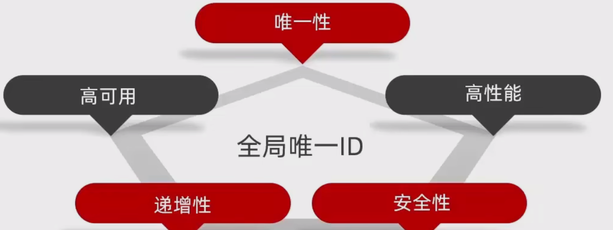


ID生成器工具类代码，效率基本可以达到每秒1w个
```java
@Component
public class RedisIdWorker {
    //开始时间戳
    private static final long BEGIN_TIMESTAMP = 1674086400L;

    //序列号位数
    private static final int COUNT_BITS = 32;

    private StringRedisTemplate stringRedisTemplate;

    public RedisIdWorker(StringRedisTemplate stringRedisTemplate) {
        this.stringRedisTemplate = stringRedisTemplate;
    }

    public long nextId(String keyPrefix){
        //1.生成时间戳
        LocalDateTime time = LocalDateTime.now();
        long nowSecond = time.toEpochSecond(ZoneOffset.UTC);
        long timestamp = nowSecond - BEGIN_TIMESTAMP;
        //2.生成序列号,redis自增长,redis单个key自增长有上限，2的64次方
        //2.1获取当前日期，精确到天
        String date = time.format(DateTimeFormatter.ofPattern("yyyy:MM:dd"));
        long count = stringRedisTemplate.opsForValue().increment("icr:" + keyPrefix + ":" + date);
        //3.拼接并返回,不能使用字符串方式拼接
        return timestamp << COUNT_BITS | count;//先向左移32位，那么低32位全为0，跟序列号进行或操作

    }

    /**
     * 生成开始时间戳
     * @param args
     */
    public static void main(String[] args) {
        LocalDateTime time = LocalDateTime.of(2023, 1, 19, 0, 0, 0);
        long second = time.toEpochSecond(ZoneOffset.UTC);
        System.out.println(second);
    }
}
```

## 2: 秒杀下单

下单业务本质上就是 **修改优惠券表中的number字段**，**再在order表中新增一条订单数据**；点击抢购优惠券，发送请求如下


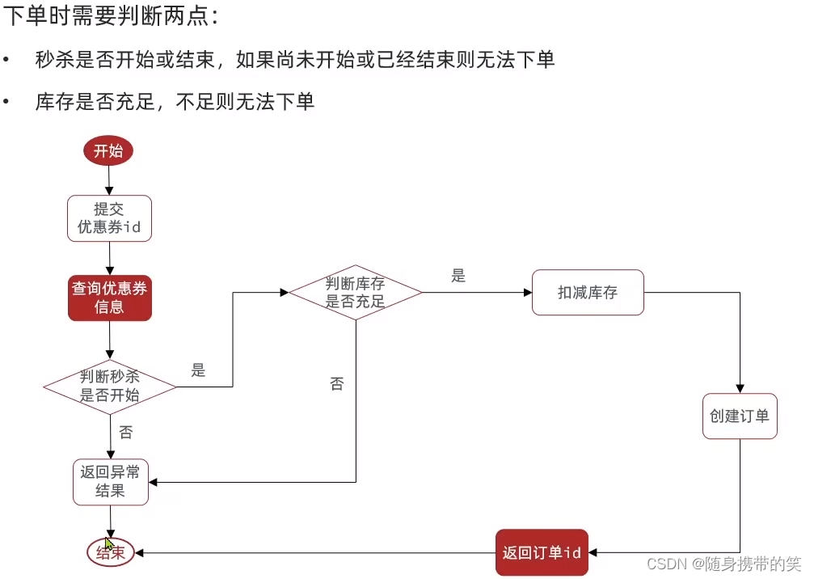

以上是业务逻辑，其中涉及到的表操作
- `seckill_voucher` 表的根据id查询操作
- `seckill_voucher` 表的根据id修改剩余数量的操作
- `voucher_order` 表的新增订单数据操作

涉及到多表操作需要添加事务，同成功，同失败


## 3：超卖问题


通过加锁的方式去处理多线程问题


### 1）悲观锁

> 悲观锁实现比较简单，操作前获取锁，操作结束才释放锁，让多个线程串行执行，但是你让并发线程串行，效率十分低下

### 2）乐观锁（版本号、CAS）
> 第一种加版本号的方式

逻辑如下：


> 第二种方式CAS法

用版本号方式，发现，用每次查的版本跟操作前查的版本作对比是否一致，那还不如直接查库存，用库存对比，更加简化，逻辑如下

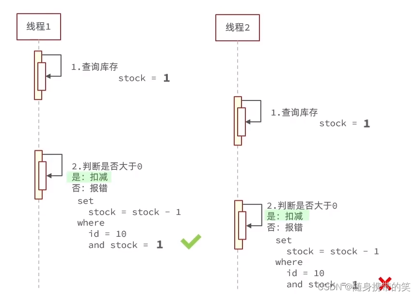

主要是在扣减操作上加上条件，查询的值不一致，就不执行操作

在idea中，代码修改，在更新数据库操作，也就是减库存的时候，加上判断条件，eq比较

```java
    //5.扣减库存
    boolean success = seckillVoucherService.update()
        .setSql("stock = stock - 1")//set stock = stock -1
        .eq("voucher_id",voucherId).eq("stock",voucher.getStock()) //where id = ? and stock =?
        .update();
```

如果是匹配库存，成功率很低，如下压力测试，100张只售出23张，但是我是开的有200个线程

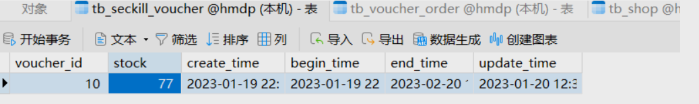

成功率低的原因

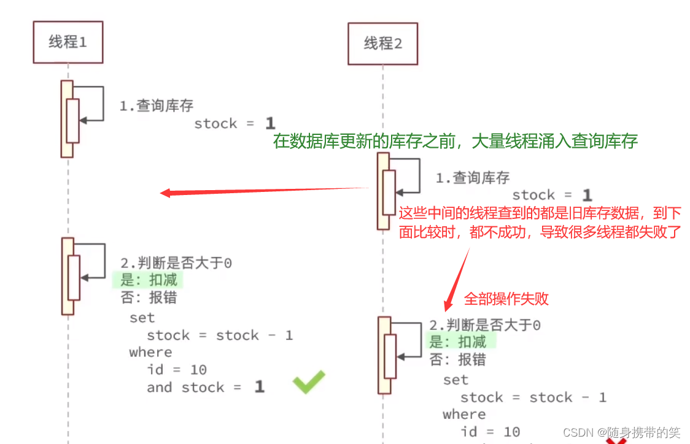

所以，我们更改库存操作时，加的条件不必是必须前面查到的库存数和更改时查到的库存数一致，我们只需要让更改时的条件为查到的库存数大于0即可，代码修改如下

```java
    //5.扣减库存
    boolean success = seckillVoucherService.update()
        .setSql("stock = stock - 1")//set stock = stock -1
        .eq("voucher_id",voucherId).gt("stock",0) //where id = ? and stock > 0 
        .update();
```

## 4：一人一单
业务逻辑修改，防止黄牛批量刷券

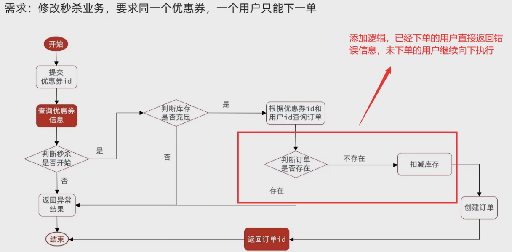

加锁方式，在并发请求时，保证一个用户只能下一单


以下是最后结果图。这个一人一单的单体项目这一节，知识点太多了，像spring框架事务失效、aop代理对象、synchronized锁对象等等，这一节值得多看几遍，我自认为我是没有能力将这些知识点阐述的非常清晰的，所以直接多看这节视频，知识点我就不记录了，就算记录也是模糊不清不能像老师那么浅显易懂。


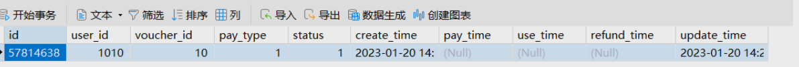

通过 `加锁` 可以解决在 `单机情况` 下的一人一单安全问题，但是在 `集群模式` 下就不行了。

我们将服务启动两份，端口分别为 `8081` 和 `8082`：ctrl+d复制启动类，添加端口配置

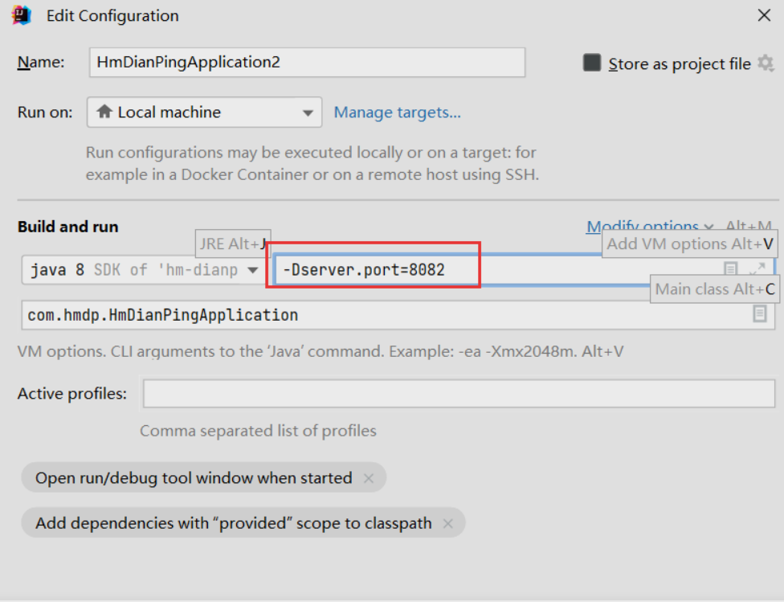


然后修改 `nginx` 的 `conf` 目录下的 `nginx.conf` 文件，配置反向代理；更改完毕后需要重新启动 `nginx` 服务
```sh
nginx.exe -s reload
```

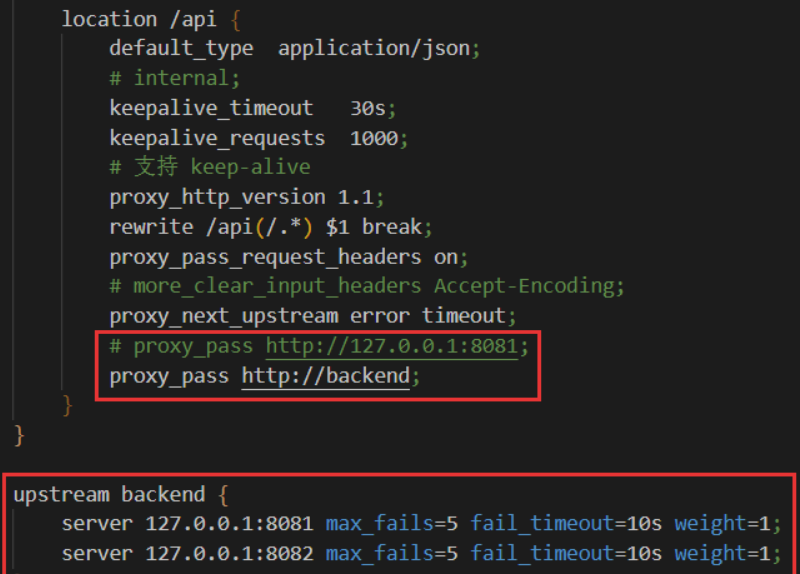

现在，用户请求会在这两个节点上负载均衡，再次测试下发现存在线程安全问题。

但是在集群模式下，加锁只是 `该台jvm` 给当前这台服务器处理的请求加锁，而集群是多台服务器轮询处理请求，会造成每台服务器都有一个加锁的线程，每台服务器都会有一个新订单创建处理


## 5：分布式锁

`分布式锁` ：满足分布式系统或集群模式下多进程可见并且互斥的锁。


`分布式锁的特点` ：多进程可见、互斥、高可用、高性能（高并发）、安全性

分布式锁的核心是实现多进程之间互斥，而满足这一点的方式有很多，常见的分布式锁有以下三种


### 1）初级版本

用redis实现分布式锁

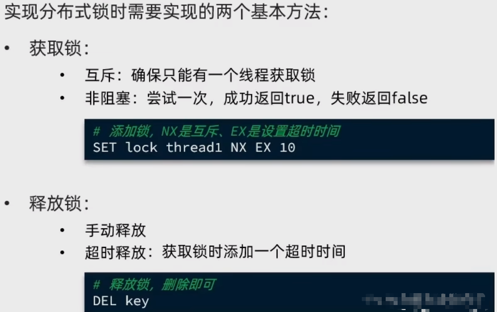

:::warning 原理
`Redis分布式锁原理` ：基于 `setnx` 命令–>key存在的情况下，不更新value，而是返回nil
那么利用key是唯一的特性来加锁，比如一人一单业务，key名称精确到userId，那么同一个用户无论发多少次请求，能成功创建键值的只有一个，因为setnx命令，后面的请求在获取锁创建键值就会失败
:::

redis获取锁命令测试，设置过期时间为10秒的锁，nx–>唯一

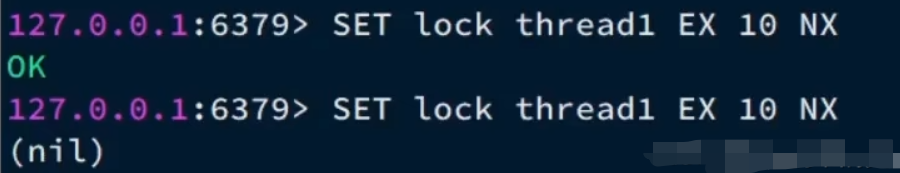

以下是结果图，两台机器发送请求，只有一台能够获取锁成功，这就是分布式锁的作用，它的作用域不再是单体项目，单机模式，而是在整个集群模式下，它的锁都生效。

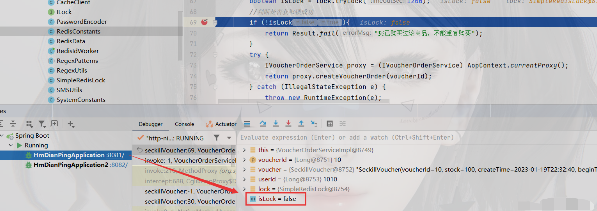

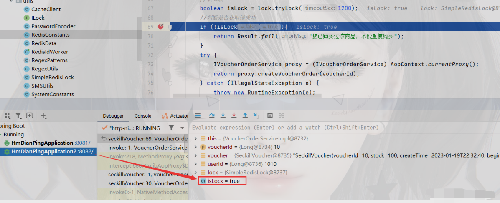

Redis中存的也是唯一的键值


数据库的表中数据变化


### 2）误删问题

> 场景描述
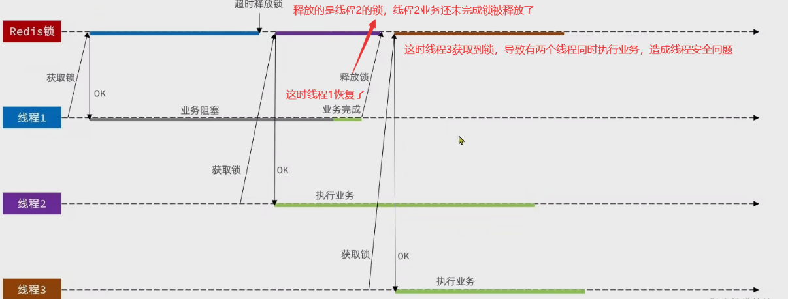

解决逻辑如下图

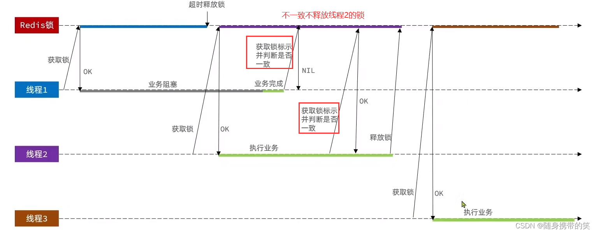

:::warning 解释
其实就是在每次释放锁的时候进行判断，判断当前锁与自己是否一致，不一致可能是别人的锁，不释放
:::

业务流程图

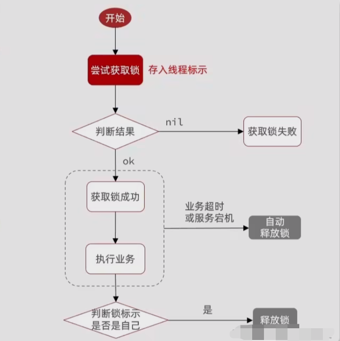

### 3）原子性问题

> 场景描述


:::warning 解释
判断锁的操作和释放锁的操作得成一个原子性操作，一起执行，要阻塞都阻塞，要通过都通过
:::

`Redis` 提供了 `Lua` 脚本功能，在一个脚本中编写多条 `Redis` 命令，确保多条命令执行时的原子性。
Lua是一种编程语言，它的基本语法大家可以参考网站：[lua语言](https://www.runoob.com/lua/lua-tutorial.html)
我们将释放锁的操作写到Lua脚本中去，直接调用脚本

> 释放锁的业务逻辑是这样的：

- ①获取锁中的线程标示
- ②判断是否与指定的标示（当前线程标示）一致
- ③如果一致则释放锁（删除）
- ④如果不一致则什么都不做

Lua脚本代码

```lua
-- 这里的 KEYS[1] 就是锁的 key，这里的 ARGV[1] 就是当前线程标识
-- 获取锁中的线程标识 get key
local id = redis.call('get', KEYS[1]);
-- 比较线程标识与锁中的标识是否一致
if (id == ARGV[1]) then
    -- 释放锁 del key
    return redis.call('del', KEYS[1])
end
return 0
```

### 4）Redisson分布式锁
> 基于 setnx 实现的分布式锁存在下面的问题

- `不可重入`：同一个线程无法多次获取同一把锁
- `不可重试`：获取锁只尝试一次就返回 false，没有重试机制
- `超时释放`：锁超时释放虽然可以避免死锁，但如果是业务执行耗时较长，也会导致锁释放，存在安全隐患
- `主从一致性`：如果 Redis 提供了主从集群，主从延同步在延迟，当主机宕机时，如果从机同步主机中的数据，则会出现锁失效

`Redisson` 是一个在 `Redis` 的基础上实现的 Java 驻内存数据网格
它不仅提供了一系列的分布式的 Java 常用对象，还提供了许多分布式服务，其中就包含了各种分布式锁的实现。

说白了就是一个封装各种锁且十分完善的工具，前面又白雪了，分布式锁轮子人家已经做的很完善了，咱学的就是个思想  [官网地址](https://redisson.org)

要使用 `Redisson` ，先导入它的坐标
```xml
<dependency>
    <groupId>org.redisson</groupId>
    <artifactId>redisson</artifactId>
    <version>3.13.6</version>
</dependency>
```

Redisson类
```java
@Configuration
public class RedisConfig {
    @Bean
    public RedissonClient redissionClient() {
        // 配置类
        Config config = new Config();

        // 添加 Redis 地址，此处添加了单点的地址，也可以使用 config.useClusterServers() 添加集群地址
        config.useSingleServer().setAddress("redis://192.168.2.12:6379").setPassword("123321");

        // 创建客户端
        return Redisson.create(config);
    }
}
```

使用 `Redisson` 的分布式锁

```java
@Resource
private RedissonClient redissonClient;

@Test
void testRedisson() throws InterruptedException {
    // 获取锁（可重入），指定锁的名称
    RLock lock = redissonClient.getLock("anyLock");
    // 尝试获取锁，参数分别是：获取锁的最大等待时间（期间会重试过），锁自动释放时间，时间单位
    boolean isLock = lock.tryLock(1, 10, TimeUnit.SECONDS);
    // 判断锁是否获取成功
    if (isLock) {
        try {
            System.out.println("执行业务");
        } finally {
            //释放锁
            lock.unlock();
        }
    }
}
```

> Redisson 分布式锁原理


> 连锁策略：不再有主从节点，都获取成功才能获取锁成功，有一个节点获取锁不成功就获取锁失败


<p style="color:red">如果多个主节点保证锁的话，一个主节点宕机了，其它线程只能获得一个新主节点的锁，获取不到其它两个锁，还会获取失败，这里主要是防止主节点宕机后，其它线程获得新主节点的锁，引起线程安全问题</p>

> 总结

- ①`不可重入Redis 分布式锁`
  - `原理`：利用 setnx 的互斥性；利用 ex 避免死锁；释放锁时判断线程标示
  - `缺陷`：不可重入、无法重试、锁超时失效

- ②`可重入的 Redis 分布式锁`
  - `原理`：利用 hash 结构，记录线程标示和重入次数；利用 watchDog 延续锁时间；利用信号量控制锁重试等待
  - `缺陷`：Redis 宕机引起锁失效问题

- ③`Redisson 的 multiLock连锁`
  - `原理`：多个独立的 Redis 节点，必须在所有节点都获取重入锁，才算获取锁成功
  - `缺陷`：运维成本高、实现复杂


### 5）秒杀优化

流程图

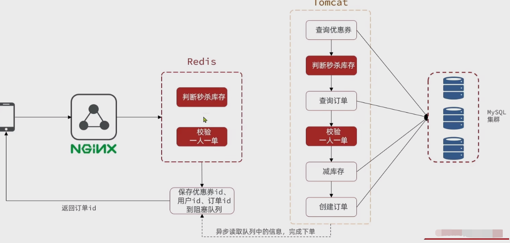

为避免所有操作都在数据库上执行，分离成两个线程，***一个线程判断用户的购买资格，发现用户有购买资格后再开启一个独立的线程来处理耗时较久的减库存、写订单的操作*** 。
可以将耗时较短的两步操作放到 Redis 中，在 Redis 中处理对应的秒杀资格的判断。Redis 的性能是比 MySQL 要好的。此外，还需要引入异步队列记录相关的信息。

**redis部分处理逻辑， Lua脚本封装操作保证原子性， redis这里选择的存储类型为set，因为key不能重复，而set恰好是无序不重复的**


***案例：改进秒杀业务，提高并发性能***

> 需求：
- 1.新增秒杀优惠券的同时，将优惠券信息保存到 Redis 中
- 2.基于 Lua 脚本，判断秒杀库存、一人一单，决定用户是否抢购成功
- 3.如果抢购成功，将优惠券 id 和用户 id 封装后存入阻塞队列
- 4.开启线程任务，不断从阻塞队列中获取信息，实现异步下单功能

**分步实现如下**

1.在新增优惠券的业务实现类中，把秒杀优惠券的库存信息保存到redis里

`VoucherServiceImpl` 类中

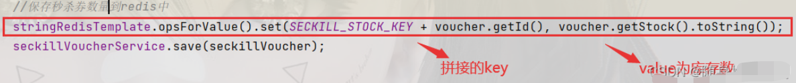

2.编写lua脚本，按照下面的业务流程逻辑，在脚本中完成业务实现


```lua
-- 1.参数列表
-- 1.1 优惠券id
local voucherId = ARGV[1]
-- 1.2 用户id
local userId = ARGV[2]

-- 2.数据key
-- 2.1 库存key   key 是优惠的业务名称加优惠券id  value 是优惠券的库存数
local stockKey = 'seckill:stock:' .. voucherId
-- 2.2 订单key   key 也是拼接的业务名称加优惠权id  而value是用户id， 这是一个set集合，凡购买该优惠券的用户都会将其id存入集合中
local orderKey = 'seckill:order:' .. voucherId

-- 3.脚本业务
-- 3.1 判断库存是否充足 get stockKey
if (tonumber(redis.call('get', stockKey)) <= 0)  then  --将get的value先转为数字类型才能判断比较
    -- 3.2 库存不足，返回1
    return 1
end
-- 3.3 判断用户是否下单 sismember orderKey userId命令，判断当前key集合中，是否存在该value；返回1存在，0不存在
if (redis.call('sismember', orderKey, userId) == 1) then
    --3.4 存在说明是重复下单，返回2
    return 2
end
-- 3.5 扣库存
redis.call('incrby', stockKey, -1)
-- 3.6 下单（保存用户）
redis.call('sadd', orderKey, userId)
return 0
```

3.java代码中执行lua脚本，并判断，抢购成功的生成订单并存入阻塞队列

首先注入脚本
```java
    private IVoucherOrderService proxy;//定义代理对象，提前定义后面会用到
    //注入脚本
    private static final DefaultRedisScript<Long> SECKILL_SCRIPT;
    static {
        SECKILL_SCRIPT = new DefaultRedisScript<>();
        SECKILL_SCRIPT.setLocation(new ClassPathResource("seckill.lua"));
        SECKILL_SCRIPT.setResultType(Long.class);
    }
```

其次运行脚本，且判断不满足的请求直接返回提示信息

```java
    @Override
    public Result seckillVoucher(Long voucherId) { //使用lua脚本
        //获取用户
        Long userId = UserHolder.getUser().getId();
        //1.执行lua脚本
        Long result = stringRedisTemplate.execute(
                SECKILL_SCRIPT,
                Collections.emptyList(), //这里是key数组，没有key，就传的一个空集合
                voucherId.toString(), userId.toString()
        );
        //2.判断结果是0
        int r = result.intValue();//Long型转为int型，便于下面比较
        if (r != 0){
            //2.1 不为0，代表没有购买资格
            return  Result.fail(r == 1?"优惠券已售罄":"不能重复购买");

        }
```

最后是将满足条件的给存放进阻塞队列中

创建一个`BlockingQueue` 阻塞队列

> `BlockingQueue` 这个阻塞队列特点：当一个线程尝试从队列获取元素的时候，如果没有元素该线程阻塞，直到队列中有元素才会被唤醒并获取元素

```java
    //创建阻塞队列  这个阻塞队列特点：当一个线程尝试从队列获取元素的时候，如果没有元素该线程阻塞，直到队列中有元素才会被唤醒获取
    private BlockingQueue<VoucherOrder> orderTasks = new ArrayBlockingQueue<>(1024 * 1024);//初始化阻塞队列的大小
```

接下来就是将满足条件的请求，给生成订单，并把订单对象add到阻塞队列中，接上面的代码，完成整个第三步
```java
        //2.2 为0，有购买资格，把下单信息保存到阻塞队列中
        //7.创建订单   向订单表新增一条数据，除默认字段，其他字段的值需要set
        VoucherOrder voucherOrder = new VoucherOrder();
        //7.1订单id
        long orderId = redisIdWorker.nextId("order");
        voucherOrder.setId(orderId);
        //7.2用户id
        voucherOrder.setUserId(userId);
        //7.3代金券id
        voucherOrder.setVoucherId(voucherId);
        //放入阻塞对列中
        orderTasks.add(voucherOrder);
        //获取代理对象
        proxy = (IVoucherOrderService) AopContext.currentProxy();
        //3.返回订单id
        return Result.ok(orderId);
    }
```

4.开启线程任务，实现异步下单功能

- 首先创建一个线程池

- 再定义一个线程任务，但是注意，线程任务需要在用户秒杀订单之前开始，用户一但开始秒杀，队列就会有新的订单，线程任务就应该立即取出订单信息，这里利用spring提供的注解，在类初始化完毕后立即执行线程任务，详细代码如下

```java
    //创建线程池
    private static final ExecutorService SECKILL_ORDER_EXECUTOR = Executors.newSingleThreadExecutor();
    //利用spring提供的注解，在类初始化完毕后立即执行线程任务
    @PostConstruct
    private void init(){
        SECKILL_ORDER_EXECUTOR.submit(new VoucherOrderHandler());
    }
```

线程任务代码如下
```java
    //创建线程任务，内部类方式
    private class VoucherOrderHandler implements Runnable{

        @Override
        public void run() {
            //1.获取队列中的订单信息
            try {
                VoucherOrder voucherOrder = orderTasks.take();
                //2.创建订单，这是调之前那个创建订单的方法，需要稍作改动
                handleVoucherOrder(voucherOrder);
            } catch (Exception e) {
                log.info("异常信息:",e);
            }
        }
    }
```

创建调用的 `handleVoucherOrder` 方法，这里的获取锁操作只是做最后的兜底，以防万一，因为前面lua脚本都已经判断过了

```java
    private void handleVoucherOrder(VoucherOrder voucherOrder) {
        Long userId = voucherOrder.getUserId();
        //创建锁对象
        SimpleRedisLock lock = new SimpleRedisLock("order:" + userId, stringRedisTemplate);
        //获取锁
        boolean isLock = lock.tryLock(1200);
        //判断是否获取锁成功
        if (!isLock){
            log.error("您已购买过该商品，不能重复购买");
        }
        try {
            proxy.createVoucherOrder(voucherOrder);//使用代理对象，最后用于提交事务
        } catch (IllegalStateException e) {
            throw new RuntimeException(e);
        } finally {
            lock.unlock();//释放锁
        }
    }
```

`createVoucherOrder` 创建订单方法，这里一人一单的其实也不必判读了，lua脚本都写好了，这里只是兜底

```java
 @Transactional
    public void createVoucherOrder(VoucherOrder voucherOrder){
        Long voucherId = voucherOrder.getVoucherId();
        //5.一人一单
        Long userId = voucherOrder.getId();
        //5.1查询订单
        int count = query().eq("user_id", userId).eq("voucher_id", voucherId).count();
        //5.2判断是否存在
        if (count > 0){
            log.error("您已经购买过了");
        }
        //6.扣减库存
        boolean success = seckillVoucherService.update()
                .setSql("stock = stock - 1")//set stock = stock -1
                .eq("voucher_id",voucherId).gt("stock",0) //where id = ? and stock > 0
                .update();
        if (!success){
            log.error("库存不足！");
        }
        this.save(voucherOrder);

    }
```

**最后来分析以下整个优化思路**

- ① `编写lua脚本` ，对于超卖问题和一人一单进行解决处理，超卖用 `CAS` 方法判断库存是否大于0，一人一单用 `redis` 的 `set` 集合的 `sismenber` 判读该优惠券（key）下的用户id（value）是否唯一

- ②Java代码中注入脚本，并执行脚本判断脚本返回结果，若不为脚本结果0，直接返回错误提示

- ③若脚本结果为0，代表有购买优惠券资格，将 `new VoucherOrder` 创建订单对象，并 `set orderId，userId，voucherId`。再把订单对象放入 `阻塞队列` 中，返回 `订单id` 给用户

- ④创建线程池，并定义线程任务，但注意，线程任务必须在方法执行前执行，使用到spring提供的注解在类初始化完成后执行线程任务

- ⑤线程任务中获取阻塞队列的订单对象，然后调用 `handleVoucherOrder` 方法传入 `voucherOrder`

- ⑥ `handleVoucherOrder` 方法其实是再次获取锁，这个就是个纯兜底，作用不大。并在获取锁成功后调用 `createVoucherOrder` 方法扣减库存创建订单，由于都是对数据库的操作，因此要提交事务

至此，整个秒杀业务优化完毕

> 总结

> 秒杀业务的优化思路是什么？
- 先利用 Redis 完成库存余量、一人一单判断，完成抢单业务
- 再将下单业务放入阻塞队列，利用独立线程异步下单

> 基于阻塞队列的异步秒杀存在哪些问题？
内存限制问题 —> 我们使用的是JDK里的阻塞队列，是基于JVM的内存，高并发海量请求下造成内存溢出还有服务宕机情况下内存数据丢失

> 数据安全问题

> 个人认为还存在的问题
- 队列满了怎么办 ？
- 子线程下单失败怎么办？
- 订单太多了超过阻塞队列大小了怎么办？
- 拒绝策略怎么设计？
- 待消费的消息是否应该持久化，不然宕机了消息不就丢失了？
- 还有如何确保消息确实被消费成功了，不然消费失败了无法重试

### 6）消息队列

由于前面的阻塞队列是基于JVM的内存实现，那么不可避免的两个大问题，
- ①高并发海量访问，创建订单，队列很快就 **超出上限造成内存溢出**；
- ②JVM内存没有持久化机制，若服务出现重启或宕机，阻塞队列中的所有任务都会丢失。所以我们使用MQ

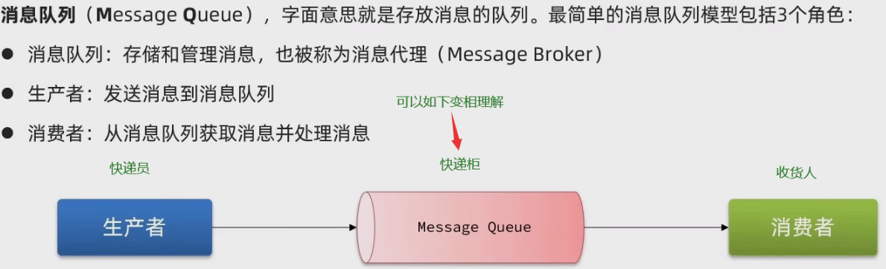

MQ是JVM以外的服务，不受JVM内存限制，且MQ中的所有消息会做持久化，这样即使重启或宕机，数据不会丢失。消息投递给消费者后需要消费者确认，未确认消息会一直存在下一次继续投递，确保消息至少被消费一次

#### 基于 List 结构模拟消息队列

`Redis` 的 `list` 数据结构是一个双向链表
队列是入口和出口不在一边，因此我们可以利用：`LPUSH` 结合 `RPOP`、或者 `RPUSH` 结合 `LPOP` 来实现。

不过要注意的是，当队列中没有消息时 `RPOP` 或 `LPOP` 操作会返回 `null`，并不像 `JVM` 的阻塞队列那样会阻塞并等待消息。

因此这里应该使用 `BRPOP` 或者 `BLPOP` 来实现阻塞效果。


> 基于 List 的消息队列有哪些优缺点
- 优点
  - 利用 `Redis` 存储，不受限于 `JVM` 内存上限
  - 基于 `Redis` 的持久化机制，数据安全性有保证
  - 可以满足消息有序性
- 缺点
  - 无法避免消息丢失
  - 只支持单消费者

#### 基于 PubSub 的消息队列

PubSub（发布订阅） 是 Redis 2.0 版本引入的消息传递模型。

顾名思义，消费者可以订阅一个或多个channel，生产者向对应 channel 发送消息后，所有订阅者都能收到相关消息。

- `SUBSCRIBE channel [channel]` ：订阅一个或多个频道
- `PUBLISH channel msg` ：向一个频道发送消息
- `PSUBSCRIBE pattern[pattern]` ：订阅与 pattern 格式匹配的所有频道

`pattern` – 通配符方式
- ?：匹配一个字符
- *：匹配多个字符
- ae：匹配括号内存在的字符


> 基于 PubSub 的消息队列有哪些优缺点
- 优点：采用发布订阅模型，支持多生产、多消费
- 缺点：
  - 不支持数据持久化
  - 无法避免消息丢失
  - 消息堆积有上限，超出时数据丢失

#### 基于 Stream 的消息队列

> 单消费模式

**发送消息的命令**

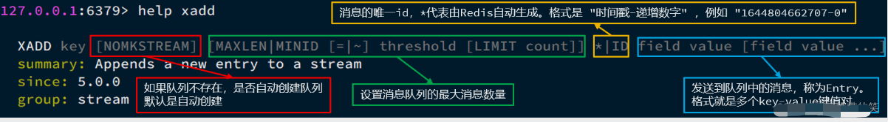

```shell
XADD key [NOMKSTREAM] [MAXLEN|MINID [=|~] threshold [LIMIT count]] *|ID field value [field value …]
```

- `key`：队列名称

- `[NOMKSTREAM]`：如果队列不存在时，确定是否自动创建队列，默认自动创建

- `[MAXLEN|MINID [=|~] threshold [LIMIT count]]`：设置消息队列的最大消息数量

- `|ID`：消息的唯一 ID， 代表由 Redis 自动生成，格式是 ”时间戳-递增数字“，例如：”1666161469358-0“

- `field value [field value …]`：发送到队列中的消息，称为 Entry。格式为多个 Key-Value 键值对。

> 例如：创建名为 users 的队列，并向其中发送一个消息，内容是：{name=jack,age=21}，并且使用 Redis 自动生成 ID

`127.0.0.1:6379> XADD users * name jack age 21 “1644805700523-0”`

**读取消息命令**


读取消息的方式之一：`XREAD`

- `[COUNT count]`：每次读取消息的最大数量；
- `[BLOCK milliseconds]`：当没有消息时，确定是否阻塞，阻塞则添加具体的 milliseconds （阻塞时长）
- `STREAMS key [key …]`：从哪个队列读取消息，Key 就是队列名；
- `ID [ID …]`：起始 ID，只返回大于该 ID 的消息；0 代表从第一个消息开始，$ 代表从最新的消息开始。

> 例如，使用 `XREAD` 读取第一个消息

```shell
127.0.0.1:6379> XREAD COUNT 1 STREAMS users 0
1) 1) "queue"
   2) 1) 1) "1666169070359-0"
         2) 1) "name"
            2) "jack"
            3) "age"
            4) 20
```

`XREAD` 阻塞方式，读取最新的消息

```shell
XREAD COUNT 1 BLOCK STREAMS queue $
```

**注意**：

- 当我们指定起始 ID 为 $ `时，代表读取最新的消息`
- 如果我们处理一条消息的过程中，又有超过 1 条以上的消息到达队列，则下次获取时也只能获取到最新的一条
- 如此便会出现漏读消息的问题

**STREAM 类型消息队列的 XREAD 命令特点**：

- 1.消息可回溯（消息永久的保存在消息队列中）
- 2.一个消息可以被多个消费者读取
- 3.可以阻塞读取
- 4.有消息漏读的风险（缺点）

> 消费者组模式

`消费者组（Consumer Group）`：将多个消费者划分到一个组中，监听同一个队列。

> 其具备下列特点：

- `消息分流`：队列中的 消息会分流给组内不同的消费者，而不是重复消费，从而加快消息处理的速度。
- `消息标示`：消费者组会维护一个标示，记录最后一个被处理的消息，即使消费者宕机重启，还会从标示之后读取消息，确保每一个消息都会被消费。（解决漏读问题）
- `消息确认`：消费者获取消息后，消息处于 pending 状态，并存入一个 pending-list。

当处理完成后需要通过 `XACK` 命令来确认消息，标记消息为已处理，才会从 pending-list 中移除。（解决消息丢失问题)

**创建消费者组**
```shell
XGROUP CREATE key groupName ID [MKSTREAM]
```

- `key`：队列名称
- `groupName`：消费者组名称
- `ID`：起始 ID 标示，$ 代表队列中最后一个消息，0 则代表队列中第一个消息
- `MKSTREAM`：队列不存在时自动创建队列

```shell
# 删除指定的消费者组
XGROUP DESTORY key groupName

# 给指定的消费者组添加消费者
XGROUP CREATECONSUMER key groupname consumername

# 删除消费者组中的指定消费者
XGROUP DELCONSUMER key groupname consumername

```

**从消费者组读取消息**
> XREADGROUP GROUP group consumer [COUNT count] [BLOCK milliseconds] [NOACK] STREAMS key [key …] ID [ID …]

- `group`：消费组名称
- `consumer`：消费者名称，如果消费者不存在，会自动创建一个消费者
- `count`：本次查询的最大数量
- `BLOCK milliseconds`：当没有消息时最长等待时间
- `NOACK`：无需手动 ACK，获取到消息后自动确认
- `STREAMS key`：指定队列名称
- `ID`：获取消息的起始 ID：
- `“>”`：从下一个未消费的消息开始
- `其它`：根据指定 id 从 `pending-list` 中获取已消费但未确认的消息。

> STREAM 类型消息队列的 XREADGROUP 命令特点
- 消息可回溯
- 可以多消费者争抢消息，加快消费速度
- 可以阻塞读取
- 没有消息漏读的风险
- 有消息确认机制，保证消息至少被消费一次


> Stream消息队列异步秒杀下单

> 需求：
- ①创建一个 `Stream` 类型的消息队列，名为 `stream.orders`
- ②修改之前的秒杀下单 `Lua` 脚本，在认定有抢购资格后，直接向 `stream.orders` 中添加消息，内容包含 `voucherId`、`userId`、`orderId`
- ③项目启动时，开启一个线程任务，尝试获取 `stream.orders` 中的消息，完成下单

redis客户端命令行执行如下命令，创建消息队列

```shell
XGROUP CREATE stream.orders g1 0 MKSTREAM
```

Lua脚本改动

```lua
-- 1.参数列表
-- 1.1.优惠券 id
local voucherId = ARGV[1]
-- 1.2.用户 id
local userId = ARGV[2]
-- 1.3.订单 id
local orderId = ARGV[3]

-- 2.数据 key
-- 2.1.库存 key
local stockKey = 'seckill:stock:' .. voucherId
-- 2.2.订单 key
local orderKey = 'seckill:order:' .. voucherId

local stockKey_value = redis.call('get', stockKey)

-- 3.脚本业务
-- 3.1.判断库存是否充足 get stockKey
if (tonumber(stockKey_value) <= 0) then
    -- 3.2.库存不足，返回 1
    return 1
end
-- 3.2.判断用户是否下单 SISMEMBER orderKey userId
if (redis.call('sismember', orderKey, userId) == 1) then
    -- 3.3.存在，则说明该用户是重复下单（这是不允许的），则返回 2
    return 2
end
-- 3.4.扣库存 incrby stockKey -1
redis.call('incrby', stockKey, -1)
-- 3.5.下单（保存用户） sadd orderKey userId
redis.call('sadd', orderKey, userId)
-- 3.6.发送消息到队列中：XADD stream.orders * k1 v1 k2 v2 ...
redis.call('xadd', 'stream.orders', '*', 'userId', userId, 'voucherId', voucherId, 'id', orderId)

return 0

```


