*** 

由于 `Redis` 具有 `过期监听` 的功能，于是就有人拿它来实现订单超时自动关闭的功能，但是这个方案并不完美。今天来聊聊11种实现订单超时自动关闭的方案，总有一种适合你！这些方案并没有绝对的好坏之分，只是适用场景的不大相同。


## 1：DelayQueue
`DelayQueue` 是 `JDK` 提供的 `api` ，是一个 `延迟队列` 

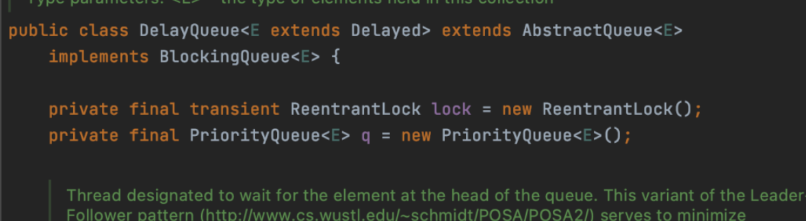

`DelayQueue` 泛型参数得实现 `Delayed` 接口，`Delayed` 继承了 `Comparable` 接口。


- `getDelay` 方法返回这个任务还剩多久时间可以执行，小于0的时候说明可以这个延迟任务到了执行的时间了。
- `compareTo` 这个是对任务排序的，保证最先到延迟时间的任务排到队列的头。

### demo

```java
@Getter
public class SanYouTask implements Delayed {
 
    private final String taskContent;
 
    private final Long triggerTime;
 
    public SanYouTask(String taskContent, Long delayTime) {
        this.taskContent = taskContent;
        this.triggerTime = System.currentTimeMillis() + delayTime * 1000;
    }
 
    @Override
    public long getDelay(TimeUnit unit) {
        return unit.convert(triggerTime - System.currentTimeMillis(), TimeUnit.MILLISECONDS);
    }
 
    @Override
    public int compareTo(Delayed o) {
        return this.triggerTime.compareTo(((SanYouTask) o).triggerTime);
    }
 
}
```

`SanYouTask` 实现了 `Delayed` 接口，构造参数

- `taskContent`：延迟任务的具体的内容
- `delayTime`：延迟时间，秒为单位

测试

```java
@Slf4j
public class DelayQueueDemo {
 
    public static void main(String[] args) {
        DelayQueue<SanYouTask> sanYouTaskDelayQueue = new DelayQueue<>();
 
        new Thread(() -> {
            while (true) {
                try {
                    SanYouTask sanYouTask = sanYouTaskDelayQueue.take();
                    log.info("获取到延迟任务:{}", sanYouTask.getTaskContent());
                } catch (Exception e) {
                }
            }
        }).start();
 
        log.info("提交延迟任务");
        sanYouTaskDelayQueue.offer(new SanYouTask("xiaoze-5s", 5L));
        sanYouTaskDelayQueue.offer(new SanYouTask("xiaoze-3s", 3L));
        sanYouTaskDelayQueue.offer(new SanYouTask("xiaoze-8s", 8L));
    }
}
```

开启一个线程从 `DelayQueue` 中获取任务，然后提交了三个任务，延迟时间分为别 `5s`，`3s`，`8s`。

### 实现原理


`offer` 方法在 ***提交任务*** 的时候，会通过根据 `compareTo` 的实现对任务进行排序，将最先需要被执行的任务放到队列头。

`take` 方法获取任务的时候，会拿到 **队列头部** 的元素，也就是队列中最早需要被执行的任务，通过`getDelay` 返回值判断任务是否需要被立刻执行，如果需要的话，就返回任务，如果不需要就会等待这个任务到延迟时间的剩余时间，当时间到了就会将任务返回。

## 2：Timer

`Timer` 也是 `JDK` 提供的 `api` 

### demo
```java
@Slf4j
public class TimerDemo {
 
    public static void main(String[] args) {
        Timer timer = new Timer();
        
        log.info("提交延迟任务");
        timer.schedule(new TimerTask() {
            @Override
            public void run() {
                log.info("执行延迟任务");
            }
        }, 5000);
    }
 
}
```

通过 `schedule` 提交一个延迟时间为5s的延迟任务


### 实现原理

提交的任务是一个 `TimerTask`

```java
public abstract class TimerTask implements Runnable {
    //忽略其它属性
    
    long nextExecutionTime;
}
```

`TimerTask` 内部有一个 `nextExecutionTime` 属性，代表下一次任务执行的时间，在提交任务的时候会计算出 `nextExecutionTime` 值。

`Timer` 内部有一个 `TaskQueue` 对象，用来保存 `TimerTask` 任务的，会根据`nextExecutionTime` 来排序，保证能够快速获取到最早需要被执行的延迟任务。

在 `Timer` 内部还有一个执行任务的线程 `TimerThread` ，这个线程就跟 `DelayQueue demo` 中开启的线程作用是一样的，用来执行到了延迟时间的任务。

所以总的来看，Timer有点像整体封装了 `DelayQueue demo` 中的所有东西，让用起来简单点。

虽然 `Timer` 用起来比较简单，但是在阿里规范中是不推荐使用的，主要是有以下几点原因：

- `Timer` 使用单线程来处理任务，长时间运行的任务会导致其他任务的延时处理
- `Timer` 没有对运行时异常进行处理，一旦某个任务触发运行时异常，会导致整个 `Timer` 崩溃，不安全

## 3：ScheduledThreadPoolExecutor

由于 `Timer` 在使用上有一定的问题，所以在 `JDK1.5` 版本的时候提供了`ScheduledThreadPoolExecutor`，这个跟 `Timer` 的作用差不多，并且他们的方法的命名都是差不多的，但是 `ScheduledThreadPoolExecutor` 解决了单线程和异常崩溃等问题。

### demo
```java
@Slf4j
public class ScheduledThreadPoolExecutorDemo {
 
    public static void main(String[] args) {
        ScheduledThreadPoolExecutor executor = new ScheduledThreadPoolExecutor(2, new ThreadPoolExecutor.CallerRunsPolicy());
 
        log.info("提交延迟任务");
        executor.schedule(() -> log.info("执行延迟任务"), 5, TimeUnit.SECONDS);
    }
 
}
```

结果

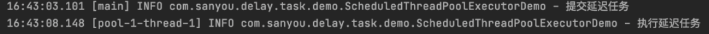

### 实现原理

`ScheduledThreadPoolExecutor` 继承了 `ThreadPoolExecutor` ，也就是继承了线程池，所以可以有很多个线程来执行任务。

`ScheduledThreadPoolExecutor` 在构造的时候会传入一个 `DelayedWorkQueue` 阻塞队列，所以线程池内部的阻塞队列是 `DelayedWorkQueue` 。


在提交延迟任务的时候，任务会被封装一个任务会被封装成 `ScheduledFutureTask` 对象，然后放到`DelayedWorkQueue` 阻塞队列中。

`ScheduledFutureTask` 实现了前面提到的 `Delayed` 接口，所以其实可以猜到 `DelayedWorkQueue` 会根据 `ScheduledFutureTask` 对于 `Delayed` 接口的实现来排序，所以线程能够获取到最早到延迟时间的任务。

当线程从 `DelayedWorkQueue` 中获取到需要执行的任务之后就会执行任务。

## 4：RocketMQ

`RocketMQ` 是阿里开源的一款消息中间件，实现了延迟消息的功能。

`RocketMQ` 延迟消息的延迟时间默认有 `18` 个等级。


当发送消息的时候只需要指定 `延迟等级` 即可。如果这 `18个等级` 的延迟时间不符和你的要求，可以修改 `RocketMQ服务端的配置文件` 。

### demo

```xml
<dependency>
    <groupId>org.apache.rocketmq</groupId>
    <artifactId>rocketmq-spring-boot-starter</artifactId>
    <version>2.2.1</version>
  
<!--web依赖-->
<dependency>
    <groupId>org.springframework.boot</groupId>
    <artifactId>spring-boot-starter-web</artifactId>
    <version>2.2.5.RELEASE</version>
</dependency>
```

配置文件
```yml
rocketmq:
  name-server: 192.168.200.144:9876 #服务器ip:nameServer端口
  producer:
    group: sanyouProducer
```

controller类，通过 `DefaultMQProducer` 发送延迟消息到 `xiaozeDelayTaskTopic`这个`topic` ，延迟等级为 `2` ，也就是延迟时间为 `5s` 的意思。

```java
@RestController
@Slf4j
public class RocketMQDelayTaskController {
 
    @Resource
    private DefaultMQProducer producer;
 
    @GetMapping("/rocketmq/add")
    public void addTask(@RequestParam("task") String task) throws Exception {
        Message msg = new Message("xiaozeDelayTaskTopic", "TagA", task.getBytes(RemotingHelper.DEFAULT_CHARSET));
        msg.setDelayTimeLevel(2);
        // 发送消息并得到消息的发送结果，然后打印
        log.info("提交延迟任务");
        producer.send(msg);
    }
 
}
```

创建一个消费者，监听 `xiaozeDelayTaskTopic` 的消息。

```java
@Component
@RocketMQMessageListener(consumerGroup = "sanyouConsumer", topic = "sanyouDelayTaskTopic")
@Slf4j
public class SanYouDelayTaskTopicListener implements RocketMQListener<String> {
 
    @Override
    public void onMessage(String msg) {
        log.info("获取到延迟任务:{}", msg);
    }
 
}
```

启动应用，浏览器输入以下链接添加任务

> http://localhost:8080/rocketmq/add?task=sanyou


测试结果


### 实现原理

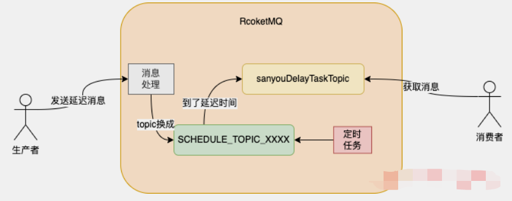

生产者发送延迟消息之后，`RocketMQ` 服务端在接收到消息之后，会去根据延迟级别是否大于0来判断是否是延迟消息

如果不大于0，说明不是延迟消息，那就会将消息保存到指定的 `topic` 中

如果大于0，说明是延迟消息，此时 `RocketMQ` 会进行一波偷梁换柱的操作，将消息的topic改成`SCHEDULE_TOPIC_XXXX`中，`XXXX` 不是占位符，然后存储。

在 `RocketMQ`内部有一个延迟任务，相当于是一个定时任务，这个任务就会获取`SCHEDULE_TOPIC_XXXX` 中的消息，判断消息是否到了延迟时间，如果到了，那么就会将消息的 `topic` 存储到原来真正的 `topic` (拿我们的例子来说就是 `sanyouDelayTaskTopic` )中，之后消费者就可以从真正的 `topic` 中获取到消息了。

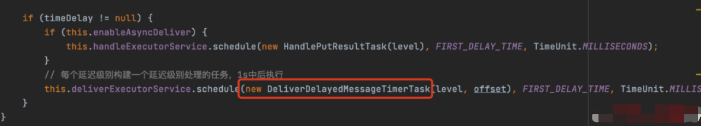

定时任务

`RocketMQ` 这种实现方式相比于前面提到的三种更加可靠，因为前面提到的三种任务内容都是存在内存的，服务器重启任务就丢了，如果要实现任务不丢还得自己实现逻辑，但是 `RocketMQ` 消息有持久化机制，能够保证任务不丢失。

## 5：RabbitMQ

`RabbitMQ` 也是一款消息中间件，通过 `RabbitMQ` 的死信队列也可以是先延迟任务的功能。

### demo

```xml
<dependency>
    <groupId>org.springframework.boot</groupId>
    <artifactId>spring-boot-starter-amqp</artifactId>
    <version>2.2.5.RELEASE</version>
</dependency>
```

配置文件

```yml
spring:
  rabbitmq:
    host: 192.168.200.144 #服务器ip
    port: 5672
    virtual-host: /
```

`RabbitMQ` 死信队列的配置类，后面说原理的时候会介绍干啥的

```java
@Configuration
public class RabbitMQConfiguration {
    
    @Bean
    public DirectExchange sanyouDirectExchangee() {
        return new DirectExchange("sanyouDirectExchangee");
    }
 
    @Bean
    public Queue sanyouQueue() {
        return QueueBuilder
                //指定队列名称，并持久化
                .durable("sanyouQueue")
                //设置队列的超时时间为5秒，也就是延迟任务的时间
                .ttl(5000)
                //指定死信交换机
                .deadLetterExchange("sanyouDelayTaskExchangee")
                .build();
    }
 
    @Bean
    public Binding sanyouQueueBinding() {
        return BindingBuilder.bind(sanyouQueue()).to(sanyouDirectExchangee()).with("");
    }
 
    @Bean
    public DirectExchange sanyouDelayTaskExchange() {
        return new DirectExchange("sanyouDelayTaskExchangee");
    }
 
    @Bean
    public Queue sanyouDelayTaskQueue() {
        return QueueBuilder
                //指定队列名称，并持久化
                .durable("sanyouDelayTaskQueue")
                .build();
    }
 
    @Bean
    public Binding sanyouDelayTaskQueueBinding() {
        return BindingBuilder.bind(sanyouDelayTaskQueue()).to(sanyouDelayTaskExchange()).with("");
    }
 
}
```

`RabbitMQDelayTaskController` 用来发送消息，这里没指定延迟时间，是因为在声明队列的时候指定了延迟时间为5s

```java
@RestController
@Slf4j
public class RabbitMQDelayTaskController {
 
    @Resource
    private RabbitTemplate rabbitTemplate;
 
    @GetMapping("/rabbitmq/add")
    public void addTask(@RequestParam("task") String task) throws Exception {
        // 消息ID，需要封装到CorrelationData中
        CorrelationData correlationData = new CorrelationData(UUID.randomUUID().toString());
        log.info("提交延迟任务");
        // 发送消息
        rabbitTemplate.convertAndSend("sanyouDirectExchangee", "", task, correlationData);
    }
 
}
```

启动应用，浏览器输入以下链接添加任务

> http://localhost:8080/rabbitmq/add?task=sanyou

测试结果，成功实现5s的延迟任务
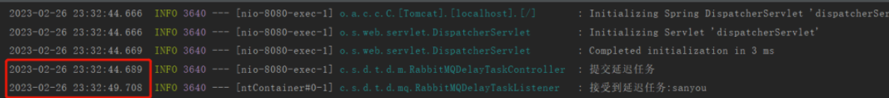

### 实现原理

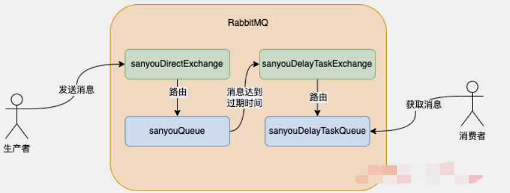

整个工作流程如下:

- 消息发送的时候会将消息发送到 `sanyouDirectExchange` 这个交换机上

- 由于 `sanyouDirectExchange` 绑定了 `sanyouQueue` ，所以消息会被路由到 `sanyouQueue` 这个队列上

- 由于 `sanyouQueue` 没有消费者消费消息，并且又设置了 `5s` 的过期时间，所以当消息过期之后，消息就被放到绑定的 `sanyouDelayTaskExchange` 死信交换机中

- 消息到达 `sanyouDelayTaskExchange` 交换机后，由于跟 `sanyouDelayTaskQueue` 进行了绑定，所以消息就被路由到 `sanyouDelayTaskQueue` 中，消费者就能从 `sanyouDelayTaskQueue` 中拿到消息了


> 上面说的队列与交换机的绑定关系，就是上面的配置类所干的事。

其实从这个单从消息流转的角度可以看出， `RabbitMQ` 跟 `RocketMQ` 实现有相似之处。

**消息最开始都并没有放到最终消费者消费的队列中，而都是放到一个中间队列中，等消息到了过期时间或者说是延迟时间，消息就会被放到最终的队列供消费者消息。**

只不过 `RabbitMQ` 需要你显示的手动指定消息所在的中间队列，而 `RocketMQ` 是在内部已经做好了这块逻辑。

除了基于 `RabbitMQ` 的死信队列来做，`RabbitMQ` 官方还提供了延时插件，也可以实现延迟消息的功能，这个插件的大致原理也跟上面说的一样，延时消息会被先保存在一个中间的地方，叫做 `Mnesia` ，然后有一个定时任务去查询最近需要被投递的消息，将其投递到目标队列中。

## 5：监听Redis过期key


生产者在消息发送时需要到指定发送到哪个 `channel` 上，消费者订阅这个 `channel` 就能获取到消息。图中 `channel` 理解成 `MQ` 中的 `topic` 。

并且在 `Redis` 中，有很多默认的 `channel` ，只不过向这些 `channel` 发送消息的生产者不是我们写的代码，而是 `Redis` 本身。这里面就有这么一个 `channel` 叫做`__keyevent@<db>__:expired`，`db` 是指 `Redis` 数据库的序号。

当某个 `Redis` 的 `key` 过期之后，`Redis` 内部会发布一个事件到 `__keyevent@<db>__:expired` 这个 `channel` 上，只要监听这个事件，那么就可以获取到过期的key。

> 所以基于监听Redis过期key实现延迟任务的原理如下：

- 将延迟任务作为key，过期时间设置为延迟时间
- 监听 `__keyevent@<db>__:expired` 这个 `channel` ，那么一旦延迟任务到了过期时间（延迟时间），那么就可以获取到这个任务

### demo

Spring已经实现了监听 `__keyevent@*__:expired` 这个 `channel` 这个功能，`__keyevent@*__:expired` 中的 `*` 代表通配符的意思，监听所有的数据库。

所以demo写起来就很简单了，只需4步即可

```xml
<dependency>
    <groupId>org.springframework.boot</groupId>
    <artifactId>spring-boot-starter-data-redis</artifactId>
    <version>2.2.5.RELEASE</version>
</dependency>
```

```yml
spring:
  redis:
    host: 192.168.200.144
    port: 6379
```

配置类
```java
@Configuration
public class RedisConfiguration {
 
    @Bean
    public RedisMessageListenerContainer redisMessageListenerContainer(RedisConnectionFactory connectionFactory) {
        RedisMessageListenerContainer redisMessageListenerContainer = new RedisMessageListenerContainer();
        redisMessageListenerContainer.setConnectionFactory(connectionFactory);
        return redisMessageListenerContainer;
    }
 
    @Bean
    public KeyExpirationEventMessageListener redisKeyExpirationListener(RedisMessageListenerContainer redisMessageListenerContainer) {
        return new KeyExpirationEventMessageListener(redisMessageListenerContainer);
    }
 
}
```

`KeyExpirationEventMessageListener` 实现了对 `__keyevent@*__:expiredchannel` 的监听
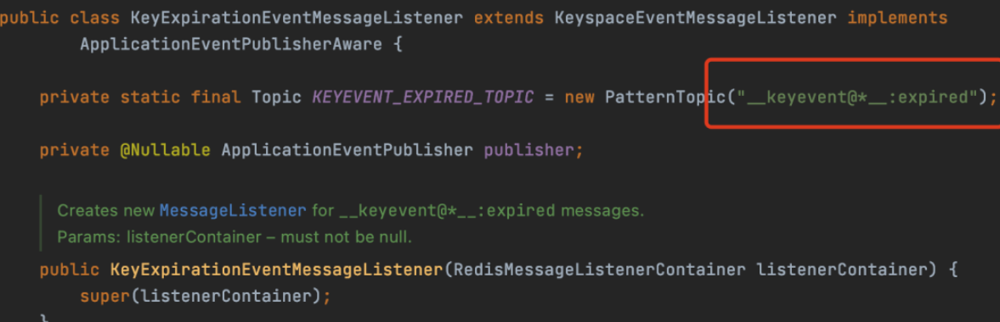

当 `KeyExpirationEventMessageListener` 收到 `Redis` 发布的过期 `Key` 的消息的时候，会发布 `RedisKeyExpiredEvent` 事件


所以我们只需要监听 `RedisKeyExpiredEvent` 事件就可以拿到过期消息的 `Key`，也就是延迟消息。

对 `RedisKeyExpiredEvent` 事件的监听实现 `MyRedisKeyExpiredEventListener`

```java
@Component
public class MyRedisKeyExpiredEventListener implements ApplicationListener<RedisKeyExpiredEvent> {
 
    @Override
    public void onApplicationEvent(RedisKeyExpiredEvent event) {
        byte[] body = event.getSource();
        System.out.println("获取到延迟消息：" + new String(body));
    }
 
}
```

代码写好，启动应用

之后我直接通过 `Redis` 命令设置消息，就没通过代码发送消息了，消息的 `key` 为 `sanyou` ，值为 `task` ，值不重要，过期时间为 `5s`

```shell
set sanyou task 
 
expire sanyou 5
```

成功获取到延迟任务

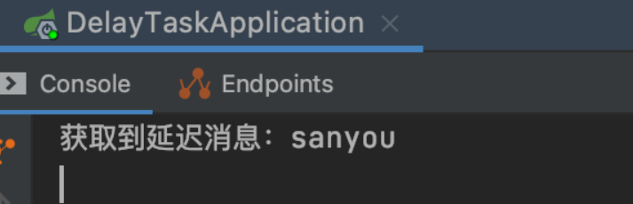

虽然这种方式可以实现延迟任务，但是这种方式坑 比较多

### 问题

> 任务存在延迟


- `Redis` 过期事件的发布不是指key到了过期时间就发布，**而是key到了过期时间被清除之后才会发布事件**。

- 而 `Redis过期key` 的两种 `清除策略` ，就是面试八股文常背的两种：

  - `惰性清除`。当这个key过期之后，访问时，这个Key才会被清除
  - `定时清除`。后台会定期检查一部分key，如果有key过期了，就会被清除  


所以即使 `key` 到了过期时间，`Redis` 也不一定会发送 `key过期事件` ，**这就到导致虽然延迟任务到了延迟时间也可能获取不到延迟任务。**

> 丢消息太频繁

Redis实现的发布订阅模式，消息是没有持久化机制，当消息发布到某个 `channel` 之后，如果没有客户端订阅这个 `channel` ，那么这个消息就丢了，并不会像 `MQ` 一样进行持久化，等有消费者订阅的时候再给消费者消费。

所以说，假设服务重启期间，某个生产者或者是 `Redis` 本身发布了一条消息到某个 `channel`，由于服务重启，没有监听这个 `channel`，那么这个消息自然就丢了。

> 消息只有广播模式

Redis的发布订阅模式消息消费只有 `广播模式` 一种。

所谓的广播模式就是多个消费者订阅同一个 `channel`，那么每个消费者都能消费到发布到这个`channel` 的所有消息。


如图，生产者发布了一条消息，内容为 `sanyou`，那么两个消费者都可以同时收到 `sanyou` 这条消息。

所以，如果通过监听 `channel` 来获取延迟任务，那么一旦服务实例有多个的话，还得保证消息不能重复处理，额外地增加了代码开发量。

> 接收到所有key的某个事件

这个不属于 `Redis` 发布订阅模式的问题，而是Redis本身事件通知的问题。

当监听了 `__keyevent@<db>__:expired` 的 `channel` ，那么所有的 `Redis` 的 `key` 只要发生了过期事件都会被通知给消费者，不管这个 `key` 是不是消费者想接收到的。

所以如果你只想消费某一类消息的 `key` ，那么还得自行加一些标记，比如消息的 `key` 加个前缀，消费的时候判断一下带前缀的 `key` 就是需要消费的任务。


## 6：Redisson的RDelayedQueue

`Redisson` 他是 `Redis` 的儿子（Redisson），基于Redis实现了非常多的功能，其中最常使用的就是Redis分布式锁的实现，但是除了实现 `Redis分布式锁` 之外，它还实现了 `延迟队列` 的功能。


### demo

```xml
<dependency>
    <groupId>org.redisson</groupId>
    <artifactId>redisson</artifactId>
    <version>3.13.1</version>
</dependency>
```

封装了一个 `RedissonDelayQueue` 类

```java
@Component
@Slf4j
public class RedissonDelayQueue {
 
    private RedissonClient redissonClient;
 
    private RDelayedQueue<String> delayQueue;
    private RBlockingQueue<String> blockingQueue;
 
    @PostConstruct
    public void init() {
        initDelayQueue();
        startDelayQueueConsumer();
    }
 
    private void initDelayQueue() {
        Config config = new Config();
        SingleServerConfig serverConfig = config.useSingleServer();
        serverConfig.setAddress("redis://localhost:6379");
        redissonClient = Redisson.create(config);
 
        blockingQueue = redissonClient.getBlockingQueue("SANYOU");
        delayQueue = redissonClient.getDelayedQueue(blockingQueue);
    }
 
    private void startDelayQueueConsumer() {
        new Thread(() -> {
            while (true) {
                try {
                    String task = blockingQueue.take();
                    log.info("接收到延迟任务:{}", task);
                } catch (Exception e) {
                    e.printStackTrace();
                }
            }
        }, "SANYOU-Consumer").start();
    }
 
    public void offerTask(String task, long seconds) {
        log.info("添加延迟任务:{} 延迟时间:{}s", task, seconds);
        delayQueue.offer(task, seconds, TimeUnit.SECONDS);
    }
 
}
```

这个类在创建的时候会去初始化延迟队列，创建一个 `RedissonClient` 对象，之后通过`RedissonClient` 对象获取到 `RDelayedQueue` 和 `RBlockingQueue` 对象，传入的队列名字叫`SANYOU`，这个名字无所谓。

当延迟队列创建之后，会开启一个延迟任务的消费线程，这个线程会一直从 `RBlockingQueue` 中通过`take` 方法阻塞获取延迟任务。

添加任务的时候是通过 `RDelayedQueue` 的 `offer` 方法添加的。

`controller` 类，通过接口添加任务，延迟时间为5s

```java
@RestController
public class RedissonDelayQueueController {
 
    @Resource
    private RedissonDelayQueue redissonDelayQueue;
 
    @GetMapping("/add")
    public void addTask(@RequestParam("task") String task) {
        redissonDelayQueue.offerTask(task, 5);
    }
 
}
```

启动项目，在浏览器输入如下连接，添加任务

> http://localhost:8080/add?task=sanyou

静静等待5s，成功获取到任务。

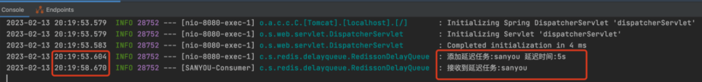

### 实现原理

如下是Redisson延迟队列的实现原理

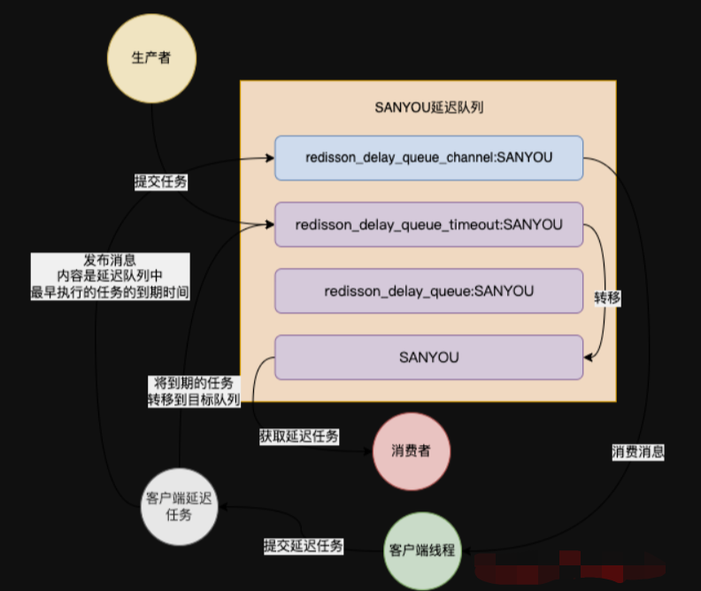

`SANYOU` 前面的前缀都是固定的，`Redisson` 创建的时候会拼上前缀。

- `redisson_delay_queue_timeout` :SANYOU，sorted set数据类型，存放所有延迟任务，按照延迟任务的到期时间戳（提交任务时的时间戳 + 延迟时间）来排序的，所以列表的最前面的第一个元素就是整个延迟队列中最早要被执行的任务，这个概念很重要

- `redisson_delay_queue` :SANYOU，list数据类型，也是存放所有的任务，但是研究下来发现好像没什么用。。

- `SANYOU` ，list数据类型，被称为目标队列，这个里面存放的任务都是已经到了延迟时间的，可以被消费者获取的任务，所以上面demo中的RBlockingQueue的take方法是从这个目标队列中获取到任务的

- `redisson_delay_queue_channel` :SANYOU，是一个channel，用来通知客户端开启一个延迟任务

任务提交的时候，`Redisson` 会将任务放到 `redisson_delay_queue_timeout:SANYOU` 中，分数就是提交任务的 `时间戳+延迟时间` ，就是延迟任务的到期时间戳

`Redisson` 客户端内部通过监听 `redisson_delay_queue_channel:SANYOU` 这个channel来提交一个延迟任务，这个延迟任务能够保证将 `redisson_delay_queue_timeout:SANYOU` 中到了延迟时间的任务从 `redisson_delay_queue_timeout:SANYOU` 中移除，存到SANYOU这个目标队列中。

于是消费者就可以从 `SANYOU` 这个目标队列获取到延迟任务了。

所以从这可以看出，`Redisson` 的延迟任务的实现跟前面说的MQ的实现都是殊途同归，最开始任务放到中间的一个地方，叫做 `redisson_delay_queue_timeout:SANYOU`，然后会开启一个类似于定时任务的一个东西，去判断这个中间地方的消息是否到了延迟时间，到了再放到最终的目标的队列供消费者消费。

`Redisson` 的这种实现方式比监听 `Redis` 过期 `key` 的实现方式更加可靠，因为消息都存在list和 `sorted set` 数据类型中，所以消息很少丢。

## 7：Netty的HashedWheelTimer

### demo

```java
@Slf4j
public class NettyHashedWheelTimerDemo {
 
    public static void main(String[] args) {
        HashedWheelTimer timer = new HashedWheelTimer(100, TimeUnit.MILLISECONDS, 8);
        timer.start();
 
        log.info("提交延迟任务");
        timer.newTimeout(timeout -> log.info("执行延迟任务"), 5, TimeUnit.SECONDS);
    }
 
}
```

测试结果


### 实现原理


如图，时间轮会被分成很多格子（上述 `demo` 中的 `8` 就代表了 `8` 个格子），一个格子代表一段时间（上述`demo` 中的 `100` 就代表一个格子是 `100ms` ），所以上述 `demo` 中，每 `800ms` 会走一圈。

当任务提交的之后，会根据任务的到期时间进行 `hash` 取模，计算出这个任务的执行时间所在具体的格子，然后添加到这个格子中，通过如果这个格子有多个任务，会用链表来保存。所以这个任务的添加有点像 `HashMap` 储存元素的原理。

`HashedWheelTimer` 内部会开启一个线程，轮询每个格子，找到到了延迟时间的任务，然后执行。

由于 `HashedWheelTimer` 也是单线程来处理任务，所以跟 `Timer` 一样，长时间运行的任务会导致其他任务的延时处理。

前面 `Redisson` 中提到的客户端延迟任务就是基于 `Netty` 的 `HashedWheelTimer` 实现的。

## 8：Hutool的SystemTimer

Hutool工具类也提供了延迟任务的实现 `SystemTimer`

### demo

```java
@Slf4j
public class SystemTimerDemo {
 
    public static void main(String[] args) {
        SystemTimer systemTimer = new SystemTimer();
        systemTimer.start();
        log.info("提交延迟任务");
        systemTimer.addTask(new TimerTask(() -> log.info("执行延迟任务"), 5000));
    }

}
```

执行结果


Hutool底层其实也用到了时间轮。

## 10：Qurtaz

Qurtaz是一款开源作业调度框架，基于Qurtaz提供的api也可以实现延迟任务的功能。

### demo
```xml
<dependency>
    <groupId>org.quartz-scheduler</groupId>
    <artifactId>quartz</artifactId>
    <version>2.3.2</version>
</dependency>
```

`SanYouJob` 实现 `Job` 接口，当任务到达执行时间的时候会调用 `execute` 的实现，从 `context` 可以获取到任务的内容

```java
@Slf4j
public class SanYouJob implements Job {
    @Override
    public void execute(JobExecutionContext context) throws JobExecutionException {
        JobDetail jobDetail = context.getJobDetail();
        JobDataMap jobDataMap = jobDetail.getJobDataMap();
        log.info("获取到延迟任务:{}", jobDataMap.get("delayTask"));
    }
}
```

测试类

```java
public class QuartzDemo {
 
    public static void main(String[] args) throws SchedulerException, InterruptedException {
        // 1.创建Scheduler的工厂
        SchedulerFactory sf = new StdSchedulerFactory();
        // 2.从工厂中获取调度器实例
        Scheduler scheduler = sf.getScheduler();
 
        // 6.启动 调度器
        scheduler.start();
 
        // 3.创建JobDetail，Job类型就是上面说的SanYouJob
        JobDetail jb = JobBuilder.newJob(SanYouJob.class)
                .usingJobData("delayTask", "这是一个延迟任务")
                .build();
 
        // 4.创建Trigger
        Trigger t = TriggerBuilder.newTrigger()
                //任务的触发时间就是延迟任务到的延迟时间
                .startAt(DateUtil.offsetSecond(new Date(), 5))
                .build();
 
        // 5.注册任务和定时器
        log.info("提交延迟任务");
        scheduler.scheduleJob(jb, t);
    }
}
``` 

执行结果：

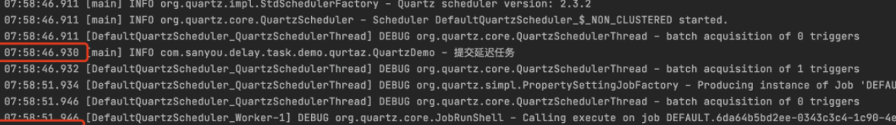

### 实现原理

核心组件

- `Job`：表示一个任务，execute方法的实现是对任务的执行逻辑

- `JobDetail`：任务的详情，可以设置任务需要的参数等信息

- `Trigger`：触发器，是用来触发业务的执行，比如说指定5s后触发任务，那么任务就会在5s后触发

- `Scheduler`：调度器，内部可以注册多个任务和对应任务的触发器，之后会调度任务的执行

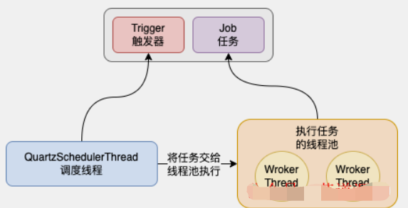

启动的时候会开启一个 `QuartzSchedulerThread` 调度线程，这个线程会去判断任务是否到了执行时间，到的话就将任务交给任务线程池去执行。

## 11：无限轮询延迟任务

无限轮询的意思就是开启一个线程不停的去轮询任务，当这些任务到达了延迟时间，那么就执行任务。

### demo
```java
@Slf4j
public class PollingTaskDemo {
 
    private static final List<DelayTask> DELAY_TASK_LIST = new CopyOnWriteArrayList<>();
 
    public static void main(String[] args) {
        new Thread(() -> {
            while (true) {
                try {
                    for (DelayTask delayTask : DELAY_TASK_LIST) {
                        if (delayTask.triggerTime <= System.currentTimeMillis()) {
                            log.info("处理延迟任务:{}", delayTask.taskContent);
                            DELAY_TASK_LIST.remove(delayTask);
                        }
                    }
                    TimeUnit.MILLISECONDS.sleep(100);
                } catch (Exception e) {
                }
            }
        }).start();
 
        log.info("提交延迟任务");
        DELAY_TASK_LIST.add(new DelayTask("芋道源码", 5L));
    }
 
    @Getter
    @Setter
    public static class DelayTask {
 
        private final String taskContent;
 
        private final Long triggerTime;
 
        public DelayTask(String taskContent, Long delayTime) {
            this.taskContent = taskContent;
            this.triggerTime = System.currentTimeMillis() + delayTime * 1000;
        }
    }
 
}
```

任务可以存在数据库又或者是内存，看具体的需求，这里我为了简单就放在内存里了。

执行结果：

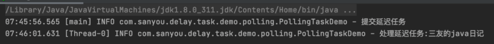


