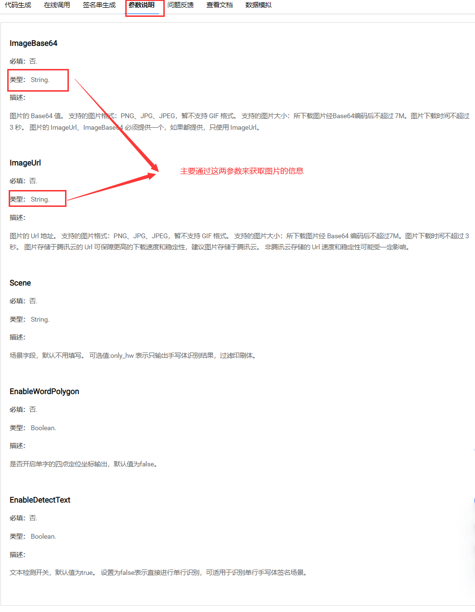

## 1：Tess4J实现（不准确）

### 1.1 引入依赖

```xml
    <!-- SpringBoot+Tess4J实现本地与远程图片的文字识别-->
    <dependency>
        <groupId>net.sourceforge.tess4j</groupId>
        <artifactId>tess4j</artifactId>
        <version>4.5.4</version>
    </dependency>
```

### 1.2 添加语言库

[github地址](https://gitcode.com/tesseract-ocr/tessdata/tree/main)

### 1.3 service
```java
package com.xiaoze.exer.service.impl;

import net.sourceforge.tess4j.Tesseract;
import net.sourceforge.tess4j.TesseractException;
import org.springframework.stereotype.Service;

import java.io.File;
import java.io.InputStream;
import java.net.URL;
import java.nio.file.Files;
import java.nio.file.Paths;
import java.nio.file.StandardCopyOption;

@Service
public class OcrService {

	/**
	 * 负责执行对本地文件的OCR任务
	 */
	public String recognizeText(File imageFile) throws TesseractException {

		Tesseract tesseract = new Tesseract();

		//设定训练文件的位置（如果是标准英文识别，此步可省略）
		tesseract.setDatapath("G:\\environments\\Tess4J\\tessdata");
		tesseract.setLanguage("chi_sim");
		return tesseract.doOCR(imageFile);
	}

	/**
	 * 则先将远程图片下载到本地，然后再执行OCR
	 */
	public String recognizeTextFromUrl(String imageUrl) throws Exception {

		URL url = new URL(imageUrl);
		InputStream in = url.openStream();
		Files.copy(in, Paths.get("downloaded.jpg"), StandardCopyOption.REPLACE_EXISTING);

		File imageFile = new File("downloaded.jpg");
		return recognizeText(imageFile);
	}
}

```

在这段代码中，`recognizeText(File imageFile)` 方法负责执行对 `本地文件的OCR任务` ，而`recognizeTextFromUrl(String imageUrl)` 方法则`先将远程图片下载到本地，然后再执行OCR`。

### 1.4 controller
```java
@RestController
@RequestMapping("/api/ocr")
public class OcrController {

    private final OcrService ocrService;

    // 使用构造器注入OcrService
    public OcrController(OcrService ocrService) {
        this.ocrService = ocrService;
    }

    @PostMapping("/upload")
    public ResponseEntity<String> uploadImage(@RequestParam("file") MultipartFile file) {
        try {
            File convFile = new File(System.getProperty("java.io.tmpdir")+"/"+file.getOriginalFilename());
            file.transferTo(convFile);
            String result = ocrService.recognizeText(convFile);
            return ResponseEntity.ok(result);
        } catch (Exception e) {
            e.printStackTrace();
            return ResponseEntity.badRequest().body("识别发生错误：" + e.getMessage());
        }
    }

    @GetMapping("/recognize-url")
    public ResponseEntity<String> recognizeFromUrl(@RequestParam("imageUrl") String imageUrl) {
        try {
            String result = ocrService.recognizeTextFromUrl(imageUrl);
            return ResponseEntity.ok(result);
        } catch (Exception e) {
            e.printStackTrace();
            return ResponseEntity.badRequest().body("从URL识别发生错误：" + e.getMessage());
        }
    }
}
```

在这个控制器中，我们创建了两个端点：`/api/ocr/upload` 用于处理用户上传的 `本地图片`，而 `/api/ocr/recognize-url` 则处理 `给定URL的远程图片`。


## 2：百度智能云实现

[官网文档](https://ai.baidu.com/ai-doc/OCR/dk3iqnq51)

### 2.1 引入依赖
```xml
<!--百度ocr-->
<dependency>
    <groupId>com.baidu.aip</groupId>
    <artifactId>java-sdk</artifactId>
    <version>4.16.10</version>
</dependency>
```

### 2.2 添加配置

```yml
baidu:
  APP_ID: #应用的appid
  API_KEY: #你的app_key
  SECRET_KEY: #你的secret_key
```

### 2.3 配置类

```java
@Setter
@Configuration
@ConfigurationProperties(prefix = "baidu")
public class baiduOcrConfig {

    private String APP_ID;
    private String API_KEY;
    private String SECRET_KEY;

    @Bean
    public AipOcr aipOcr() {
        return new AipOcr(APP_ID, API_KEY, SECRET_KEY);
    }

}
```

### 1.4 controller

```java
@RestController
@Slf4j
@RequestMapping("/api")
public class BaiduOcrController {


    @Autowired
    private AipOcr aipOcr;

    @PostMapping(value = "/process",consumes = MediaType.MULTIPART_FORM_DATA_VALUE)
    public String processImage(@RequestParam("file") MultipartFile file) {
        HashMap<String, String> options = new HashMap<String, String>();
        options.put("detect_direction", "true");
        options.put("probability", "true");
        try {
            byte[] imageBytes = file.getBytes();
            JSONObject result = aipOcr.basicGeneral(imageBytes, options);

            // 解析百度OCR的识别结果
            StringBuilder sb = new StringBuilder();
            result.getJSONArray("words_result").forEach(item -> {
                JSONObject word = (JSONObject) item;
                sb.append(word.getString("words")).append("\n");
            });

            return sb.toString();
        } catch (IOException e) {
            e.printStackTrace();
            return "Error processing image";
        }

    }

}

```

### 1.5 常用API

[官方文档](https://ai.baidu.com/ai-doc/OCR/Nkibizxlf)

#### 通用文字识别

[官网文档](https://ai.baidu.com/ai-doc/OCR/Nkibizxlf#%E9%80%9A%E7%94%A8%E6%96%87%E5%AD%97%E8%AF%86%E5%88%AB)

```java
//image为图片的二进制字节数组，options为传入可选参数调用接口
basicGeneral(byte[] image, HashMap<String, String> options) 
```

```java
//image为图片的存放路径，options为传入可选参数调用接口
basicGeneral(String image, HashMap<String, String> options)
```

```java
//image为图片的存放在服务器的路径，options为传入可选参数调用接口
basicGeneralUrl(String url, HashMap<String, String> options)
```

#### 通用文字识别（高精度版）

[官网文档](https://ai.baidu.com/ai-doc/OCR/Nkibizxlf#%E9%80%9A%E7%94%A8%E6%96%87%E5%AD%97%E8%AF%86%E5%88%AB%EF%BC%88%E9%AB%98%E7%B2%BE%E5%BA%A6%E7%89%88%EF%BC%89)


```java
//image为图片的二进制字节数组，options为传入可选参数调用接口
basicAccurateGeneral(byte[] image, HashMap<String, String> options)
```

```java
//image为本地图片的存放路径，options为传入可选参数调用接口
basicAccurateGeneral(String image, HashMap<String, String> options)
```

#### 通用文字识别（含位置信息版）

[官网文档](https://ai.baidu.com/ai-doc/OCR/Nkibizxlf#%E9%80%9A%E7%94%A8%E6%96%87%E5%AD%97%E8%AF%86%E5%88%AB%EF%BC%88%E5%90%AB%E4%BD%8D%E7%BD%AE%E4%BF%A1%E6%81%AF%E7%89%88%EF%BC%89)

```java
//image为图片的二进制字节数组，options为传入可选参数调用接口
general(byte[] image, HashMap<String, String> options)
```

```java
//image为图片的存放路径，options为传入可选参数调用接口
general(String image, HashMap<String, String> options)
```

```java
//image为图片的存放在服务器的路径，options为传入可选参数调用接口
generalUrl(String url, HashMap<String, String> options)
```

#### 通用文字识别（含位置高精度版）

[官网文档](https://ai.baidu.com/ai-doc/OCR/Nkibizxlf#%E9%80%9A%E7%94%A8%E6%96%87%E5%AD%97%E8%AF%86%E5%88%AB%EF%BC%88%E5%90%AB%E4%BD%8D%E7%BD%AE%E9%AB%98%E7%B2%BE%E5%BA%A6%E7%89%88%EF%BC%89)


```java
//image为图片的二进制字节数组，options为传入可选参数调用接口
accurateGeneral(byte[] image, HashMap<String, String> options)
```

```java
//image为图片的存放路径，options为传入可选参数调用接口
accurateGeneral(String image, HashMap<String, String> options)
```

#### 通用文字识别（含生僻字版）

[官网文档](https://ai.baidu.com/ai-doc/OCR/Nkibizxlf#%E9%80%9A%E7%94%A8%E6%96%87%E5%AD%97%E8%AF%86%E5%88%AB%EF%BC%88%E5%90%AB%E7%94%9F%E5%83%BB%E5%AD%97%E7%89%88%EF%BC%89)

```java
enhancedGeneral(byte[] image, HashMap<String, String> options)
```

```java
enhancedGeneral(String image, HashMap<String, String> options)
```

```java
enhancedGeneralUrl(String url, HashMap<String, String> options)
```

## 3：阿里云实现

[官方文档](https://next.api.aliyun.com/api-tools/sdk/ocr-api?spm=a2c4g.442247.0.0.40933e8eQ3GZIX&version=2021-07-07&language=java-tea&tab=primer-doc)

[代码示例](https://next.api.aliyun.com/api/ocr-api/2021-07-07/RecognizeAdvanced?spm=api-workbench.SDK%20Document.0.0.2e7652e95jnhKE&tab=DOC&sdkStyle=dara&lang=JAVA)

### 3.1 引入依赖

```xml
<dependency>
  <groupId>com.aliyun</groupId>
  <artifactId>ocr_api20210707</artifactId>
  <version>1.2.0</version>
</dependency>
```

### 3.2 编写yml配置文件

```yml
aliyun:
  KeyId: #你的KeyId
  KeySecret: #你的KeySecret
  endpoint: ocr-api.cn-hangzhou.aliyuncs.com
```

### 3.3 编写配置类

```java
@Setter
@Component
@ConfigurationProperties(prefix = "aliyun")
public class AliyunOcrConfig {
    private String KeyId;
    private String KeySecret;
    private String endpoint;

    @Bean
    public Client ocrClient(){
        try {

            Client client = new Client(new Config().setAccessKeyId(KeyId).setAccessKeySecret(KeySecret).setEndpoint(endpoint));
            return client;
        } catch (Exception e) {
            throw new RuntimeException(e);
        }
    }
}
```

### 3.4 编写测试接口

```java
@RestController
@RequestMapping("/api")
@Slf4j
public class AliyunOcrController {

    @Resource
    private Client client;

    @PostMapping(value = "ocr",consumes = MediaType.MULTIPART_FORM_DATA_VALUE)
    public String OcrTest(@RequestParam("file")MultipartFile file) throws IOException {
        RecognizeGeneralRequest request = new RecognizeGeneralRequest();
        request.setBody(file.getInputStream());
        try {
            RecognizeGeneralResponse response = client.recognizeGeneral(request);
            String json = new Gson().toJson(response.getBody());
            String[] split = json.split(",");
            return split[1].split(":")[1].replace("\\","");

//            return json;
        } catch (TeaException error) {
            Common.assertAsString(error.message);
        } catch (Exception e) {
            TeaException error = new TeaException(e.getMessage(), e);
            // 如有需要，请打印 error
            Common.assertAsString(error.message);
        }
        return null;
    }

}

```

## 4：腾讯云实现

[官网文档](https://cloud.tencent.com/document/product/866)

[官网API](https://cloud.tencent.com/document/api/866/33515)

[官网参数说明与在线调试](https://console.cloud.tencent.com/api/explorer?Product=ocr&Version=2018-11-19&Action=GeneralHandwritingOCR)

### 4.1 获取密钥

[地址](https://console.cloud.tencent.com/cam/capi)

### 4.2 引入依赖

```xml
<dependency>
    <groupId>com.tencentcloudapi</groupId>
    <artifactId>tencentcloud-sdk-java</artifactId>
    <version>3.1.909</version>
</dependency>
```

### 4.3 编写yml配置文件

```yml
tencent:
  SecretId: #你的SecretId
  SecretKey: #你的SecretKey
```

### 4.4 编写配置类

```java

@Setter
@Configuration
@ConfigurationProperties(prefix = "tencent")
public class TencentOcrConfig {

    private String SecretId;
    private String SecretKey;

    @Bean
    public Credential credential(){
        return new Credential(SecretId,SecretKey);
    }

}
```

### 4.5 编写将文件转换成Base64编码的工具类

由于腾讯云OCR的API接收的参数如下图，所以要编写将文件转码成Base64的工具类：



```java
public class ByteToBase64Converter {

    public static String encodeBytesToBase64(byte[] bytes) {
        return Base64.getEncoder().encodeToString(bytes);
    }

}
```

### 4.6 编写接口测试

```java
@RestController
@RequestMapping("/api")
@Slf4j
public class TencentOcrController {
    @Resource
    private Credential credential;


    @PostMapping(value = "/tencent",consumes = MediaType.MULTIPART_FORM_DATA_VALUE)
    public String TencentOCR(@RequestParam("file")MultipartFile file) throws TencentCloudSDKException, IOException {

        // 实例化一个http选项，可选的，没有特殊需求可以跳过
        HttpProfile httpProfile = new HttpProfile();
        httpProfile.setEndpoint("ocr.tencentcloudapi.com");

        // 实例化一个client选项，可选的，没有特殊需求可以跳过
        ClientProfile clientProfile = new ClientProfile();
        clientProfile.setHttpProfile(httpProfile);

        // 实例化要请求产品的client对象,clientProfile是可选的
        OcrClient client = new OcrClient(credential, "ap-guangzhou", clientProfile);

        //将上传的文件转换成base64编码
        String encodeBytesToBase64 = ByteToBase64Converter.encodeBytesToBase64(file.getBytes());


        // 实例化一个请求对象,每个接口都会对应一个request对象
        GeneralBasicOCRRequest req = new GeneralBasicOCRRequest();
        req.setImageBase64(encodeBytesToBase64);

       // req.setImageUrl("https://ltmyblog.oss-cn-shenzhen.aliyuncs.com/myBlog/article/image-20230924213423855.png");

        // 返回的resp是一个GeneralBasicOCRResponse的实例，与请求对象对应
        GeneralBasicOCRResponse resp = client.GeneralBasicOCR(req);


        GeneralBasicOCRResponse.toJsonString(resp);
        // 输出json格式的字符串回包
        System.out.println(GeneralBasicOCRResponse.toJsonString(resp));
        return GeneralBasicOCRResponse.toJsonString(resp);
    }

}
```