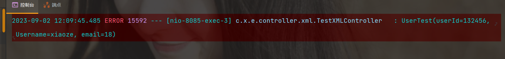

## 1：依赖添加
```xml
<!--XML解析-->
<dependency>
    <groupId>com.fasterxml.jackson.dataformat</groupId>
    <artifactId>jackson-dataformat-xml</artifactId>
</dependency>
```
## 2：接收发送来的XML数据
### 1）后端简单接收
- ①postman发送请求，格式为XML，修改`Content-Type`格式为：`text/xml`或者`application/xml`

xml报文
```xml
<User>
    <name>xiaoze</name>
    <age>18</age>
</User>
```
- ②后端接收
实体类
```java
@Data
@AllArgsConstructor
@NoArgsConstructor
@JacksonXmlRootElement(localName = "User")
public class User {
    @JacksonXmlProperty(localName = "name")
    private String name;

    @JacksonXmlProperty(localName = "age")
    private Integer age;
}
```
controller
```java
    @PostMapping("/testXML")
    public R testXMLController(@RequestBody User user){
        System.out.println(user);
        return R.ok().data("user",user);
    }
```
- ③结果

### 2）后端复杂接收
- ①xml报文
```xml
<?xml version="1.0" encoding="UTF-8" standalone="yes"?>
<Root>
    <head>
        <provider>江南造汽场</provider>
        <address>江南皮革厂旁边</address>
        <date>2022-10-10 11:21:43</date>
    </head>
    <info>
        <car>
            <name>兰博基尼</name>
            <type>敞篷跑车</type>
            <count>10</count>
        </car>
        <car>
            <name>法拉利</name>
            <type>超跑</type>
            <count>5</count>
        </car>
    </info>
</Root>
```
<p style="color:red">Content-Type为application/xml</p>

- ②后端解析XML数据
解析根标签【Root】
```java
@Data
@JacksonXmlRootElement(localName = "Root")
@AllArgsConstructor
@NoArgsConstructor
public class RootXml {
    @JacksonXmlElementWrapper(localName = "head")
    private HeadInfo headInfo;

    @JacksonXmlElementWrapper(localName = "info")
    @JacksonXmlProperty(localName = "car")
    private List<Car> carList;
}

```
解析head标签
```java
@Data
@AllArgsConstructor
@NoArgsConstructor
@JacksonXmlRootElement(localName = "Root")
public class HeadInfo {

    @JacksonXmlProperty(localName = "provider")
    private String facName;

    @JacksonXmlProperty(localName = "address")
    private String address;

    @JacksonXmlProperty(localName = "date")
    //也可以使用@DateTimeFormat注解转换,但无法精确到小时
    //此处也可以改成String,然后使用DateTimeFormatter.ofPattern("yyyy-MM-dd HH:mm:ss")转换
    @JsonFormat(pattern = "yyyy-MM-dd HH:mm:ss", timezone = "GMT+8")
    private Date date;
}

```
解析info标签
```java
@Data
@AllArgsConstructor
@NoArgsConstructor
@JacksonXmlRootElement(localName = "Root")
public class CarInfos {

    @JacksonXmlElementWrapper(localName = "info")
    @JacksonXmlProperty(localName = "car")
    private List<Car> carList;

}

```
解析car标签
```java
//车辆信息
@AllArgsConstructor
@NoArgsConstructor
@Data
public class Car {

    @JacksonXmlProperty(localName = "name")
    private String carName;

    @JacksonXmlProperty(localName = "type")
    private String carType;

    @JacksonXmlProperty(localName = "count")
    private Integer count;
}
```
- ③编写controller接收XML并获取数据
> produces = MediaType.APPLICATION_XML_VALUE, consumes = MediaType.APPLICATION_XML_VALUE

```java
 @PostMapping(value = "/parseXML", produces = MediaType.APPLICATION_XML_VALUE, consumes = MediaType.APPLICATION_XML_VALUE)
    public R parseXML(@RequestBody RootXml rootXml){
        HeadInfo headInfo = rootXml.getHeadInfo();
        System.out.println("headInfo:" + headInfo);
        List<Car> carList = rootXml.getCarList();
        for(Car car : carList){
            System.out.println(car);
        }
        return R.ok().data("car",carList);
    }
```
- ④结果展示


### 3）后端复杂解析标签接收

最终要转换的javabean
```java
@Data
@XmlRootElement(name = "user")
@XmlAccessorType(XmlAccessType.FIELD)
public class UserTest {
    private Integer userId;
    private String Username;
    private String email;
}
```
xml解析工具类
```java
package com.xiaoze.exer.utils;

import javax.xml.bind.JAXBContext;
import javax.xml.bind.JAXBException;
import javax.xml.bind.Marshaller;
import javax.xml.bind.Unmarshaller;
import javax.xml.stream.XMLInputFactory;
import javax.xml.stream.XMLStreamReader;
import java.io.*;

/**
 * 封装了XML转换成object，object转换成XML的代码
 *
 * @author hhz
 * @date 2023/8/30 16:25
 */
public class XMLUtil {
    /**
     * 方法描述: 将对象直接转换成String类型的 XML输出
     *
     * @param :
     * @return
     * @Author 胡昊泽
     * @Date 2023/8/30 16:25
     */
    public static String convertToXml(Object obj) {
        // 创建输出流
        StringWriter sw = new StringWriter();
        try {
            // 利用jdk中自带的转换类实现
            JAXBContext context = JAXBContext.newInstance(obj.getClass());
            Marshaller marshaller = context.createMarshaller();
            // 格式化xml输出的格式
            marshaller.setProperty(Marshaller.JAXB_FORMATTED_OUTPUT, Boolean.TRUE);
            // 将对象转换成输出流形式的xml
            marshaller.marshal(obj, sw);
        } catch (JAXBException e) {
            e.printStackTrace();
        }
        return sw.toString();
    }

    /**
     * 　　* 将对象根据路径转换成xml文件
     * 　　*
     * 　　* @param obj
     * 　　* @param path
     */
    public static String convertToXml(Object obj, String path) {
        FileWriter fw = null;
        try {
            // 利用jdk中自带的转换类实现
            JAXBContext context = JAXBContext.newInstance(obj.getClass());
            Marshaller marshaller = context.createMarshaller();
            // 格式化xml输出的格式
            marshaller.setProperty(Marshaller.JAXB_FORMATTED_OUTPUT, Boolean.TRUE);
            // 将对象转换成输出流形式的xml
            // 创建输出流
            fw = new FileWriter(path);
            marshaller.marshal(obj, fw);
        } catch (JAXBException e) {
            e.printStackTrace();
        } catch (IOException e) {
            e.printStackTrace();
        }
        return fw.toString();
    }

    /**
     * 　　* 将String类型的xml转换成对象
     * 　　*
     * 　　* @param clazz
     * 　　* @param xmlStr
     * 　　* @return
     */
    public static Object convertXmlStrToObject(Class clazz, String xmlStr) {
        Object xmlObject = null;
        try {
            JAXBContext context = JAXBContext.newInstance(clazz);
            // 进行将Xml转成对象的核心接口
            Unmarshaller unmarshaller = context.createUnmarshaller();
            StringReader sr = new StringReader(xmlStr);
            xmlObject = unmarshaller.unmarshal(sr);
        } catch (JAXBException e) {
            e.printStackTrace();
        }
        return xmlObject;
    }

    /**
     * 　　* 将file类型的xml转换成对象
     * 　　*
     * 　　* @param clazz
     * 　　* @param xmlPath
     * 　　* @return
     */
    public static Object convertXmlFileToObject(Class clazz, String xmlPath) {
        Object xmlObject = null;
        try {
            JAXBContext context = JAXBContext.newInstance(clazz);
            Unmarshaller unmarshaller = context.createUnmarshaller();
            FileReader fr = null;
            fr = new FileReader(xmlPath);
            xmlObject = unmarshaller.unmarshal(fr);
        } catch (JAXBException e) {
            e.printStackTrace();
        } catch (FileNotFoundException e) {
            e.printStackTrace();
        }
        return xmlObject;
    }

    /**
     * xml转换成JavaBean
     *
     * @param xml xml格式字符串
     * @param t   待转化的对象
     * @return 转化后的对象
     * @throws Exception JAXBException
     */
    public static <T> T convertToJavaBean(String xml, Class<T> t) throws Exception {
        T obj = null;
        JAXBContext context = JAXBContext.newInstance(t);
        XMLInputFactory xif = XMLInputFactory.newInstance();
        xif.setProperty(XMLInputFactory.IS_SUPPORTING_EXTERNAL_ENTITIES, false);
        xif.setProperty(XMLInputFactory.SUPPORT_DTD, false);
        XMLStreamReader xsr = xif.createXMLStreamReader(new StringReader(xml));
        Unmarshaller unmarshaller = context.createUnmarshaller();
        obj = (T) unmarshaller.unmarshal(xsr);
        return obj;
    }

    /**
     * JavaBean转换成xml
     *
     * @param obj
     * @param encoding
     * @return
     */
    public static String convertToXml1(Object obj, String encoding) {
        String result = null;
        try {
            JAXBContext context = JAXBContext.newInstance(obj.getClass());
            Marshaller marshaller = context.createMarshaller();
            marshaller.setProperty(Marshaller.JAXB_FORMATTED_OUTPUT, true);
            marshaller.setProperty(Marshaller.JAXB_ENCODING, encoding);
            StringWriter writer = new StringWriter();
            marshaller.marshal(obj, writer);
            result = writer.toString();
        } catch (Exception e) {
            e.printStackTrace();
        }

        return result;
    }
}
```
controller
```java
   /**
     * 方法描述: 解析请求中的xml报文
     * @Author 胡昊泽
     * @Date 2023/9/2 11:36
     * @param request:
     * @param response:
     * @return java.lang.String
     */
    @PostMapping(value = "/dataInfo", produces = "text/html;charset=UTF-8")
    public String initAcctOrgData(HttpServletRequest request, HttpServletResponse response) {
        // 定义xml报文中对应的JavaBean
        UserTest user = new UserTest();
        String ns = "http://esb.xjrccb.com/1000200036";
        String result = "";
        try {
            // 1.获取请求中的xml报文，转换成字符串
            String reqt = new String(readInputStream(request.getInputStream()), "UTF-8");

            // 2.处理数据
            String orgReq1 = reqt.replace("<ns:", "<");
            String orgReq2 = orgReq1.replace("</ns:", "</");

            // 3.解析处理后的字符串，并转换成为Javabean
            user = XMLUtil.convertToJavaBean(orgReq2, UserTest.class);

            // 4.进行对应的操作......
            logger.error(String.valueOf(user));

            // 5.JavaBean转换成xml
            String userXml = XMLUtil.convertToXml1(user, "UTF-8");

            // 6.统一返回xml格式
            result = rtnData(userXml, ns);
        } catch (Exception e) {
            e.printStackTrace();
            logger.error("chucuole");
        }
        return result;
    }

    /**
     * 接受参数
     * @param inStream
     * @return
     * @throws Exception
     */
    public static byte[] readInputStream(InputStream inStream) throws Exception {
        ByteArrayOutputStream outSteam = null;
        try {
            outSteam = new ByteArrayOutputStream();
            byte[] buffer = new byte[1024];
            int len;
            while ((len = inStream.read(buffer)) != -1) {
                outSteam.write(buffer, 0, len);
            }
            return outSteam.toByteArray();
        }
        catch(Exception e) {
            throw e;
        }
        finally{
            if(outSteam != null) {
                outSteam.close();
                outSteam = null;
            }
            if(inStream != null) {
                inStream.close();
                inStream = null;
            }
        }
    }
    /**
     * 构造返回格式
     * @param data 返回数据
     * @param ns webservice格式命名空间
     * @return
     */
    public String rtnData(String data,String ns) {
        String dataStr = data.replaceAll("<", "<ns:");
        String dataStr1 = dataStr.replaceAll("<ns:/", "</ns:");
        String dataStr2 = dataStr1.replace("<ns:Envelope>", "<soapenv:Envelope xmlns:soapenv=\"http://schemas.xmlsoap.org/soap/envelope/\">");
        String dataStr3 = dataStr2.replace("</ns:Envelope>", "</soapenv:Envelope>");

        String dataStr4 = dataStr3.replace("<ns:Header>", "<soap:Header xmlns:soap=\"http://schemas.xmlsoap.org/soap/envelope/\">");
        String dataStr5 = dataStr4.replace("</ns:Header>", "</soap:Header>");

        String dataStr6 = dataStr5.replace("<ns:Body>", "<soapenv:Body>");
        String dataStr7 = dataStr6.replace("</ns:Body>", "</soapenv:Body>");

        String dataStr8 = dataStr7.replace("<ns:resp>", "<ns:resp xmlns:ns=\"" + ns + "\">");
        String dataStr9 = dataStr8.replace("<ns:?", "<?");

        return dataStr9;
    }
```
xml报文测试
```xml
<ns:user>
    <ns:userId>132456</ns:userId>
    <ns:Username>xiaoze</ns:Username>
    <ns:email>18</ns:email>
</ns:user>
```
结果展示


## 3：后端发送XML数据
### 1）编写实体类
```java
@Data
@AllArgsConstructor
@NoArgsConstructor
@JacksonXmlRootElement(localName = "User")
public class User {
    @JacksonXmlProperty(localName = "name")
    private String name;

    @JacksonXmlProperty(localName = "age")
    private Integer age;
}
```
### 2）编写controller
> 注解上添加：produces = MediaType.APPLICATION_XML_VALUE
```java
 @PostMapping(value = "/sendXML", produces = MediaType.APPLICATION_XML_VALUE)
    public R sendXML(){
        User user = new User();
        user.setName("xiaoze");
        user.setAge(18);
        return R.ok().data("user",user);
    }
```


## 4：学习网站
[博客地址](https://blog.csdn.net/weixin_45565886/article/details/127258837)

## 5：补充
复杂报文以及对应的JavaBean解析
### 1）示例一
```xml
<ns:reqt xmlns:ns="http://esb.xjrccb.com/1000200036">
            <ns:svcHead>
                <ns:SvcId>1000200036</ns:SvcId>
                <ns:OptId>01</ns:OptId>
                <ns:VerNo>1.0.0.0</ns:VerNo>
                <ns:CsmId>60060</ns:CsmId>
                <ns:CsmTms>2023-08-08T11:47:51</ns:CsmTms>
                <ns:CsmSeqNo>gjf05xl5</ns:CsmSeqNo>
            </ns:svcHead>
            <ns:extHead>
                <ns:FileFlag>0</ns:FileFlag>
            </ns:extHead>
            <ns:appHead>
                <ns:acceptSysId>BCOPRM</ns:acceptSysId>
                <ns:operationType>01</ns:operationType>
            </ns:appHead>
            <ns:appBody>
                <ns:orgCode>6001</ns:orgCode>
                <ns:name>新疆维吾尔自治区农村信用合作社</ns:name>
                <ns:shortName>shortName</ns:shortName>
                <ns:parentOrgCode>parentOrgCode</ns:parentOrgCode>
                <ns:orgType>01</ns:orgType>
                <ns:orgKind>orgKind</ns:orgKind>
                <ns:orgLevel>1</ns:orgLevel>
                <ns:branchCode>branchCode</ns:branchCode>
                <ns:exBillBrc>exBillBrc</ns:exBillBrc>
                <ns:orgAddress>orgAddress</ns:orgAddress>
                <ns:orgTel>orgTel</ns:orgTel>
                <ns:cityCode>cityCode</ns:cityCode>
                <ns:legalPerson/>
                <ns:description/>
                <ns:status>1</ns:status>
                <ns:deptFrom>deptFrom</ns:deptFrom>
                <ns:areaCode>areaCode</ns:areaCode>
                <ns:attributeStr1/>
                <ns:attributeStr2/>
                <ns:attributeStr3/>
                <ns:attributeStr4/>
                <ns:attributeStr5/>
                <ns:attributeStr6/>
                <ns:attributeStr7/>
                <ns:attributeStr8/>
                <ns:attributeStr9/>
                <ns:attributeStr10/>
            </ns:appBody>
        </ns:reqt>
```
```java
@XmlRootElement(name = "reqt")
public class FsBpfOrgSyncInput {

	@XmlElement(name = "svcHead")
	public SvcHead svcHead;

	@XmlElement(name = "extHead")
	public ExtHead extHead;

	@XmlElement(name = "appHead")
	public AppHead appHead;

	@XmlElement(name = "appBody")
	public AppBody appBody;

	public void setSvcHead(SvcHead svcHead) {
		this.svcHead = svcHead;
	}

	public void setExtHead(ExtHead extHead) {
		this.extHead = extHead;
	}

	public void setAppHead(AppHead appHead) {
		this.appHead = appHead;
	}

	public void setAppBody(AppBody appBody) {
		this.appBody = appBody;
	}

	public static class AppBody {
		@XmlElement(name = "orgCode")
		public String orgCode;
		@XmlElement(name = "name")
		public String name;
		@XmlElement(name = "shortName")
		public String shortName;
		@XmlElement(name = "parentOrgCode")
		public String parentOrgCode;
		@XmlElement(name = "orgType")
		public String orgType;
		@XmlElement(name = "orgKind")
		public String orgKind;
		@XmlElement(name = "orgLevel")
		public String orgLevel;
		@XmlElement(name = "branchCode")
		public String branchCode;
		@XmlElement(name = "exBillBrc")
		public String exBillBrc;
		@XmlElement(name = "orgAddress")
		public String orgAddress;
		@XmlElement(name = "orgTel")
		public String orgTel;
		@XmlElement(name = "cityCode")
		public String cityCode;
		@XmlElement(name = "legalPerson")
		public String legalPerson;
		@XmlElement(name = "description")
		public String description;
		@XmlElement(name = "status")
		public String status;
		@XmlElement(name = "deptFrom")
		public String deptFrom;
		@XmlElement(name = "areaCode")
		public String areaCode;
		@XmlElement(name = "attributeStr1")
		public String attributeStr1;
		@XmlElement(name = "attributeStr2")
		public String attributeStr2;
		@XmlElement(name = "attributeStr3")
		public String attributeStr3;
		@XmlElement(name = "attributeStr4")
		public String attributeStr4;
		@XmlElement(name = "attributeStr5")
		public String attributeStr5;
		@XmlElement(name = "attributeStr6")
		public String attributeStr6;
		@XmlElement(name = "attributeStr7")
		public String attributeStr7;
		@XmlElement(name = "attributeStr8")
		public String attributeStr8;
		@XmlElement(name = "attributeStr9")
		public String attributeStr9;
		@XmlElement(name = "attributeStr10")
		public String attributeStr10;
        public void setOrgCode(String orgCode) {
			this.orgCode = orgCode;
		}

		public void setName(String name) {
			this.name = name;
		}

		public void setShortName(String shortName) {
			this.shortName = shortName;
		}

		public void setParentOrgCode(String parentOrgCode) {
			this.parentOrgCode = parentOrgCode;
		}

		public void setOrgType(String orgType) {
			this.orgType = orgType;
		}

		public void setOrgKind(String orgKind) {
			this.orgKind = orgKind;
		}

		public void setOrgLevel(String orgLevel) {
			this.orgLevel = orgLevel;
		}

		public void setBranchCode(String branchCode) {
			this.branchCode = branchCode;
		}

		public void setExBillBrc(String exBillBrc) {
			this.exBillBrc = exBillBrc;
		}

		public void setOrgAddress(String orgAddress) {
			this.orgAddress = orgAddress;
		}

		public void setOrgTel(String orgTel) {
			this.orgTel = orgTel;
		}

		public void setCityCode(String cityCode) {
			this.cityCode = cityCode;
		}

		public void setLegalPerson(String legalPerson) {
			this.legalPerson = legalPerson;
		}

		public void setDescription(String description) {
			this.description = description;
		}

		public void setStatus(String status) {
			this.status = status;
		}

		public void setDeptFrom(String deptFrom) {
			this.deptFrom = deptFrom;
		}

		public void setAreaCode(String areaCode) {
			this.areaCode = areaCode;
		}

		public void setAttributeStr1(String attributeStr1) {
			this.attributeStr1 = attributeStr1;
		}

		public void setAttributeStr2(String attributeStr2) {
			this.attributeStr2 = attributeStr2;
		}

		public void setAttributeStr3(String attributeStr3) {
			this.attributeStr3 = attributeStr3;
		}

		public void setAttributeStr4(String attributeStr4) {
			this.attributeStr4 = attributeStr4;
		}

		public void setAttributeStr5(String attributeStr5) {
			this.attributeStr5 = attributeStr5;
		}

		public void setAttributeStr6(String attributeStr6) {
			this.attributeStr6 = attributeStr6;
		}

		public void setAttributeStr7(String attributeStr7) {
			this.attributeStr7 = attributeStr7;
		}

		public void setAttributeStr8(String attributeStr8) {
			this.attributeStr8 = attributeStr8;
		}

		public void setAttributeStr9(String attributeStr9) {
			this.attributeStr9 = attributeStr9;
		}

		public void setAttributeStr10(String attributeStr10) {
			this.attributeStr10 = attributeStr10;
		}

	}
    public static class AppHead {
		@XmlElement(name = "acceptSysId")
		public String acceptSysId;

		@XmlElement(name = "operationType")
		public String operationType;

		public void setAcceptSysId(String acceptSysId) {
			this.acceptSysId = acceptSysId;
		}

		public void setOperationType(String operationType) {
			this.operationType = operationType;
		}

	}

	public static class ExtHead {
		@XmlElement(name = "FileFlag")
		public String fileFlag;

		public void setFileFlag(String fileFlag) {
			this.fileFlag = fileFlag;
		}

	}

	public static class SvcHead {
		@XmlElement(name = "SvcId")
		public String svcId;
		@XmlElement(name = "OptId")
		public String optId;
		@XmlElement(name = "VerNo")
		public String verNo;
		@XmlElement(name = "CsmId")
		public String csmId;
		@XmlElement(name = "CsmTms")
		public String csmTms;
		@XmlElement(name = "CsmSeqNo")
		public String csmSeqNo;

		public void setSvcId(String svcId) {
			this.svcId = svcId;
		}
		public void setOptId(String optId) {
			this.optId = optId;
		}
		public void setVerNo(String verNo) {
			this.verNo = verNo;
		}
		public void setCsmId(String csmId) {
			this.csmId = csmId;
		}
		public void setCsmTms(String csmTms) {
			this.csmTms = csmTms;
		}
		public void setCsmSeqNo(String csmSeqNo) {
			this.csmSeqNo = csmSeqNo;
		}
	}
}
