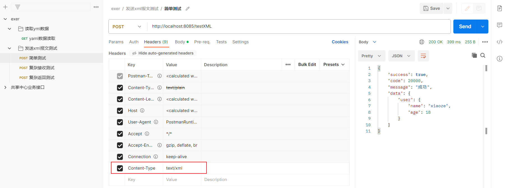
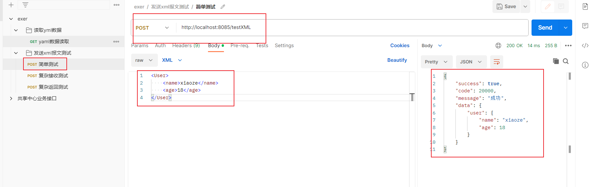

## 1：依赖添加
```xml
<!--XML解析-->
<dependency>
    <groupId>com.fasterxml.jackson.dataformat</groupId>
    <artifactId>jackson-dataformat-xml</artifactId>
</dependency>
```
## 2：接收发送来的XML数据
### 1）后端简单接收
- ①postman发送请求，格式为XML，修改`Content-Type`格式为：`text/xml`或者`application/xml`

xml报文
```xml
<User>
    <name>xiaoze</name>
    <age>18</age>
</User>
```
- ②后端接收
实体类
```java
@Data
@AllArgsConstructor
@NoArgsConstructor
@JacksonXmlRootElement(localName = "User")
public class User {
    @JacksonXmlProperty(localName = "name")
    private String name;

    @JacksonXmlProperty(localName = "age")
    private Integer age;
}
```
controller
```java
    @PostMapping("/testXML")
    public R testXMLController(@RequestBody User user){
        System.out.println(user);
        return R.ok().data("user",user);
    }
```
- ③结果

### 2）后端复杂接收
- ①xml报文
```xml
<?xml version="1.0" encoding="UTF-8" standalone="yes"?>
<Root>
    <head>
        <provider>江南造汽场</provider>
        <address>江南皮革厂旁边</address>
        <date>2022-10-10 11:21:43</date>
    </head>
    <info>
        <car>
            <name>兰博基尼</name>
            <type>敞篷跑车</type>
            <count>10</count>
        </car>
        <car>
            <name>法拉利</name>
            <type>超跑</type>
            <count>5</count>
        </car>
    </info>
</Root>
```
<p style="color:red">Content-Type为application/xml</p>

- ②后端解析XML数据
解析根标签【Root】
```java
@Data
@JacksonXmlRootElement(localName = "Root")
@AllArgsConstructor
@NoArgsConstructor
public class RootXml {
    @JacksonXmlElementWrapper(localName = "head")
    private HeadInfo headInfo;

    @JacksonXmlElementWrapper(localName = "info")
    @JacksonXmlProperty(localName = "car")
    private List<Car> carList;
}

```
解析head标签
```java
@Data
@AllArgsConstructor
@NoArgsConstructor
@JacksonXmlRootElement(localName = "Root")
public class HeadInfo {

    @JacksonXmlProperty(localName = "provider")
    private String facName;

    @JacksonXmlProperty(localName = "address")
    private String address;

    @JacksonXmlProperty(localName = "date")
    //也可以使用@DateTimeFormat注解转换,但无法精确到小时
    //此处也可以改成String,然后使用DateTimeFormatter.ofPattern("yyyy-MM-dd HH:mm:ss")转换
    @JsonFormat(pattern = "yyyy-MM-dd HH:mm:ss", timezone = "GMT+8")
    private Date date;
}

```
解析info标签
```java
@Data
@AllArgsConstructor
@NoArgsConstructor
@JacksonXmlRootElement(localName = "Root")
public class CarInfos {

    @JacksonXmlElementWrapper(localName = "info")
    @JacksonXmlProperty(localName = "car")
    private List<Car> carList;

}

```
解析car标签
```java
//车辆信息
@AllArgsConstructor
@NoArgsConstructor
@Data
public class Car {

    @JacksonXmlProperty(localName = "name")
    private String carName;

    @JacksonXmlProperty(localName = "type")
    private String carType;

    @JacksonXmlProperty(localName = "count")
    private Integer count;
}
```
- ③编写controller接收XML并获取数据
> produces = MediaType.APPLICATION_XML_VALUE, consumes = MediaType.APPLICATION_XML_VALUE

```java
 @PostMapping(value = "/parseXML", produces = MediaType.APPLICATION_XML_VALUE, consumes = MediaType.APPLICATION_XML_VALUE)
    public R parseXML(@RequestBody RootXml rootXml){
        HeadInfo headInfo = rootXml.getHeadInfo();
        System.out.println("headInfo:" + headInfo);
        List<Car> carList = rootXml.getCarList();
        for(Car car : carList){
            System.out.println(car);
        }
        return R.ok().data("car",carList);
    }
```
- ④结果展示


## 3：后端发送XML数据
### 1）编写实体类
```java
@Data
@AllArgsConstructor
@NoArgsConstructor
@JacksonXmlRootElement(localName = "User")
public class User {
    @JacksonXmlProperty(localName = "name")
    private String name;

    @JacksonXmlProperty(localName = "age")
    private Integer age;
}
```
### 2）编写controller
> 注解上添加：produces = MediaType.APPLICATION_XML_VALUE
```java
 @PostMapping(value = "/sendXML", produces = MediaType.APPLICATION_XML_VALUE)
    public R sendXML(){
        User user = new User();
        user.setName("xiaoze");
        user.setAge(18);
        return R.ok().data("user",user);
    }
```

## 4：学习网站
[博客地址](https://blog.csdn.net/weixin_45565886/article/details/127258837)