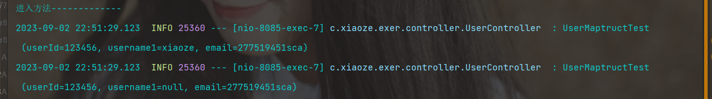
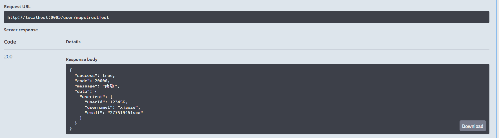

## 1：导包
```xml
        <dependency>
            <groupId>org.projectlombok</groupId>
            <artifactId>lombok</artifactId>
            <scope>provided</scope>
        </dependency>

<!--        <dependency>-->
<!--            <groupId>org.projectlombok</groupId>-->
<!--            <artifactId>lombok-mapstruct-binding</artifactId>-->
<!--            <version>0.2.0</version>-->
<!--        </dependency>-->
        <dependency>
            <groupId>org.mapstruct</groupId>
            <artifactId>mapstruct</artifactId>
            <version>1.3.1.Final</version>
        </dependency>
        <dependency>
            <groupId>org.mapstruct</groupId>
            <artifactId>mapstruct-processor</artifactId>
            <version>1.3.1.Final</version>
            <scope>provided</scope>
        </dependency>
```

## 2：Java类实例转换
首先需要定义要转换类，和被转换的类，字段不同。

### 1）被转换的类
```java
@Data
@EqualsAndHashCode()
@Accessors(chain = true)
@ApiModel(value="User对象", description="")
@ToString
public class User implements Serializable {

    private static final long serialVersionUID = 1L;

    @ApiModelProperty(value = "主键")
    @ExcelProperty("用户id")
    @TableId(value = "user_id", type = IdType.AUTO)
    private Integer userId;

    @ApiModelProperty(value = "账号")
    @ExcelProperty("用户账号")
    private String username;

    @ApiModelProperty(value = "密码")
    @ExcelProperty("用户密码")
    private String password;

    @ApiModelProperty(value = "手机号")
    @ExcelProperty("手机号")
    private String mobile;

    @ApiModelProperty(value = "个人简介")
    @ExcelProperty("个人简介")
    private String introduction;

    @ApiModelProperty(value = "学校")
    @ExcelProperty("学校")
    private String school;

    @ApiModelProperty(value = "邮箱")
    @ExcelProperty("邮箱")
    private String email;

    @ApiModelProperty(value = "性别(0表示女，1表示男)")
    @ExcelProperty("性别")
    private Boolean sex;

    @ApiModelProperty(value = "用户头像")
    @ExcelProperty("用户头像")
    private String pic;

    @ApiModelProperty(value = "登录状态（0表示未登录，1表示登录）")
    @ExcelProperty("登录状态")
    private Integer status;

    @ApiModelProperty(value = "用户权限（0表示未删除，1表示已删除）")
    @ExcelProperty("用户权限")
    private Integer deleted;

    @ApiModelProperty(value = "评分")
    @ExcelProperty("评分")
    private Double score;

    @ApiModelProperty(value = "创建，注册时间")
    @TableField(fill = FieldFill.INSERT)
    @DateTimeFormat(pattern = "yyyy-MM-dd HH:mm:ss")
    @ExcelProperty("创建时间")
    private Date created;

    @ApiModelProperty(value = "最后一次登录时间")
    @TableField(fill = FieldFill.INSERT_UPDATE)
    @DateTimeFormat(pattern = "yyyy-MM-dd HH:mm:ss")
    @ExcelProperty("最后一次登录时间")
    private Date lastlogintime;
}
```

### 2）转换之后的类
```java
@Data
@EqualsAndHashCode(callSuper = false)
@Accessors(chain = true)
public class UserMaptructTest implements Serializable {
       private Integer userId;
       private String username1;
       private String email;
}
```

### 3）转换方法编写
```java
package com.xiaoze.exer.Assembler;

import com.xiaoze.exer.entity.AddUser.UserMaptructTest;
import com.xiaoze.exer.entity.JaxbTest.UserTest;
import com.xiaoze.exer.entity.User;
import com.xiaoze.exer.exception.BusinessException;
import org.mapstruct.Mapper;
import org.mapstruct.Mapping;
/**
 * @author 小泽
 * @create 2023-09-02  12:17
 * 记得每天敲代码哦
 */
@Mapper(componentModel = "spring")
public abstract class UserAssembler {

    // javabean转换（字段不一致）
    @Mapping(source = "username", target = "username1")
    public abstract UserMaptructTest toAcctOrgAddInput(User input);

    // javabean转换（字段一致）
    public abstract UserTest toAddPo(User input);

    //另外一种写法（@MappingTarget 这个后面的是转换后的，把后面的转换成前面的）
    public abstract void toUpdPo(@MappingTarget UserMaptructTest userMaptructTest, User input);

    /**
     * 不存在时抛出异常
     *
     * @param bpfRepdConfPo
     */
    public void checkExist(User bpfRepdConfPo) {
        if (null == bpfRepdConfPo) {
            throw new BusinessException("BCBPFM700002");
        }
    }

    /**
     * 存在时抛出异常
     *
     * @param bpfRepdConfPo
     */
    public void checkExists(User bpfRepdConfPo) {
        if (null != bpfRepdConfPo) {
            throw new BusinessException("BCBPFM700001");
        }
    }
}
```

### 4）controller测试
```java
    @Autowired
    private UserAssembler userAssembler;

    @ApiOperation("mapstructTest测试")
    @GetMapping("/mapstructTest")
    public R mapstructTest() {
        System.out.println("进入方法-------------");
        User user = new User();
        user.setUserId(123456).setUsername("xiaoze").setEmail("277519451sca");

        // 1.普通转换
        UserMaptructTest userTest = userAssembler.toAcctOrgAddInput(user);
        logger.info(userTest);

        // 2.另外一种写法 (后面->前面)
        UserMaptructTest userMaptructTest = new UserMaptructTest();
        userAssembler.toUpdPo(userMaptructTest,user);
        logger.info(userMaptructTest);

        return R.ok().data("usertest", userTest);
    }
```

### 5）测试结果


