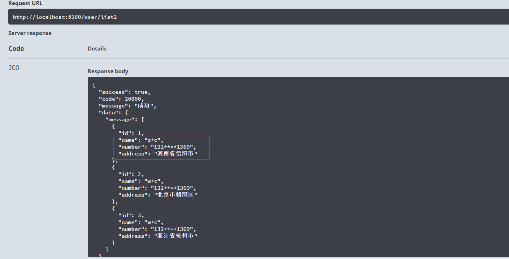

## 1：SQL 数据脱敏实现
```sql
-- CONCAT()、LEFT()和RIGHT()字符串函数组合使用，请看下面具体实现
 
-- CONCAT(str1,str2,…)：返回结果为连接参数产生的字符串
-- LEFT(str,len)：返回从字符串str 开始的len 最左字符
-- RIGHT(str,len)：从字符串str 开始，返回最右len 字符
 
-- 电话号码脱敏sql：
 
SELECT mobilePhone AS oldPhone, CONCAT(LEFT(mobilePhone,3), '********' ) AS newPhone FROM t_s_user
 
-- 身份证号码脱敏sql:
 
SELECT idcard AS oldIdCard, CONCAT(LEFT(idcard,3), '****' ,RIGHT(idcard,4)) AS newIdCard FROM t_s_user
```
## 2：JAVA数据脱敏工具类
```java
package com.xiaoze.exer.utils;

import org.apache.commons.lang3.StringUtils;

/**
 * 脱敏工具类
 **/
public class DesensitizedUtils {

    /**
     * 【中文姓名】只显示第一个汉字，其他隐藏为2个星号，比如：李**
     *
     * @param fullName
     * @return
     */
    public static String chineseName(String fullName) {
        if (StringUtils.isBlank(fullName)) {
            return "";
        }
        String name = StringUtils.left(fullName, 1);
        return StringUtils.rightPad(name, StringUtils.length(fullName), "*");
    }

    /**
     * 【身份证号】显示最后四位，其他隐藏。共计18位或者15位，比如：*************1234
     *
     * @param id
     * @return
     */
    public static String idCardNum(String id) {
        if (StringUtils.isBlank(id)) {
            return "";
        }
        String num = StringUtils.right(id, 4);
        return StringUtils.leftPad(num, StringUtils.length(id), "*");
    }

    /**
     * 【固定电话 后四位，其他隐藏，比如1234
     *
     * @param num
     * @return
     */
    public static String fixedPhone(String num) {
        if (StringUtils.isBlank(num)) {
            return "";
        }
        return StringUtils.leftPad(StringUtils.right(num, 4), StringUtils.length(num), "*");
    }

    /**
     * 【手机号码】前三位，后四位，其他隐藏，比如135******10
     *
     * @param num
     * @return
     */
    public static String mobilePhone(String num) {
        if (StringUtils.isBlank(num)) {
            return "";
        }
        return StringUtils.left(num, 3).concat(StringUtils.removeStart(StringUtils.leftPad(StringUtils.right(num, 2), StringUtils.length(num), "*"), "***"));
    }

    /**
     * 【地址】只显示到地区，不显示详细地址，比如：北京市海淀区****
     *
     * @param address
     * @param sensitiveSize 敏感信息长度
     * @return
     */
    public static String address(String address, int sensitiveSize) {
        if (StringUtils.isBlank(address)) {
            return "";
        }
        int length = StringUtils.length(address);
        return StringUtils.rightPad(StringUtils.left(address, length - sensitiveSize), length, "*");
    }

    /**
     * 【电子邮箱 邮箱前缀仅显示第一个字母，前缀其他隐藏，用星号代替，@及后面的地址显示，比如：d**@126.com>
     *
     * @param email
     * @return
     */
    public static String email(String email) {
        if (StringUtils.isBlank(email)) {
            return "";
        }
        int index = StringUtils.indexOf(email, "@");
        if (index <= 1) {
            return email;
        } else {
            return StringUtils.rightPad(StringUtils.left(email, 1), index, "*").concat(StringUtils.mid(email, index, StringUtils.length(email)));
        }
    }

    /**
     * 【银行卡号】前六位，后四位，其他用星号隐藏每位1个星号，比如：6222600**********1234>
     *
     * @param cardNum
     * @return
     */
    public static String bankCard(String cardNum) {
        if (StringUtils.isBlank(cardNum)) {
            return "";
        }
        return StringUtils.left(cardNum, 6).concat(StringUtils.removeStart(StringUtils.leftPad(StringUtils.right(cardNum, 4), StringUtils.length(cardNum), "*"), "******"));
    }

    /**
     * 【密码】密码的全部字符都用*代替，比如：******
     *
     * @param password
     * @return
     */
    public static String password(String password) {
        if (StringUtils.isBlank(password)) {
            return "";
        }
        String pwd = StringUtils.left(password, 0);
        return StringUtils.rightPad(pwd, StringUtils.length(password), "*");
    }

    /**
     * 【车牌号】前两位后一位，比如：苏M****5
     *
     * @param carNumber
     * @return
     */
    public static String carNumber(String carNumber) {
        if (StringUtils.isBlank(carNumber)) {
            return "";
        }
        return StringUtils.left(carNumber, 2).
                concat(StringUtils.removeStart(StringUtils.leftPad(StringUtils.right(carNumber, 1), StringUtils.length(carNumber), "*"), "**"));

    }
}
```
## 3：自定义注解实现
### 1）自定义注解
```java
package com.xiaoze.exer.interfaceForMy;

import com.fasterxml.jackson.annotation.JacksonAnnotationsInside;
import com.fasterxml.jackson.databind.annotation.JsonSerialize;
import com.xiaoze.exer.config.DataMaskingSerializer2;
import com.xiaoze.exer.enums.DataMaskEnum2;

import java.lang.annotation.*;

@Target({ElementType.FIELD, ElementType.TYPE})
@Retention(RetentionPolicy.RUNTIME)
@Documented
@JacksonAnnotationsInside
@JsonSerialize(using = DataMaskingSerializer2.class)
public @interface DataMask2 {

    DataMaskEnum2 function();

}
```

### 2）枚举类
```java
public enum DataMaskEnum2 {

    /**
     * 名称脱敏
     */
    USERNAME(s -> s.replaceAll("(\\S)\\S(\\S*)", "$1*$2"))
    ,
    /**
     * Phone sensitive type.
     */
    PHONE(s -> s.replaceAll("(\\d{3})\\d{4}(\\d{4})", "$1****$2"))
    ,
    /**
     * Address sensitive type.
     */
    ADDRESS(s -> s.replaceAll("(\\S{3})\\S{2}(\\S*)\\S{2}", "$1****$2****"))
    ;

    /**
     * 成员变量  是一个接口类型
     */
    private Function<String, String> function;

    DataMaskEnum2(Function<String, String> function) {
        this.function = function;
    }

    public Function<String, String> function() {
        return this.function;
    }

}

```

### 3）借助Jackson类和接口实现序列化才脱敏：

```java
package com.xiaoze.exer.config;

import com.fasterxml.jackson.core.JsonGenerator;
import com.fasterxml.jackson.databind.BeanProperty;
import com.fasterxml.jackson.databind.JsonMappingException;
import com.fasterxml.jackson.databind.JsonSerializer;
import com.fasterxml.jackson.databind.SerializerProvider;
import com.fasterxml.jackson.databind.ser.ContextualSerializer;
import com.xiaoze.exer.enums.DataMaskEnum2;
import com.xiaoze.exer.interfaceForMy.DataMask2;

import java.io.IOException;
import java.util.Objects;

public final class DataMaskingSerializer2 extends JsonSerializer<String> implements ContextualSerializer {

    private DataMaskEnum2 dataMaskEnum2;

    @Override
    public void serialize(String value, JsonGenerator gen, SerializerProvider serializers) throws IOException {
        gen.writeString(dataMaskEnum2.function().apply(value));
    }

    @Override
    public JsonSerializer<?> createContextual(SerializerProvider prov, BeanProperty property) throws JsonMappingException {
        DataMask2 annotation = property.getAnnotation(DataMask2.class);
        if (Objects.nonNull(annotation) && Objects.equals(String.class, property.getType().getRawClass())) {
            this.dataMaskEnum2 = annotation.function();
            return this;
        }
        return prov.findValueSerializer(property.getType(), property);
    }

}
```
### 4）实体类测试
```java
@Data
@AllArgsConstructor
public class MyDataMaskVo2 {

    private Integer id;

    @DataMask2(function = DataMaskEnum2.USERNAME)
    private String name;
    @DataMask2(function = DataMaskEnum2.PHONE)
    private String number;
    @DataMask2(function = DataMaskEnum2.ADDRESS)
    private String address;

}
```

### 5）controller测试
```java
    @GetMapping("/list2")
    public R list2() {
        MyDataMaskVo2 v1 = new MyDataMaskVo2(1, "zzc", "13217251369", "河南省信阳市");
        MyDataMaskVo2 v2 = new MyDataMaskVo2(2, "wzc", "13217251369", "北京市朝阳区");
        MyDataMaskVo2 v3 = new MyDataMaskVo2(3, "wxc", "13217251369", "浙江省杭州市");
        return R.ok().data("message", Arrays.asList(v1, v2, v3));
    }
```

### 6）测试结果


