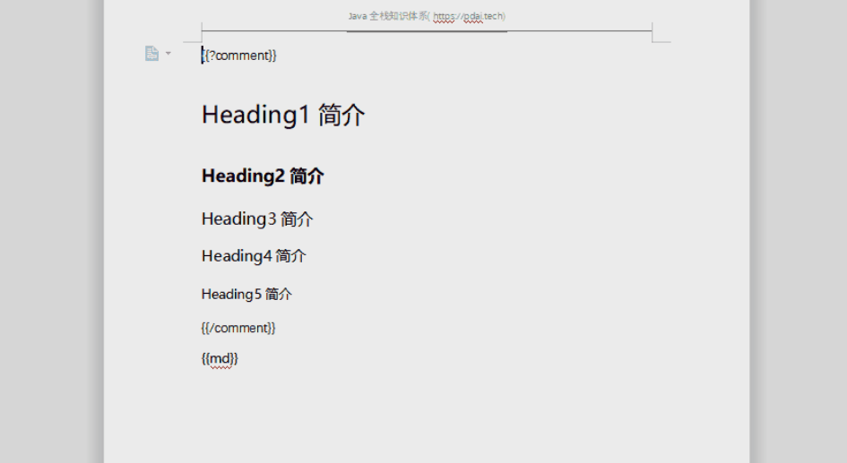

[官方文档](https://poi.apache.org/index.html)

## 1: 导入maven包
```xml
        <dependency>
            <groupId>com.deepoove</groupId>
            <artifactId>poi-tl</artifactId>
            <version>1.12.0</version>
        </dependency>
<!-- 插件的包如下，比如highlight,markdown包 -->
        <dependency>
            <groupId>com.deepoove</groupId>
            <artifactId>poi-tl-plugin-highlight</artifactId>
            <version>1.0.0</version>
        </dependency>
        <dependency>
             <groupId>com.deepoove</groupId>
             <artifactId>poi-tl-plugin-markdown</artifactId>
             <version>1.0.3</version>
        </dependency>
```
## 2：导出基于template的word
### 1）controller实现
```java
@ApiOperation("Download Word")
@GetMapping("/word/download")
public void download(HttpServletResponse response) {
    try {
        XWPFTemplate document = userService.generateWordXWPFTemplate();
        response.reset();
        response.setContentType("application/octet-stream");
        response.setHeader("Content-disposition",
                "attachment;filename=user_word_" + System.currentTimeMillis() + ".docx");
        OutputStream os = response.getOutputStream();
        document.write(os);
        os.close();
    } catch (Exception e) {
        e.printStackTrace();
    }
}

```
### 2）service实现

```java
@Override
public XWPFTemplate generateWordXWPFTemplate() throws IOException {
    Map<String, Object> content = new HashMap<>();
    content.put("title", "Java 全栈知识体系");
    content.put("author", "pdai");
    content.put("site", new HyperlinkTextRenderData("", ""));

    content.put("poiText", "Apache POI 是创建和维护操作各种符合Office Open XML（OOXML）标准和微软的OLE 2复合文档格式（OLE2）的Java API。用它可以使用Java读取和创建,修改MS Excel文件.而且,还可以使用Java读取和创建MS Word和MSPowerPoint文件。更多请参考[官方文档](https://poi.apache.org/index.html)");

    content.put("poiText2", "生成xls和xlsx有什么区别？POI对Excel中的对象的封装对应关系？");
    content.put("poiList", Numberings.create("excel03只能打开xls格式，无法直接打开xlsx格式",
            "xls只有65536行、256列; xlsx可以有1048576行、16384列",
            "xls占用空间大, xlsx占用空间小，运算速度也会快一点"));

    RowRenderData headRow = Rows.of("ID", "Name", "Email", "TEL", "Description").textColor("FFFFFF")
            .bgColor("4472C4").center().create();
    TableRenderData table = Tables.create(headRow);
    getUserList()
            .forEach(a -> table.addRow(Rows.create(a.getId() + "", a.getUserName(), a.getEmail(), a.getPhoneNumber() + "", a.getDescription())));
    content.put("poiTable", table);

    Resource resource = new ClassPathResource("pdai-guli.png");
    content.put("poiImage", Pictures.ofStream(new FileInputStream(resource.getFile())).create());

    return XWPFTemplate.compile(new ClassPathResource("poi-tl-template.docx").getFile()).render(content);
}

private List<User> getUserList() {
    List<User> userList = new ArrayList<>();
    for (int i = 0; i < 5; i++) {
        userList.add(User.builder()
                .id(Long.parseLong(i + "")).userName("pdai" + i).email("pdai@pdai.tech" + i).phoneNumber(121231231231L)
                .description("hello world" + i)
                .build());
    }
    return userList;
}
```
### 3）模板资源


## 3：导出markdown为word

### 1）controller
```java
@ApiOperation("Download Word based on markdown")
@GetMapping("/word/downloadMD")
public void downloadMD(HttpServletResponse response) {
    try {
        XWPFTemplate document = userService.generateWordXWPFTemplateMD();
        response.reset();
        response.setContentType("application/octet-stream");
        response.setHeader("Content-disposition",
                "attachment;filename=user_word_" + System.currentTimeMillis() + ".docx");
        OutputStream os = response.getOutputStream();
        document.write(os);
        os.close();
    } catch (Exception e) {
        e.printStackTrace();
    }
}
```

### 2）service实现
```java
@Override
public XWPFTemplate generateWordXWPFTemplateMD() throws IOException {
    MarkdownRenderData code = new MarkdownRenderData();

    Resource resource = new ClassPathResource("test.md");
    code.setMarkdown(new String(Files.readAllBytes(resource.getFile().toPath())));
    code.setStyle(MarkdownStyle.newStyle());

    Map<String, Object> data = new HashMap<>();
    data.put("md", code);

    Configure config = Configure.builder().bind("md", new MarkdownRenderPolicy()).build();

    return XWPFTemplate.compile(new ClassPathResource("markdown_template.docx").getFile(), config).render(data);
}
```

### 3）模板资源

