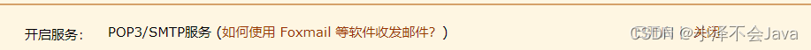

## 1：配置QQ邮箱环境
**登录QQ邮箱**  --> **设置**  -->  **账户** -->**如图操作**。（需要开启这个服务，开启很简单，根据提示就可以了）


## 2：导包
```xml
    <dependency>
        <groupId>org.springframework.boot</groupId>
        <artifactId>spring-boot-starter-mail</artifactId>
        <version>2.7.0</version>
    </dependency>
```

## 3：application.yml配置
```yml
#服务端口
spring:
  servlet:
    multipart:
      max-request-size: 30MB
      max-file-size: 1024MB
  application:
    name: exer
  mvc:
    pathmatch:
      matching-strategy: 'ANT_PATH_MATCHER '
  mail:
    # 下面这个是QQ邮箱host ， 企业邮箱 : smtp.exmail.qq.com
    host: smtp.qq.com
    # tencent mail port  这个是固定的
    port: 465
    # 你的QQ邮箱
    username: huhaoze0429@qq.com
    # 进入邮箱配置后得到的授权码
    password: fmjlxvxxajtcdfce
    #test-connection: true
    default-encoding: utf-8
    properties:
      mail:
        smtp:
          auth: true
          starttls:
            enable: true
            required: true
    protocol: smtps
#返回json的全局时间格式
  jackson:
    serialization:
      write-dates-as-timestamps: true
    date-format: yyyy-MM-dd HH:mm:ss
    time-zone: GMT+8
#  cloud:
#    nacos:
#      discovery:
#        server-addr: localhost:8848
  profiles:
    active: dev
  datasource:
    driver-class-name: com.mysql.cj.jdbc.Driver
    url: jdbc:mysql://localhost:3306/collegestudentsloosechangenetwork?useUnicode=true&characterEncoding=UTF-8&serverTimezone=Asia/Shanghai
    username: root
    password: '010429'
  redis:
    database: 0
    host: localhost
    port: 6379
mybatis-plus:
#  configuration:
#    log-impl: org.apache.ibatis.logging.stdout.StdOutImpl
  global-config:
    db-config:
      logic-delete-field: deleted # 全局逻辑删除的实体字段名(since 3.3.0,配置后可以忽略不配置步骤2)
      logic-delete-value: 1 # 逻辑已删除值(默认为 1)
      logic-not-delete-value: 0 # 逻辑未删除值(默认为 0)
    mapper-locations: classpath:com/xiaoze/fraulein/mapper/xml/*.xml

qiniu:
  accessKey: zKhTOqWZCDZenbQ2js2-D-WbFGyicyhTbc3tFFyl
  secretKey:  4VWXeZxfD5isbwdSSTyJ6oEHdi9Mnd7wP1wnGOm8
  bucketName:  collegestudent
  path: xiaozestudy.love
server:
  port: 8085
```

## 4：发送邮件配置类
```java
package com.xiaoze.exer.config;

import org.apache.commons.collections4.map.HashedMap;
import org.springframework.beans.factory.annotation.Autowired;
import org.springframework.context.annotation.Configuration;
import org.springframework.core.io.FileSystemResource;
import org.springframework.mail.SimpleMailMessage;
import org.springframework.mail.javamail.JavaMailSender;
import org.springframework.mail.javamail.JavaMailSenderImpl;
import org.springframework.mail.javamail.MimeMessageHelper;

import javax.mail.internet.MimeMessage;
import java.io.File;
import java.util.Map;


/**
 * @author 小泽
 * @create 2022-10-08  16:04
 * 记得每天敲代码哦
 */

@Configuration
public class QQmail {

    @Autowired
    private JavaMailSender javaMailSender;

    public Boolean sendMail(String popMailUser,String sendTitle,String sendMessage ){
        SimpleMailMessage message = new SimpleMailMessage();
        // 发件人 你的邮箱
        message.setFrom("huhaoze0429@qq.com");
        // 接收人 接收者邮箱
        message.setTo(new String[]{popMailUser});
        //邮件标题
        message.setSubject(sendTitle);
        //邮件内容
        message.setText(sendMessage);
        javaMailSender.send(message);
        return true;
    }

    //在上面单元测试中加入如下测试用例（通过MimeMessageHelper来发送一封带有附件的邮件）：
    public void sendAttachmentsMail() throws Exception {
        MimeMessage mimeMessage = javaMailSender.createMimeMessage();
        MimeMessageHelper helper = new MimeMessageHelper(mimeMessage, true);
        helper.setFrom("dyc87112@qq.com");
        helper.setTo("dyc87112@qq.com");
        helper.setSubject("主题：有附件");
        helper.setText("有附件的邮件");
        FileSystemResource file = new FileSystemResource(new File("weixin.jpg"));
        helper.addAttachment("附件-1.jpg", file);
        helper.addAttachment("附件-2.jpg", file);
        javaMailSender.send(mimeMessage);

    }

    //除了发送附件之外，我们在邮件内容中可能希望通过嵌入图片等静态资源，让邮件获得更好的阅读体验，而不是从附件中查看具体图片，下面的测试用例演示了如何通过MimeMessageHelper实现在邮件正文中嵌入静态资源。
    public void sendInlineMail() throws Exception {

        MimeMessage mimeMessage = javaMailSender.createMimeMessage();

        MimeMessageHelper helper = new MimeMessageHelper(mimeMessage, true);
        helper.setFrom("dyc87112@qq.com");
        helper.setTo("dyc87112@qq.com");
        helper.setSubject("主题：嵌入静态资源");
        helper.setText("<html><body></body></html>", true);

        FileSystemResource file = new FileSystemResource(new File("weixin.jpg"));
        helper.addInline("weixin", file);
        //这里需要注意的是addInline函数中资源名称weixin需要与正文中cid:weixin对应起来
        javaMailSender.send(mimeMessage);
    }
}
```