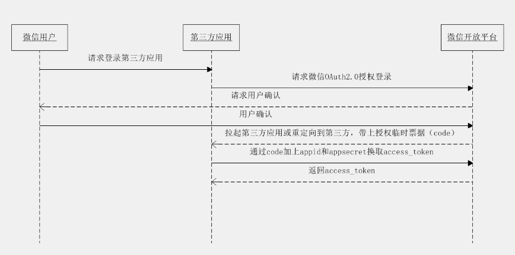
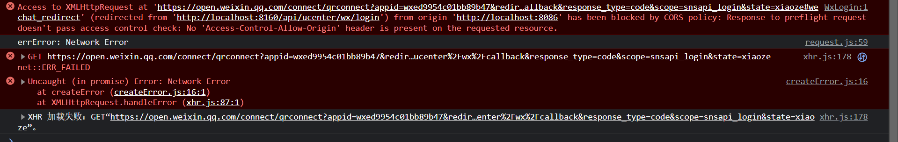

:::warning 需求背景
在现在大部分网站，都支持微信登录或者支付宝登录，所以我们应该如何实现？
:::

<p style="color:red">但是有个问题，要想真正实现微信登录，需要具备一些必要的条件，比如，微信公众号需要认证等，所以我借助之前写过的一些来实现，我个人公众号目前无法实现这一功能。</p>

<!-- [微信登录官网地址](https://developers.weixin.qq.com/doc/oplatform/Website_App/WeChat_Login/Wechat_Login.html) -->

## 1：流程说明
- ①：用户点击`按钮`或者`初始化页面`就发送微信请求，会打开一个二维码
- ②：在此期间会获得临时凭证code，
- ③：然后会调用配置的回调地址（后端接口），会自动拼接上面获得的临时凭证code，
- ④：后端就可以在接口中向微信发送请求，获得用户唯一标识openid。



## 2：前提条件准备
### 1）后端maven包
主要就是后端接口向三方发送请求的包
```xml
  <!--httpclient-->
  <dependency>
      <groupId>org.apache.httpcomponents</groupId>
      <artifactId>httpclient</artifactId>
  </dependency>
  <!--gson-->
  <dependency>
      <groupId>com.google.code.gson</groupId>
      <artifactId>gson</artifactId>
  </dependency>
```

### 2）微信公众号信息配置application.properties
```xml
# 微信开放平台 appid
wx.open.app_id=wxed9954c01bb89b47
# 微信开放平台 appsecret
wx.open.app_secret=a7482517235173ddb4083788de60b90e
# 微信开放平台 重定向url
wx.open.redirect_url=http://localhost:8160/api/ucenter/wx/callback
```
### 3）配置类读取微信公众号配置信息
```java
@Component
public class ConstantWxUtils implements InitializingBean {

    @Value("${wx.open.app_id}")
    private String appId;

    @Value("${wx.open.app_secret}")
    private String appSecret;

    @Value("${wx.open.redirect_url}")
    private String redirectUrl;

    public static String WX_OPEN_APP_ID;
    public static String WX_OPEN_APP_SECRET;
    public static String WX_OPEN_REDIRECT_URL;

    @Override
    public void afterPropertiesSet() throws Exception {
        WX_OPEN_APP_ID = appId;
        WX_OPEN_APP_SECRET = appSecret;
        WX_OPEN_REDIRECT_URL = redirectUrl;
    }
}
```
### 4）后端代码向三方发送请求工具类
```java
/**
 * 依赖的jar包有：commons-lang-2.6.jar、httpclient-4.3.2.jar、httpcore-4.3.1.jar、commons-io-2.4.jar
 *
 *
 */
public class HttpClientUtils {

    public static final int connTimeout = 10000;
    public static final int readTimeout = 10000;
    public static final String charset = "UTF-8";
    private static HttpClient client = null;

    static {
        PoolingHttpClientConnectionManager cm = new PoolingHttpClientConnectionManager();
        cm.setMaxTotal(128);
        cm.setDefaultMaxPerRoute(128);
        client = HttpClients.custom().setConnectionManager(cm).build();
    }

    public static String postParameters(String url, String parameterStr) throws ConnectTimeoutException, SocketTimeoutException, Exception {
        return post(url, parameterStr, "application/x-www-form-urlencoded", charset, connTimeout, readTimeout);
    }

    public static String postParameters(String url, String parameterStr, String charset, Integer connTimeout, Integer readTimeout) throws ConnectTimeoutException, SocketTimeoutException, Exception {
        return post(url, parameterStr, "application/x-www-form-urlencoded", charset, connTimeout, readTimeout);
    }

    public static String postParameters(String url, Map<String, String> params) throws ConnectTimeoutException,
            SocketTimeoutException, Exception {
        return postForm(url, params, null, connTimeout, readTimeout);
    }

    public static String postParameters(String url, Map<String, String> params, Integer connTimeout, Integer readTimeout) throws ConnectTimeoutException,
            SocketTimeoutException, Exception {
        return postForm(url, params, null, connTimeout, readTimeout);
    }

    public static String get(String url) throws Exception {
        return get(url, charset, null, null);
    }

    public static String get(String url, String charset) throws Exception {
        return get(url, charset, connTimeout, readTimeout);
    }

    /**
     * 发送一个 Post 请求, 使用指定的字符集编码.
     *
     * @param url
     * @param body        RequestBody
     * @param mimeType    例如 application/xml "application/x-www-form-urlencoded" a=1&b=2&c=3
     * @param charset     编码
     * @param connTimeout 建立链接超时时间,毫秒.
     * @param readTimeout 响应超时时间,毫秒.
     * @return ResponseBody, 使用指定的字符集编码.
     * @throws ConnectTimeoutException 建立链接超时异常
     * @throws SocketTimeoutException  响应超时
     * @throws Exception
     */
    public static String post(String url, String body, String mimeType, String charset, Integer connTimeout, Integer readTimeout)
            throws ConnectTimeoutException, SocketTimeoutException, Exception {
        HttpClient client = null;
        HttpPost post = new HttpPost(url);
        String result = "";
        try {
            if (org.apache.commons.lang3.StringUtils.isNotBlank(body)) {
                HttpEntity entity = new StringEntity(body, ContentType.create(mimeType, charset));
                post.setEntity(entity);
            }
            // 设置参数
            Builder customReqConf = RequestConfig.custom();
            if (connTimeout != null) {
                customReqConf.setConnectTimeout(connTimeout);
            }
            if (readTimeout != null) {
                customReqConf.setSocketTimeout(readTimeout);
            }
            post.setConfig(customReqConf.build());

            HttpResponse res;
            if (url.startsWith("https")) {
                // 执行 Https 请求.
                client = createSSLInsecureClient();
                res = client.execute(post);
            } else {
                // 执行 Http 请求.
                client = HttpClientUtils.client;
                res = client.execute(post);
            }
            result = IOUtils.toString(res.getEntity().getContent(), charset);
        } finally {
            post.releaseConnection();
            if (url.startsWith("https") && client != null && client instanceof CloseableHttpClient) {
                ((CloseableHttpClient) client).close();
            }
        }
        return result;
    }


    /**
     * 提交form表单
     *
     * @param url
     * @param params
     * @param connTimeout
     * @param readTimeout
     * @return
     * @throws ConnectTimeoutException
     * @throws SocketTimeoutException
     * @throws Exception
     */
    public static String postForm(String url, Map<String, String> params, Map<String, String> headers, Integer connTimeout, Integer readTimeout) throws ConnectTimeoutException,
            SocketTimeoutException, Exception {

        HttpClient client = null;
        HttpPost post = new HttpPost(url);
        try {
            if (params != null && !params.isEmpty()) {
                List<NameValuePair> formParams = new ArrayList<NameValuePair>();
                Set<Entry<String, String>> entrySet = params.entrySet();
                for (Entry<String, String> entry : entrySet) {
                    formParams.add(new BasicNameValuePair(entry.getKey(), entry.getValue()));
                }
                UrlEncodedFormEntity entity = new UrlEncodedFormEntity(formParams, Consts.UTF_8);
                post.setEntity(entity);
            }

            if (headers != null && !headers.isEmpty()) {
                for (Entry<String, String> entry : headers.entrySet()) {
                    post.addHeader(entry.getKey(), entry.getValue());
                }
            }
            // 设置参数
            Builder customReqConf = RequestConfig.custom();
            if (connTimeout != null) {
                customReqConf.setConnectTimeout(connTimeout);
            }
            if (readTimeout != null) {
                customReqConf.setSocketTimeout(readTimeout);
            }
            post.setConfig(customReqConf.build());
            HttpResponse res = null;
            if (url.startsWith("https")) {
                // 执行 Https 请求.
                client = createSSLInsecureClient();
                res = client.execute(post);
            } else {
                // 执行 Http 请求.
                client = HttpClientUtils.client;
                res = client.execute(post);
            }
            return IOUtils.toString(res.getEntity().getContent(), "UTF-8");
        } finally {
            post.releaseConnection();
            if (url.startsWith("https") && client != null
                    && client instanceof CloseableHttpClient) {
                ((CloseableHttpClient) client).close();
            }
        }
    }


    /**
     * 发送一个 GET 请求
     *
     * @param url
     * @param charset
     * @param connTimeout 建立链接超时时间,毫秒.
     * @param readTimeout 响应超时时间,毫秒.
     * @return
     * @throws ConnectTimeoutException 建立链接超时
     * @throws SocketTimeoutException  响应超时
     * @throws Exception
     */
    public static String get(String url, String charset, Integer connTimeout, Integer readTimeout)
            throws ConnectTimeoutException, SocketTimeoutException, Exception {

        HttpClient client = null;
        HttpGet get = new HttpGet(url);
        String result = "";
        try {
            // 设置参数
            Builder customReqConf = RequestConfig.custom();
            if (connTimeout != null) {
                customReqConf.setConnectTimeout(connTimeout);
            }
            if (readTimeout != null) {
                customReqConf.setSocketTimeout(readTimeout);
            }
            get.setConfig(customReqConf.build());

            HttpResponse res = null;

            if (url.startsWith("https")) {
                // 执行 Https 请求.
                client = createSSLInsecureClient();
                res = client.execute(get);
            } else {
                // 执行 Http 请求.
                client = HttpClientUtils.client;
                res = client.execute(get);
            }

            result = IOUtils.toString(res.getEntity().getContent(), charset);
        } finally {
            get.releaseConnection();
            if (url.startsWith("https") && client != null && client instanceof CloseableHttpClient) {
                ((CloseableHttpClient) client).close();
            }
        }
        return result;
    }


    /**
     * 从 response 里获取 charset
     *
     * @param ressponse
     * @return
     */
    @SuppressWarnings("unused")
    private static String getCharsetFromResponse(HttpResponse ressponse) {
        // Content-Type:text/html; charset=GBK
        if (ressponse.getEntity() != null && ressponse.getEntity().getContentType() != null && ressponse.getEntity().getContentType().getValue() != null) {
            String contentType = ressponse.getEntity().getContentType().getValue();
            if (contentType.contains("charset=")) {
                return contentType.substring(contentType.indexOf("charset=") + 8);
            }
        }
        return null;
    }


    /**
     * 创建 SSL连接
     *
     * @return
     * @throws GeneralSecurityException
     */
    private static CloseableHttpClient createSSLInsecureClient() throws GeneralSecurityException {
        try {
            SSLContext sslContext = new SSLContextBuilder().loadTrustMaterial(null, new TrustStrategy() {
                public boolean isTrusted(X509Certificate[] chain, String authType) throws CertificateException {
                    return true;
                }
            }).build();

            SSLConnectionSocketFactory sslsf = new SSLConnectionSocketFactory(sslContext, new X509HostnameVerifier() {

                @Override
                public boolean verify(String arg0, SSLSession arg1) {
                    return true;
                }

                @Override
                public void verify(String host, SSLSocket ssl)
                        throws IOException {
                }

                @Override
                public void verify(String host, X509Certificate cert)
                        throws SSLException {
                }

                @Override
                public void verify(String host, String[] cns,
                                   String[] subjectAlts) throws SSLException {
                }

            });

            return HttpClients.custom().setSSLSocketFactory(sslsf).build();

        } catch (GeneralSecurityException e) {
            throw e;
        }
    }

    public static void main(String[] args) {
        try {
            String str = post("https://localhost:443/ssl/test.shtml", "name=12&page=34", "application/x-www-form-urlencoded", "UTF-8", 10000, 10000);
            //String str= get("https://localhost:443/ssl/test.shtml?name=12&page=34","GBK");
            /*Map<String,String> map = new HashMap<String,String>();
            map.put("name", "111");
            map.put("page", "222");
            String str= postForm("https://localhost:443/ssl/test.shtml",map,null, 10000, 10000);*/
            System.out.println(str);
        } catch (ConnectTimeoutException e) {
            // TODO Auto-generated catch block
            e.printStackTrace();
        } catch (SocketTimeoutException e) {
            // TODO Auto-generated catch block
            e.printStackTrace();
        } catch (Exception e) {
            // TODO Auto-generated catch block
            e.printStackTrace();
        }
    }

}
```
## 3：真正代码实现

### 1）错误实现（后端全实现）

#### 前端代码实现
```html
<template>
  <div class="main">
    <el-button type="success" @click="wxLogin">点击登录</el-button>

  </div>
</template>

<script>
import {wxLogin1} from './../../api/login'
export default {
  name: 'WxLogin',
  data() {
    return {}
  },
  created() {
    // this.wxLogin();
  },
  // mounted中挂载
  mounted() {
  },
  methods: {
    wxLogin(){
      wxLogin1().then( res => {
      })
    },
  }
}
</script>

<style scoped>
</style>
```
接口信息
```js
export  function wxLogin1() {
  return request({
    url: '/api/ucenter/wx/login'
  })
}
```

#### 后端代码实现
```java
@Controller
@RequestMapping("/api/ucenter/wx")
@CrossOrigin
public class WxLoginController {
    private static final Logger logger = LoggerFactory.getLogger(WxLoginController.class);

    //生成微信扫描二维码
    @GetMapping("/login")
    public String getWxCode() {
        //固定地址，后面拼接参数
        //%s相当于？，也就是占位符。
        String url = "https://open.weixin.qq.com/connect/qrconnect" +
                "?appid=%s" +
                "&redirect_uri=%s" +
                "&response_type=code" +
                "&scope=snsapi_login" +
                "&state=%s" +
                "#wechat_redirect";

        //对redirect_url进行编码
        String redirectUrl = ConstantWxUtils.WX_OPEN_REDIRECT_URL;

        try {
            redirectUrl = URLEncoder.encode(redirectUrl, "utf-8");
        } catch (UnsupportedEncodingException e) {
            e.printStackTrace();
        }

        String finalurl = String.format(
                url,
                ConstantWxUtils.WX_OPEN_APP_ID,
                redirectUrl,
                "xiaoze");
        //重定向到请求微信地址里面
        logger.error("已经进入微信二维码生成方法");
        // return R.ok().data("url", finalurl);
         return "redirect:"+finalurl;
    }

    //2：获取扫描人信息
    //2 获取扫描人信息，添加数据
    @GetMapping("/callback")
    public String callback(String code, String state) {
        try {
            //1 获取code值，临时票据，类似于验证码
            //2 拿着code请求 微信固定的地址，得到两个值 accsess_token 和 openid
            String baseAccessTokenUrl = "https://api.weixin.qq.com/sns/oauth2/access_token" +
                    "?appid=%s" +
                    "&secret=%s" +
                    "&code=%s" +
                    "&grant_type=authorization_code";
            //拼接三个参数 ：id  秘钥 和 code值
            String accessTokenUrl = String.format(
                    baseAccessTokenUrl,
                    ConstantWxUtils.WX_OPEN_APP_ID,
                    ConstantWxUtils.WX_OPEN_APP_SECRET,
                    code
            );
            //请求这个拼接好的地址，得到返回两个值 accsess_token 和 openid
            //使用httpclient发送请求，得到返回结果
            String accessTokenInfo = HttpClientUtils.get(accessTokenUrl);

            //从accessTokenInfo字符串获取出来两个值 accsess_token 和 openid
            //把accessTokenInfo字符串转换map集合，根据map里面key获取对应值
            //使用json转换工具 Gson
            Gson gson = new Gson();
            HashMap mapAccessToken = gson.fromJson(accessTokenInfo, HashMap.class);
            String access_token = (String) mapAccessToken.get("access_token");
            String openid = (String) mapAccessToken.get("openid");

            //已经获取到了access_token 和 openid(唯一标识。)
            logger.error(access_token);   //72_i_N1iNH92fczdKBl4HszAS8lMPyoTPzO_TX-it9Uf-NNKKxYIfQGgGdWnY6AHkz1PFOh9NzRNaL8ep3WW_NyibywLvNKT9zOzqrMpA65muo
            logger.error(openid);    //o3_SC50E6NSvr8mgqAb2UHoj0-_s

            //3 拿着得到accsess_token 和 openid，再去请求微信提供固定的地址，获取到扫描人信息
            //访问微信的资源服务器，获取用户信息
            String baseUserInfoUrl = "https://api.weixin.qq.com/sns/userinfo" +
                    "?access_token=%s" +
                    "&openid=%s";
            //拼接两个参数
            String userInfoUrl = String.format(
                    baseUserInfoUrl,
                    access_token,
                    openid
            );
            //发送请求
            String userInfo = HttpClientUtils.get(userInfoUrl);
            //获取返回userinfo字符串扫描人信息
            HashMap userInfoMap = gson.fromJson(userInfo, HashMap.class);
            String nickname = (String) userInfoMap.get("nickname");//昵称
            String headimgurl = (String) userInfoMap.get("headimgurl");//头像

            //已经获取到了 nickname 和 headimgurl
            logger.error(nickname);
            logger.error(headimgurl);
            return "redirect:http://localhost:8086/dashboard?token=123456";
        } catch (Exception e) {
            throw new GuliException(20001, "登录失败");
        }
    }
}
```
### 2） 问题显现
<p style="color: red">本来的意思是，打开二维码界面（重定向）和回调地址都由后端来实现，但是发现前端再点击按钮调用接口之后，发现后端不能重定向到二维码界面，会显示跨域问题，现在已解决。</p>



### 3） 解决办法
- 第一种：前端点击按钮，后端接口不重定向，直接返回地址，由前端重定向进行跳转，登录之后然后自动回调回调地址
- 第二种：前端直接请求微信获取临时凭证code，然后再回调`回调地址`,就相当于后端只实现回调接口就可以了，获取临时凭证完全由前端实现。

### 4）正确实现1（后端端获取code，前端负责重定向，后端负责回调）
<p style="color:red">上面跨域问题无法解决，所以采用前后端结合实现。</p>

> 思路：`微信公众号信息` 配置在`前端`，前端直接配置信息并`生成二维码`，采用`内嵌页面`的方式，然后登录成功之后，调用配置的回调函数，相当于`后端`就只有一个`回调接口`

前端实现  

代码实现
```html
<template>
  <div class="main">
    <el-button type="success" @click="wxLogin">点击登录</el-button>
  </div>
</template>

<script>
import {wxLogin1} from './../../api/login'
export default {
  name: 'WxLogin',
  data() {
    return {}
  },
  created() {
    // this.wxLogin();
  },
  // mounted中挂载
  mounted() {
    // this.createWxQrcode();
  },
  methods: {
    wxLogin(){
      wxLogin1().then( res => {
        console.log(res.data.url)
        let path=window.location.protocol+'//'+res.data.url
        console.log(path)
        window.location.href=path
      })
    },
  }
}
</script>

<style scoped>
</style>
```
后端回调实现
```java
@Controller
@RequestMapping("/api/ucenter/wx")
@CrossOrigin
public class WxLoginController {
    private static final Logger logger = LoggerFactory.getLogger(WxLoginController.class);

    //生成微信扫描二维码
    @ResponseBody
    @GetMapping("/login")
    public R getWxCode() {
        //固定地址，后面拼接参数
        //%s相当于？，也就是占位符。
        String url = "open.weixin.qq.com/connect/qrconnect" +
                "?appid=%s" +
                "&redirect_uri=%s" +
                "&response_type=code" +
                "&scope=snsapi_login" +
                "&state=%s" +
                "#wechat_redirect";

        //对redirect_url进行编码
        String redirectUrl = ConstantWxUtils.WX_OPEN_REDIRECT_URL;

        try {
            redirectUrl = URLEncoder.encode(redirectUrl, "utf-8");
        } catch (UnsupportedEncodingException e) {
            e.printStackTrace();
        }

        String finalurl = String.format(
                url,
                ConstantWxUtils.WX_OPEN_APP_ID,
                redirectUrl,
                "xiaoze");
        //重定向到请求微信地址里面
        logger.error("已经进入微信二维码生成方法");
        return R.ok().data("url", finalurl);
        // return "redirect:"+finalurl;
    }

    //2：获取扫描人信息
    //2 获取扫描人信息，添加数据
    @GetMapping("/callback")
    public String callback(String code, String state) {
        try {
            //1 获取code值，临时票据，类似于验证码
            //2 拿着code请求 微信固定的地址，得到两个值 accsess_token 和 openid
            String baseAccessTokenUrl = "https://api.weixin.qq.com/sns/oauth2/access_token" +
                    "?appid=%s" +
                    "&secret=%s" +
                    "&code=%s" +
                    "&grant_type=authorization_code";
            //拼接三个参数 ：id  秘钥 和 code值
            String accessTokenUrl = String.format(
                    baseAccessTokenUrl,
                    ConstantWxUtils.WX_OPEN_APP_ID,
                    ConstantWxUtils.WX_OPEN_APP_SECRET,
                    code
            );
            //请求这个拼接好的地址，得到返回两个值 accsess_token 和 openid
            //使用httpclient发送请求，得到返回结果
            String accessTokenInfo = HttpClientUtils.get(accessTokenUrl);

            //从accessTokenInfo字符串获取出来两个值 accsess_token 和 openid
            //把accessTokenInfo字符串转换map集合，根据map里面key获取对应值
            //使用json转换工具 Gson
            Gson gson = new Gson();
            HashMap mapAccessToken = gson.fromJson(accessTokenInfo, HashMap.class);
            String access_token = (String) mapAccessToken.get("access_token");
            String openid = (String) mapAccessToken.get("openid");

            //已经获取到了access_token 和 openid(唯一标识。)
            logger.error(access_token);   //72_i_N1iNH92fczdKBl4HszAS8lMPyoTPzO_TX-it9Uf-NNKKxYIfQGgGdWnY6AHkz1PFOh9NzRNaL8ep3WW_NyibywLvNKT9zOzqrMpA65muo
            logger.error(openid);    //o3_SC50E6NSvr8mgqAb2UHoj0-_s

            //3 拿着得到accsess_token 和 openid，再去请求微信提供固定的地址，获取到扫描人信息
            //访问微信的资源服务器，获取用户信息
            String baseUserInfoUrl = "https://api.weixin.qq.com/sns/userinfo" +
                    "?access_token=%s" +
                    "&openid=%s";
            //拼接两个参数
            String userInfoUrl = String.format(
                    baseUserInfoUrl,
                    access_token,
                    openid
            );
            //发送请求
            String userInfo = HttpClientUtils.get(userInfoUrl);
            //获取返回userinfo字符串扫描人信息
            HashMap userInfoMap = gson.fromJson(userInfo, HashMap.class);
            String nickname = (String) userInfoMap.get("nickname");//昵称
            String headimgurl = (String) userInfoMap.get("headimgurl");//头像

            //已经获取到了 nickname 和 headimgurl
            logger.error(nickname);
            logger.error(headimgurl);
            return "redirect:http://localhost:8086/dashboard?token=123456";
        } catch (Exception e) {
            throw new GuliException(20001, "登录失败");
        }
    }
}
```

### 5）正确实现2（前端直接获取code，后端只负责回调）
<p style="color:red">上面跨域问题无法解决，所以采用前后端结合实现。</p>

> 思路：`微信公众号信息` 配置在`前端`，前端直接配置信息并`生成二维码`，采用`内嵌页面`的方式，然后登录成功之后，调用配置的回调函数，相当于`后端`就只有一个`回调接口`

前端实现  
index.html引入微信js文件
```js
<script src="http://res.wx.qq.com/connect/zh_CN/htmledition/js/wxLogin.js"></script>
```
代码实现
```html
<template>
  <div class="main">
    <!-- <el-button type="success" @click="wxLogin">点击登录</el-button> -->
    <div id="wxcode"></div>
  </div>
</template>

<script>
import {wxLogin1} from './../../api/login'
export default {
  name: 'WxLogin',
  data() {
    return {}
  },
  created() {
    // this.wxLogin();
  },
  // mounted中挂载
  mounted() {
    this.createWxQrcode();
  },
  methods: {
    // wxLogin(){
    //   wxLogin1().then( res => {
    //     console.log(res.data.url)
    //     let path=window.location.protocol+'//'+res.data.url
    //     console.log(path)
    //     window.location.href=path
    //   })
    // },
    createWxQrcode() {
      //重写二维码样式
      var href = 'data:text/css;base64,LmltcG93ZXJCb3gge2Rpc3BsYXk6IGZsZXg7fQouaW1wb3dlckJveCAucXJjb2RlIHt3aWR0aDogMjMycHg7IGhlaWdodDogMjMycHh9Ci5pbXBvd2VyQm94IC50aXRsZSB7ZGlzcGxheTogbm9uZTt9Ci5pbXBvd2VyQm94IC5pbmZvIHtkaXNwbGF5OiBub25lO30KLnN0YXR1c19pY29uIHtkaXNwbGF5OiBub25lfQ=='
      // 生成微信登录二维码
      var obj = new WxLogin({
        // self_redirect: true,
        id: "wxcode", // 页面显示二维码的容器id
        appid: "wxed9954c01bb89b47", // 微信官方提供的测试id
        scope: "snsapi_login",
        redirect_uri: encodeURI("http://localhost:8160/api/ucenter/wx/callback"), // 微信官方中的测试地址
        state: "bind",
        style: "black",
        href: href,
      });
    }
  }
}
</script>

<style scoped>
</style>
```
后端回调实现
```java
@Controller
@RequestMapping("/api/ucenter/wx")
@CrossOrigin
public class WxLoginController {
    private static final Logger logger = LoggerFactory.getLogger(WxLoginController.class);

    //生成微信扫描二维码
    @ResponseBody
    @GetMapping("/login")
    public R getWxCode() {
        //固定地址，后面拼接参数
        //%s相当于？，也就是占位符。
        String url = "open.weixin.qq.com/connect/qrconnect" +
                "?appid=%s" +
                "&redirect_uri=%s" +
                "&response_type=code" +
                "&scope=snsapi_login" +
                "&state=%s" +
                "#wechat_redirect";

        //对redirect_url进行编码
        String redirectUrl = ConstantWxUtils.WX_OPEN_REDIRECT_URL;

        try {
            redirectUrl = URLEncoder.encode(redirectUrl, "utf-8");
        } catch (UnsupportedEncodingException e) {
            e.printStackTrace();
        }

        String finalurl = String.format(
                url,
                ConstantWxUtils.WX_OPEN_APP_ID,
                redirectUrl,
                "xiaoze");
        //重定向到请求微信地址里面
        logger.error("已经进入微信二维码生成方法");
        return R.ok().data("url", finalurl);
        // return "redirect:"+finalurl;
    }

    //2：获取扫描人信息
    //2 获取扫描人信息，添加数据
    @GetMapping("/callback")
    public String callback(String code, String state) {
        try {
            //1 获取code值，临时票据，类似于验证码
            //2 拿着code请求 微信固定的地址，得到两个值 accsess_token 和 openid
            String baseAccessTokenUrl = "https://api.weixin.qq.com/sns/oauth2/access_token" +
                    "?appid=%s" +
                    "&secret=%s" +
                    "&code=%s" +
                    "&grant_type=authorization_code";
            //拼接三个参数 ：id  秘钥 和 code值
            String accessTokenUrl = String.format(
                    baseAccessTokenUrl,
                    ConstantWxUtils.WX_OPEN_APP_ID,
                    ConstantWxUtils.WX_OPEN_APP_SECRET,
                    code
            );
            //请求这个拼接好的地址，得到返回两个值 accsess_token 和 openid
            //使用httpclient发送请求，得到返回结果
            String accessTokenInfo = HttpClientUtils.get(accessTokenUrl);

            //从accessTokenInfo字符串获取出来两个值 accsess_token 和 openid
            //把accessTokenInfo字符串转换map集合，根据map里面key获取对应值
            //使用json转换工具 Gson
            Gson gson = new Gson();
            HashMap mapAccessToken = gson.fromJson(accessTokenInfo, HashMap.class);
            String access_token = (String) mapAccessToken.get("access_token");
            String openid = (String) mapAccessToken.get("openid");

            //已经获取到了access_token 和 openid(唯一标识。)
            logger.error(access_token);   //72_i_N1iNH92fczdKBl4HszAS8lMPyoTPzO_TX-it9Uf-NNKKxYIfQGgGdWnY6AHkz1PFOh9NzRNaL8ep3WW_NyibywLvNKT9zOzqrMpA65muo
            logger.error(openid);    //o3_SC50E6NSvr8mgqAb2UHoj0-_s

            //3 拿着得到accsess_token 和 openid，再去请求微信提供固定的地址，获取到扫描人信息
            //访问微信的资源服务器，获取用户信息
            String baseUserInfoUrl = "https://api.weixin.qq.com/sns/userinfo" +
                    "?access_token=%s" +
                    "&openid=%s";
            //拼接两个参数
            String userInfoUrl = String.format(
                    baseUserInfoUrl,
                    access_token,
                    openid
            );
            //发送请求
            String userInfo = HttpClientUtils.get(userInfoUrl);
            //获取返回userinfo字符串扫描人信息
            HashMap userInfoMap = gson.fromJson(userInfo, HashMap.class);
            String nickname = (String) userInfoMap.get("nickname");//昵称
            String headimgurl = (String) userInfoMap.get("headimgurl");//头像

            //已经获取到了 nickname 和 headimgurl
            logger.error(nickname);
            logger.error(headimgurl);
            return "redirect:http://localhost:8086/dashboard?token=123456";
        } catch (Exception e) {
            throw new GuliException(20001, "登录失败");
        }
    }
}
```

  
