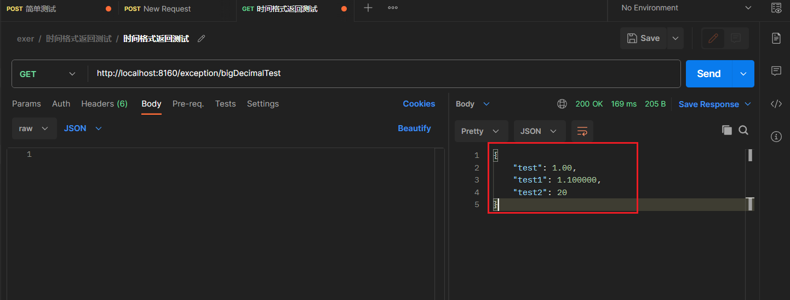

## 1-自定义校验字段注解

::: warning 需求背景
  我需要实现的功能是： 在`字段`上面可以加一个`自定义注解`，当我这个字段从`数据库`中查询出来`BigDecimal`该类型为`整数`时，我可以默认给它加入`小数点`,当然也可以根据需求处理其他类型的值。
:::

具体实现


### 1：定义接口
```java
@Target({ElementType.METHOD, ElementType.TYPE}) 
@Retention(RetentionPolicy.RUNTIME)
public @interface EnableScaleConvert {
}
```

```java
@Target(ElementType.FIELD)
@Retention(RetentionPolicy.RUNTIME)
public @interface ScaleConvert {
	int value() default 2;
}
```

### 2：定义切面类
```java
@Aspect
@Component
public class ScaleConvertAspect {
    /**
     * @annotation 作用与标注了该注解的方法上
     */
    @Pointcut("@annotation(com.xjrccb.bizplat.facade.annotation.EnableScaleConvert)")
    public void pointCutEnableScaleConvert() {

	}
    
    @AfterReturning(returning="result", pointcut="pointCutEnableScaleConvert()")
    public Object AfterExec(JoinPoint joinPoint,Object result){
    		result = ScaleConvertUtil.enableScaleConvert(result);
    		return result;
    }
}
```

### 3：定义内含方法实现
```java
public class ScaleConvertUtil {
	
	Integer aa = new Integer(0);
	
	private static final Logger log = LoggerFactory.getLogger(ScaleConvertUtil.class);
	
	 public static Object enableScaleConvert(Object model) {
    	EnableScaleConvert annotation = model.getClass().getAnnotation(EnableScaleConvert.class);
    	return model = annotation != null ? scaleConvert(model) : model;
    }
    
	public static Object scaleConvert(Object model){
		try {
			Field[] field = model.getClass().getDeclaredFields();
			for (int i = 0; i < field.length; i++) {
				String name = field[i].getName();
				name = name.substring(0, 1).toUpperCase() + name.substring(1);
				String type = field[i].getGenericType().toString();
				ScaleConvert scaleConvert = field[i].getAnnotation(ScaleConvert.class);
				if (type.equals("class java.math.BigDecimal") && scaleConvert !=null ) {
					int scale = scaleConvert.value();
					Method mg = model.getClass().getMethod("get"+name, null);
					BigDecimal value = (BigDecimal) mg.invoke(model);
					Method m = model.getClass().getMethod("set"+name, new Class[] {BigDecimal.class});
					m.invoke(model,new Object[] {NumberUtil.round(value, scale, RoundingMode.DOWN)});
				}
				if (type.equals("class java.lang.Integer")) {
					Method mg = model.getClass().getMethod("get"+name, null);
					Integer value = (Integer) mg.invoke(model);
					value = value == null ? 0 : value;
					
					Method m = model.getClass().getMethod("set"+name, new Class[] {Integer.class});
					m.invoke(model,new Object[] {value});
				}
				if (type.contains("java.util.List")) {
					Method mg = model.getClass().getMethod("get"+name, null);
					List tmp = (List) mg.invoke(model);
					if(CollectionUtils.isNotEmpty(tmp)) {
						for (int j = 0; j < tmp.size(); j++) {
							Object object = tmp.get(j);
							if (object instanceof BigDecimal) {
							} else {
								enableScaleConvert(object);
							}
						}
					}
				}
				
			}
    	    	} catch (NoSuchMethodException e) {
    		LogUtil.error(log,"处理数值精度方法异常:"+e);
    		throw new RccbRuntimeException("处理数值精度方法异常") ;
    	} catch (IllegalAccessException e) {
    		LogUtil.error(log,"处理数值精度非法访问异常:"+e);
    		throw new RccbRuntimeException("处理数值精度非法访问异常") ;
    	} catch (IllegalArgumentException e) {
    		LogUtil.error(log,"处理数值精度非法参数异常:"+e);
    		throw new RccbRuntimeException("处理数值精度非法参数异常") ;
    	} catch (InvocationTargetException e) {
    		LogUtil.error(log,"处理数值精度调用目标异常:"+e);
    		throw new RccbRuntimeException("处理数值精度调用目标异常") ;
    	}
		return model;

	}
    
    public static Object scaleConvert(Object model, int num)
    		throws NoSuchMethodException, IllegalAccessException, IllegalArgumentException, InvocationTargetException {
    	
    	Field[] field = model.getClass().getDeclaredFields();
    	for (int i = 0; i < field.length; i++) {
    		String name = field[i].getName();
    		name = name.substring(0, 1).toUpperCase() + name.substring(1);
    		String type = field[i].getGenericType().toString();
    		if (type.equals("class java.math.BigDecimal")) {
    			Method mg = model.getClass().getMethod("get"+name, null);
    			BigDecimal value = (BigDecimal) mg.invoke(model);
    			Method m = model.getClass().getMethod("set"+name, new Class[] {BigDecimal.class});
    			m.invoke(model,new Object[] {NumberUtil.round(value, num, RoundingMode.DOWN)});
    		}
    		if (type.contains("java.util.List")) {
    			Method mg = model.getClass().getMethod("get"+name, null);
    			List tmp = (List) mg.invoke(model);
    			for (int j = 0; j < tmp.size(); j++) {
    				Object object = tmp.get(j);
    				if (object instanceof BigDecimal) {
    					BigDecimal value = (BigDecimal) object;
    					BigDecimal temp = NumberUtil.round(value, num, RoundingMode.DOWN);
    					tmp.set(j, temp);
    				} else {
    					scaleConvert(object, num);
    				}
    			}
    		}
    		
    	}
    	return model;
    	
    }
}
```

### 4：测试

#### 实体类

```java
@Data
@EnableScaleConvert
public class BigDecimalTest {
       @ScaleConvert
       private BigDecimal test;
       @ScaleConvert(6)
       private BigDecimal test1;
       private BigDecimal test2;
}
```

#### 测试方法

```java
    @ApiOperation("格式返回测试")
    // @UserTimeInterface(methodName = "bigDecimalTest")
    @EnableScaleConvert 
    @GetMapping("/bigDecimalTest")
    public BigDecimalTest BigDecimalTest() {
        BigDecimalTest bigDecimalTest = new BigDecimalTest();
        bigDecimalTest.setTest(new BigDecimal(1));
        bigDecimalTest.setTest1(new BigDecimal("1.1"));
        bigDecimalTest.setTest2(new BigDecimal(20));
        System.out.println(bigDecimalTest);
        return bigDecimalTest;
    }
```




