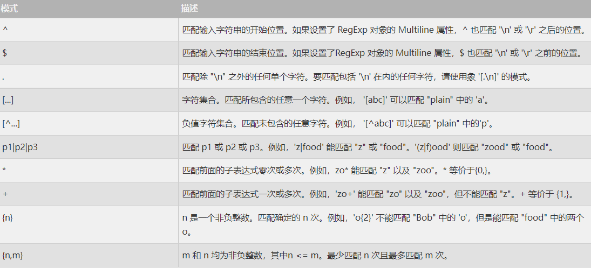

## 语法
### 1：创建数据库
```mysql
命令行创建：mysqladmin -u root -p create 数据库名称
```
### 2：删除数据库
```mysql
命令行创建：mysqladmin -u root -p drop  数据库名称
```
### 3：选择数据库
```mysql
进入数据库：mysql -u root -p
使用数据库：use 数据库名称;
```
### 4：数据类型
- MySQL 中定义数据字段的类型对数据库的优化是非常重要的。
- MySQL 支持多种类型，大致可以分为三类：**数值**、**日期/时间** 和 **字符串\(字符\)** 类型。  
#### 4.1 数值类型
- MySQL 支持所有标准 SQL 数值数据类型。
- 这些类型包括严格数值数据类型( `INTEGER`、`SMALLINT`、`DECIMAL` 和 `NUMERIC` )，以及近似数值数据类型( `FLOAT`、`REAL` 和 `DOUBLE` `PRECISION` )。
- 关键字 `INT` 是 `INTEGER` 的同义词，关键字 `DEC` 是 `DECIMAL` 的同义词。
-  `BIT`数据类型保存位字段值，并且支持 MyISAM、MEMORY、InnoDB 和 BDB 表。
- 作为 SQL 标准的扩展，MySQL 也支持整数类型 `TINYINT`、`MEDIUMINT` 和 `BIGINT`。下面的表显示了需要的每个整数类型的存储和范围。    

| 类型 |  大小  |  范围(有符号)  | 范围(无符号) | 用途 |
|--|--|--|--| ---- |
| TINYINT |   	1 字节   |  (-128，127)  | 	(0，255) | 小整数值 |
| SMALLINT |   	2 字节   |  (-32768，32767)	  | 	(0，65535)	 | 大整数值 |
| MEDIUMINT |   	3 字节   |  (-8 388 608，8 388 607)	  | 	(0，16 777 215)	 | 大整数值 |
| INT或INTEGER |   	4 字节   |  (-2 147 483 648，2 147 483 647)	  | 	(0，4 294 967 295)   | 大整数值 |
| BIGINT |   	8 字节   |  (-9 233 372 036 854 775 808，9 223 372 036 854 775 807)	  | 	(0，18 446 744 073 709 551 615)	 | 极大整数值 |
| FLOAT |   	4 字节   |  (-3.402 823 466 E+38，-1.175 494 351 E-38)，0，(1.175 494 351 E-38，3.402 823 466 351 E+38)	  | 	0，(1.175 494 351 E-38，3.402 823 466 E+38)	 | 单精度 浮点数值 |
| DOUBLE |   	8 字节   |  (-1.797 693 134 862 315 7 E+308，-2.225 073 858 507 201 4 E-308)，0，(2.225 073 858 507 201 4 E-308，1.797 693 134 862 315 7 E+308)	  | 0，(2.225 073 858 507 201 4 E-308，1.797 693 134 862 315 7 E+308)	 | 双精度 浮点数值 |
| DECIMAL |   对DECIMAL(M,D) ，如果M>D，为M+2否则为D+2   | 依赖于M和D的值	  | 依赖于M和D的值	 | 小数值 |


***
#### 4.2 日期和时间类型
- 表示时间值的日期和时间类型为 `DATETIME`、`DATE`、`TIMESTAMP`、`TIME` 和 `YEAR`。
- 每个时间类型有一个有效值范围和一个"零"值，当指定不合法的 MySQL 不能表示的值时使用"零"值。
- `TIMESTAMP` 类型有专有的自动更新特性，将在后面描述。  

| 类型 |  大小(字节)  |  范围  | 格式 | 用途 |
|--|--|--|--|--|
| DATE |   3  |  1000-01-01/9999-12-31  | 	YYYY-MM-DD | 日期值 |
| TIME |   3   |  '-838:59:59'/'838:59:59'	  | 	HH:MM:SS	 | 时间值或持续时间 |
| YEAR |   1   | 1901/2155	 | YYYY | 年份值 |
| DATETIME |   8   |  1000-01-01 00:00:00/9999-12-31 23:59:59	  | 	YYYY-MM-DD HH:MM:SS	 | 混合日期和时间值 |
| TIMESTAMP |   4  |  1970-01-01 00:00:00/2038 结束时间是第 2147483647 秒，北京时间 2038-1-19 11:14:07，格林尼治时间 2038-1-19 03:14:07  | 	YYYYMMDD HHMMSS	 | 混合日期和时间值，时间戳 |

***
#### 4.3 字符串类型
字符串类型指 `CHAR`、`VARCHAR`、`BINARY`、`VARBINARY`、`BLOB`、`TEXT`、`ENUM` 和 `SET`。该节描述了这些类型如何工作以及如何在查询中使用这些类型。

| 类型 |  大小  | 用途 |
|--|--|--|
| CHAR | 0-255字节 | 定长字符串 |
| VARCHAR | 0-65535 字节 | 变长字符串 |
| TINYBLOB | 0-255字节 | 不超过 255 个字符的二进制字符串 |
| TINYTEXT | 0-255字节 | 短文本字符串 |
| BLOB | 0-65 535字节	 | 二进制形式的长文本数据 |
| TEXT | 0-65 535字节	 | 长文本数据 |
| MEDIUMBLOB | 0-16 777 215字节	 | 二进制形式的中等长度文本数据 |
| MEDIUMTEXT | 0-16 777 215字节	 | 中等长度文本数据 |
| LONGBLOB | 0-4 294 967 295字节	 | 二进制形式的极大文本数据 |
| LONGTEXT | 0-4 294 967 295字节	 | 极大文本数据 |

::: warning 提示
- `CHAR` 和 `VARCHAR` 类型类似，但它们保存和检索的方式不同。它们的最大长度和是否尾部空格被保留等方面也不同。在存储或检索过程中不进行大小写转换。
- `BINARY` 和 `VARBINARY` 类类似于 `CHAR` 和 `VARCHAR`，不同的是它们包含二进制字符串而不要非二进制字符串。也就是说，它们包含字节字符串而不是字符字符串。这说明它们没有字符集，并且排序和比较基于列值字节的数值值。

- `BLOB` 是一个二进制大对象，可以容纳可变数量的数据。有 4 种 `BLOB` 类型：`TINYBLOB`、`BLOB`、MEDIUMBLOB 和 LONGBLOB。它们只是可容纳值的最大长度不同。

- 有 4 种 `TEXT` 类型：`TINYTEXT`、`TEXT`、`MEDIUMTEXT` 和 `LONGTEXT`。这些对应 4 种`BLOB` 类型，有相同的最大长度和存储需求。
:::
### 5：创建数据表
创建MySQL数据表需要以下信息：
- 表名
- 表字段名
- 定义每个表字段

```mysql
CREATE TABLE IF NOT EXISTS tutorials_tbl(
   tutorial_id INT NOT NULL AUTO_INCREMENT,
   tutorial_title VARCHAR(100) NOT NULL,
   tutorial_author VARCHAR(40) NOT NULL,
   submission_date DATE,
   PRIMARY KEY ( tutorial_id )
);
```
### 6：删除数据表
```mysql
DROP TABLE table_name ;
```
### 7：插入数据
MySQL 表中使用 `INSERT INTO SQL`语句来插入数据。

```mysql
INSERT INTO table_name ( field1, field2,...fieldN )
                       VALUES
                       ( value1, value2,...valueN );
```
### 8：查询数据
MySQL 数据库使用`SQL SELECT`语句来查询数据。

```mysql
SELECT column_name,column_name
FROM table_name
[WHERE Clause]
[OFFSET M ][LIMIT N]
```

- 查询语句中你可以使用一个或者多个表，表之间使用逗号(,)分割，并使用WHERE语句来设定查询条件。
- `SELECT` 命令可以读取一条或者多条记录。
- 你可以使用星号（*）来代替其他字段，SELECT语句会返回表的所有字段数据
- 你可以使用 `WHERE` 语句来包含任何条件。
- 你可以通过`OFFSET`指定`SELECT`语句开始查询的数据偏移量。默认情况下偏移量为0。
- 你可以使用 `LIMIT` 属性来设定返回的记录数。

### 9：where字句
MySQL 表中使用 `INSERT INTO SQL`语句来插入数据。

```mysql
SELECT field1, field2,...fieldN FROM table_name1, table_name2...
[WHERE condition1 [AND [OR]] condition2.....
```

- 查询语句中你可以使用一个或者多个表，表之间使用逗号(,)分割，并使用WHERE语句来设定查询条件。
- 你可以在WHERE子句中指定任何条件。
- 你可以使用AND或者OR指定一个或多个条件。
- WHERE子句也可以运用于SQL的 DELETE 或者 UPDATE 命令。
- WHERE 子句类似于程序语言中的if条件，根据 MySQL 表中的字段值来读取指定的数据。

### 10：update查询
如果我们需要修改或更新MySQL中的数据，我们可以使用 `SQL UPDATE` 命令来操作。.

```mysql
UPDATE table_name SET field1=new-value1, field2=new-value2
[WHERE Clause]
```

- 你可以同时更新一个或多个字段。
- 你可以在 WHERE 子句中指定任何条件。
- 你可以在一个单独表中同时更新数据。

### 11：delete语句
你可以使用 SQL 的 `DELETE FROM` 命令来删除 MySQL 数据表中的记录。

```mysql
DELETE FROM table_name [WHERE Clause]
```
- 如果没有指定 WHERE 子句，MySQL表中的所有记录将被删除。
- 你可以在 WHERE 子句中指定任何条件
- 您可以在单个表中一次性删除记录。

### 12：like字句
```mysql
SELECT field1, field2,...fieldN 
FROM table_name1, table_name2...
WHERE field1 LIKE condition1 [AND [OR]] filed2 = 'somevalue'
```
### 13：排序
```mysql
SELECT field1, field2,...fieldN FROM table_name1, table_name2...
ORDER BY field1, [field2...] [ASC [DESC]]
```
- 你可以使用任何字段来作为排序的条件，从而返回排序后的查询结果。
- 你可以设定多个字段来排序。
- 你可以使用 ASC 或 DESC 关键字来设置查询结果是按升序或降序排列。 默认情况下，它是按升排列。
- 你可以添加 WHERE...LIKE 子句来设置条件。

### 14：分组
在分组的列上我们可以使用 COUNT, SUM, AVG,等函数。


```mysql
SELECT column_name, function(column_name)
FROM table_name
WHERE column_name operator value
GROUP BY column_name;
```
### 15：连接的使用

- INNER JOIN（内连接,或等值连接）：获取两个表中字段匹配关系的记录。
- LEFT JOIN（左连接）：获取左表所有记录，即使右表没有对应匹配的记录。
- RIGHT JOIN（右连接）： 与 LEFT JOIN 相反，用于获取右表所有记录，即使左表没有对应匹配的记录。

[具体学习链接](https://www.w3cschool.cn/mysql/func-date-add.html)
### 16：NULL值处理

- IS NULL: 当列的值是NULL,此运算符返回true。
- IS NOT NULL: 当列的值不为NULL, 运算符返回true。

::: warning 注意
关于 NULL 的条件比较运算是比较特殊的。你不能使用 = NULL 或 != NULL 在列中查找 NULL 值 。

在MySQL中，NULL值与任何其它值的比较（即使是NULL）永远返回false，即 NULL = NULL 返回false 。

MySQL中处理NULL使用IS NULL和IS NOT NULL运算符。
:::
### 17：正则表达式

> 查找name字段中以'st'为开头的所有数据：
```mysql
 SELECT name FROM person_tbl WHERE name REGEXP '^st';
```
> 查找name字段中以'ok'为结尾的所有数据：

```mysql
 SELECT name FROM person_tbl WHERE name REGEXP 'ok$';
```
> 查找name字段中包含'mar'字符串的所有数据：

```mysql
  SELECT name FROM person_tbl WHERE name REGEXP 'mar';
```
> 查找name字段中以元音字符开头或以'ok'字符串结尾的所有数据：

```mysql
  SELECT name FROM person_tbl WHERE name REGEXP '^[aeiou]|ok$';
```
### 18：事务
1、`原子性`：一组事务，要么成功；要么撤回，即事务在执行过程中出错会回滚到事务开始前的状态。  
2、`一致性` ： 一个事务不论是开始前还是结束后，数据库的完整性都没有被破坏。因此写入的数据必须完全符合所有预设规则（资料精确度、串联性以及后续数据库能够自发完成预定工作）。  
3、`隔离性`：数据库允许多个事务并发的同时对其数据进行读写修改等操作，隔离性可以防止多个事务并发执行时由于交叉执行而导致数据的不一致。事务隔离可分为：Read uncommitted（读未提交）、Read committed（读提交）、Repeatable read（可重复读）、Serializable（串行化）。  
4、`持久性`：事务在处理结束后对数据做出的修改是永久的，无法丢失。  

[具体学习链接](https://www.w3cschool.cn/mysql/mysql-transaction.html)
### 19：alter命令
[具体学习链接](https://www.w3cschool.cn/mysql/mysql-alter.html)
### 20：索引
[具体学习链接](https://www.w3cschool.cn/mysql/mysql-index.html)

## 函数
[具体学习链接](https://www.w3cschool.cn/mysql/func-date-add.html)
